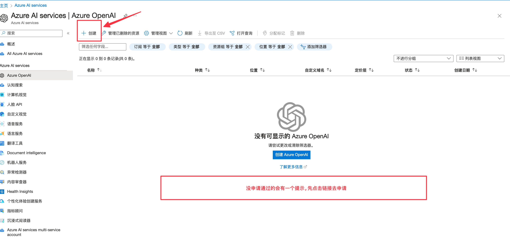
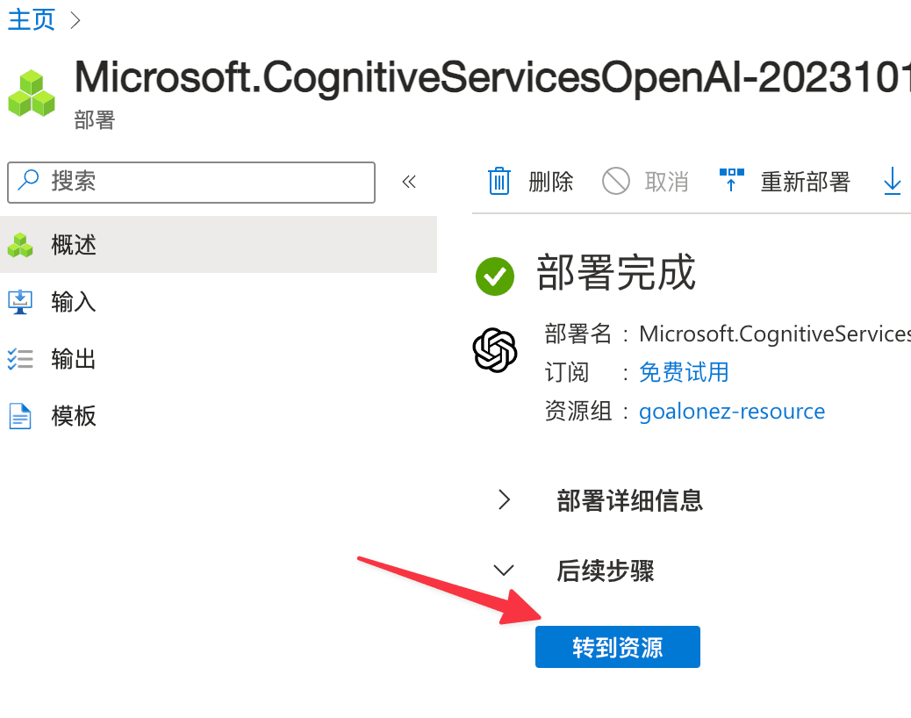
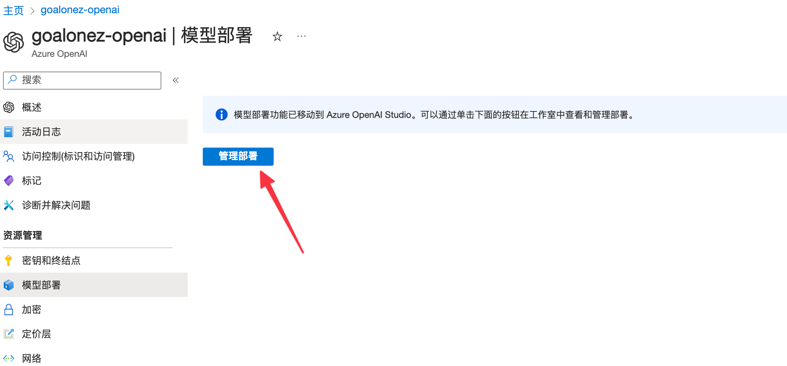

# AzureOpenAI申请

2块钱5刀体验金的号被封了😅便宜的东西果然不靠谱。

于是想着申请一下Azure OpenAI试试，没想到一晚上就成功了。

## 创建账号

> https://azure.microsoft.com/zh-cn/free

- 点击免费开始使用
- 登录

- 使用卡注册认证（国内卡就能绑定）

## 控制台

### 订阅

- 搜索`订阅`

- 获取`订阅id`（记录下来，后续申请权限要用到）

### Azure OpenAI

- 搜索`Azure OpenAI`

- 先申请`权限`

> 跳转后的申请页面的域名前缀应该是这个：https://customervoice.microsoft.com

- 申请需要用到`公司名、公司邮箱、公司地址、公司域名、公司电话`
  - 订阅id填上面获取的
  - 这里我填的公司域名没法打开（😂公司似乎不维护主页了）
  - 电话我留的自己的，怕电话打到公司去
  - 但是依然过了一晚上就通过了
- 接到通过邮件后点击左上角的`创建`
- 根据提示往下填就行了，没什么坑

## 创建OpenAI

### 资源

- 创建完成后转到资源

### 密钥

- 左侧密钥和终结点
- 获取Api Key和Endpoint

### 模型部署

- 左侧模型部署
- 点击管理部署

- 点击新建部署创建一个模型

## 开始使用

然后在你日常使用的客户端就可以填入`密钥、端点、模型名`开始使用了。

不过部分应用可能不支持Azure OpenAI，因为api结构不同。比如我的Obsidian插件似乎就没法直接使用。

## 其他

有看到帖子说账单被莫名扣了49刀。

根据回复，可以去这个地址看一下是否有Developer功能，关掉就行。我目前是没有遇到这个。

> https://portal.azure.com/#view/HubsExtension/BrowseResource/resourceType/Microsoft.ApiManagement%2Fservice

<gitalk/>