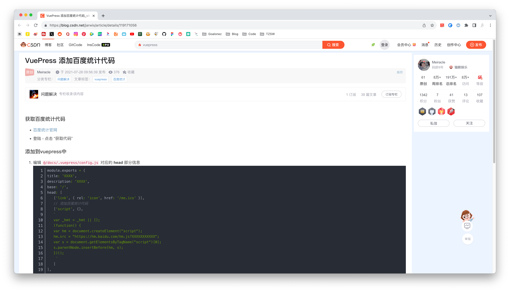
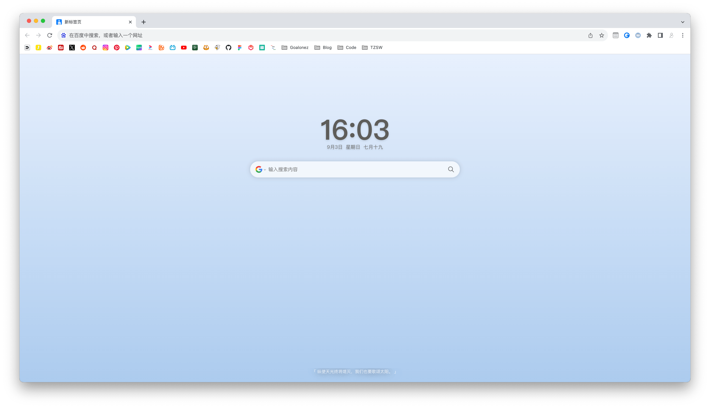
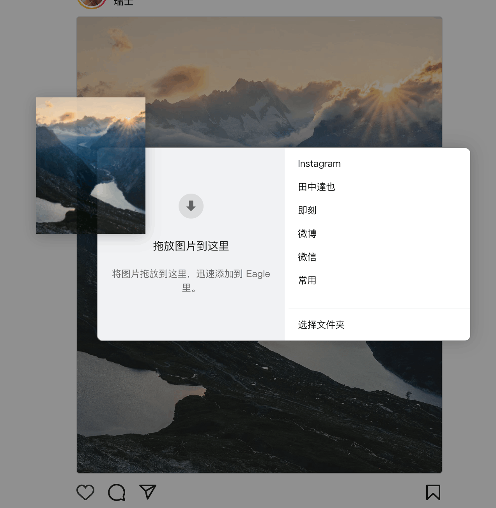

# Chrome插件折腾之路

## 篡改猴(tampermonkey)

### 脚本列表

#### AC-baidu

搜索引擎优化，我目前只开启了`重定向、去广告、自动翻页、自主拦截`这几个功能。

不是很喜欢自定义样式，用了一段时间就关掉了。

#### Bilibili Evolved

- 装了一些`组件`，没装`插件`，具体看个人需求到在线仓库安装

- 首页效果

#### 知乎增强

很久没上知乎了。

#### 知乎美化

#### CSDN广告完全过滤、人性化脚本优化

具体设置的话默认就好了，我就关了一个选项：`显示来自脚本的小广告`

效果具体看下图对比

- 安装前

- 安装后

#### Jellyfin danmaku extension
- Jellyfin弹幕支持
#### NGA优化摸鱼体验
- 转成excel的样式

#### NGA优化摸鱼体验-WebDAV配置同步
- 同步摸鱼插件的配置
#### Tieba Remix
- 贴吧样式优化
#### 小米路由器增强脚本
- 方便看各个设备的速度
#### 虎牙解锁蓝光20M清晰度
- 免app扫码解锁清晰度

## ~~🚫iTab新标签页~~
> 自部署了一个导航页，所以就卸了，但是iTab的体验还是挺好的

一直在找一款简洁的新标签页插件，只需要`时间和搜索框`，直到试用了这款插件。

- 其实下面还可以设置小组件，自定义快捷网页，但是我并不需要这些功能，所以通过`极简模式`设置成了这个样子。

- 一个软件，用自己需要用到的功能就好，不必提前增加学习成本，有需求的时候自然会想去研究

## Sun-Panel BE
- 可以根据网络情况自动切换导航页。方便在家里的时候直接打开局域网地址，在外面打开公网地址。

## Eagle for Chrome

主要用来配合`Eagle`收集图片

- 直接拖动图片到弹出框就可以自动下载到本地了
- 支持的网站比较多，都做了适配，适配的网站只拖动小图会自动下原图
- 支持网页截图

## ~~🚫简悦 - SimpRead~~
> 感觉有点占资源，但平时用的不多，就卸了

`专注阅读`,偶尔读文章的时候可以屏蔽掉其他元素。

主要还是用来`连接Obsidian`，直接把网页文章保存到`本地Markdown`。

- 功能应该是挺强大的，就是设置也复杂，而且设置界面的设计一言难尽
- 一个软件，用自己需要用到的功能就好，不必提前增加学习成本，有需求的时候自然会想去研究

我的配置主要是以下几种

- 共通-同步盘-坚果云-手动同步：用来同步账号配置。
- 基础设定：没记错的话应该是默认的设置。
- 高级设定：这个看自己需求，我都忘了设置了哪些内容，选项太多了。
- 服务：授权了坚果云（配合同步账号配置），其他授权看你自己用的什么文档工具。
- 站点管理：没记错的话应该是默认的设置。
- 插件管理：`导入到 Obsidian`（by Kenshin Wang）、`阅读模式浮动面板定制器`（by Kenshin Wang）
- 稍后读：没用上，一般我都直接用Chrome自带的阅读清单，或者转发到微信的滴答清单公众号同步到待办里。这个功能当时试用过，但是整体逻辑有点莫名其妙，反正没怎么摸透，同步好像也有点问题，就没再用了。

## ~~🚫crxMouse Chrome™ 手势~~
> 非要拿权限，似乎也有安全问题，就卸了

因为最近`smartUp手势`经常出现不流畅，卡顿之类的细节问题，所以就切换了，手势没啥区别，无缝切换，也是只开了`鼠标手势`，拖拽之类的用不上就关了。

## ~~🚫沉浸式翻译~~
> 体验挺好的，但是当时因为不支持自定义api，所以就切换到了“简约翻译”

网页翻译，还是比较强大的。不过我个人用得不多，基本还是用Chrome自带的网页翻译。

自带翻译效果不好的时候才会尝试这个插件。

- 翻译服务直接用的`腾讯交互翻译`，省得自己去设置api。

- 总是翻译的网址设置：

  - *.reddit.com

  - *.quora.com

## 简约翻译

## uBlock Origin Lite

去广告，这个就不多说了。

## Gitako

仓库树状图结构展示。

## Apifox Browser Extension

这个是Apifox的网页版请求插件。

我开发中使用Apifox，因为IDEA的插件好用点，可以直接解析上传接口。

但是我不想装客户端，所以一直用的网页版的Apifox，配合这个插件。

如果没用Apifox的话就不用装了。

## ~~🚫Surfingkeys~~
> 用得少就卸了
- Vim操作页面

## V2EX_Polish

- 由于最近`V2EX - 超级增强`脚本经常出现加载失败的情况，需要重新刷新页面，所以就切到了这个插件。

## LinuxDo Scripts

## Obsidian Web Clipper
- 剪藏网页

## VocabMeld - 沉浸式语言学习
- 智能替换网页词汇，创造沉浸式双语学习环境，在日常浏览中自然习得语言。

## B2Y - YouTube 同步显示 Bilibili 弹幕
- 可以把同一个视频，B站的弹幕同步到Youtube

## 小电视空降助手
- 跳过B站视频内的广告

## Enhancer for YouTube™

我主要用来`控制YouTube的播放速度`，直接在播放窗口下面点小按钮就好了，不用到播放器的菜单里去选择。

当然还有很多功能，我基本用的默认配置。

## Bitwarden 密码管理器
- 自建密码管理器

## CookieCloud
- PT站同步cookie到moviepilot

<gitalk/>