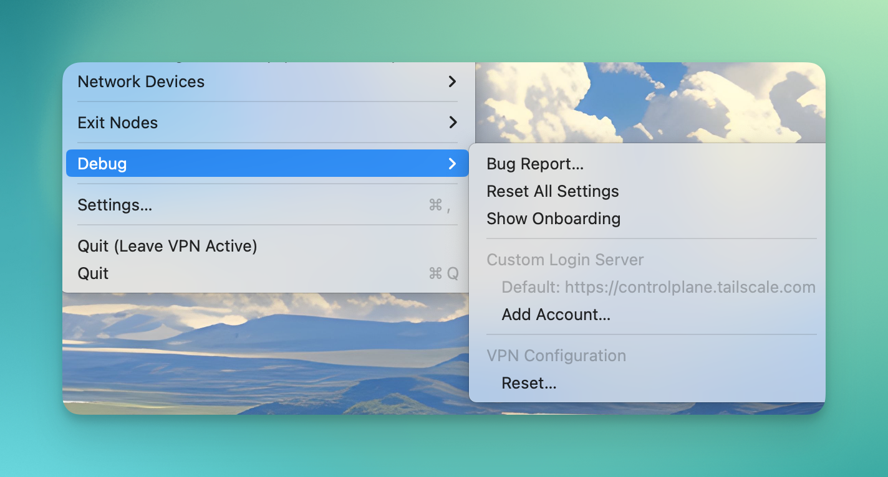

# MacOS还原自建Tailscale登录服务地址

由于之前自建了Headscale，后来又用回官方服务了。但是MacOS上经常卡bug，每次即使连上后，重启机器又会去尝试连接的登录服务器还是之前设置的自建地址。

可以通过`option + 右上方状态栏图标`看到debug中的地址是是自建的，并且通过可视化界面没法换回官方默认的。

通过在终端执行一下命令，进行还原

```shell
defaults write io.tailscale.ipn.macos ControlURL https://controlplane.tailscale.com
```

这时候可以看到，地址又回到官方地址了。



<gitalk/>