# Mac软件折腾之路

## 概况

### 差生文具多🤣

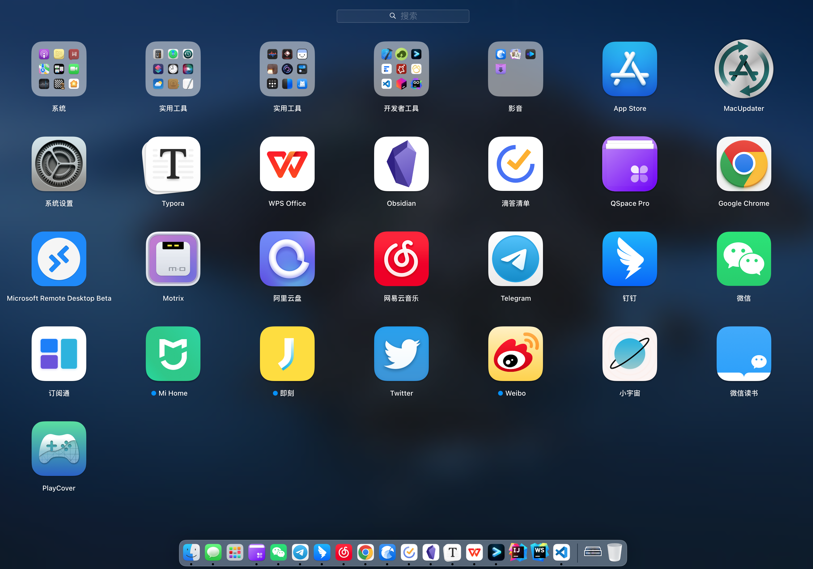

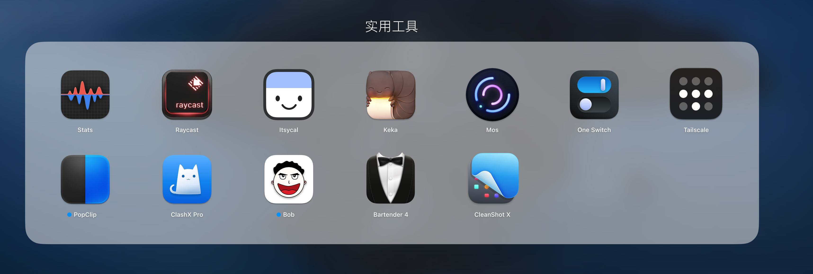

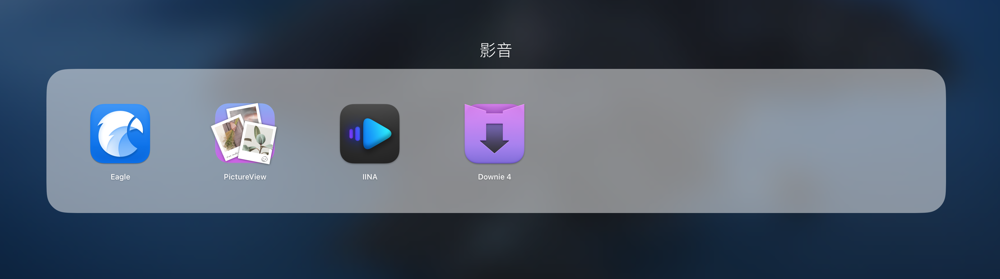

### 快捷键几乎都是用Raycast配置

## 启动器

### Raycast（`CMD + 空格`）

#### 极力推荐！极力推荐！极力推荐！👍👍👍

直接关闭spotlight，设置Raycast快捷键`CMD + 空格`

具体可以参考Blog

> 地址：[Raycast折腾之路](./Raycast折腾之路)

一个软件平替多个软件

- 启动本地软件
- 快捷链接（支持变量赋值网址查询条件）
- 搜索文件（支持文本内容）
- 剪切板历史（支持搜索、分类），`mac上有很多剪切板工具，这个够用了`（`option + C`）
- 代码片段收藏（支持自定义变量赋值），平替了`Snippetslab`（`option + D`）
- 快捷窗口布局（控制其他app的布局，比如全屏，半屏，上下左右排布等），平替了`Rectangle`
- 窗口切换及菜单栏切换（这个用得少）
- 系统功能控制（例如音量、清空废纸篓、弹出磁盘等等）
- `给常用软件设置快捷键，快速唤起、隐藏`，平替了`manico`
- 搜索截图
- 搜索通讯录
- 搜索emoji
- 便签
- 快捷计算器
- ~~词典~~（关掉了，个人使用不到）
- ~~日历~~（关掉了，个人使用不到）
- ~~待办~~（关掉了，还是用滴答清单）
- `AI`（交互体验最好的GPT操作，可惜8刀/月实在太贵了，实在下不去手😭）
- Chrome历史 + 书签（插件）
- Jetbrains项目管理（插件）
- vscode项目管理（插件）
- hosts多环境管理（插件）`平替iHosts`
- 控制CleanShot X截图（插件）
- 搜索Obsidian文档（插件）
- Linux命令查询（插件）
- 端口管理（插件）
- Tailscale设备查询（插件）
- `快捷获取短信中收到的验证码`（插件）
- 表情包搜索（插件）

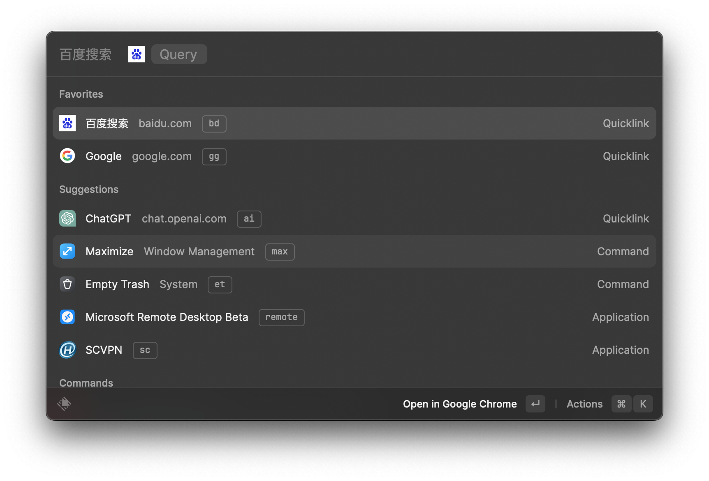

## 文档

### Obsidian（`option + 1`）

- 个人知识库。

具体可以参考Blog

> 地址：[Obsidian折腾之路](./Obsidian折腾之路)

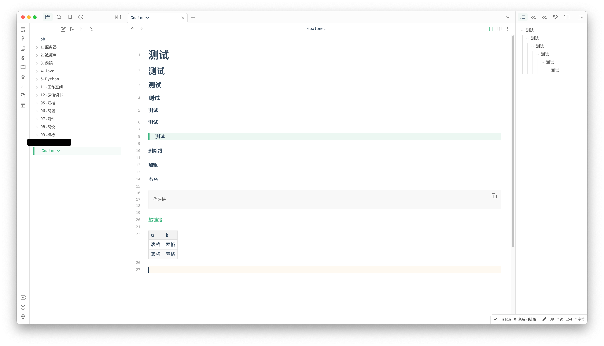

### WPS（`option + 2`）

- 工作相关的本地Word、Excel处理（由于工作文件某些隐私要求，`关闭自动同步云文档`，Word、Excel都是本地处理，至今搞不明白他的上云逻辑，一会自动到云上，一会躲在某个缓存目录下）
- 需要对外分享和团队协作的`智能文档、思维导图、流程图`（原先用知犀思维导图和draw.io画图，但为了统一都都切到WPS了）
- 使用`同步盘`来保存一些跨平台的配置文件备份。
- `文件传输助手`（暂时用得不多，主要微信无法多端同时登录，所以使用WPS的，但是目前入口太深不太方便，另外发送出去所有设备都会收到响应，很多时候只是想单纯发给某台机器。之前提了相关需求，也不知道会不会实现，什么时候实现）

### Typora（`option + 3`）

- 仅用来编辑`Blog`内容。（书写体验是真的不错，可惜没法代替Obsidian，没有手机端）

### ~~Notion~~

- 卡，挂代理也卡，打开时的加载页面图标停半天，膈应。其他都还不错。目前还是更倾向于Obsidian，数据在本地，掌握在自己手里，本地文件搜索也快。

#### ~~wolai~~

仿Notion，刚出的时候体验过一段时间，有一些微创新的小功能，国内网络相对好一点。目前被阿里收购，不知道早期一款被骂关闭的貌似叫`寒舟`的软件现在是什么想法🤣。

### ~~Flomo~~

- 没有代码块，而且个人需求上滴答清单基本能平替，所以轻度体验后就放弃了。

### ~~语雀~~

- 搜索体验不好
- 目录管理太痛苦了
- 流畅度一般
- 听说裁员严重，创始人也走了，不是很看好后续发展（以前会员群还有创始人回消息，后来就没什么反馈了）
- 买了一年会员，提前放弃了，冲动消费😮‍💨
- 相对于Notion这样的块级操作，个人还是比较喜欢语雀的书写体验

## 待办TODO

### 滴答清单（`option + S`）

试用过不少待办清单软件，最终还是选择滴答清单，并且为了月视图一直开着会员

- 全平台同步

- 免费功能也够用了

- 能想到的功能基本都有实现，轻量使用和复杂需求都能满足（`一个软件，用自己需要用到的功能就好，不必提前增加学习成本，有需求的时候自然会想去研究`）
  - 待办
  - 番茄钟
  - 习惯打卡等等都统一搞定
  
- 可以联动微信公众号，直接通过转发收集待办，这个功能`使用率极高`（当时Flomo和印象笔记的事件，这个功能我在滴答清单已经使用很久了，所以看到消息的时候还比较诧异）

## 资源管理器

### QSpace Pro（`option + A`）

自带的Finder实在是用不习惯，于是看推荐试用了QSpace Pro，感觉真的不错，不过没有用过其他的软件，只谈谈这个软件。

- 自定义配置多，包括快捷键，右键菜单列表，界面样式等等，很多设置都可以调出`顺手`的习惯。
- 打开模式可以切换到QSpace Pro，几乎可以替换掉Finder，自动调出Finder的场景几乎很少了。
- 管理远程连接（这块我用得不多，因为之前用来sftp连云服务器，SMB连局域网影视，感觉体验一般，但偶尔也可以应急一下）
- 批量重命名
- 暂存架（毕竟有多个布局窗口，我个人平时一般用不上，可以拿来替代一个叫`Yoink`的软件，当时买过，后来因为经常性卡死就卸载了）
- 压缩文件管理（一般默认还是用的`Keka`）

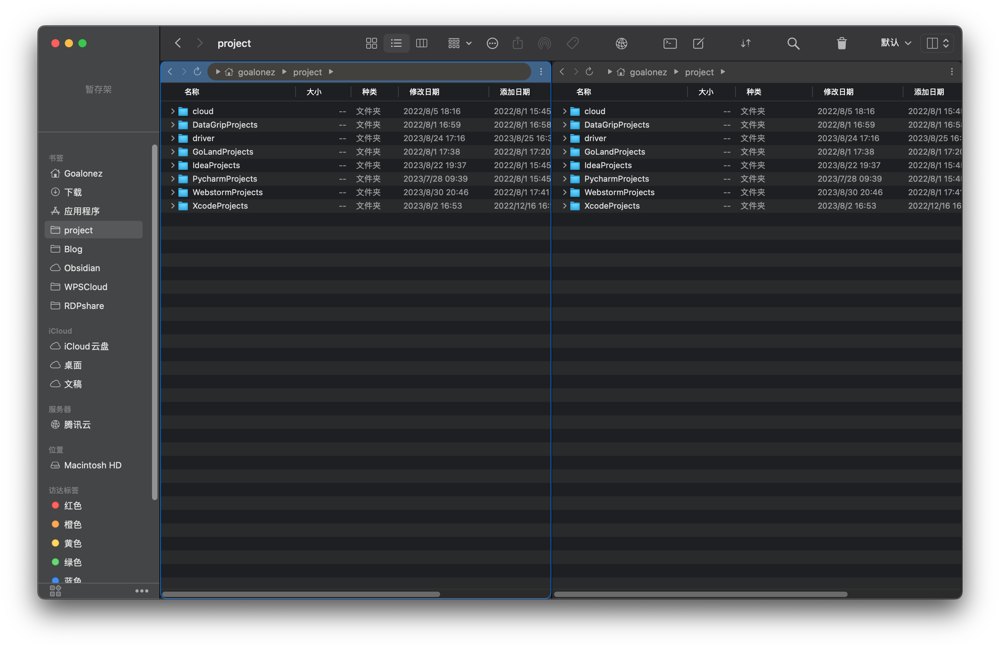

## 浏览器

### Chrome（`option + Q`）

这个就不多说了。

具体可以参考Blog

> 地址：[Chrome插件折腾之路](./Chrome插件折腾之路)

### ~~Edge~~

自从转了内核之后，一开始还当个人，后来就变`纯粹的垃圾桶`，啥都往里扔。而且当时试用的时候出现过几次`丢失登录信息`的情况，所有页面都需要重新登陆，直接转回Chrome。

### ~~Arc~~

从刚测试开始至今，下载安装过两次，都是体验了一会还是转回了Chrome，颜值是有的，可惜它的优势都不是刚需。劣势却很致命。

- 资源占用高
- 没有书签栏（这个见仁见智）
- 全局命令栏对我意义不大，反而是负担（因为平常都是Raycast打开常用页面）
- 默认语言没有中文，导致网页翻译有问题

### ~~Safari~~

插件生态还是少了。

## 远程桌面

### Microsoft Remote Desktop Beta

配合Tailscale控制Windows，Ubuntu Desktop都很方便，自动适配Mac的快捷键，可以同步剪切板和传输文件。

## 下载软件

### Motrix

我自己用的比较少，主要平时不怎么下东西，小东西Chrome就下完了，也不好评价，偶尔下不动的时候用这个速度还可以。

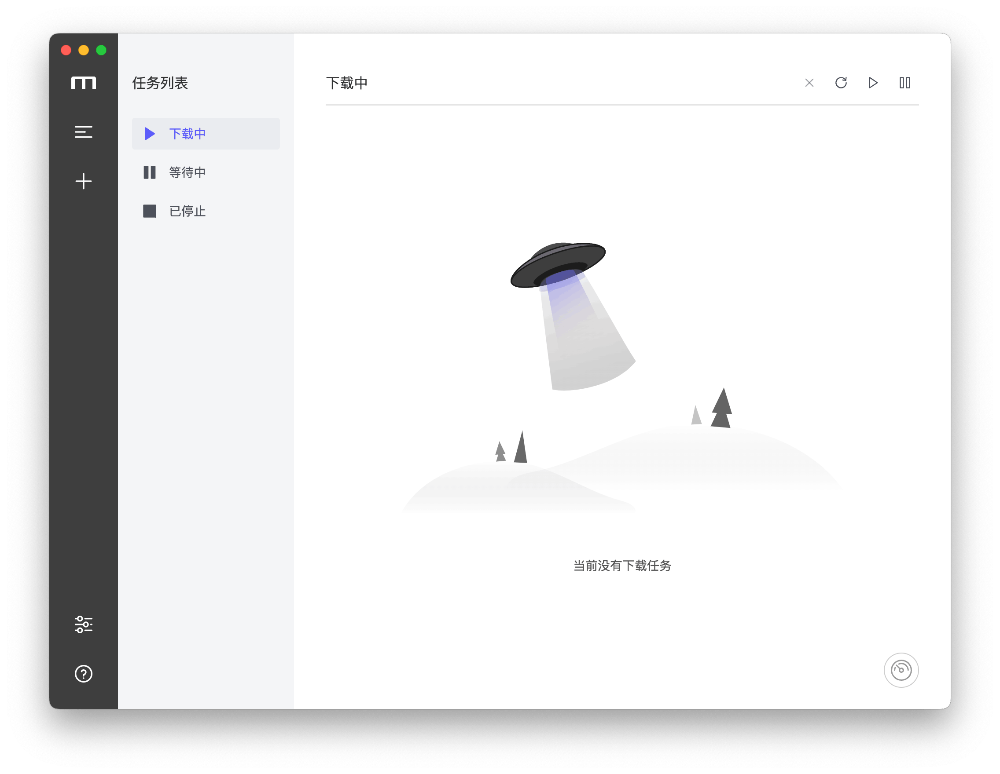

## 云盘和同步盘

### 阿里云盘

说实话，一坨💩，越更新越卡，一堆乱七八糟的东西，而且是特别卡，每次打开等半天。

唯一的优势就是在不充钱的情况下下载速度比百度云盘的几百KB快一点。目前也开始限速的，但还有几MB每秒，勉强用着。

- 目前主要用来做下冷备，一些iCloud和WPS里的东西加密打包隔一段时间备份一下
- 然后偶尔下点影视资源，几MB每秒也能接受了，毕竟免费

### WPS（同步文件夹）

工作经常用到，虽然自己不喜欢写Word，但碍于别人老是发Word和Excel格式的文件，就开了会员。

所以统一用里面的同步文件夹当同步盘了，体验一般，但是够用。

### ~~百度云盘~~

会员还有几个月，但是全端都卸载了，又卡广告又多，同步空间做得一堆BUG（不知道现在有没有好点，那时候功能刚上线没多久体验了下），会员费从使用频率上看并不值得。

### ~~坚果云~~

体验不错，迫于穷，还是没用，目前没下客户端，仅用于Chrome`简悦`插件的账号数据同步。😂

## 音乐

### 网易云（`option + ~ `）

- 88会员白嫖，所以勉强算免费
- 音乐云盘（全靠这个功能，没版权的直接传这里再收藏到歌单就能听了，除去某些被封杀的音乐没法听）

### Spotify

- 偶尔听一下欧美歌单，还不错

### ~~QQ音乐~~

* 哪有白嫖的香
* 音乐云盘（这是虚假的音乐云盘，上传后会去匹配自己的资源，达不到网易云的效果，而且有时候瞎匹配）

### ~~Apple Music~~

- 见仁见智，个人不习惯操作方式

## IM

### 微信（`option + E`）

所谓小而美，感觉有点克制，但不多🤣。反正日常还是得用，没办法。缓存机制很烦，工作中有些敏感文件经常被缓存在一些目录下面，得找半天去删除。

### 钉钉（`option + R`）

工作需要，打卡、审批、工作交流。

#### 钉钉个人版

- 体验了一下个人版，割裂严重，和普通版需要切换，而不是深度集成
- 收购的`wolai`集成度不高，没啥用
- AI很蠢
- 云盘集成的阿里云盘，看不到下载上传列表

### Telegram（`option + W`）

主要用来订阅频道看看资讯，以及机器人。

- 输入框可以多端同步！虽然不太用得上，但还是觉得6
- 万人群都不卡（已经退完了，消息看不过来，也没什么好聊的，就清空了）

## 订阅管理

### 订阅通

V2ex看到的，目前用来管理订阅，使用频率不高，有点食之无味，弃之可惜的意思。😅

- 有IOS和Mac版

## 软件更新器

### MacUpdater

统一更新软件（强迫症福音😂有空就点一点）

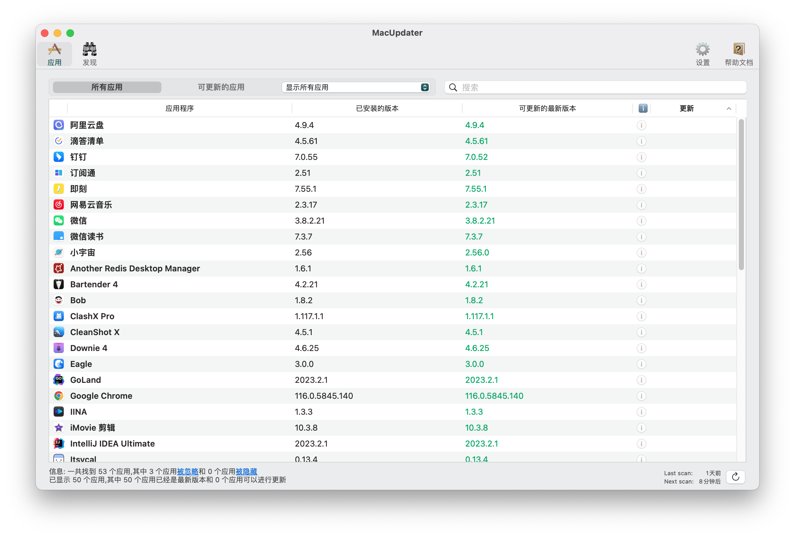

## 监控

### Stats

开源软件，挺好用的，经常会看一看。

## 日历

### Itsycal

简洁，小巧，够用。

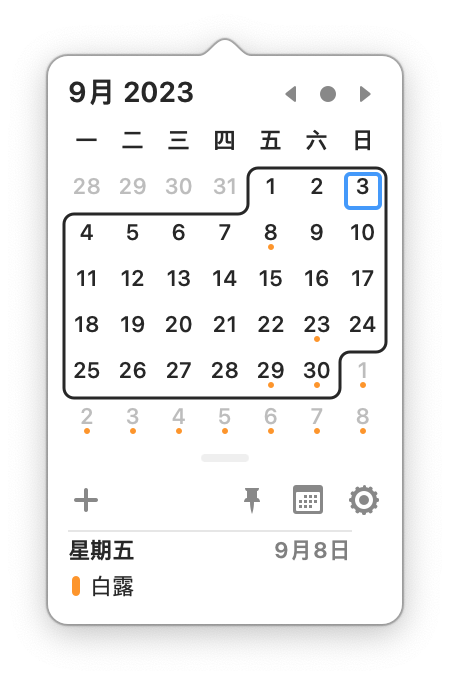

## 压缩

### Keka

看推荐下的，官网免费，MAS版收费，下了就一直用着了，也没尝试其他的软件。

## 鼠标体验增强

### Mos

挺好用的，就是隔段时间就出现软件自动挂掉的问题，得重新启动一下。😅懒得找平替，看来这个问题暂时还能忍。

- 平滑滚动

- 翻转方向

## 快捷控制

### One Switch

很多小功能的控制。

- 不过目前已经不再常驻，基本要用到的功能都被平替
- 现在唯一场景只有清理屏幕和键盘的时候开一下屏幕清洁模式

## 网络

### Tailscale

把设备组成一个局域网，很方便。

具体可以参考Blog

> 地址：[Tailscale自建(Headscale及Drep)](./Tailscale自建(Headscale及Drep))

### ClashX Pro

代理。

具体可以参考Blog

> ​	地址：[Clash配置订阅节点及规则](./Clash配置订阅节点及规则)

## 划词

### PopClip

主要配合`Bob`来做划词翻译

可以按需添加一些插件

## 翻译

### Bob

- 输入翻译（`option + F`）
- 划词翻译（`配合PopClip`）
- OCR + 翻译（`option + ESC`）

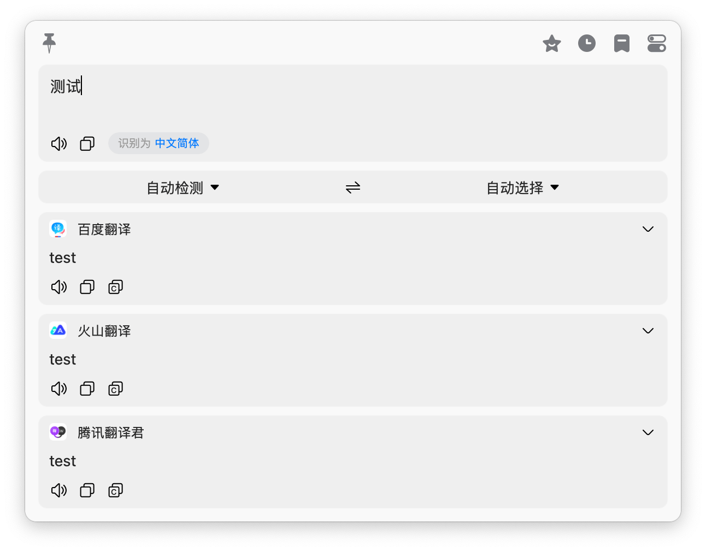

## 菜单栏管理

### Bartender 4

因为刘海的存在，这个是必备软件。下面是我自己的日常配置。

- 不用外接显示器的时候，网易云会收到下面的隐藏栏中去

根据`|`划分

1. 日常软件
2. 搜狗输入法 + 系统控制
3. Stats的网速和电量 + Itsycal
4. 隐藏栏：Stats监控 + 工具类软件

## 截图

### CleanShot X

图片类大一统软件

- 自定义截图（这个是先截图再单独编辑，从其他软件转过来可能需要适应一下）（`option + F1`）
- 窗口截图（`option + F4`）
- 全屏截图
- 滚动截图
- 倒计时截图
- ~~OCR~~这个还是用的`Bob`，OCR完直接就翻译了，方便点
- 录屏
- Gif
- 截图历史（很喜欢它的界面设计，还带了分类）（`option + F2`）
- 截图编辑
- All in One（会根据之前的截图范围弹出一个所有功能的界面）（`option + F3`）

## 图片管理

### Eagle（`option + Z`）

用来收集素材，并且进行管理，通过iCloud，阿里云盘压缩加密冷备

- 搭配Chrome插件
  - 收集Instagram、微博、即刻之类的图片
  - 网页截图

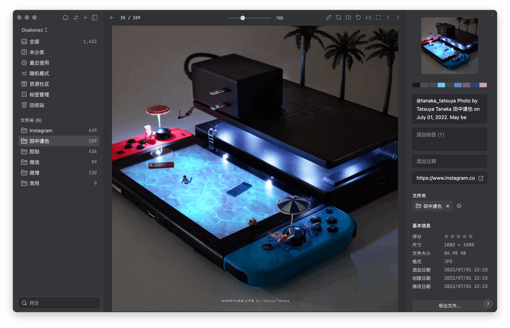

## 图片预览

### PictureView

V2ex看到的帖子，下载下来体验还不错，就一直在用了，倒腾了一下快捷键，还是比较顺手的。

## 视频播放

### IINA

倒腾了下快捷键，用着顺手。颜值也不错。

## 视频下载

### Downie 4

偶尔会下载一些网站的视频，使用频率不高，但是很好用。直接输入地址就可以了。

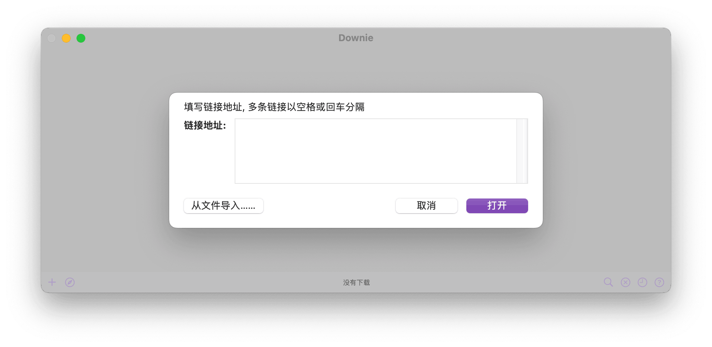

## 开发工具

### Jetbrains全家桶

这个就不介绍了，个人前后端都喜欢用这一套

### Visual Studio Code

我主要用来当文本编辑器用

插件丰富，功能强大

### Navicat

偶尔需要用到一下，频率低。处理表结构或者导数据之类的。

大部分时间直接使用JetBrains里自带的，写SQL的时候提示舒服很多，也不单独下载Datagrip，太吃内存了。但是表结构的编辑界面做得太烂了，现在习惯直接SQL处理表结构。

### oss-browser

偶尔连下OSS

### Another Redis Desktop Manager

Redis可视化管理，用的也不多。Jetbrains虽然也支持Redis了，但是目前还不完善。

### Tabby（`option + X`）

终端及服务器管理

具体可以参考Blog

> 地址：[终端折腾之路](./终端折腾之路)

- 全平台同步
- 新建窗口页的时候有点卡，所以我一般常开一个本地终端标签页
- 云服务器不多，这个就够管理了
- 主要有些服务器需要通过跳板，试用了多个终端软件，最终选择了这个

## M1安装的IOS软件

### Mi Home（米家）

- 在Mac上可以控制一下家电也还行
- 配置智能场景以及联动小爱音箱做得跟💩一样
  - 多个智能开关在编辑完一串流程后，保存会变化，得通过骚操作删掉设备添加设备，瞎试半天才能保存出想要的流程。想象不到代码怎么实现出来的，会出现这种BUG，而且看上去不是偶现，简直不敢相信常规操作也能出现这种问题
  - 之前设置了某个场景，我回家会根据流程打开相应设备。从某天开始，我语音小爱音箱执行该场景，变成了把我的设备全部关闭。至今没法还原回我需要的场景，设置了也没用。但是单个设备的控制又是正常的。

### 即刻

纯摸鱼😂

### Twitter

纯摸鱼😂

### Weibo（微博）

纯摸鱼😂

### 小宇宙

- 以前下班打车经常听，现在场景不多。
- 工作时间听不进去，写代码的时候放半天结果发现自己完全想不起来讲了什么。
- 但还是觉得app做的不错，Mac版勉强够用，有播放列表同步，就是没法快捷键控制播放。

### 微信读书

- 大部分时间还是在手机上看

### PlayCover

下了个`金铲铲`，但没玩，可以不用，不能没有系列 + 1 🤣

<git-talk/>