# Mac软件折腾之路

## 概况

### 差生文具多🤣

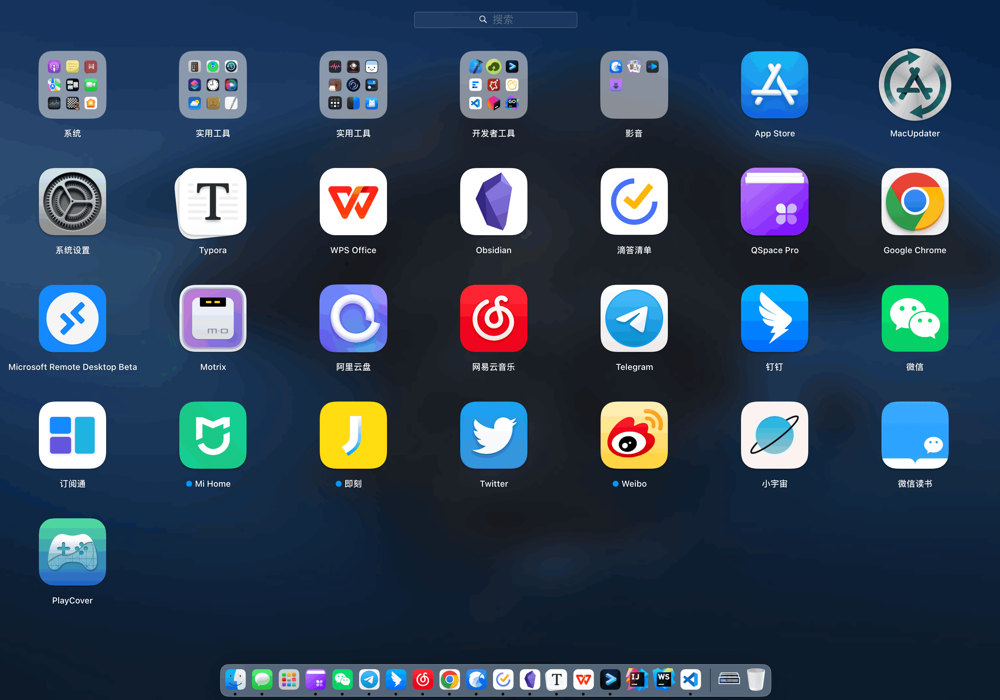

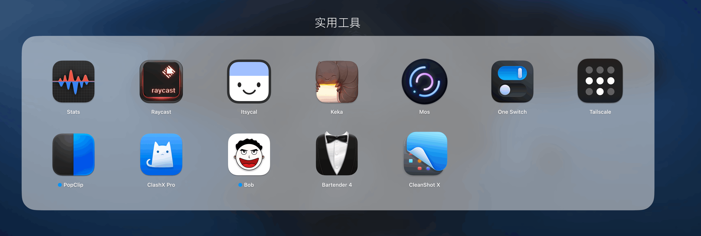

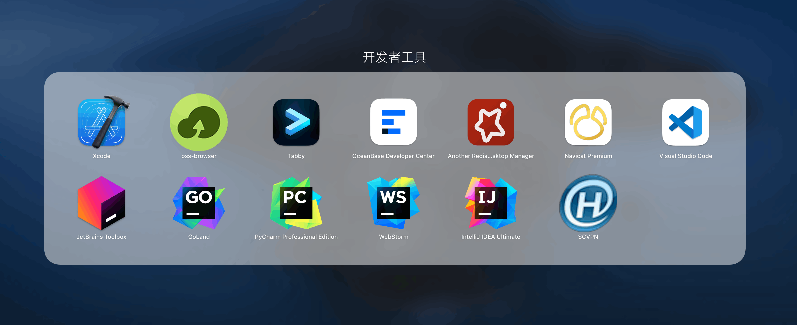

### 快捷键几乎都是用Raycast配置

## 启动器

### [Raycast](https://www.raycast.com/)（`CMD + 空格`）

#### 👍👍👍极力推荐！极力推荐！极力推荐！

直接关闭spotlight，设置Raycast快捷键`CMD + 空格`

具体可以参考Blog

> 地址：[Raycast折腾之路（常用功能篇）](./Raycast折腾之路（常用功能篇）)

一个软件平替多个软件

- 启动本地软件
- 快捷链接（支持变量赋值网址查询条件）
- 搜索文件（支持文本内容）
- 剪切板历史（支持搜索、分类），`mac上有很多剪切板工具，这个够用了`（`option + C`）
- 代码片段收藏（支持自定义变量赋值），平替了`Snippetslab`（`option + D`）
- 快捷窗口布局（控制其他app的布局，比如全屏，半屏，上下左右排布等），平替了`Rectangle`
- 窗口切换及菜单栏切换（这个用得少）
- 系统功能控制（例如音量、清空废纸篓、弹出磁盘等等）
- `给常用软件设置快捷键，快速唤起、隐藏`，平替了`manico`
- 搜索截图
- 搜索通讯录
- 搜索emoji
- 便签
- 快捷计算器
- ~~词典~~（关掉了，个人使用不到）
- ~~日历~~（关掉了，个人使用不到）
- ~~待办~~（关掉了，还是用滴答清单）
- `AI`（交互体验最好的GPT操作，可惜8刀/月实在太贵了，实在下不去手😭）
- Chrome历史 + 书签（插件）
- Jetbrains项目管理（插件）
- VSCode项目管理（插件）
- Hosts多环境管理（插件）`平替iHosts`
- 控制CleanShot X截图（插件）
- 搜索Obsidian文档（插件）
- Linux命令查询（插件）
- 端口管理（插件）
- Tailscale设备查询（插件）
- `快捷获取短信中收到的验证码`（插件）
- 表情包搜索（插件）

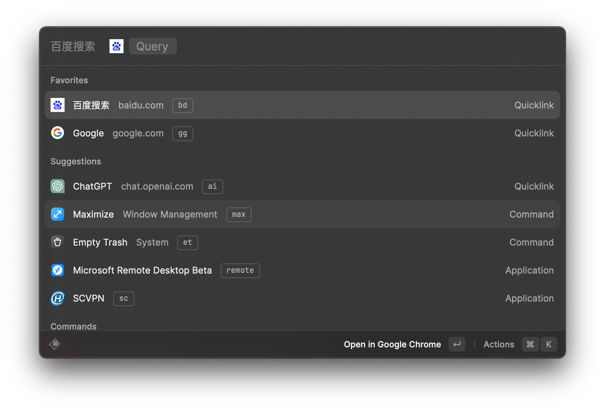

## 文档

### ~~🚫[Obsidian](https://obsidian.md/)（`option + 1`）~~

- 个人知识库。
- `最近经常开会会写一些接口文档，表格能力实在太弱了。于是还是放弃了。想来很多文档在有了gpt之后也不太需要记录了，于是摒弃了一些长篇的文档，把需要用到的转移到了Notion。`

具体可以参考Blog

> 地址：[Obsidian折腾之路](./Obsidian折腾之路)

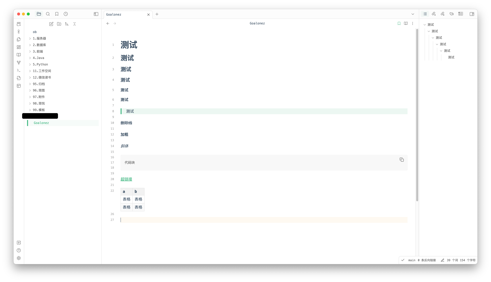

### [WPS](https://www.wps.cn/)（`option + 1`）

- 虽然自己不喜欢写Word，但碍于别人老是发Word和Excel格式的文件，活动的时候差不多5.6元/月开了个会员。
- 工作相关的本地Word、Excel处理（由于工作文件某些隐私要求，`关闭自动同步云文档`，Word、Excel都是本地处理，至今搞不明白他的上云逻辑，一会自动到云上，一会躲在某个缓存目录下）
- 需要对外分享和团队协作的`智能文档、思维导图、流程图`（原先用知犀思维导图和draw.io画图，但为了统一都切到WPS了）
- 使用`文件夹同步`当做同步盘来备份一些跨平台软件的配置文件。
- `文件传输助手`（暂时用得不多，主要微信无法多端同时登录，所以使用WPS的，但是目前入口太深不太方便，另外发送出去所有设备都会收到响应，很多时候只是想单纯发给某台机器。之前提了相关需求，也不知道会不会实现，什么时候实现）

### [Typora](https://typora.io/)（`option + 2`）

- 仅用来编辑`Blog`内容。（书写体验是真的不错，可惜没法代替Obsidian，没有手机端）
- 统一切换到Typora
  - `由于Notion的块状结构书写体验，以及大纲和只有3级标题的问题，最终还是统一切换到Typora来存储及书写知识库文档`
  - `放弃手机端查看文档，这个场景总体来说比较少，所以放弃问题也不算很大`
  - `导出Notion后的文件通过QSpace批量重命名，高级模式替换文件名，通过正则表达式\s+(.+)将后缀替换掉`

### ~~🚫[Notion](https://www.notion.so/)~~

- 卡，挂呆梨也卡，打开时的加载页面图标停半天，膈应。其他都还不错。目前还是更倾向于Obsidian，数据在本地，掌握在自己手里，本地文件搜索也快。
- ~~`因为Obsidian表格能力的问题，又尝试了一下Notion。最近感觉Notion好像加载速度变快了一些，而且可以少下在一个软件，直接用Web版就可以了。于是又转移回了Notion。其实书写体验最好的还是语雀，但是考虑到阿里云和语雀最近崩了好几次，还是对Notion的未来更看好一些。`~~

#### ~~🚫[wolai](https://www.wolai.com/)~~

仿Notion，刚出的时候体验过一段时间，有一些微创新的小功能，国内网络相对好一点。目前被阿里收购，不知道早期一款被骂关闭的貌似叫`寒舟`的软件现在是什么想法🤣。

### ~~🚫[Flomo](https://flomoapp.com/)~~

- 没有代码块，而且个人需求上滴答清单基本能平替，所以轻度体验后就放弃了。

### ~~🚫[语雀](https://www.yuque.com/)~~

- 搜索体验不好
- 目录管理太痛苦了
- 流畅度一般
- 听说裁员严重，创始人也走了，不是很看好后续发展（以前会员群还有创始人回消息，后来就没什么反馈了）
- 买了一年会员，提前放弃了，冲动消费😮‍💨
- 相对于Notion这样的块级操作，个人还是比较喜欢语雀的书写体验

### [PDFgear](https://www.pdfgear.com/)

- PDF预览软件
- 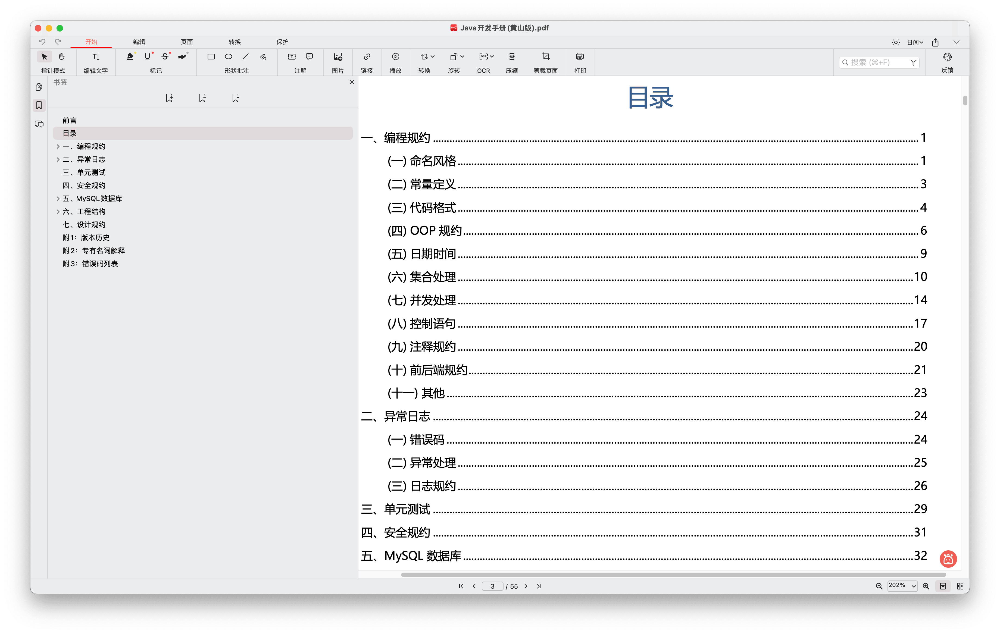

## 待办TODO

### [滴答清单](https://www.dida365.com/)（`option + S`）

试用过不少待办清单软件，最终还是选择滴答清单，并且为了月视图一直开着会员

- 全平台同步

- 免费功能也够用了

- 能想到的功能基本都有实现，轻量使用和复杂需求都能满足（`一个软件，用自己需要用到的功能就好，不必提前增加学习成本，有需求的时候自然会想去研究`）
  - 待办
  - 番茄钟
  - 习惯打卡等等都统一搞定
  
- 可以联动微信公众号，直接通过转发收集待办，这个功能`使用率极高`（当时Flomo和印象笔记的事件，这个功能我在滴答清单已经使用很久了，所以看到消息的时候还比较诧异）

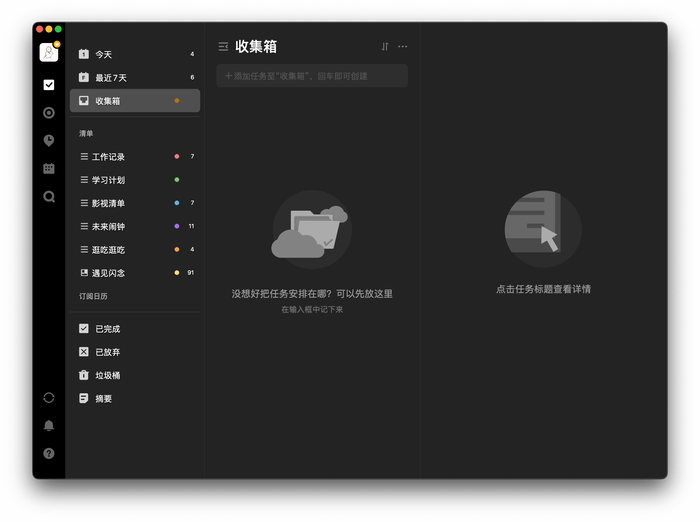

## 资源管理器

### [QSpace Pro](https://qspace.awehunt.com/zh-cn/index.html)（`option + A`）

自带的Finder实在是用不习惯，于是看推荐试用了QSpace Pro，感觉真的不错，不过没有用过其他的软件，只谈谈这个软件。

- 自定义配置多，包括快捷键，右键菜单列表，界面样式等等，很多设置都可以调出`顺手`的习惯。
- 打开模式可以切换到QSpace Pro，几乎可以替换掉Finder，自动调出Finder的场景几乎很少了。
- 管理远程连接（这块我用得不多，因为之前用来sftp连云服务器，SMB连局域网影视，感觉体验一般，但偶尔也可以应急一下）
- 批量重命名
- 暂存架（毕竟有多个布局窗口，我个人平时一般用不上，可以拿来替代一个叫`Yoink`的软件，当时买过，后来因为经常性卡死就卸载了）
- 压缩文件管理（一般默认还是用的`Keka`）

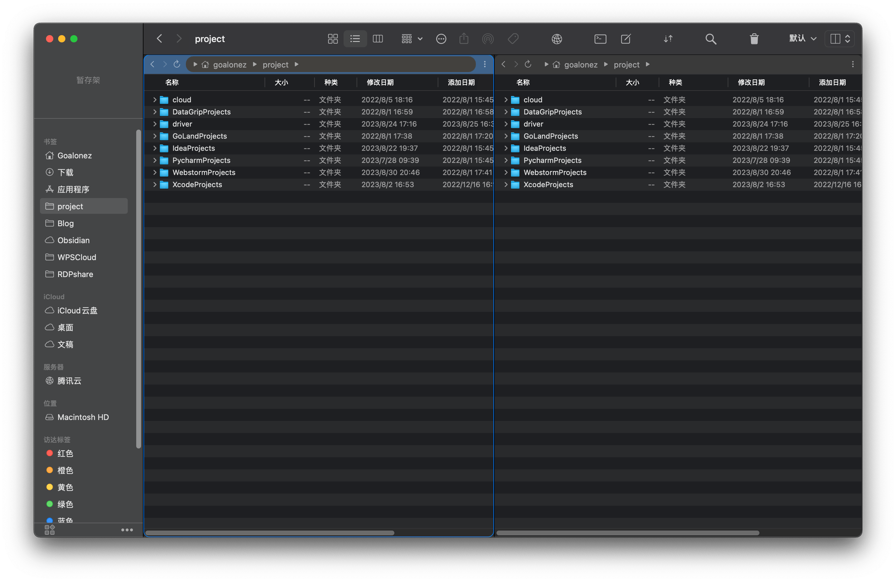

## 浏览器

### [Chrome](https://www.google.com/chrome/)（`option + Q`）

这个就不多说了。

具体可以参考Blog

> 地址：[Chrome插件折腾之路](./Chrome插件折腾之路)

### [MenubarX](https://menubarx.app/)

菜单栏浏览器

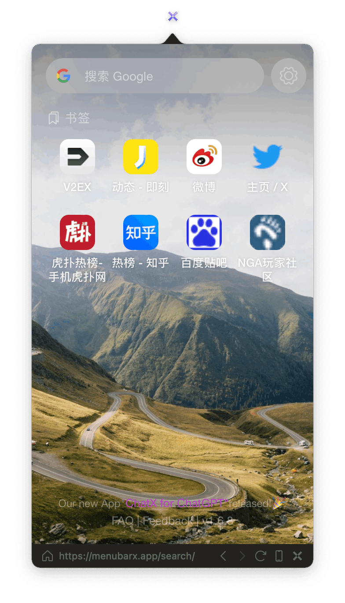

### ~~🚫[Edge](https://www.microsoft.com/zh-cn/edge)~~

自从转了内核之后，一开始还当个人，后来就变`纯粹的垃圾桶`，啥都往里扔。而且当时试用的时候出现过几次`丢失登录信息`的情况，所有页面都需要重新登陆，直接转回Chrome。

### ~~🚫[Arc](https://arc.net)~~

从刚测试开始至今，下载安装过两次，都是体验了一会还是转回了Chrome，颜值是有的，可惜它的优势都不是刚需。劣势却很致命。

- 资源占用高
- 没有书签栏（这个见仁见智）
- 全局命令栏对我意义不大，反而是负担（因为平常都是Raycast打开常用页面）
- 默认语言没有中文，导致网页翻译有问题

### ~~🚫Safari~~

插件生态还是少了。

## 输入法

### ~~🚫[搜狗输入法](https://shurufa.sogou.com)~~

切换了不少输入法，最终还是回到了搜狗输入法。

- 各个端的小功能和小细节完善，基本不会有某个功能想到了却发现没实现的情况。

- 配置完之后还算顺手，也基本没什么广告。
- 全平台同步（做的跟💩一样，从来没成功同步过配置，新电脑上的初始化配置似乎会把旧的云端配置顶掉，搞不懂同步逻辑）
- `双十一的时候，在Ios桌面下拉搜索，强制默认在选字栏跳出携程广告，只需好几天还没法关，于是就转移了。`

### [微信输入法](https://z.weixin.qq.com/)

- 简洁
- 多设备剪切板同步
- 表情包推荐

## 远程桌面

### [Microsoft Remote Desktop Beta](https://install.appcenter.ms/orgs/rdmacios-k2vy/apps/microsoft-remote-desktop-for-mac/distribution_groups/all-users-of-microsoft-remote-desktop-for-mac)

配合Tailscale控制Windows，Ubuntu Desktop都很方便，自动`适配Mac的快捷键`，可以`同步剪切板`和`传输文件`。

## 下载软件

### [Motrix](https://motrix.app/)

我自己用的比较少，主要平时不怎么下东西，小东西Chrome就下完了，也不好评价，偶尔下不动的时候用这个下载速度还可以。

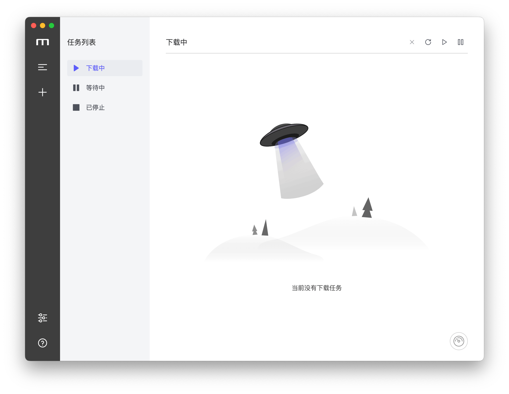

## 云盘和同步盘

### [阿里云盘](https://www.aliyundrive.com/)

说实话，一坨💩，越更新越卡，一堆乱七八糟的东西，而且是特别卡，每次打开等半天。

唯一的优势就是在不充钱的情况下下载速度比百度云盘的几百KB快一点。目前也开始限速了，但还有几MB每秒，勉强用着。

- 目前主要用来做下冷备，一些iCloud和WPS里的东西加密打包隔一段时间备份一下
- 然后偶尔下点影视资源，几MB每秒也能接受了，毕竟免费

### [WPS](https://www.wps.cn/)（同步文件夹）

工作经常需要用到Word和Excel，所以统一用里面的`同步文件夹`当同步盘了，体验一般，但是够用。一般会存放一些跨平台的文件，以及跨平台软件的配置文件。（Mac独占的软件直接用icloud备份配置文件）

### ~~[🚫百度网盘](https://pan.baidu.com/)~~

会员还有几个月，但是全端都卸载了，又卡广告又多，同步空间做得一堆BUG（不知道现在有没有好点，那时候功能刚上线没多久体验了下），会员费从使用频率上看并不值得。

### ~~[🚫坚果云](https://www.jianguoyun.com/)~~

体验不错，迫于穷，还没用上，而且还是想尽量减少软件，所以没有单独为了同步盘再下载它。目前仅用于Chrome`简悦`插件的账号数据同步。😂

## 音乐

### [网易云](https://music.163.com/)（`option + ~ `）

- 88会员白嫖，所以勉强算免费
- 音乐云盘（全靠这个功能，没版权的直接传这里再收藏到歌单就能听了，除去某些被封杀的音乐没法听）

### [Spotify](https://open.spotify.com/)

- 偶尔听一下欧美歌单，还不错

### ~~🚫[QQ音乐](https://y.qq.com/)~~

* 哪有白嫖的香
* 音乐云盘（虚假的音乐云盘，上传后会去匹配自己的资源，达不到网易云的效果，而且有时候瞎匹配导致播放的和上传的不一致）

### ~~🚫[Apple Music](https://music.apple.com/cn/browse)~~

- 见仁见智，个人不习惯操作方式

## IM

### [微信](https://weixin.qq.com/)（`option + E`）

所谓小而美，感觉有点克制，但不多🤣。反正日常还是得用，没办法。缓存机制很烦，工作中有些敏感文件经常被缓存在一些目录下面，得找半天去删除。

### [钉钉](https://www.dingtalk.com/)（`option + R`）

工作需要，打卡、审批、工作交流。

#### ~~🚫[钉钉个人版](https://workspace.dingtalk.com/welcome)~~

- 邀请码：DINGROCKS

- 体验了一下个人版，割裂严重，和普通版需要切换，而不是深度集成
- 收购的`wolai`集成度不高，没啥用
- AI很蠢
- 云盘集成的阿里云盘，看不到下载上传列表

### [Telegram](https://telegram.org/)（`option + W`）

主要用来订阅频道看看资讯，以及机器人。

- 输入框可以多端同步，虽然不太用得上，但还是觉得👍
- 万人群不卡（已经退完了，消息看不过来，也没什么好聊的，就清空了）

## 订阅管理

### 订阅通

V2ex看到的，目前用来管理订阅，偶尔看看每个月的付费情况分析，使用频率不高，有点食之无味，弃之可惜的意思。😅

- 有iOS和Mac版

## 软件更新器

### [MacUpdater](https://www.corecode.io/macupdater/)

统一更新软件（强迫症福音😂有空就点一点）

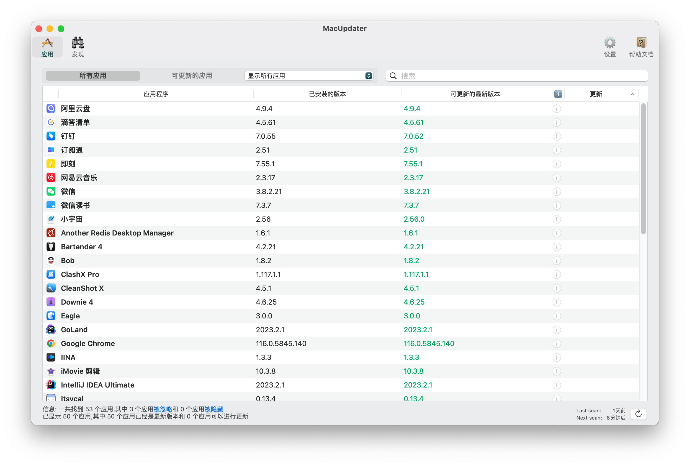

## 监控

### [Stats](https://github.com/exelban/stats)

开源软件，挺好用的，经常会看一看。

## 日历

### [Itsycal](https://www.mowglii.com/itsycal/)

简洁，小巧，够用。

## 压缩

### [Keka](https://www.keka.io/)

看推荐下的，官网免费，MAS版收费，下了就一直用着了，也没尝试其他的软件。

## 鼠标体验增强

### ~~🚫[Mos](https://github.com/Caldis/Mos)~~

挺好用的，就是隔段时间会出现软件自动挂掉的问题，得重新启动一下。😅懒得找平替，看来这个问题暂时还能忍。

- 平滑滚动

- 翻转方向

### [Mac Mouse Fix 3.0](https://github.com/noah-nuebling/mac-mouse-fix/releases)

刷到帖子下载试了一下，于是决定替换掉了Mos。

- 平滑滚动
- 翻转方向
- 自定义按键

## 快捷控制

### [One Switch](https://fireball.studio/oneswitch/)

很多小功能的控制。

- 不过目前已经`不再常驻`，基本要用到的功能都被平替
- 现在唯一场景只有清理屏幕和键盘的时候开一下屏幕清洁模式

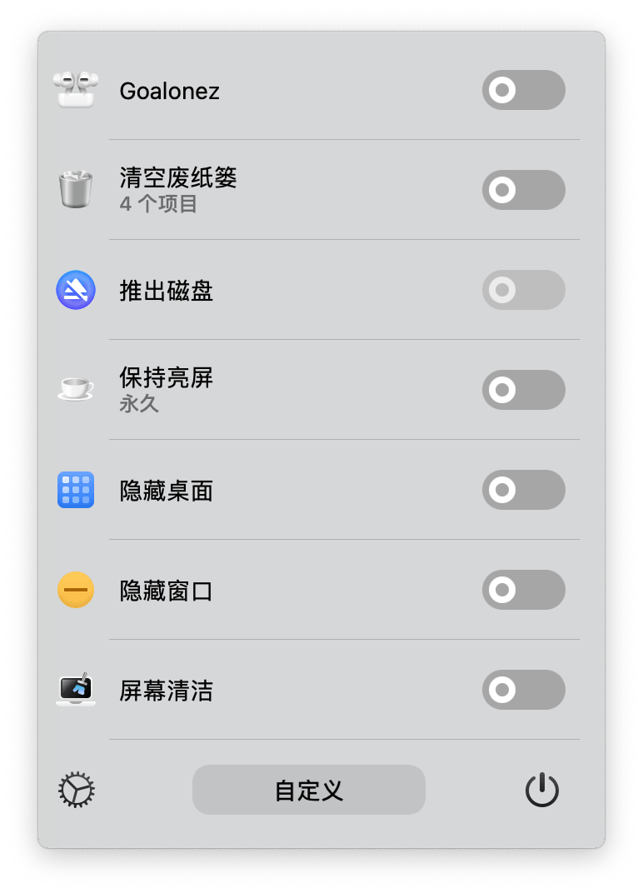

## 网络

### [Tailscale](https://tailscale.com/)

把自己的一些设备组成一个局域网，很方便。

具体可以参考Blog

> 地址：[Tailscale自建(Headscale及Drep)](./Tailscale自建(Headscale及Drep))

### ClashX Pro

## 划词

### [PopClip](https://www.popclip.app/)

主要配合`Bob`来做划词翻译

可以按需添加一些插件

## 翻译

### [Bob](https://bobtranslate.com/)

- 输入翻译（`option + F`）
- 划词翻译（`配合PopClip`）
- OCR + 翻译~~（`option + ESC`）~~（`option + V`）

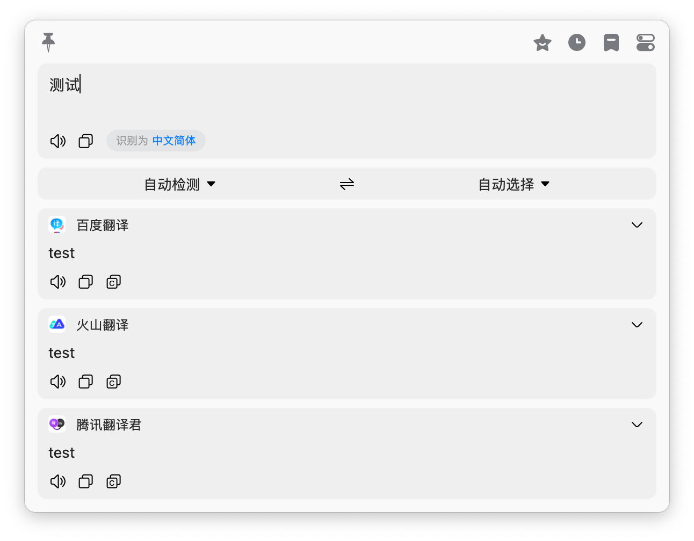

## 菜单栏管理

### [Bartender 4](https://www.macbartender.com/)

因为刘海的存在，这个是必备软件。下面是我自己的日常配置。

- 不用外接显示器的时候，网易云会收到下面的隐藏栏中去

根据`|`划分

1. 日常软件
2. 搜狗输入法字数统计 + 系统控制
3. Stats的网速和电量 + Itsycal
4. 隐藏栏：Stats监控 + 工具类软件

## 截图

### [CleanShot X](https://cleanshot.com/)

图片类大一统软件

- 自定义截图~~（这个是先截图再单独编辑，从其他软件转过来可能需要适应一下）（`option + F1`）~~
- 窗口截图~~（`option + F4`）~~（`option + F3`）
- 全屏截图
- 滚动截图
- 倒计时截图
- OCR(这个还是用的`Bob`的`文本识别`，OCR完直接就翻译了，方便点，这个仅用来识别二维码)
- 录屏
- GIF
- 截图历史（很喜欢它的界面设计，还带了分类）（`option + F2`）
- 截图编辑
- 👍All In One（~~会根据之前的截图范围~~弹出一个所有功能的界面）~~（`option + F3`）~~（`option + F1`）
- 截图固定在桌面上
- 1G云空间，方便把截图分享出去（个人用不太上这个）

>用了两年才发现原来All In One是可以直接选区的,而不用根据之前的截图范围😅，于是直接配置了option + F1快捷键
>
>具体设置如下
>
>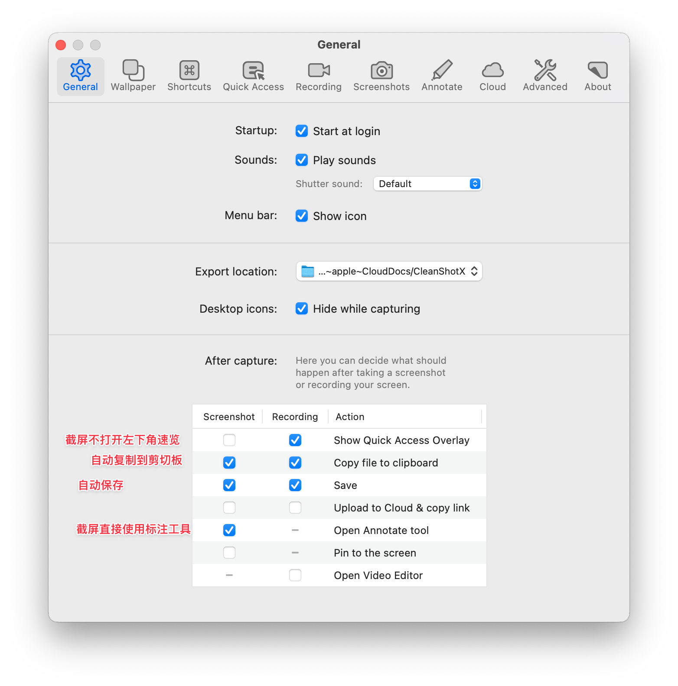
>
>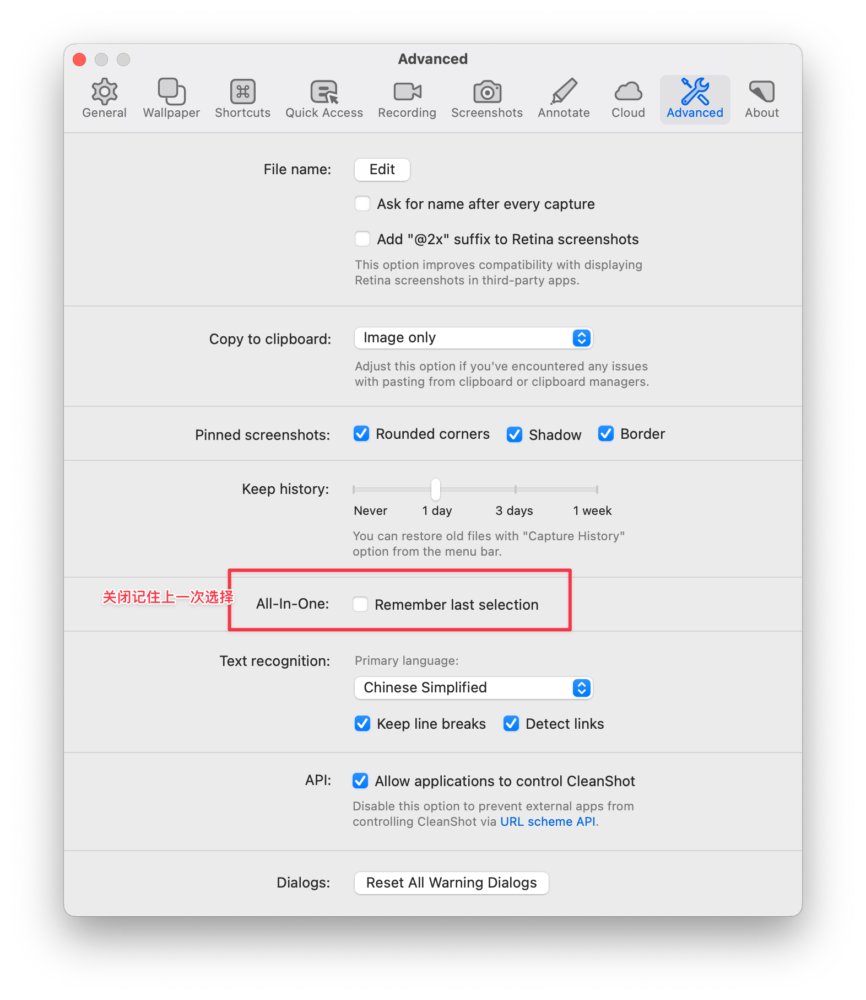

## 图片管理

### [Eagle](https://eagle.cool/)（`option + Z`）

用来收集素材，并且进行管理，通过iCloud，阿里云盘压缩加密冷备

- 搭配Chrome插件
  - 收集Instagram、微博、即刻之类的图片
  - 网页截图

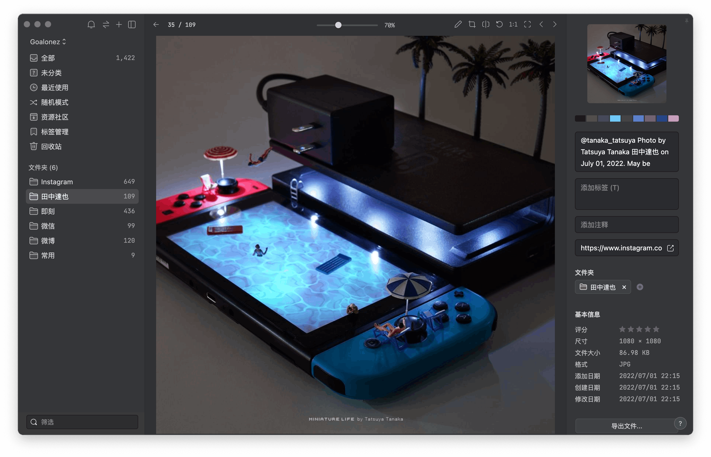

## 图片预览

### [PictureView](https://wl879.github.io/apps/picview/)

V2ex看到的帖子，下载下来体验还不错，就一直在用了，倒腾了一下快捷键，还是比较顺手的。

## 视频播放

### [IINA](https://iina.io/)

倒腾了下快捷键，用着顺手。颜值也不错。

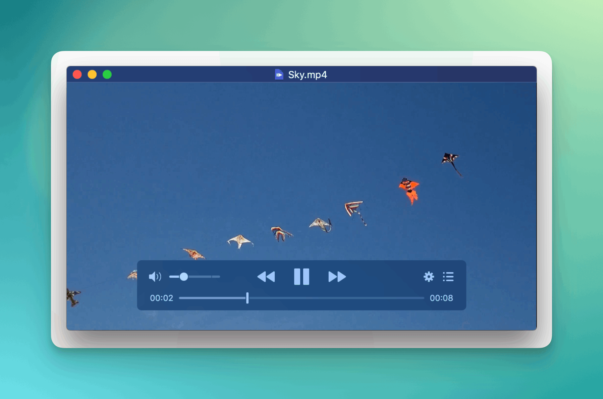

## 视频下载

### [Downie 4](https://software.charliemonroe.net/downie/)

偶尔会下载一些网站的视频，使用频率不高，但是很好用。直接输入地址就会自动解析下载。

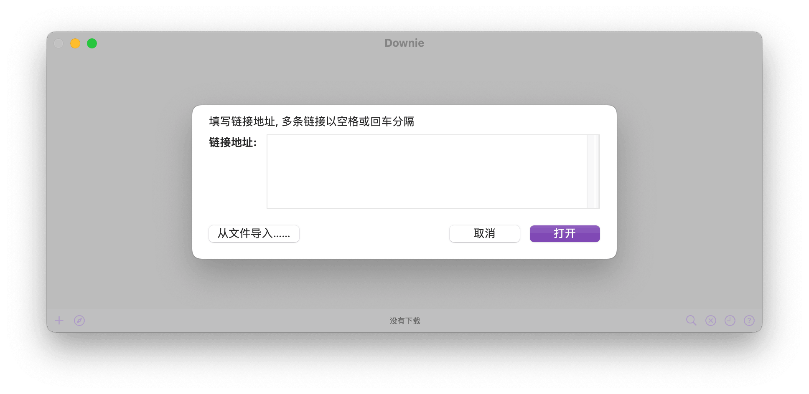

## 开发工具

### [Jetbrains全家桶](https://www.jetbrains.com/)

这个就不介绍了，个人前后端都喜欢用这一套

### [Visual Studio Code](https://code.visualstudio.com/)

我主要用来当文本编辑器用

插件丰富，功能强大

### [Navicat](https://www.navicat.com.cn/)

偶尔需要用到一下，频率低。处理表结构或者导数据之类的。

大部分时间直接使用JetBrains里自带的，写SQL的时候提示舒服很多，也不单独下载Datagrip，太吃内存了。但是JetBrains表结构的编辑界面做得太烂了，现在习惯直接SQL处理表结构。

### [oss-browser](https://github.com/aliyun/oss-browser)

偶尔连下OSS

### ~~🚫[Another Redis Desktop Manager](https://github.com/qishibo/AnotherRedisDesktopManager)~~

Redis可视化工具，用的也不多。Jetbrains虽然也支持Redis了，但是目前还不完善。

### [Tiny](https://github.com/tiny-craft/tiny-rdm)

Redis可视化工具，颜值高一点。

### [Tabby](https://tabby.sh/)（`option + X`）

终端及服务器管理

- 全平台同步
- 新建本地终端标签页的时候有点卡，所以我一般常驻一个本地终端标签页
- 云服务器不多，这个就够管理了
- 主要有些服务器需要通过跳板，试用了多个终端软件，最终选择了这个

配置

- 具体可以参考Blog

  > [Zsh配置](./Zsh配置)

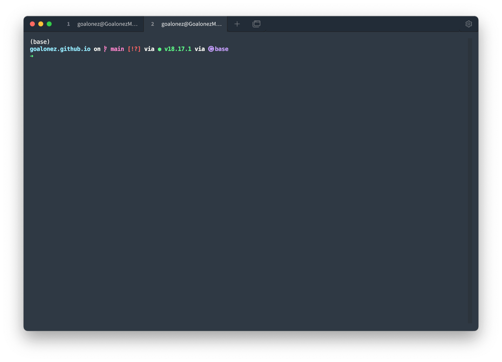

### [Volta](https://volta.sh/)

node版本管理

- 全平台（试用过nvm，fnm都遇到过一些坑，只有这个目前畅通）

### OrbStack

- OrbStack 是运行 Docker 容器和 Linux 的快速、轻便且简单的方案。用来替代Docker Desktop。

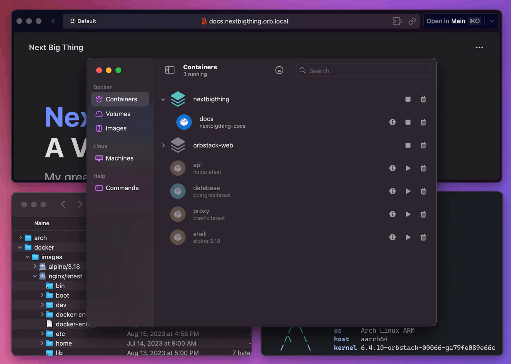

## 虚拟机

### UTM

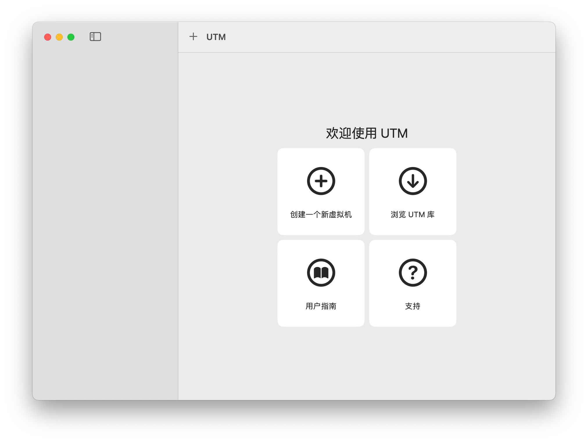

## M1安装的iOS软件

### Mi Home（米家）

- 在Mac上可以控制一下家电也还行
- 配置智能场景以及联动小爱音箱做得跟💩一样
  - 多个智能开关在编辑完一串流程后，保存会变化，得通过骚操作删掉设备添加设备，瞎试半天才能保存出想要的流程。想象不到代码怎么实现出来的，会出现这种BUG，而且看上去不是偶现，简直不敢相信常规操作也能出现这种问题
  - 之前设置了某个场景，我回家会根据流程打开相应设备。从某天开始，我语音小爱音箱执行该场景，变成了把我的设备全部关闭。至今没法还原回我需要的场景，设置了也没用。但是单个设备的控制又是正常的。

### 即刻

纯摸鱼😂

### Twitter

纯摸鱼😂

### Weibo（微博）

纯摸鱼😂

### 小宇宙

- 以前下班打车经常听，现在场景不多。
- 工作时间听不进去，只能听个响。
- 觉得app做的不错，Mac版勉强够用，有播放列表同步，就是没法快捷键控制播放。

### 微信读书

- 大部分时间还是在手机上看

### PlayCover

下了个`金铲铲`，但没怎么玩。

可以不用，不能没有系列 + 1 🤣

<gitalk/>