# MoviePilot配置-Nas媒体库自动化管理工具

## 仓库

[官方仓库](https://github.com/jxxghp/MoviePilot)

感谢大佬的开源

## UI展示

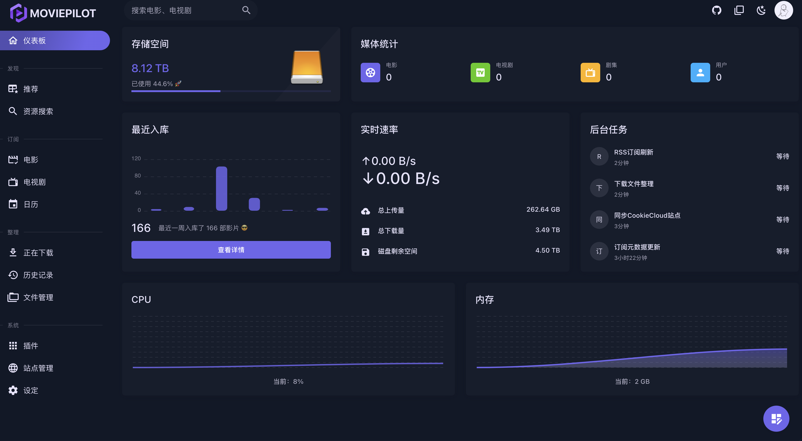

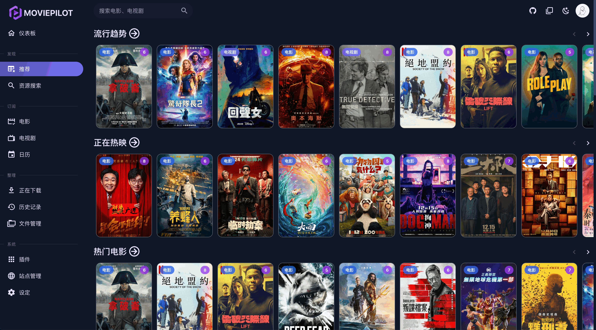

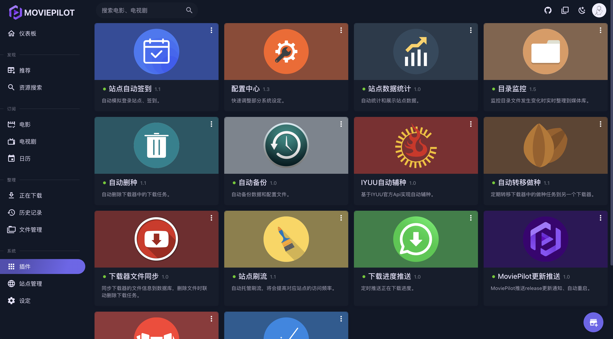

## 功能介绍

### 仪表盘

- 展示一些基础信息

### 发现

#### 推荐

- 搜索影视资源
  - 添加订阅
  - 搜索已添加站点里的种子资源

#### 资源搜索

- 搜索已添加站点里的种子资源

### 订阅（自动追剧）⭐

- 电影
- 电视剧
- 日历
  - 更新时间展示

> 只有暂时没有资源的或者还在更新的会展示在订阅中
>
> 如果下载完了，会从订阅里消失

### 整理

#### 正在下载

- 当前正在下载的任务信息

#### 历史记录⭐

- 媒体库整理纪录
- 经过MoviePilot的资源全靠这个历史记录来管理，比较重要，但目前界面还比较简单

#### 文件管理

- 环境变量中DLOWNLOAD_PATH路径下的内容
- 也可以跳转到上层，展示整个Docker容器的目录

### 系统

#### 插件⭐

- 插件系统

#### 站点管理⭐

- PT站点管理

#### 设定

- 系统设置内容
  - 用户
  - 系统
    - 设置下载器
    - 设置媒体服务
    - 设置媒体库
  - 站点
    - 设置同步CookieCloud
    - 优先级
  - 搜索
    - 站点选择
    - 优先级规则
  - 订阅
    - 站点选择
    - 优先级规则
  - 服务
    - 自带的服务，可以手动执行
  - 通知
    - 设置通知密钥
    - 选择通知方案，微信、Tg、Slack、群晖
  - 词表
  - 关于
    - 系统版本信息

## 前置-安装CookieCloud（可选）

- 主要用于添加站点管理

> 也可以手动在MoviePilot左下角的站点管理中手动添加站点。
>
> 但是还是推荐用CookieCloud这个Chrome插件，添加站点方便点。

#### 安装地址
  - https://github.com/easychen/CookieCloud
  - 可以直接在Releases安装
  - 也可以在插件商店安装

#### 界面

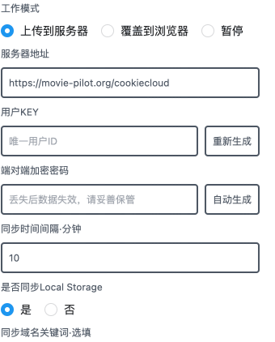

#### 配置

- 服务器地址
  - MoviePilot提供的公共地址：https://movie-pilot.org/cookiecloud
  - 当然也可以自建，具体参考Github仓库
- Key和密码生成后自己记住
- 域名一行一个
  - 建议只配置PT站，没必要把所有Cookie都同步上去，虽然理论上有KEY和密码加密。
  - ~~馒头需要用`xp.io`的域名。~~ 新版本已支持馒头所有域名
    - ~~不过下面`自定义索引站点`插件，可以添加`cc`域名，并且能够搭配辅种插件（`io`没法辅种），所以还是建议先用`io`域名添加完之后配置索引，然后把域名改成`cc`的。~~
- 一般选择手动同步即可，平时暂停，等什么时候网站连接不通了再手动更新就好了

## 前置-目录概况

- 这里以极空间举例，其他产品应该整体逻辑都差不多，反正都是基于Docker的版本。

- 硬盘模式为单盘模式，目前为3个机械盘，1个固态盘。
  - 盘1主要长期保种资源（这类资源通常通过MoviePilot下载种子到本地，手动添加到qBittorrent下载，路径选到盘1，并且打上标签`已整理`。`因为默认下载路径在盘2，搭配“目录监控”插件整理到媒体库中`）
  - 盘2主要存放短期影视资源、订阅内容
  - 盘3主要用于刷流。
  - 固态盘1主要存放Docker配置信息、虚拟机文件


> 如果是ZDR模式，也就是一个存储池，设置上应该更方便一些。我是因为在折腾之前已经切换到单盘模式了，而且怕盘坏了不知道丢了什么内容，所以还是继续使用单盘模式。

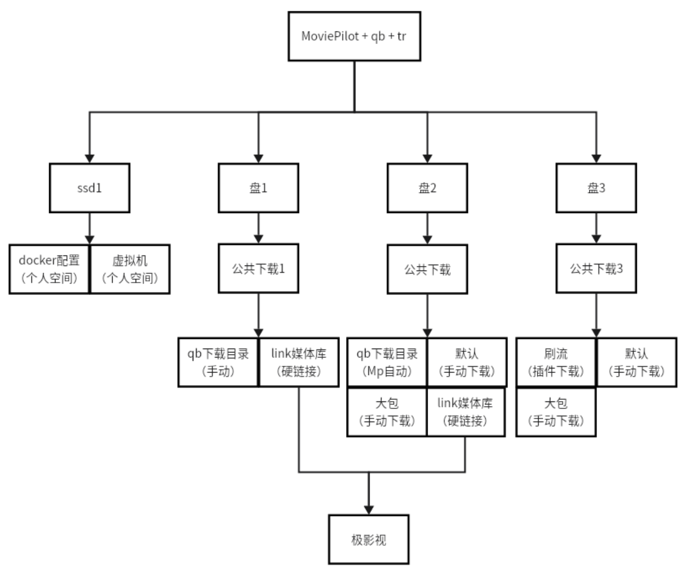

> 这里主要是因为极影视只能通过分类共享，但是里面的资源也得放在公共空间。
>
> 所以我的下载目录都是在公共空间里创建的，然后指定对应盘位。
>
> 配置目录则放在个人空间。

- 下载目录

  - 公共下载 -> 盘2

  - 公共下载1 -> 盘1

  - 公共下载3 -> 盘3

- 配置文件目录（固态盘）
  - qBittorrent
    - /个人空间/docker/qb -> /config
  - Transmission
    - /个人空间/docker/tr/watch -> /watch
    - /个人空间/docker/tr/config -> /config
  - MoviePilot
    - /个人空间/docker/MoviePilot/config -> /config
    - /个人空间/docker/MoviePilot/cache -> /moviepilot

> 2024-02-28：引用自官方频道
>
> 【关于 MoviePilot多目录支持的说明】
>
> 1. 下载目录支持按电影、电视剧、动漫设定三个不同的下载目录。
> 2. 媒体库目录支持配置多个根目录（使用,号分隔），同时每个根目录下可以按电影、电视剧、动漫设定多个不同的一级目录名称，开启自动分类时会在一级目录下根据分类策略自动建二级目录。
> 3. 多目录整理时会自动匹配下载目录和媒体库目录的关系，匹配的逻辑是：
>
> \- 计算媒体库目录与下载目录的相似度，相似度最高的目录会优先使用（也就是说，如果你希望下载目录和媒体库目录一对一整理时，在Docker中将下载目录和媒体库目录映射为同一个父路径，程序便会自动识别）
>
> \- 如无相似的目录，则按配置的顺序查找第一个满足文件大小要求的媒体库目录。

## 前置-下载器安装

### qBittorrent（用于下载任务）

参考[官方文档](https://www.zspace.cn/help/?articleId=100124)

- 关闭性能限制

- 下载目录如果有多盘位的话就跟我设置得一样就行了

| 目录                | 容器内路径  | 备注                                              |
| ------------------- | ----------- | ------------------------------------------------- |
| /团队空间/公共下载  | /downloads  | 默认盘2下载目录                                   |
| /团队空间/公共下载1 | /downloads1 | 盘1下载目录，为了`目录监控`插件，方便整理到媒体库 |
| /团队空间/公共下载3 | /downloads3 | 盘3下载目录，为了`刷流`插件                       |

#### Web UI

[仓库地址](https://github.com/VueTorrent/VueTorrent)

- 我为了一屏显示我关注的数据所以改了一些样式代码，但大致是如下图所示


### Transmission（用于保种任务）

#### Docker安装

#####  搜索镜像

> chisbread_transmission

##### 启动容器

###### 1.关闭性能限制

###### 2.文件夹映射

| 本地文件夹路径（自己创建） | 容器内路径  | 备注                                                         |
| -------------------------- | ----------- | ------------------------------------------------------------ |
| /个人空间/docker/tr/watch  | /watch      | 种子监控目录，感觉没啥用                                     |
| /个人空间/docker/tr/config | /config     | 配置目录                                                     |
| /个人空间/docker/tr/web    | /web        | web UI文件夹[官方仓库](https://github.com/transmission-web-control/transmission-web-control) |
| /团队空间/公共下载         | /downloads  | 默认盘2下载目录                                              |
| /团队空间/公共下载1        | /downloads1 | 盘1下载目录，方便`目录监控`插件整理到媒体库                  |
| /团队空间/公共下载3        | /downloads3 | 盘3下载目录，为了`刷流`插件                                  |

###### 3.端口

> 由于极空间自带下载为51413，防止冲突，所以等会环境变量里PEERPORT设置成51419

| 映射端口 | 容器内端口 |
| -------- | ---------- |
| 51419    | 51419 TCP  |
| 51419    | 51419 UDP  |
| 9091     | 9091       |

###### 4.环境变量

| 环境变量              | 值       | 备注   |
| --------------------- | -------- | ------ |
| USER                  | 自己设置 | 账号   |
| PASS                  | 自己设置 | 密码   |
| PUID                  | 0        | 权限   |
| PGIU                  | 0        | 权限   |
| TRANSMISSION_WEB_HOME | /web     | web UI |

#### Web UI

[仓库地址](https://github.com/transmission-web-control/transmission-web-control)

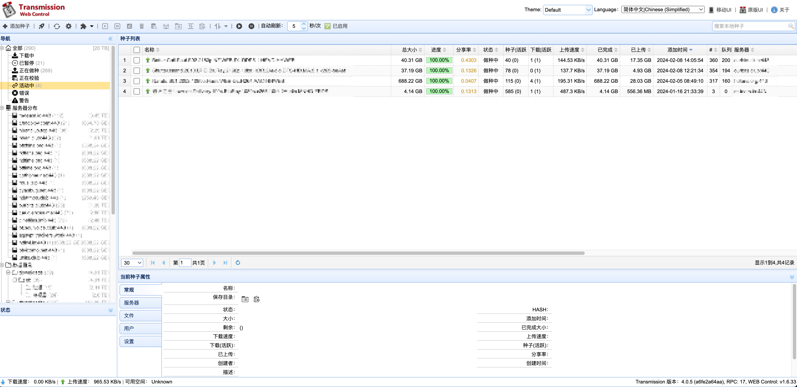

##### 补充

###### 1.Transmission web UI卡顿解决

根据药丸论坛的教程，可以设置`/个人空间/docker/tr/config/tr-web-control/config.js`下的`pageSize`调整到50以下。然后重启容器，清除浏览器里Transmission页面的缓存。这样默认分页会从200变得小一点。

###### 2.Transmission任务列表文件大小与PT站不一致

由于默认文件大小是按1000来计算的，所以可以修改源代码进行解决。

- 拉取代码
- 找到路径`src/lib/utils.ts`
- 搜索`const k = 1000;`，改成`1024`
- 执行`npm install`、`npm run build`打包
- 打包出来的`dist`即`/个人空间/docker/tr/web`

> 有点麻烦，其实也没什么必要去改。

## 主要-安装MoviePilot⭐

### Docker安装

#### 搜索镜像

> jxxghp/moviepilot

#### 安装容器

###### 1.文件夹路径映射

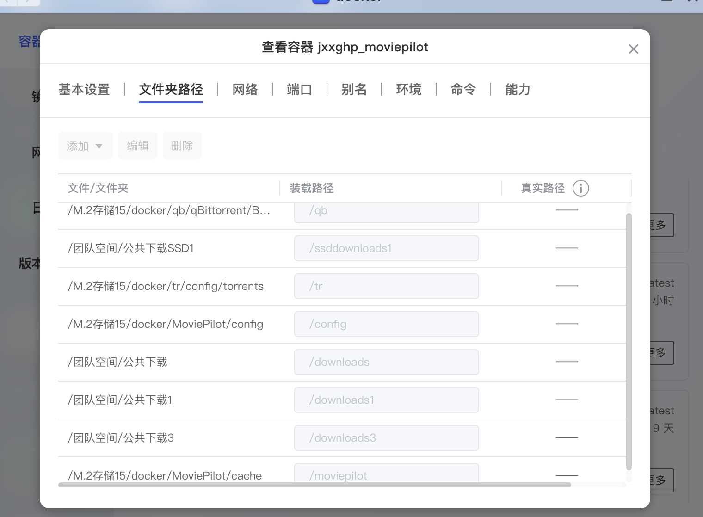

| 本地文件夹路径（自己创建）                | 容器内路径  | 备注                                               |
| ----------------------------------------- | ----------- | -------------------------------------------------- |
| /个人空间/docker/tr/config/torrents       | /tr         | Docker安装的Transmission的种子文件夹               |
| /个人空间/docker/qb/qBittorrent/BT_backup | /qb         | Docker安装的qBittorrent的种子文件夹                |
| /个人空间/docker/MoviePilot/config        | /config     | MoviePilot的配置文件夹                             |
| /个人空间/docker/MoviePilot/cache         | /moviepilot | MoviePilot的浏览器内核，不映射的话每次都会重新下载 |
| /团队空间/公共下载                        | /downloads  | 默认盘2下载目录                                    |
| /团队空间/公共下载1                       | /downloads1 | 盘1下载目录，为了`目录监控`插件，方便整理到媒体库  |
| /团队空间/公共下载3                       | /downloads3 | 盘3下载目录，为了`刷流`插件                        |

###### 2.网络

- host

###### 3.环境

- 这里只提供主要的一些配置
- 更多配置可以参考[官方仓库](https://github.com/jxxghp/MoviePilot?tab=readme-ov-file#1-%E7%8E%AF%E5%A2%83%E5%8F%98%E9%87%8F)
- 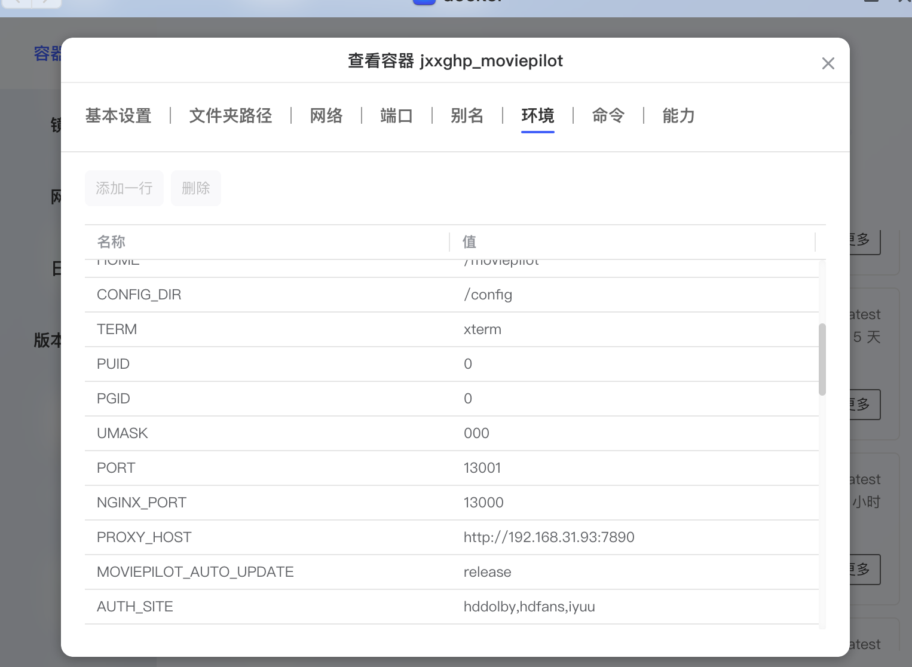

| 环境变量                                                     | 值                          | 备注                                                         |
| ------------------------------------------------------------ | --------------------------- | ------------------------------------------------------------ |
| PORT                                                         | 3000                        | WEB服务端口，可自行修改，不要和API端口冲突                   |
| NGINX_PORT                                                   | 3001                        | API服务端口，可自行修改，不要和WEB端口冲突                   |
| PROXY_HOST                                                   | `http://nas的局域网ip:7890` | 没有呆梨就别填，主要是为了tg通知和Github更新版本             |
| MOVIEPILOT_AUTO_UPDATE                                       | true                        | 自动更新                                                     |
| AUTH_SITE                                                    | hdfans,iyuu                 | 认证站点，具体参考[仓库](https://github.com/jxxghp/MoviePilot?tab=readme-ov-file#1-%E7%8E%AF%E5%A2%83%E5%8F%98%E9%87%8F) |
| HDFANS_UID                                                   |                             | 自行根据站点填写                                             |
| HDFANS_PASSKEY                                               |                             | 自行根据站点填写                                             |
| IYUU_SIGN                                                    |                             | [iyuu](https://iyuu.cn/)获取                                 |
| TMDB_API_DOMAIN                                              | api.tmdb.org                | TMDB API地址,有呆梨可以填`api.themoviedb.org`                |
| TMDB_IMAGE_DOMAIN                                            | static-mdb.v.geilijiasu.com | TMDB API地址,有呆梨可以填`image.tmdb.org`                    |
| DOWNLOAD_PATH`新版本mp可以直接在页面设定-系统里进行配置`     | /downloads/qb               | 默认下载地址，盘2的qBittorrent下载目录下                     |
| LIBRARY_PATH`新版本mp可以直接在页面设定-系统里进行配置`      | /downloads/link             | 默认媒体库地址，盘2的下载目录的link下                        |
| LIBRARY_CATEGORY`新版本mp可以直接在页面设定-系统里进行配置`  | true                        | 资源库开启自动二级分类                                       |
| DOWNLOAD_CATEGORY`新版本mp可以直接在页面设定-系统里进行配置` | false                       | 下载关闭自动二级分类                                         |
| TRANSFER_TYPE`新版本mp可以直接在页面设定-系统里进行配置`     | link                        | 默认整理方式，推荐`link`硬链接，只占用1份空间。`但是似乎多盘位会变成复制。所以我盘2只硬链接盘2的媒体库，盘1只硬链接盘1的媒体库，通过极影视选中文件夹来关联资源。` |
| DOWNLOADER`新版本mp可以直接在页面设定-系统里进行配置`        | qbittorrent                 | 默认下载器                                                   |
| QB_HOST`新版本mp可以直接在页面设定-系统里进行配置`           | `http://nas的局域网ip:端口` | qBittorrent的地址                                            |
| QB_USER`新版本mp可以直接在页面设定-系统里进行配置`           |                             | qBittorrent的账号                                            |
| QB_PASSWORD`新版本mp可以直接在页面设定-系统里进行配置`       |                             | qBittorrent的密码                                            |
| TR_HOST`新版本mp可以直接在页面设定-系统里进行配置`           | `http://nas的局域网ip:端口` | Transmission的地址                                           |
| TR_USER`新版本mp可以直接在页面设定-系统里进行配置`           |                             | Transmission的账号                                           |
| TR_PASSWORD`新版本mp可以直接在页面设定-系统里进行配置`       |                             | Transmission的密码                                           |
| DOWNLOAD_MOVIE_PATH`新版本mp可以直接在页面设定-系统里进行配置` | /downloads/qb/电影          | 电影下载保存目录路径                                         |
| DOWNLOAD_TV_PATH`新版本mp可以直接在页面设定-系统里进行配置`  | /downloads/qb/电视剧        | 电视剧下载保存目录路径                                       |
| DOWNLOAD_ANIME_PATH`新版本mp可以直接在页面设定-系统里进行配置` | /downloads/qb/动漫          | 动漫下载保存目录路径                                         |
| LIBRARY_MOVIE_NAME`新版本mp可以直接在页面设定-系统里进行配置` | 电影                        | 电影媒体库目录名称                                           |
| LIBRARY_TV_NAME`新版本mp可以直接在页面设定-系统里进行配置`   | 电视剧                      | 电视剧媒体库目录名称                                         |
| LIBRARY_ANIME_NAME`新版本mp可以直接在页面设定-系统里进行配置` | 动漫                        | 动漫媒体库目录名称                                           |
| COOKIECLOUD_HOST`新版本mp可以直接在页面设定-站点里进行配置`  | `http://nas的局域网ip:端口` | 如果自建的话就填写，如果用默认mp官方的话不需要加这个环境变量 |
| COOKIECLOUD_KEY`新版本mp可以直接在页面设定-站点里进行配置`   |                             | 上方CookieCloud插件生成的key                                 |
| COOKIECLOUD_PASSWORD`新版本mp可以直接在页面设定-站点里进行配置` |                             | 上方CookieCloud插件生成的密码                                |
| COOKIECLOUD_INTERVAL`新版本mp可以直接在页面设定-站点里进行配置` | 10                          | CookieCloud同步间隔（分钟）                                  |
| SUBSCRIBE_MODE`新版本mp可以直接在页面设定-订阅里进行配置`    | rss                         | 订阅模式                                                     |
| SUBSCRIBE_RSS_INTERVAL`新版本mp可以直接在页面设定-订阅里进行配置` | 15                          | RSS订阅模式刷新时间间隔（分钟）                              |
| PLUGIN_MARKET                                                | 见下方                      | 仓库扩展                                                     |

###### 3.1仓库扩展

```
https://github.com/jxxghp/MoviePilot-Plugins,https://github.com/thsrite/MoviePilot-Plugins,https://github.com/honue/MoviePilot-Plugins,https://github.com/dandkong/MoviePilot-Plugins,https://github.com/Aqr-K/MoviePilot-Plugins,https://github.com/AnjoyLi/MoviePilot-Plugins,https://github.com/WithdewHua/MoviePilot-Plugins,https://github.com/HankunYu/MoviePilot-Plugins,https://github.com/baozaodetudou/MoviePilot-Plugins
```

###### 4.媒体库分类

- 详情参考底部示例

#### 启动容器

- 访问`http://nas的局域网ip:3000`，默认用户名admin，初始化密码在日志中，登录后自行修改。

## 同步站点

- 执行
  - 设定-服务-同步CookieCloud站点
  - 同步完成即可在`站点管理`中看到自己的PT站了

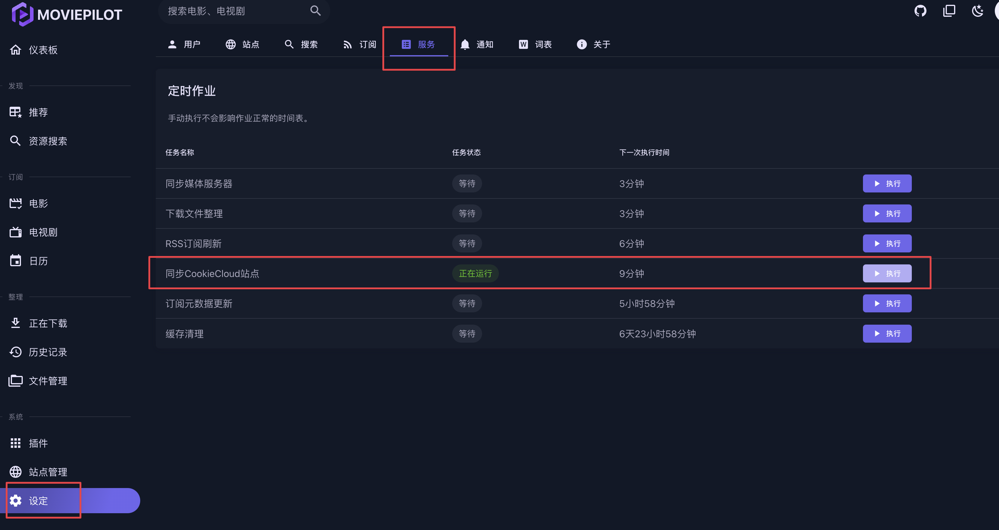

## 插件⭐


### 站点自动签到

- 45 8,19 * * *
- 每天8点45和19点45执行一次。第二次执行只是为了保证某些时候失败的情况。

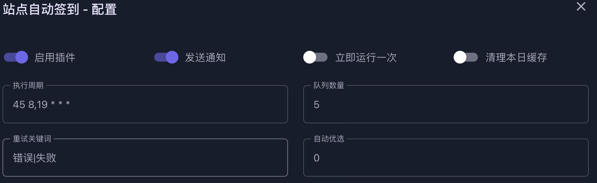

### 配置中心

- 可视化修改一些app.env的数据
- 按需修改即可

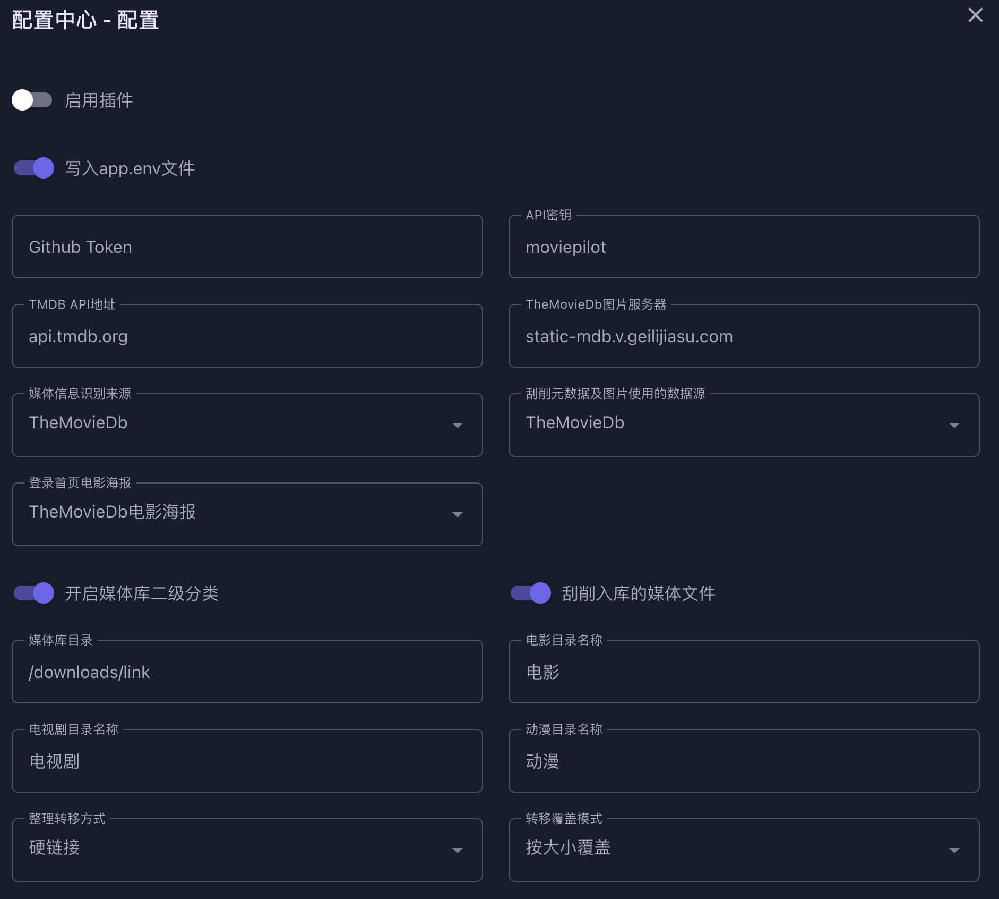

### 站点数据统计

- 15 21 * * *
- 每天21点15分执行一次


### 目录监控

- 主要是为了盘1手动下载的资源进行整理入库
- 监控了盘1下载目录的3个类型的文件夹
- 每一行一个目录，支持以下几种配置方式，转移方式支持`move、copy、link、softlink、rclone_copy、rclone_move`

  - 监控目录#转移方式
  - 监控目录:转移目的目录
  - 监控目录:转移目的目录#转移方式

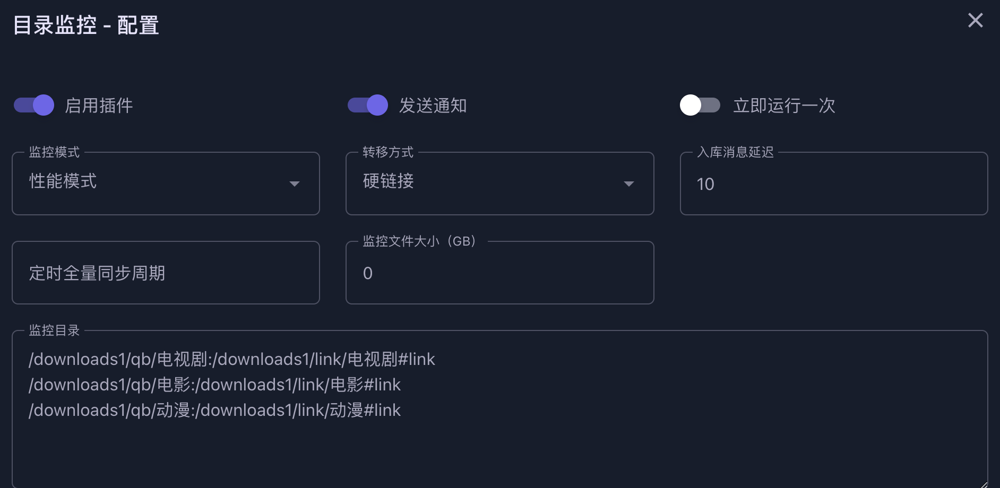

### 自动删种

- 45 * * * *
- 每小时45分的时候执行一下。
- 主要是为了配合刷流插件，目前只对刷流并且做种60小时的种进行暂停。
  - 60小时主要是为了防止HR，具体规则按站点来调整。

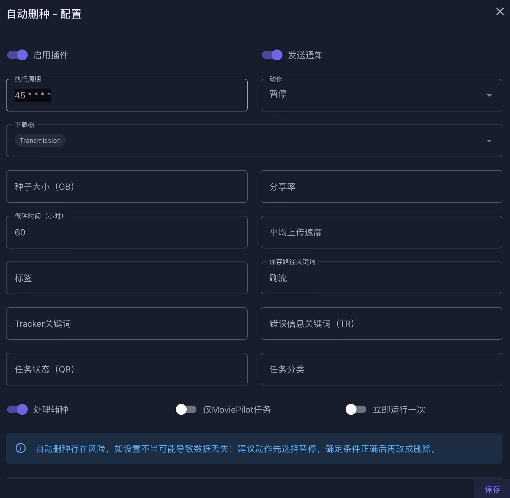

### 自动备份

- 50 * * * *
- 每小时50分的时候备份一下数据

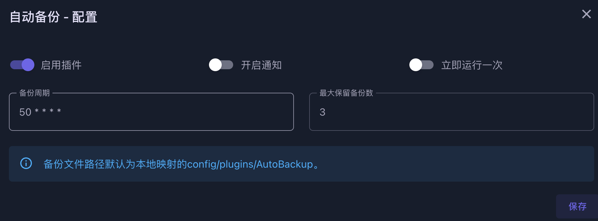

### iyuu自动辅种

- 主要是为了刷魔力值，只需要下载一份资源，就可以在多个站进行保种，一般这种拿不到什么上传量，但是对魔力值提升还是有些帮助的。

- 45 8,19 * * *
- 每天8点45分和19点45分执行一次
- 刷流目录下的不辅种
  - 本来可以按标签来，但是刷流标签在自动转种到Transmission后会消失，所以只能按目录来了

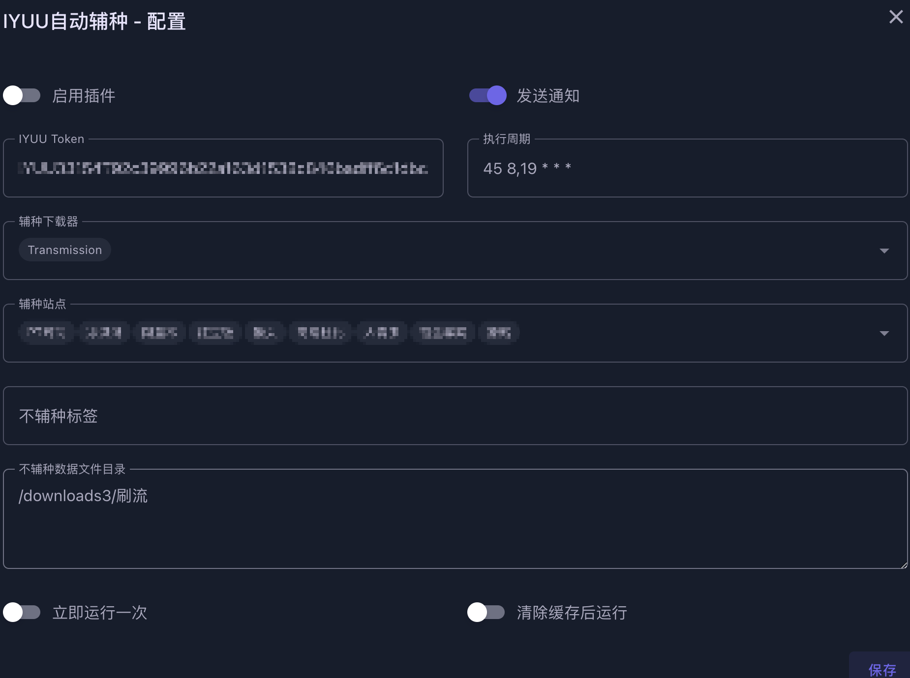

### 自动转移做种

- qBittorrent只负责下载任务，下载完成后转移到Transmission进行保种

- */10 * * * *
- 每隔10分钟1次
- 只转移`已整理`的标签
  - 手动下载到盘1的任务需要手动打标签

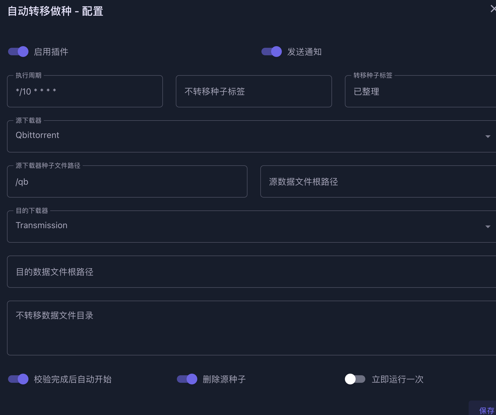

### 下载器文件同步

我也没搞懂干嘛的。虽然下载后开着，但是一直不知道具体是什么效果。欢迎留言补充。

### 站点刷流

- 默认10分钟运行一次
- 这里应该是默认用的爬虫模式，而非RSS模式，并且只会读取首页的数据，所以部分首页都是置顶的站就没法很好的进行刷流。

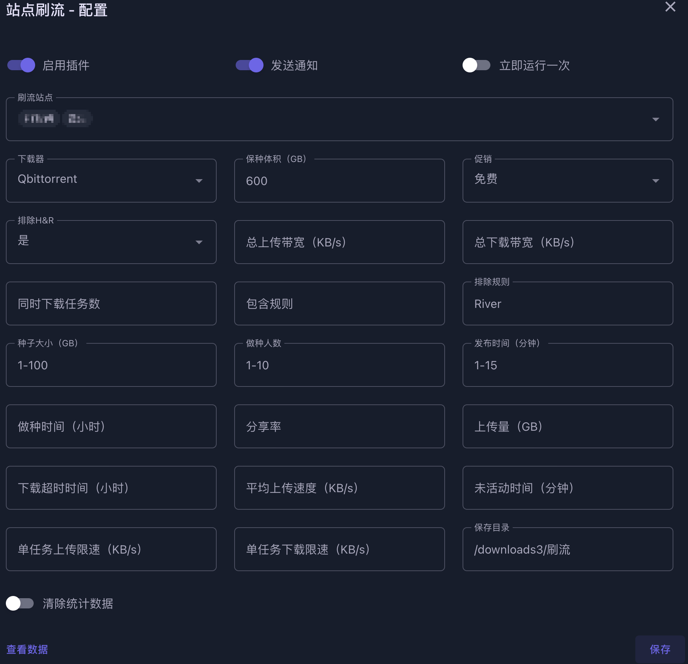

### 下载进度推送

- 3600秒，1小时执行1次。
- 只会监控通过MoviePilot下载的任务。自己在qBittorrent添加的不会监控。

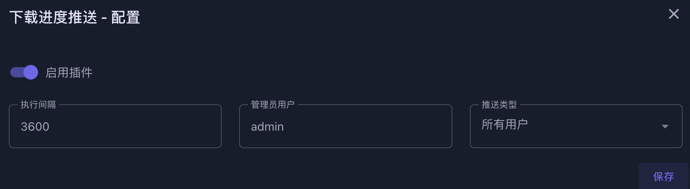

### Bark消息通知

没有呆梨的话可以用这个插件来通知，配置还是挺方便的。

- 服务器地址记得配置完成，完整的应该是`https://api.day.app/你的编码`

### 自定义索引站点

> 2024-02-15:目前最新版官方已经添加麒麟、馒头多域名支持，所以删除了相应配置方案。

- 添加没有默认支持的站点

- 

- 其他站点欢迎留言补充


### 清理订阅缓存

- 这个插件需要在环境变量中添加仓库扩展
- 主要是为了某些时候自动订阅下载了资源，但是被自己手动删掉的情况

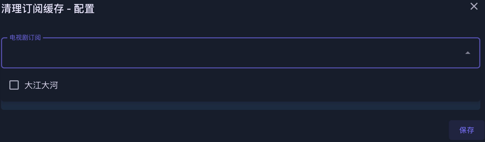

### 订阅规则

> 引用自MoviePilot群组

```
SPECSUB & CNSUB & 4K & !BLU & BLURAY & H265 & !DOLBY & !REMUX & !UHD > CNSUB & 4K & !BLU & BLURAY & H265 & !DOLBY & !REMUX & !UHD > SPECSUB & CNSUB & 4K & !BLU & !BLURAY & !UHD & !REMUX & WEBDL & !DOLBY > CNSUB & 4K & !BLU & !BLURAY & !UHD & !REMUX & WEBDL & !DOLBY > 4K & !BLU & !DOLBY > 4K & !BLU > SPECSUB & CNSUB & 1080P & BLURAY & !DOLBY & !BLU & !UHD & !REMUX > CNSUB & 1080P & !BLU & BLURAY & !DOLBY & !UHD & !REMUX > SPECSUB & CNSUB & 1080P & !BLU & !BLURAY & !UHD & !REMUX & WEBDL & !DOLBY > CNSUB & 1080P & !BLU & !BLURAY & !UHD & !REMUX & WEBDL & !DOLBY > 1080P & !BLU & !DOLBY > 1080P & !BLU > 720P & !BLU 
```

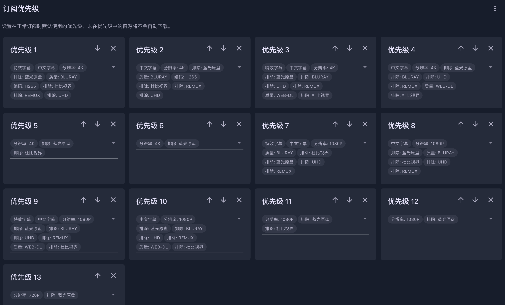

## ~~iyuu掉备案临时解决方案~~

> 目前官方已通过hk域名解决该问题

### 反代

- 首页自己得有域名
- 申请一个免费的ssl证书
- 通过自己的服务器反代一个api.iyuu.cn

### MoviePilot插件版

- 由于容器内没法使用nano、vi、vim，只能文件夹映射出来

- /app/app/plugins/iyuuautoseed/iyuu_helper.py

- 修改api.iyuu.cn成自己反代的地址即可

> 但是这种情况会导致MoviePilot自动升级功能失效，一直提示获取当前版本失败,取消映射即可修复

### iyuu-plus

- ssh只能通过sh命令进入，而且每次启动都会拉取最新代码，所以还是得文件夹映射出来
- /IYUU/app/common/Constant.php
- 修改api.iyuu.cn成自己反代的地址即可

## 馒头新架构添加站点

> 引用自官方群组
>
> 注意：馒头部分插件仍然使用cookie访问，请自行评估风险。具体可参考更新日志支持情况。

- 检查版本是否为1.7.5+

- 添加配置

  - 如果原先站点管理里的mt没删除 请替换rss地址、cookie和UA

  - 如果意外删除 请手动添加。`官方提供的添加方式图片就不放了，因为带了链接。`

- 添加完成后请到馒头的控制台 - 实验室 - 建立存取令牌

- 生成令牌后请回到站点管理测试馒头联通性一次 连通性正常后尝试`搜索`并观察日志 日志中有MT获取到APIkey字样即可

请在cookiecloud浏览器插件端黑名单添加域名

避免下次同步时覆盖手动添加的cookie

## 媒体库分类示例

> 动漫分类更新：
>
> 电影不动，原先电视剧里的动漫调整到了单独分类。
>
> - 这部分我也没整太明白，也不知道这样配置对不对。因为测试了一下原有资源重新整理。
>   - 火影忍者是正常进入分类的。
>   - 死亡笔记却跑到日韩剧里去了。
> - 欢迎大佬留言改进。

- 修改配置文件
  - `/个人空间/docker/MoviePilot/config/category.yaml`

```yaml
####### 配置说明 #######
# 1. 该配置文件用于配置电影和电视剧的分类策略，配置后程序会按照配置的分类策略名称进行分类，配置文件采用yaml格式，需要严格附合语法规则
# 2. 配置文件中的一级分类名称：`movie`、`tv` 为固定名称不可修改，二级名称同时也是目录名称，会按先后顺序匹配，匹配后程序会按这个名称建立二级目录
# 3. 支持的分类条件：
#   `original_language` 语种，具体含义参考下方字典
#   `production_countries` 国家或地区（电影）、`origin_country` 国家或地区（电视剧），具体含义参考下方字典
#   `genre_ids` 内容类型，具体含义参考下方字典
#   themoviedb 详情API返回的其它一级字段
# 4. 配置多项条件时需要同时满足，一个条件需要匹配多个值是使用`,`分隔

# 配置电影的分类策略
movie:
  恐怖电影:
    genre_ids: '27'
  中国动画电影:
    genre_ids: '16'
    original_language: 'zh,cn,bo,za'
  日韩动画电影:
    genre_ids: '16'
    original_language: 'ja,ko'
  欧美动画电影:
    genre_ids: '16'
  华语电影:
    original_language: 'zh,cn,bo,za'
  日韩电影:
    original_language: 'ja,ko'
  欧美电影:

# 配置电视剧的分类策略
tv:
  中国纪录片:
    genre_ids: '99'
    original_language: 'zh,cn,bo,za'
  外国纪录片:
    genre_ids: '99'
  中国综艺:
    genre_ids: '10764,10767'
    original_language: 'zh,cn,bo,za'
  日韩综艺:
    genre_ids: '10764,10767'
    original_language: 'ja,ko'
  欧美综艺:
    genre_ids: '10764,10767'
  国产剧:
    origin_country: 'CN,TW,HK'
  日韩剧:
    original_language: 'ja,ko'
  欧美剧:

# 配置动漫的分类策略
anime:
  中国动漫:
    genre_ids: '16'
    # 匹配 origin_country 国家，CN是中国大陆，TW是中国台湾，HK是中国香港
    origin_country: 'CN,TW,HK'
  日韩动漫:
    genre_ids: '16'
    # 匹配 origin_country 国家，JP是日本
    origin_country: 'JP,KR'
  儿童动漫:
    genre_ids: '10762'
  欧美动漫:
    genre_ids: '16'

## genre_ids 内容类型 字典，注意部分中英文是不一样的
#	28	Action
#	12	Adventure
#	16	Animation
#	35	Comedy
#	80	Crime
#	99	Documentary
#	18	Drama
#	10751	Family
#	14	Fantasy
#	36	History
#	27	Horror
#	10402	Music
#	9648	Mystery
#	10749	Romance
#	878  Science Fiction
#	10770	TV Movie
#	53	Thriller
#	10752	War
#	37	Western
#	28	动作
#	12	冒险
#	16	动画
#	35	喜剧
#	80	犯罪
#	99	纪录
#	18	剧情
#	10751	家庭
#	14	奇幻
#	36	历史
#	27	恐怖
#	10402	音乐
#	9648	悬疑
#	10749	爱情
#	878	科幻
#	10770	电视电影
#	53	惊悚
#	10752	战争
#	37	西部

## original_language 语种 字典
#	af	南非语
#	ar	阿拉伯语
#	az	阿塞拜疆语
#	be	比利时语
#	bg	保加利亚语
#	ca	加泰隆语
#	cs	捷克语
#	cy	威尔士语
#	da	丹麦语
#	de	德语
#	dv	第维埃语
#	el	希腊语
#	en	英语
#	eo	世界语
#	es	西班牙语
#	et	爱沙尼亚语
#	eu	巴士克语
#	fa	法斯语
#	fi	芬兰语
#	fo	法罗语
#	fr	法语
#	gl	加里西亚语
#	gu	古吉拉特语
#	he	希伯来语
#	hi	印地语
#	hr	克罗地亚语
#	hu	匈牙利语
#	hy	亚美尼亚语
#	id	印度尼西亚语
#	is	冰岛语
#	it	意大利语
#	ja	日语
#	ka	格鲁吉亚语
#	kk	哈萨克语
#	kn	卡纳拉语
#	ko	朝鲜语
#	kok	孔卡尼语
#	ky	吉尔吉斯语
#	lt	立陶宛语
#	lv	拉脱维亚语
#	mi	毛利语
#	mk	马其顿语
#	mn	蒙古语
#	mr	马拉地语
#	ms	马来语
#	mt	马耳他语
#	nb	挪威语(伯克梅尔)
#	nl	荷兰语
#	ns	北梭托语
#	pa	旁遮普语
#	pl	波兰语
#	pt	葡萄牙语
#	qu	克丘亚语
#	ro	罗马尼亚语
#	ru	俄语
#	sa	梵文
#	se	北萨摩斯语
#	sk	斯洛伐克语
#	sl	斯洛文尼亚语
#	sq	阿尔巴尼亚语
#	sv	瑞典语
#	sw	斯瓦希里语
#	syr	叙利亚语
#	ta	泰米尔语
#	te	泰卢固语
#	th	泰语
#	tl	塔加路语
#	tn	茨瓦纳语
#	tr	土耳其语
#	ts	宗加语
#	tt	鞑靼语
#	uk	乌克兰语
#	ur	乌都语
#	uz	乌兹别克语
#	vi	越南语
#	xh	班图语
#	zh	中文
#	cn	中文
#	zu	祖鲁语

## origin_country/production_countries 国家地区 字典
#	AR	阿根廷
#	AU	澳大利亚
#	BE	比利时
#	BR	巴西
#	CA	加拿大
#	CH	瑞士
#	CL	智利
#	CO	哥伦比亚
#	CZ	捷克
#	DE	德国
#	DK	丹麦
#	EG	埃及
#	ES	西班牙
#	FR	法国
#	GR	希腊
#	HK	香港
#	IL	以色列
#	IN	印度
#	IQ	伊拉克
#	IR	伊朗
#	IT	意大利
#	JP	日本
#	MM	缅甸
#	MO	澳门
#	MX	墨西哥
#	MY	马来西亚
#	NL	荷兰
#	NO	挪威
#	PH	菲律宾
#	PK	巴基斯坦
#	PL	波兰
#	RU	俄罗斯
#	SE	瑞典
#	SG	新加坡
#	TH	泰国
#	TR	土耳其
#	US	美国
#	VN	越南
#	CN	中国 内地
#	GB	英国
#	TW	中国台湾
#	NZ	新西兰
#	SA	沙特阿拉伯
#	LA	老挝
#	KP	朝鲜 北朝鲜
#	KR	韩国 南朝鲜
#	PT	葡萄牙
#	MN	蒙古国 蒙古
```

## 其他教程

🔥热心网友整理的MoviePilot安装和使用指引，可供参考：

- https://github.com/DDS-Derek/MoviePilot/tree/docs
- https://hackfang.me/movie-pilot-install-and-guide
- https://github.com/Putarku/MoviePilot-Help

## 求药🙈

求💊论坛、十一大，感谢大佬！[我的邮箱](mailto:z4781854680@gmail.com)

## 注意

- **请勿**在任何国内平台宣传 MoviePilot，MoviePilot 仅用于学习交流使用。
- **请勿**将 MoviePilot 用于商业用途。
- **请勿**将 MoviePilot 制作为视频内容，于境内视频网站(版权利益方)传播。
- **请勿**将 MoviePilot 用于任何违反法律法规的行为。
- **请勿**将本教程在国内任何平台宣传，本教程**只**作为官方仓库教程补充。

<gitalk/>
