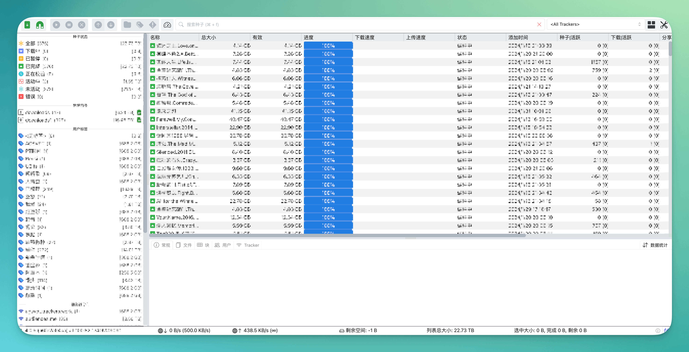
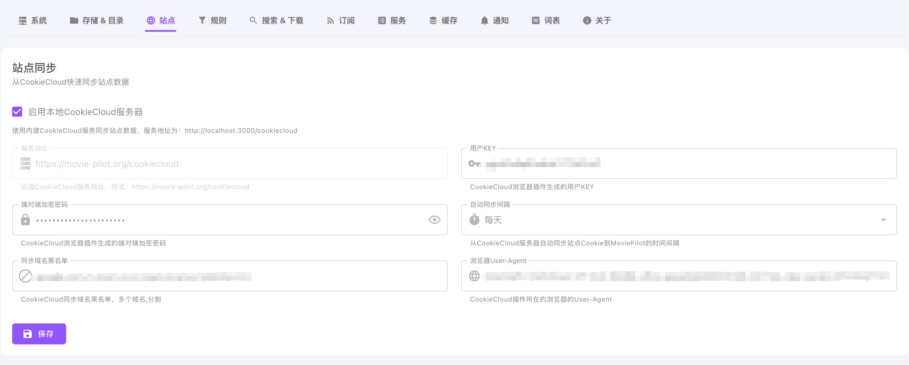
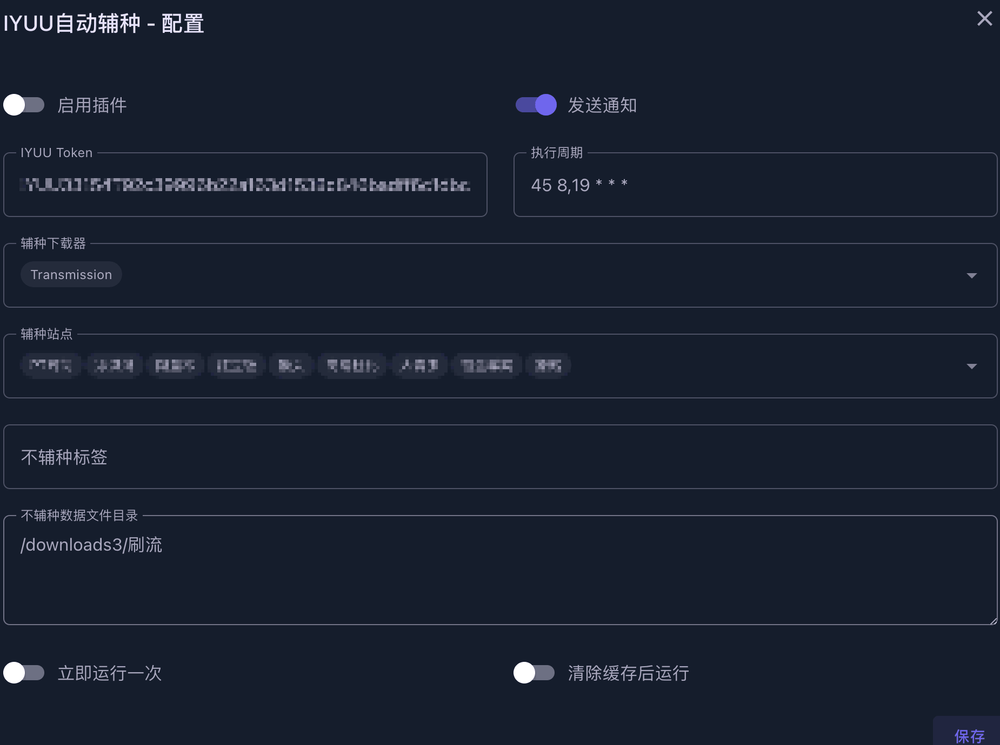
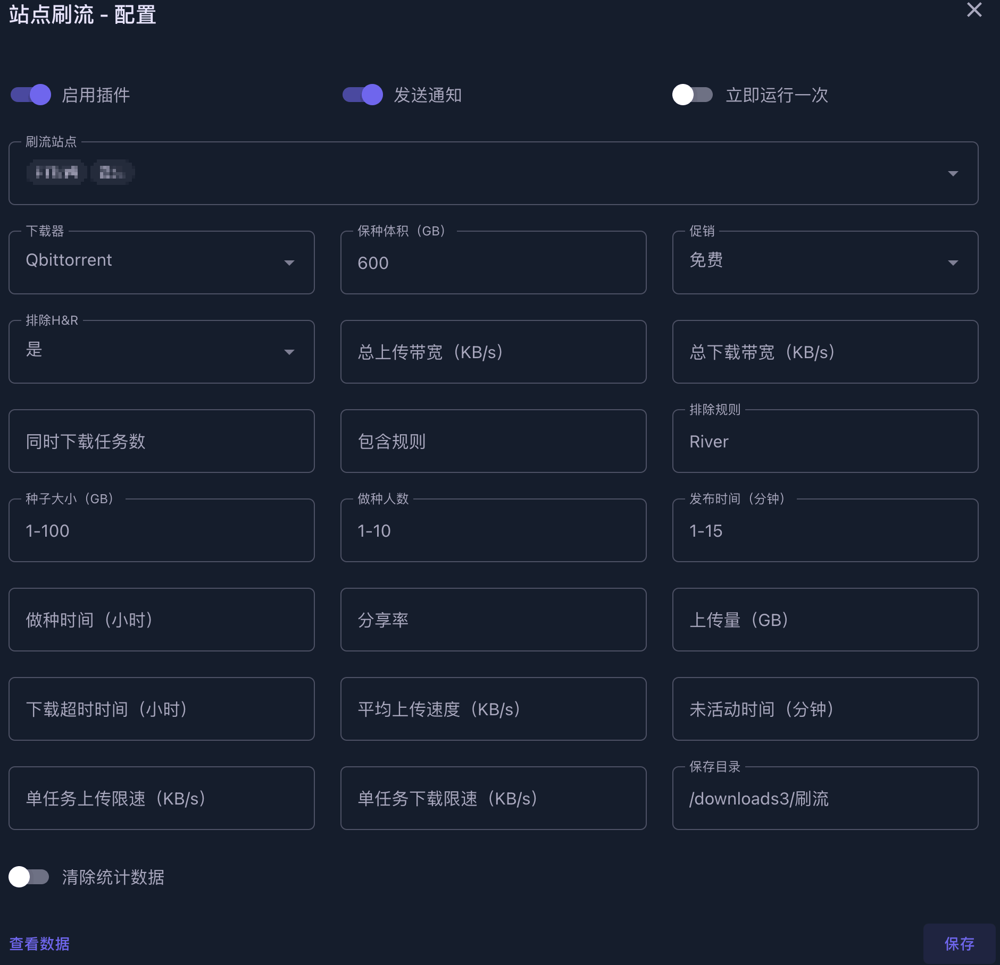

# MoviePilot配置-Nas媒体库自动化管理工具

## 界面


## 功能介绍

| 类别        | 子类别     | 内容                                                                                    |
| --------- | ------- | ------------------------------------------------------------------------------------- |
| 仪表盘       | -       | 展示一些基础统计信息                                                                            |
| 搜索结果      | -       | 搜索已添加站点里的种子资源                                                                         |
| 发现        | 推荐      | 影视资源榜单<br />- 添加到订阅<br />- 搜索已添加站点里的具体种子资源                                            |
|           | 探索      | 搜索已添加站点里的种子资源                                                                         |
| 订阅（自动追剧）⭐ | 电影      | -                                                                                     |
|           | 电视剧     | -                                                                                     |
|           | 工作流     |                                                                                       |
|           | 日历      | 订阅后的影视更新时间展示                                                                          |
| 整理        | 正在下载    | 当前正在下载的任务信息                                                                           |
|           | 媒体整理⭐   | 媒体库整理纪录<br />经过MoviePilot的资源全靠这个历史记录来管理，比较重要                                          |
|           | 文件管理    | 配置的下载目录下的文件列表<br />也可以跳转到上层，展示整个Docker容器的目录<br />支持`阿里云盘`、`115网盘`、`RClone`、`OpenList` |
| 系统        | 插件⭐     | 插件系统                                                                                  |
|           | 站点管理⭐   | PT站点管理                                                                                |
|           | 用户管理    | 管理用户信息                                                                                |
|           | 设定      | 系统设置内容                                                                                |
|           | --系统    | 设置api地址、令牌、下载器、媒体服务器等                                                                 |
|           | --存储&目录 | 设置本地或三方挂载、媒体目录、刮削规则                                                                   |
|           | --站点    | 设置同步CookieCloud<br />站点刷新<br />站点重置                                                   |
|           | --规则    | 设置自定义规则、优先级规则、下载规则                                                                    |
|           | --搜索    | 媒体数据源<br />搜索站点选择                                                                     |
|           | --订阅    | 订阅模式设置、订阅站点选择                                                                         |
|           | --服务    | 操作定时任务                                                                                |
|           | --缓存    | 管理缓存                                                                                  |
|           | --通知    | 设置通知相关内容<br />微信、Telegram、Slack、SynologyChat、VoceChat、WebPush、自定义                     |
|           | --词表    | 自定义识别词、制作组、字幕组、占位符、屏蔽词                                                                |
|           | --关于    | 系统版本信息                                                                                |

## 仓库地址

[官方仓库](https://github.com/jxxghp/MoviePilot)

感谢大佬的开源
## 前置条件

> - 请先准备好`认证站点`，否则装了也无法使用。
> - 具体`认证站点`可参考官方仓库下[AUTH_SITE](https://wiki.movie-pilot.org/configuration)的内容
> - 请注意`认证站点`和`支持站点`并不相同。MoviePilot支持管理的站点并不代表能够用来认证。

## 前置-安装CookieCloud插件（可选）

- 用于添加站点管理
- 如果手动在MoviePilot站点管理里添加，`也可以选择不装`

#### 安装地址
- [Chrome插件商店](https://chromewebstore.google.com/detail/cookiecloud/ffjiejobkoibkjlhjnlgmcnnigeelbdl)

#### 界面


#### 配置
- 生成用户KEY、端对端加密密码
    - 先记下来，后续在mp的`设定-站点-站点同步`中进行配置，勾选`启用本地CookieCloud服务器`，启用内建的CookieCloud提供服务，服务地址为：`http://localhost:${NGINX_PORT}/cookiecloud/`
- 域名一行一个
  - 建议只配置PT站就行了，没必要把所有Cookie都同步上去，虽然理论上有KEY和密码加密。

## 前置-下载器安装

### qBittorrent（用于下载任务）
#### 安装
参考[官方文档](https://www.zspace.cn/help/?articleId=100124)或者[Docker Compose](./NAS-DockerCompose分享.html#qbittorrent)

| 目录                | 容器内路径  | 备注                                              |
| ------------------- | ----------- | ------------------------------------------------- |
| /团队空间/公共下载  | /downloads  | 默认盘2下载目录                                   |
| /团队空间/公共下载1 | /downloads1 | 盘1下载目录，为了`目录监控`插件，方便整理到媒体库 |
| /团队空间/公共下载3 | /downloads3 | 盘3下载目录，为了`刷流`插件                       |

#### Web UI

[仓库地址](https://github.com/VueTorrent/VueTorrent)

- 我为了一屏显示我关注的数据所以改了一些样式代码，但大致是如下图所示


### Transmission（用于保种任务）

#### 安装

参考[Docker Compose](./NAS-DockerCompose分享.html#transmission)

| 本地文件夹路径（自己创建） | 容器内路径  | 备注                                                         |
| -------------------------- | ----------- | ------------------------------------------------------------ |
| /个人空间/docker/tr/watch  | /watch      | 种子监控目录，感觉没啥用                                     |
| /个人空间/docker/tr/config | /config     | 配置目录                                                     |
| /个人空间/docker/tr/web    | /web        | web UI文件夹[官方仓库](https://github.com/jayzcoder/TrguiNG)。文件夹名改成对应的。 |
| /团队空间/公共下载         | /downloads  | 默认盘2下载目录                                              |
| /团队空间/公共下载1        | /downloads1 | 盘1下载目录，方便`目录监控`插件整理到媒体库                  |
| /团队空间/公共下载3        | /downloads3 | 盘3下载目录，为了`刷流`插件                                  |

> 由于极空间自带下载端口为51413，可能会冲突，要么修改端口，要么直接服务控制里关掉自带的下载


#### Web UI

[TrguiNG仓库地址](https://github.com/jayzcoder/TrguiNG)

被大佬安利了这个新的UI，确实流畅不少。替换了原先使用的[transmission-web-control](https://github.com/transmission-web-control/transmission-web-control)。



## 前置-目录概况

- 这里以极空间举例，其他产品应该整体逻辑都差不多，反正都是基于Docker的版本。

- 硬盘模式为单盘模式，目前为3个机械盘，1个固态盘。
  - 盘1主要长期保种资源（这类资源通常通过MoviePilot下载种子到本地，手动添加到qBittorrent下载，路径选到盘1，并且打上标签`已整理`。`因为默认下载路径在盘2，搭配“目录监控”插件整理到媒体库中`）
  - 盘2主要存放短期影视资源、订阅内容
  - 盘3主要用于刷流。
  - 固态盘1主要存放Docker配置信息、虚拟机文件
  - `如果是ZDR模式，也就是一个存储池，设置上应该更方便一些。我是因为在折腾之前已经切换到单盘模式了，而且怕盘坏了不知道丢了什么内容，所以还是继续使用单盘模式。`


> 这里主要是因为极影视只能通过分类共享，但是里面的资源也得放在公共空间。
>
> 所以我的下载目录都是在公共空间里创建的，然后指定对应盘位。
>
> 配置目录则放在个人空间。


> 2024-02-28：引用自官方频道
>
> 【关于 MoviePilot多目录支持的说明】
>
> 1. 下载目录支持按电影、电视剧、~~动漫~~设定三个不同的下载目录。`最新版已经取消了动漫单独分类，可以参考后续系统设置目录里来配置出单独的动漫目录`
> 2. 媒体库目录支持配置多个根目录（使用,号分隔），同时每个根目录下可以按电影、电视剧、动漫设定多个不同的一级目录名称，开启自动分类时会在一级目录下根据分类策略自动建二级目录。
> 3. 多目录整理时会自动匹配下载目录和媒体库目录的关系，匹配的逻辑是：
>
> \- 计算媒体库目录与下载目录的相似度，相似度最高的目录会优先使用（也就是说，如果你希望下载目录和媒体库目录一对一整理时，在Docker中将下载目录和媒体库目录映射为同一个父路径，程序便会自动识别）
>
> \- 如无相似的目录，则按配置的顺序查找第一个满足文件大小要求的媒体库目录。

## 主要-安装MoviePilot⭐

### 安装

参考[Docker Compose](./NAS-DockerCompose分享.html#moviepilot)

| 本地文件夹路径（自己创建）                         | 容器内路径       | 备注                             |
| ------------------------------------- | ----------- | ------------------------------ |
| /个人空间/docker/tr/config/torrents       | /tr         | Docker安装的Transmission的种子文件夹    |
| /个人空间/docker/qb/qBittorrent/BT_backup | /qb         | Docker安装的qBittorrent的种子文件夹     |
| /个人空间/docker/MoviePilot/config        | /config     | MoviePilot的配置文件夹               |
| /个人空间/docker/MoviePilot/cache         | /moviepilot | MoviePilot的浏览器内核，不映射的话每次都会重新下载 |
| /团队空间/公共下载                            | /downloads  | 默认盘2下载目录                       |
| /团队空间/公共下载1                           | /downloads1 | 盘1下载目录                         |
| /团队空间/公共下载3                           | /downloads3 | 盘3下载目录，为了`刷流`插件                |

#### 启动容器

- 访问`http://nas的局域网ip:3000`，默认用户名admin，初始化密码在日志中，登录后自行修改。

## MoviePilot配置介绍

### 系统

#### 下载器


### 存储&目录
- 目前的效果大概是这个样子的，qb是下载目录，link是媒体库。
- 没有使用二级分类，因为媒体库用极影视或者Jellyfin,似乎反而影响识别效果。
```
link
├── 电视剧
├── 电影
qb
├── 电视剧
├── 电影
```


#### ~~媒体库分类示例~~
- ~~配合`二级分类策略`插件，修改会方便一点。~~
- ~~参考分类[配置文件](https://github.com/jxxghp/MoviePilot/blob/main/config/category.yaml)~~


- ~~修改配置文件（可以直接通过上面的插件修改）~~
  - ~~`/个人空间/docker/MoviePilot/config/category.yaml`~~

```yaml
# 配置电影的分类策略
movie:
  中国动画电影:
    genre_ids: '16'
    original_language: 'zh,cn,bo,za'
  日韩动画电影:
    genre_ids: '16'
    original_language: 'ja,ko'
  欧美动画电影:
    genre_ids: '16'
  恐怖电影:
    genre_ids: '27'
  华语电影:
    original_language: 'zh,cn,bo,za'
  日韩电影:
    original_language: 'ja,ko'
  欧美电影:

# 配置电视剧的分类策略
tv:
  中国动漫:
    genre_ids: '16'
    # 匹配 origin_country 国家，CN是中国大陆，TW是中国台湾，HK是中国香港
    origin_country: 'CN,TW,HK'
  日韩动漫:
    genre_ids: '16'
    # 匹配 origin_country 国家，JP是日本
    origin_country: 'JP,KR'
  儿童动漫:
    genre_ids: '10762'
  欧美动漫:
    genre_ids: '16'
  中国纪录片:
    genre_ids: '99'
    original_language: 'zh,cn,bo,za'
  外国纪录片:
    genre_ids: '99'
  中国综艺:
    genre_ids: '10764,10767'
    original_language: 'zh,cn,bo,za'
  日韩综艺:
    genre_ids: '10764,10767'
    original_language: 'ja,ko'
  欧美综艺:
    genre_ids: '10764,10767'
  国产剧:
    origin_country: 'CN,TW,HK'
  日韩剧:
    original_language: 'ja,ko'
  欧美剧:
```

### 站点

#### 站点同步


- 执行
  - 设定-服务-同步CookieCloud站点
  - 同步完成即可在`站点管理`中看到自己的PT站了


### 规则

#### 优先级规则组
```
SPECSUB & CNSUB & 4K & !BLU & BLURAY & H265 & !DOLBY & !REMUX & !UHD > CNSUB & 4K & !BLU & BLURAY & H265 & !DOLBY & !REMUX & !UHD > SPECSUB & CNSUB & 4K & !BLU & !BLURAY & !UHD & !REMUX & WEBDL & !DOLBY > CNSUB & 4K & !BLU & !BLURAY & !UHD & !REMUX & WEBDL & !DOLBY > 4K & !BLU & !DOLBY > 4K & !BLU > SPECSUB & CNSUB & 1080P & BLURAY & !DOLBY & !BLU & !UHD & !REMUX > CNSUB & 1080P & !BLU & BLURAY & !DOLBY & !UHD & !REMUX > SPECSUB & CNSUB & 1080P & !BLU & !BLURAY & !UHD & !REMUX & WEBDL & !DOLBY > CNSUB & 1080P & !BLU & !BLURAY & !UHD & !REMUX & WEBDL & !DOLBY > 1080P & !BLU & !DOLBY > 1080P & !BLU > 720P & !BLU
```

### 通知


## 插件⭐


### 站点自动签到

- 45 8,19 * * *
- 每天8点45和19点45执行一次。第二次执行只是为了保证某些时候失败的情况。


### 站点数据统计

- 15 21 * * *
- 每天21点15分执行一次


### 自动删种

- 45 * * * *
- 每小时45分的时候执行一下。
- 主要是为了配合刷流插件，目前只对刷流并且做种60小时的种进行暂停。
  - 60小时主要是为了防止HR，具体规则按站点来调整。


### 自动备份

- 50 * * * *
- 每小时50分的时候备份一下数据


### iyuu自动辅种

- 主要是为了刷魔力值，只需要下载一份资源，就可以在多个站进行保种，一般这种拿不到什么上传量，但是对魔力值提升还是有些帮助的。

- 45 8,19 * * *
- 每天8点45分和19点45分执行一次
- 刷流目录下的不辅种
  - 本来可以按标签来，但是刷流标签在自动转种到Transmission后会消失，所以只能按目录来了



### 自动转移做种

- qBittorrent只负责下载任务，下载完成后转移到Transmission进行保种

- */10 * * * *
- 每隔10分钟1次
- 只转移`已整理`的标签
  - 手动下载到盘1的任务需要手动打标签


### 站点刷流

- 默认10分钟运行一次
- 这里应该是默认用的爬虫模式，而非RSS模式，并且只会读取首页的数据，所以部分首页都是置顶的站就没法很好的进行刷流。



### 下载进度推送

- 3600秒，1小时执行1次。
- 只会监控通过MoviePilot下载的任务。自己在qBittorrent添加的不会监控。


### 清理订阅缓存

- 这个插件需要在环境变量中添加仓库扩展
- 主要是为了某些时候自动订阅下载了资源，但是被自己手动删掉的情况


## 支持阿里云盘、115网盘

文件管理-左上角-选择对应网盘-扫码登录即可


## Jellyfin媒体库

参考[Docker Compose](./NAS-DockerCompose分享.html#jellyfin)

## 其他教程

🔥热心网友整理的MoviePilot安装和使用指引，可供参考：

- https://github.com/DDS-Derek/MoviePilot/tree/docs
- https://hackfang.me/movie-pilot-install-and-guide
- https://github.com/Putarku/MoviePilot-Help

## 注意

- **请勿**在任何国内平台宣传 MoviePilot，MoviePilot 仅用于学习交流使用。
- **请勿**将 MoviePilot 用于商业用途。
- **请勿**将 MoviePilot 制作为视频内容，于境内视频网站(版权利益方)传播。
- **请勿**将 MoviePilot 用于任何违反法律法规的行为。
- **请勿**将本教程在国内任何平台宣传，本教程**只**作为官方仓库教程补充。

<gitalk/>
