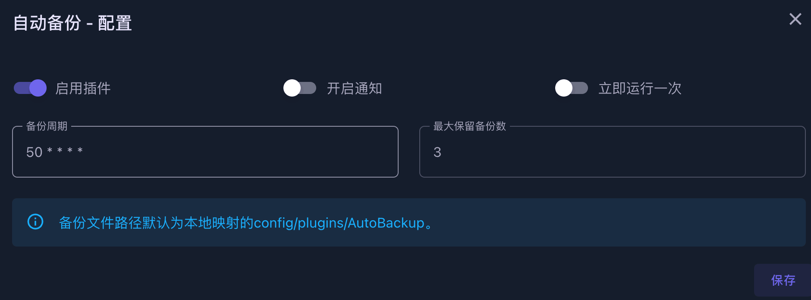
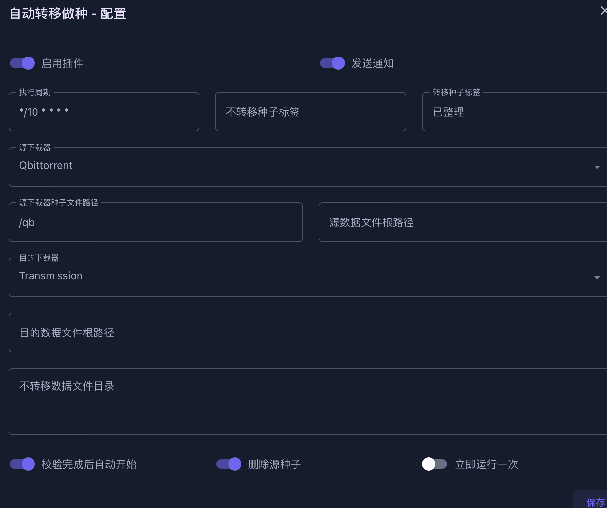

# MoviePilot配置-Nas媒体库自动化管理工具

## 概况

### UI展示


### 仪表盘

- 展示一些基础信息

### 发现

#### 推荐

- 搜索影视资源
  - 添加订阅
  - 搜索已添加站点里的种子资源

#### 资源搜索

- 搜索已添加站点里的种子资源

### 订阅（自动追剧）⭐

- 电影
- 电视剧
- 日历
  - 更新时间展示

> 只有暂时没有资源的或者还在更新的会展示在订阅中
>
> 如果下载完了，会从订阅里消失

### 整理

#### 正在下载

- 当前正在下载的任务信息

#### 历史记录⭐

- 媒体库整理纪录
- 经过MoviePilot的资源全靠这个历史记录来管理，比较重要，但目前界面还比较简单

#### 文件管理

- 环境变量中DLOWNLOAD_PATH路径下的内容
- 也可以跳转到上层，展示整个Docker容器的目录

### 系统

#### 插件⭐

- 插件系统

#### 站点管理⭐

- PT站点管理

#### 设定

- 系统设置内容
  - 用户
  - 站点
    - 优先级
  - 搜索
    - 站点选择
    - 优先级规则
  - 订阅
    - 站点选择
    - 优先级规则
  - 服务
    - 自带的服务，可以手动执行
  - 通知
    - 选择通知方案，微信、Tg、Slack、群晖
  - 词表
  - 关于
    - 系统版本信息

## 安装CookieCloud（可选）

> 也可以手动在MoviePilot左下角的站点管理中手动添加站点。
>
> 但是还是推荐用CookieCloud这个Chrome插件，添加站点方便点。

#### 安装地址
  - https://github.com/easychen/CookieCloud
  - 可以直接在Releases安装
  - 也可以在插件商店安装

#### 界面


#### 配置

- 服务器地址
  - MoviePilot提供的公共地址：https://movie-pilot.org/cookiecloud
  - 当然也可以自建，具体参考Github仓库
- Key和密码生成后自己记住
- 域名一行一个
  - 建议只配置pt站，没必要把所有cookie都同步上去，虽然理论上有key和密码加密。
  - 某站需要用`xp.io`的域名。
- 一般选择手动同步即可，平时暂停，等什么时候网站连接不通了再手动更新就好了

## 配置概况

- 这里以极空间举例，其他产品应该整体逻辑都差不多，反正都是基于Docker的版本。

- 硬盘模式为单盘模式，目前为3个盘，盘1主要存放配置信息、长期保种资源，盘2主要存放短期影视资源、订阅内容，盘3主要用于刷流。

> 如果是ZDR模式，也就是一个存储池，设置上应该更方便一些。我是因为在折腾之前已经切换到单盘模式了，而且怕盘坏了不知道丢了什么内容，所以还是继续使用单盘模式。

## 目录创建

> 这里主要是因为极影视只能通过分类共享，但是里面的资源也得放在公共空间。
>
> 所以我的下载目录都是在公共空间里创建的，然后指定对应盘位。
>
> 配置目录则放在个人空间。

- 下载目录

  - 公共下载 -> 盘2

  - 公共下载1 -> 盘1

  - 公共下载3 -> 盘3

- 配置文件目录
  - qb
    - /个人空间/docker/qb -> /config
  - tr
    - /个人空间/docker/tr/watch -> /watch
    - /个人空间/docker/tr/watch -> /config
  - MoviePilot
    - /个人空间/docker/MoviePilot/config -> /config
    - /个人空间/docker/MoviePilot/cache -> /moviepilot

## 下载器

### 下载qBittorrent

> 主要用于下载任务

参考[官方文档](https://www.zspace.cn/help/?articleId=100124)

- 关闭性能限制

- 下载目录如果有多盘位的话就跟我设置得一样就行了

| 目录                | 容器内路径  | 备注                                              |
| ------------------- | ----------- | ------------------------------------------------- |
| /团队空间/公共下载  | /downloads  | 默认盘2下载目录                                   |
| /团队空间/公共下载1 | /downloads1 | 盘1下载目录，为了`目录监控`插件，方便整理到媒体库 |
| /团队空间/公共下载3 | /downloads3 | 盘3下载目录，为了`刷流`插件                       |

### 下载Transmission

> 主要用于上传保种

#### Docker安装

#####  搜索镜像

> chisbread_transmission

##### 启动容器

###### 关闭性能限制

###### 文件夹映射

| 本地文件夹路径（自己创建） | 容器内路径  | 备注                                        |
| -------------------------- | ----------- | ------------------------------------------- |
| /个人空间/docker/tr/watch  | /watch      | 种子监控目录，感觉没啥用                    |
| /个人空间/docker/tr/config | /config     | 配置目录                                    |
| /团队空间/公共下载         | /downloads  | 默认盘2下载目录                             |
| /团队空间/公共下载1        | /downloads1 | 盘1下载目录，方便`目录监控`插件整理到媒体库 |
| /团队空间/公共下载3        | /downloads3 | 盘3下载目录，为了`刷流`插件                 |

###### 端口

> 由于极空间自带下载为51413，防止冲突，所以等会环境变量里PEERPORT设置成51419

| 映射端口 | 容器内端口 |
| -------- | ---------- |
| 51419    | 51419 TCP  |
| 51419    | 51419 UDP  |
| 9091     | 9091       |

###### 环境变量

| 环境变量 | 值   | 备注 |
| -------- | ---- | ---- |
| USER     |      | 账号 |
| PASS     |      | 密码 |
| PUID     | 0    | 权限 |
| PGIU     | 0    | 权限 |

## 安装MoviePilot

### Docker安装

#### 搜索镜像

> jxxghp/moviepilot

#### 安装容器

##### 文件夹路径映射

| 本地文件夹路径（自己创建）                | 容器内路径  | 备注                                               |
| ----------------------------------------- | ----------- | -------------------------------------------------- |
| /个人空间/docker/tr/config/torrents       | /tr         | Docker安装的tr的种子文件夹                         |
| /个人空间/docker/qb/qBittorrent/BT_backup | /qb         | Docker安装的qb的种子文件夹                         |
| /个人空间/docker/MoviePilot/config        | /config     | MoviePilot的配置文件夹                             |
| /个人空间/docker/MoviePilot/cache         | /moviepilot | MoviePilot的浏览器内核，不映射的话每次都会重新下载 |
| /团队空间/公共下载                        | /downloads  | 默认盘2下载目录                                    |
| /团队空间/公共下载1                       | /downloads1 | 盘1下载目录，为了`目录监控`插件，方便整理到媒体库  |
| /团队空间/公共下载3                       | /downloads3 | 盘3下载目录，为了`刷流`插件                        |

##### 网络

- host

##### 环境

- 这里只提供基础的一些配置
- 更多配置可以参考[仓库](https://github.com/jxxghp/MoviePilot?tab=readme-ov-file#1-%E7%8E%AF%E5%A2%83%E5%8F%98%E9%87%8F)

| 环境变量               | 值                          | 备注                                                         |
| ---------------------- | --------------------------- | ------------------------------------------------------------ |
| PORT                   | 3000                        | WEB服务端口，可自行修改，不要和API端口冲突                   |
| NGINX_PORT             | 3001                        | API服务端口，可自行修改，不要和WEB端口冲突                   |
| PROXY_HOST             | `http://nas的局域网ip:7890` | 没有呆梨就别填，主要是为了tg通知和Github更新版本             |
| MOVIEPILOT_AUTO_UPDATE | true                        | 自动更新                                                     |
| AUTH_SITE              | hdfans,iyuu                 | 认证站点，具体参考[仓库](https://github.com/jxxghp/MoviePilot?tab=readme-ov-file#1-%E7%8E%AF%E5%A2%83%E5%8F%98%E9%87%8F) |
| HDFANS_UID             |                             | 自行根据站点填写                                             |
| HDFANS_PASSKEY         |                             | 自行根据站点填写                                             |
| IYUU_SIGN              |                             | [iyuu](https://iyuu.cn/)获取                                 |
| TMDB_API_DOMAIN        | api.tmdb.org                | TMDB API地址,有呆梨可以填`api.themoviedb.org`                |
| TMDB_IMAGE_DOMAIN      | static-mdb.v.geilijiasu.com | TMDB API地址,有呆梨可以填`image.tmdb.org`                    |
| DOWNLOAD_PATH          | /downloads/qb               | 默认下载地址，盘2的qb下载目录下                              |
| LIBRARY_PATH           | /downloads/link             | 默认媒体库地址，盘2的下载目录的link下                        |
| DOWNLOAD_CATEGORY      | true                        | 自动二级分类开关                                             |
| TRANSFER_TYPE          | link                        | 默认整理方式，推荐`link`硬链接，只占用1份空间。`但是似乎多盘位会变成复制。所以我盘2只硬链接盘2的媒体库，盘1只硬链接盘1的媒体库，通过极影视选中文件夹来关联资源。` |
| DOWNLOADER             | qbittorrent                 | 默认下载器                                                   |
| QB_HOST                | `http://nas的局域网ip:端口` | qb的地址                                                     |
| QB_USER                |                             | qb的账号                                                     |
| QB_PASSWORD            |                             | qb的密码                                                     |
| TR_HOST                | `http://nas的局域网ip:端口` | tr的地址                                                     |
| TR_USER                |                             | tr的账号                                                     |
| TR_PASSWORD            |                             | tr的密码                                                     |
| DOWNLOAD_MOVIE_PATH    | /downloads/qb/电影          | 电影下载保存目录路径                                         |
| DOWNLOAD_TV_PATH       | /downloads/qb/电视剧        | 电视剧下载保存目录路径                                       |
| DOWNLOAD_ANIME_PATH    | /downloads/qb/动漫          | 动漫下载保存目录路径                                         |
| LIBRARY_MOVIE_NAME     | 电影                        | 电影媒体库目录名称                                           |
| LIBRARY_TV_NAME        | 电视剧                      | 电视剧媒体库目录名称                                         |
| LIBRARY_ANIME_NAME     | 动漫                        | 动漫媒体库目录名称                                           |
| COOKIECLOUD_KEY        |                             | 上方CookieCloud插件生成的key                                 |
| COOKIECLOUD_PASSWORD   |                             | 上方CookieCloud插件生成的密码                                |
| COOKIECLOUD_INTERVAL   | 10                          | CookieCloud同步间隔（分钟）                                  |
| SUBSCRIBE_MODE         | rss                         | 订阅模式                                                     |
| SUBSCRIBE_RSS_INTERVAL | 15                          | RSS订阅模式刷新时间间隔（分钟）                              |
| PLUGIN_MARKET          | 见下方                      | 仓库扩展                                                     |

#### 仓库扩展

```
https://github.com/jxxghp/MoviePilot-Plugins,https://github.com/thsrite/MoviePilot-Plugins,https://github.com/honue/MoviePilot-Plugins,https://github.com/dandkong/MoviePilot-Plugins,https://github.com/Aqr-K/MoviePilot-Plugins,https://github.com/AnjoyLi/MoviePilot-Plugins,https://github.com/WithdewHua/MoviePilot-Plugins,https://github.com/HankunYu/MoviePilot-Plugins,https://github.com/baozaodetudou/MoviePilot-Plugins
```

#### 启动容器

- 访问`http://nas的局域网ip:3000`，默认用户名admin，初始化密码在日志中，登录后自行修改。

## 同步站点

- 执行
  - 设定-服务-同步CookieCloud站点
  - 同步完成即可在`站点管理`中看到自己的PT站了


## 插件


### 站点自动签到

- 45 8,19 * * *
- 每天8点45和19点45执行一次。第二次执行只是为了保证某些时候失败的情况。


### 配置中心

- 可视化修改一些app.env的数据
- 按需修改即可


### 站点数据统计

- 15 21 * * *
- 每天21点15分执行一次
- 主要是mac上的chrome不太方便安装ptpp，所以用这个插件看下自己的数据


### 目录监控

- 主要是为了盘1手动下载的资源进行整理入库
- 监控了盘1下载目录的3个类型的文件夹
- 每一行一个目录，支持以下几种配置方式，转移方式支持move、copy、link、softlink、rclone_copy、rclone_move

  - 监控目录#转移方式
  - 监控目录:转移目的目录
  - 监控目录:转移目的目录#转移方式


### 自动删种

- 45 * * * *
- 每小时45分的时候执行一下。
- 主要是为了配合刷流插件，目前只对刷流并且做种60小时的种进行暂停。
  - 60小时主要是为了防止HR，具体规则按你自己的站点来调整。


### 自动备份

- 50 * * * *
- 每小时50分的时候备份一下数据



### iyuu自动辅种

- 主要是为了刷魔力值，只需要下载一份资源，就可以在多个站进行保种，一半这种拿不到什么上传量，但是对魔力值提升还是有些帮助的。

- 45 8,19 * * *
- 每天8点45分和19点45分执行一次
- 刷流目录下的不辅种
  - 本来可以按标签来，但是刷流标签在自动转种到tr后会消失，所以只能按目录来了


### 自动转移做种

- qb只负责下载任务，下载完成后转移到tr进行保种

- */10 * * * *
- 每隔10分钟1次
- 只转移`已整理`的标签
  - 手动下载到盘1的任务需要手动打标签



### 下载器文件同步

我也没搞懂干嘛的。虽然下来开着，但是一直不知道是什么效果。欢迎留言补充。

### 站点刷流

- 默认10分钟运行一次
- 这里应该是默认用的爬虫模式，而非RSS模式，并且只会读取首页的数据，所以部分首页都是置顶的站就没法很好的进行刷流。
- 配置按自己需求设置吧，我只设了这几个选项。


### 下载进度推送

- 3600秒，1小时执行1次。
- 只会监控通过MoviePilot下载的任务。自己在qb添加的不会监控。


### Bark消息通知

没有呆梨的话可以用这个插件来通知，配置还是挺方便的。

- 服务器地址记得配置完成，完整的应该是`https://api.day.app/你的编码`

### 清理订阅缓存

- 这个插件需要在环境变量中添加仓库扩展
- 主要是为了某些时候自动订阅下载了资源，但是被自己手动删掉的情况


### 订阅规则

> 引用自MoviePilot群组

```
 SPECSUB & CNSUB & 4K & !BLU & BLURAY & H265 & !DOLBY & !REMUX & !UHD > CNSUB & 4K & !BLU & BLURAY & H265 & !DOLBY & !REMUX & !UHD > SPECSUB & CNSUB & 4K & !BLU & !BLURAY & !UHD & !REMUX & WEBDL & !DOLBY > CNSUB & 4K & !BLU & !BLURAY & !UHD & !REMUX & WEBDL & !DOLBY > 4K & !BLU & !DOLBY > 4K & !BLU > SPECSUB & CNSUB & 1080P & BLURAY & !DOLBY & !BLU & !UHD & !REMUX > CNSUB & 1080P & !BLU & BLURAY & !DOLBY & !UHD & !REMUX > SPECSUB & CNSUB & 1080P & !BLU & !BLURAY & !UHD & !REMUX & WEBDL & !DOLBY > CNSUB & 1080P & !BLU & !BLURAY & !UHD & !REMUX & WEBDL & !DOLBY > 1080P & !BLU & !DOLBY > 1080P & !BLU > 720P & !BLU 
```


## iyuu掉备案临时解决方案

### 反代

- 首页自己得有域名
- 申请一个免费的ssl证书
- 通过自己的服务器反代一个api.iyuu.cn

### MoviePilot插件版

- 由于容器内没法使用nano、vi、vim，只能文件夹映射出来

- /app/app/plugins/iyuuautoseed/iyuu_helper.py

- 修改api.iyuu.cn成自己反代的地址即可

> 但是这种情况会导致MoviePilot自动升级功能失效，一直提示获取当前版本失败,取消映射即可修复

### iyuu-plus

- ssh只能通过sh命令进入，而且每次启动都会拉取最新代码，所以还是得文件夹映射出来
- /IYUU/app/common/Constant.php
- 修改api.iyuu.cn成自己反代的地址即可

## 求药🙈

堡、大聪明、人人人、💊论坛、各大站，感谢大佬！

<gitalk/>
