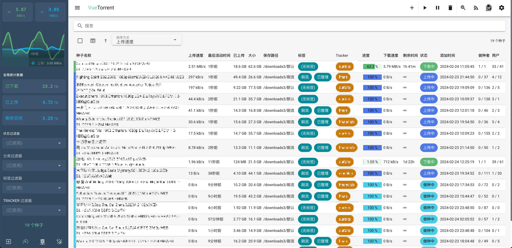
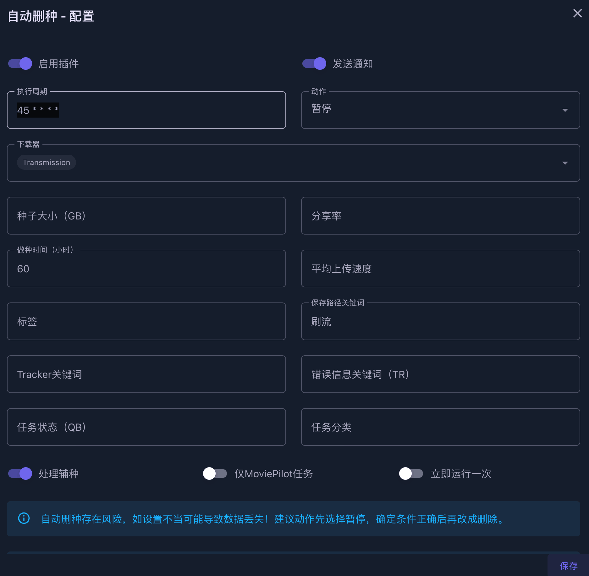
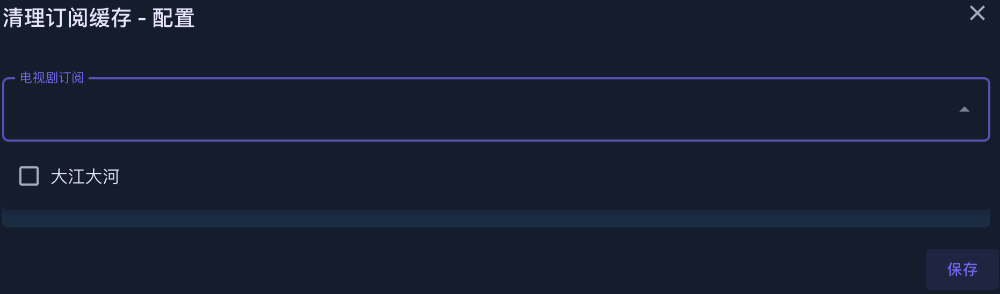

# MoviePilot配置-Nas媒体库自动化管理工具

## 仓库

[官方仓库](https://github.com/jxxghp/MoviePilot)

感谢大佬的开源

> 请先准备好`认证站点`，否则装了也无法使用。
>
> 具体`认证站点`可参考官方仓库下AUTH_SITE的内容
>
> - 请注意`认证站点`和`支持站点`并不相同。MoviePilot支持管理的站点并不代表能够用来认证。

## UI展示


## 功能介绍

### 仪表盘

- 展示一些基础信息

### 发现

#### 推荐

- 搜索影视资源
  - 添加订阅
  - 搜索已添加站点里的种子资源

#### 资源搜索

- 搜索已添加站点里的种子资源

### 订阅（自动追剧）⭐

- 电影
- 电视剧
- 日历
  - 更新时间展示

> 只有暂时没有资源的或者还在更新的会展示在订阅中
>
> 如果下载完了，会从订阅里消失

### 整理

#### 正在下载

- 当前正在下载的任务信息

#### 历史记录⭐

- 媒体库整理纪录
- 经过MoviePilot的资源全靠这个历史记录来管理，比较重要，但目前界面还比较简单

#### 文件管理

- 环境变量中DLOWNLOAD_PATH路径下的内容
- 也可以跳转到上层，展示整个Docker容器的目录

### 系统

#### 插件⭐

- 插件系统

#### 站点管理⭐

- PT站点管理

#### 设定

- 系统设置内容
  - 用户
  - 系统
    - 设置下载器
    - 设置媒体服务
    - 设置媒体库
  - 站点
    - 设置同步CookieCloud
    - 优先级
  - 搜索
    - 媒体数据源
    - 站点选择
    - 优先级规则
  - 订阅
    - 站点选择
    - 优先级规则
  - 服务
    - 自带的服务，可以手动执行
  - 通知
    - 设置通知密钥
    - 选择通知方案，微信、Tg、Slack、群晖
  - 词表
  - 关于
    - 系统版本信息

## 前置-安装CookieCloud（可选）

- 主要用于添加站点管理

> 也可以手动在MoviePilot左下角的站点管理中手动添加站点。
>
> 但是还是推荐用CookieCloud这个Chrome插件，添加站点方便点。

#### 安装地址
  - https://github.com/easychen/CookieCloud
  - 可以直接在Releases安装
  - 也可以在插件商店安装

#### 界面


#### 配置

- 服务器地址
  - MoviePilot提供的公共地址：https://movie-pilot.org/cookiecloud
  - 当然也可以自建，具体参考Github仓库
- Key和密码生成后自己记住
- 域名一行一个
  - 建议只配置PT站，没必要把所有Cookie都同步上去，虽然理论上有KEY和密码加密。
- 一般选择手动同步即可，平时暂停，等什么时候网站连接不通了再手动更新就好了

#### 自建

如果想自建后端服务的话搜索镜像`easychen_cookiecloud`

## 前置-目录概况

- 这里以极空间举例，其他产品应该整体逻辑都差不多，反正都是基于Docker的版本。

- 硬盘模式为单盘模式，目前为3个机械盘，1个固态盘。
  - 盘1主要长期保种资源（这类资源通常通过MoviePilot下载种子到本地，手动添加到qBittorrent下载，路径选到盘1，并且打上标签`已整理`。`因为默认下载路径在盘2，搭配“目录监控”插件整理到媒体库中`）
  - 盘2主要存放短期影视资源、订阅内容
  - 盘3主要用于刷流。
  - 固态盘1主要存放Docker配置信息、虚拟机文件


> 如果是ZDR模式，也就是一个存储池，设置上应该更方便一些。我是因为在折腾之前已经切换到单盘模式了，而且怕盘坏了不知道丢了什么内容，所以还是继续使用单盘模式。


> 这里主要是因为极影视只能通过分类共享，但是里面的资源也得放在公共空间。
>
> 所以我的下载目录都是在公共空间里创建的，然后指定对应盘位。
>
> 配置目录则放在个人空间。

- 下载目录

  - 公共下载 -> 盘2

  - 公共下载1 -> 盘1

  - 公共下载3 -> 盘3

- 配置文件目录（固态盘）
  - qBittorrent
    - /个人空间/docker/qb -> /config
  - Transmission
    - /个人空间/docker/tr/watch -> /watch
    - /个人空间/docker/tr/config -> /config
  - MoviePilot
    - /个人空间/docker/MoviePilot/config -> /config
    - /个人空间/docker/MoviePilot/cache -> /moviepilot

> 2024-02-28：引用自官方频道
>
> 【关于 MoviePilot多目录支持的说明】
>
> 1. 下载目录支持按电影、电视剧、动漫设定三个不同的下载目录。
> 2. 媒体库目录支持配置多个根目录（使用,号分隔），同时每个根目录下可以按电影、电视剧、动漫设定多个不同的一级目录名称，开启自动分类时会在一级目录下根据分类策略自动建二级目录。
> 3. 多目录整理时会自动匹配下载目录和媒体库目录的关系，匹配的逻辑是：
>
> \- 计算媒体库目录与下载目录的相似度，相似度最高的目录会优先使用（也就是说，如果你希望下载目录和媒体库目录一对一整理时，在Docker中将下载目录和媒体库目录映射为同一个父路径，程序便会自动识别）
>
> \- 如无相似的目录，则按配置的顺序查找第一个满足文件大小要求的媒体库目录。

## 前置-下载器安装

### qBittorrent（用于下载任务）

参考[官方文档](https://www.zspace.cn/help/?articleId=100124)

- 关闭性能限制

- 下载目录如果有多盘位的话就跟我设置得一样就行了

| 目录                | 容器内路径  | 备注                                              |
| ------------------- | ----------- | ------------------------------------------------- |
| /团队空间/公共下载  | /downloads  | 默认盘2下载目录                                   |
| /团队空间/公共下载1 | /downloads1 | 盘1下载目录，为了`目录监控`插件，方便整理到媒体库 |
| /团队空间/公共下载3 | /downloads3 | 盘3下载目录，为了`刷流`插件                       |

#### Web UI

[仓库地址](https://github.com/VueTorrent/VueTorrent)

- 我为了一屏显示我关注的数据所以改了一些样式代码，但大致是如下图所示



### Transmission（用于保种任务）

#### Docker安装

#####  搜索镜像

> chisbread_transmission

##### 启动容器

###### 1.关闭性能限制

###### 2.文件夹映射

| 本地文件夹路径（自己创建） | 容器内路径  | 备注                                                         |
| -------------------------- | ----------- | ------------------------------------------------------------ |
| /个人空间/docker/tr/watch  | /watch      | 种子监控目录，感觉没啥用                                     |
| /个人空间/docker/tr/config | /config     | 配置目录                                                     |
| /个人空间/docker/tr/web    | /web        | web UI文件夹[官方仓库](https://github.com/transmission-web-control/transmission-web-control) |
| /团队空间/公共下载         | /downloads  | 默认盘2下载目录                                              |
| /团队空间/公共下载1        | /downloads1 | 盘1下载目录，方便`目录监控`插件整理到媒体库                  |
| /团队空间/公共下载3        | /downloads3 | 盘3下载目录，为了`刷流`插件                                  |

###### 3.端口

> 由于极空间自带下载为51413，防止冲突，所以等会环境变量里PEERPORT设置成51419

| 映射端口 | 容器内端口 |
| -------- | ---------- |
| 51419    | 51419 TCP  |
| 51419    | 51419 UDP  |
| 9091     | 9091       |

###### 4.环境变量

| 环境变量              | 值       | 备注   |
| --------------------- | -------- | ------ |
| USER                  | 自己设置 | 账号   |
| PASS                  | 自己设置 | 密码   |
| PUID                  | 0        | 权限   |
| PGIU                  | 0        | 权限   |
| TRANSMISSION_WEB_HOME | /web     | web UI |

#### Web UI

被大佬安利了一个新的UI，确实流畅不少。替换了`transmission-web-control`。

[TrguiNG仓库地址](https://github.com/jayzcoder/TrguiNG)


~~[transmission-web-control仓库地址](https://github.com/transmission-web-control/transmission-web-control)~~


##### 补充

###### 1.Transmission web UI卡顿解决

根据药丸论坛的教程，可以设置`/个人空间/docker/tr/config/tr-web-control/config.js`下的`pageSize`调整到50以下。然后重启容器，清除浏览器里Transmission页面的缓存。这样默认分页会从200变得小一点。

###### 2.Transmission任务列表文件大小与PT站不一致

由于默认文件大小是按1000来计算的，所以可以修改源代码进行解决。

- 拉取代码
- 找到路径`src/lib/utils.ts`
- 搜索`const k = 1000;`，改成`1024`
- 执行`npm install`、`npm run build`打包
- 打包出来的`dist`即`/个人空间/docker/tr/web`

> 有点麻烦，其实也没什么必要去改。

## 主要-安装MoviePilot⭐

### Docker安装

#### 搜索镜像

> jxxghp/moviepilot

#### 安装容器

###### 1.文件夹路径映射


| 本地文件夹路径（自己创建）                | 容器内路径  | 备注                                               |
| ----------------------------------------- | ----------- | -------------------------------------------------- |
| /个人空间/docker/tr/config/torrents       | /tr         | Docker安装的Transmission的种子文件夹               |
| /个人空间/docker/qb/qBittorrent/BT_backup | /qb         | Docker安装的qBittorrent的种子文件夹                |
| /个人空间/docker/MoviePilot/config        | /config     | MoviePilot的配置文件夹                             |
| /个人空间/docker/MoviePilot/cache         | /moviepilot | MoviePilot的浏览器内核，不映射的话每次都会重新下载 |
| /团队空间/公共下载                        | /downloads  | 默认盘2下载目录                                    |
| /团队空间/公共下载1                       | /downloads1 | 盘1下载目录，为了`目录监控`插件，方便整理到媒体库  |
| /团队空间/公共下载3                       | /downloads3 | 盘3下载目录，为了`刷流`插件                        |

###### 2.网络

- host

###### 3.环境

- 这里只提供主要的一些配置
- 更多配置可以参考[官方仓库](https://github.com/jxxghp/MoviePilot?tab=readme-ov-file#1-%E7%8E%AF%E5%A2%83%E5%8F%98%E9%87%8F)
- 

| 环境变量                  | 值                          | 备注                                                         |
| ------------------------- | --------------------------- | ------------------------------------------------------------ |
| PORT                      | 3001                        | API服务端口，默认`3001`，可自行修改，不能与WEB服务端口冲突   |
| NGINX_PORT                | 3000                        | WEB服务端口，默认`3000`，可自行修改，不能与API服务端口冲突   |
| PROXY_HOST                | `http://nas的局域网ip:7890` | 没有呆梨就别填，主要是为了tg通知和Github更新版本             |
| MOVIEPILOT_AUTO_UPDATE    | true                        | 自动更新                                                     |
| AUTH_SITE                 | hdfans,iyuu                 | 认证站点，具体参考[仓库](https://github.com/jxxghp/MoviePilot?tab=readme-ov-file#1-%E7%8E%AF%E5%A2%83%E5%8F%98%E9%87%8F) |
| HDFANS_UID                |                             | 自行根据站点填写                                             |
| HDFANS_PASSKEY            |                             | 自行根据站点填写                                             |
| IYUU_SIGN                 |                             | [iyuu](https://iyuu.cn/)获取                                 |
| BIG_MEMORY_MODE           | 默认false，可以改成true     | 大内存模式，速度更快，但同时占用更多内存                     |
| SUBSCRIBE_STATISTIC_SHARE | 默认true                    | 订阅匿名共享数据                                             |
| PLUGIN_STATISTIC_SHARE    | 默认true                    | 插件下载匿名共享数据                                         |
| TMDB_API_DOMAIN           | api.tmdb.org                | TMDB API地址,有呆梨不用写这个变量，默认就是api.themoviedb.org` |
| TMDB_IMAGE_DOMAIN         | static-mdb.v.geilijiasu.com | TMDB API地址,有呆梨不用写这个变量，默认就是`image.tmdb.org`  |
| PLUGIN_MARKET             | 见下方                      | 仓库扩展`当前版本已经内置了流行的三方仓库，所以这个变量应该也不需要了` |

###### 3.1仓库扩展

```
https://github.com/jxxghp/MoviePilot-Plugins,https://github.com/thsrite/MoviePilot-Plugins,https://github.com/honue/MoviePilot-Plugins,https://github.com/dandkong/MoviePilot-Plugins,https://github.com/Aqr-K/MoviePilot-Plugins,https://github.com/AnjoyLi/MoviePilot-Plugins,https://github.com/WithdewHua/MoviePilot-Plugins,https://github.com/HankunYu/MoviePilot-Plugins,https://github.com/baozaodetudou/MoviePilot-Plugins
```

###### 4.媒体库分类

- 详情参考下方`目录`配置

#### 启动容器

- 访问`http://nas的局域网ip:3000`，默认用户名admin，初始化密码在日志中，登录后自行修改。

## 配置介绍

### 连接


### 目录

> 通过目前的方式配置的话，极影视中也是三大类。动漫、电影、电视剧。每种分类分别选种link目录下的对应目录即可。

#### 下载目录

- 我的策略是下载目录只进行`一级分类`，也就是只分成动漫、电影、电视剧


#### 媒体库目录

- 媒体库目录进行了二级分类。因为目前版本动漫是直接存在电影和电视剧分类下，所以将动漫分类优先级提高。最终在目录路径上其实还是区分出了电影、电视剧、动漫三大类。


#### 媒体库分类示例

- 配合`二级分类策略`插件，修改会方便一点。


> - 目前的目录设定结构已经可以做到按二级分类精细化设定目录，动漫一级分类已没有意义，现已取消，同时解决了动漫分类错误的问题。如动漫需单独一级目录，可在目录设定中对电影/电视剧下的动漫二级分类单独设定目录，并将优先级调高
>
> - 【动漫独立一级目录配置示例】
>
>   1. 仅适用于`v1.9.1-1+`
>
>   2. 在分类策略配置文件中 movie/tv 下配置好动漫二级分类，`anime配置项已弃用`
>
>   3. 在目录设定中按如下格式新增目录，并提高优先级，仅为示例，同样的原理名称和路径都可以自己灵活调整，也可以不加（此时在电影/电视剧二级目录下）
>
>   \- 路径：/video/动漫
>
>     类型：电影
>
>     类别：动画电影
>
>   \- 路径：/video/动漫
>
>     类型：电视剧
>
>     类别：国漫
>
>   参考分类配置文件：https://github.com/jxxghp/MoviePilot/blob/main/config/category.yaml

- 修改配置文件（可以直接通过上面的插件修改）
  - `/个人空间/docker/MoviePilot/config/category.yaml`

```yaml
# 配置电影的分类策略
movie:
  中国动画电影:
    genre_ids: '16'
    original_language: 'zh,cn,bo,za'
  日韩动画电影:
    genre_ids: '16'
    original_language: 'ja,ko'
  欧美动画电影:
    genre_ids: '16'
  恐怖电影:
    genre_ids: '27'
  华语电影:
    original_language: 'zh,cn,bo,za'
  日韩电影:
    original_language: 'ja,ko'
  欧美电影:

# 配置电视剧的分类策略
tv:
  中国动漫:
    genre_ids: '16'
    # 匹配 origin_country 国家，CN是中国大陆，TW是中国台湾，HK是中国香港
    origin_country: 'CN,TW,HK'
  日韩动漫:
    genre_ids: '16'
    # 匹配 origin_country 国家，JP是日本
    origin_country: 'JP,KR'
  儿童动漫:
    genre_ids: '10762'
  欧美动漫:
    genre_ids: '16'
  中国纪录片:
    genre_ids: '99'
    original_language: 'zh,cn,bo,za'
  外国纪录片:
    genre_ids: '99'
  中国综艺:
    genre_ids: '10764,10767'
    original_language: 'zh,cn,bo,za'
  日韩综艺:
    genre_ids: '10764,10767'
    original_language: 'ja,ko'
  欧美综艺:
    genre_ids: '10764,10767'
  国产剧:
    origin_country: 'CN,TW,HK'
  日韩剧:
    original_language: 'ja,ko'
  欧美剧:
```

### 站点

#### 站点同步

如果自建的话就填自己的ip端口


- 执行
  - 设定-服务-同步CookieCloud站点
  - 同步完成即可在`站点管理`中看到自己的PT站了


### 搜索


### 订阅


#### 订阅规则

> 引用自MoviePilot群组

```
SPECSUB & CNSUB & 4K & !BLU & BLURAY & H265 & !DOLBY & !REMUX & !UHD > CNSUB & 4K & !BLU & BLURAY & H265 & !DOLBY & !REMUX & !UHD > SPECSUB & CNSUB & 4K & !BLU & !BLURAY & !UHD & !REMUX & WEBDL & !DOLBY > CNSUB & 4K & !BLU & !BLURAY & !UHD & !REMUX & WEBDL & !DOLBY > 4K & !BLU & !DOLBY > 4K & !BLU > SPECSUB & CNSUB & 1080P & BLURAY & !DOLBY & !BLU & !UHD & !REMUX > CNSUB & 1080P & !BLU & BLURAY & !DOLBY & !UHD & !REMUX > SPECSUB & CNSUB & 1080P & !BLU & !BLURAY & !UHD & !REMUX & WEBDL & !DOLBY > CNSUB & 1080P & !BLU & !BLURAY & !UHD & !REMUX & WEBDL & !DOLBY > 1080P & !BLU & !DOLBY > 1080P & !BLU > 720P & !BLU 
```


### 通知


## 插件⭐


### 站点自动签到

- 45 8,19 * * *
- 每天8点45和19点45执行一次。第二次执行只是为了保证某些时候失败的情况。


### 站点数据统计

- 15 21 * * *
- 每天21点15分执行一次


### 目录监控

- 主要是为了盘1手动下载的资源进行整理入库
- 监控了盘1下载目录的3个类型的文件夹
- 每一行一个目录，支持以下几种配置方式，转移方式支持`move、copy、link、softlink、rclone_copy、rclone_move`

  - 监控目录#转移方式
  - 监控目录:转移目的目录
  - 监控目录:转移目的目录#转移方式


### 自动删种

- 45 * * * *
- 每小时45分的时候执行一下。
- 主要是为了配合刷流插件，目前只对刷流并且做种60小时的种进行暂停。
  - 60小时主要是为了防止HR，具体规则按站点来调整。



### 自动备份

- 50 * * * *
- 每小时50分的时候备份一下数据


### iyuu自动辅种

- 主要是为了刷魔力值，只需要下载一份资源，就可以在多个站进行保种，一般这种拿不到什么上传量，但是对魔力值提升还是有些帮助的。

- 45 8,19 * * *
- 每天8点45分和19点45分执行一次
- 刷流目录下的不辅种
  - 本来可以按标签来，但是刷流标签在自动转种到Transmission后会消失，所以只能按目录来了


### 自动转移做种

- qBittorrent只负责下载任务，下载完成后转移到Transmission进行保种

- */10 * * * *
- 每隔10分钟1次
- 只转移`已整理`的标签
  - 手动下载到盘1的任务需要手动打标签


### 下载器文件同步

我也没搞懂干嘛的。虽然下载后开着，但是一直不知道具体是什么效果。欢迎留言补充。

### 站点刷流

- 默认10分钟运行一次
- 这里应该是默认用的爬虫模式，而非RSS模式，并且只会读取首页的数据，所以部分首页都是置顶的站就没法很好的进行刷流。


### 下载进度推送

- 3600秒，1小时执行1次。
- 只会监控通过MoviePilot下载的任务。自己在qBittorrent添加的不会监控。


### Bark消息通知

没有呆梨的话可以用这个插件来通知，配置还是挺方便的。

- 服务器地址记得配置完成，完整的应该是`https://api.day.app/你的编码`

### 自定义索引站点

> 2024-02-15:目前最新版官方已经添加麒麟、馒头多域名支持，所以删除了相应配置方案。

- 添加没有默认支持的站点

- 

- 其他站点欢迎留言补充


### 清理订阅缓存

- 这个插件需要在环境变量中添加仓库扩展
- 主要是为了某些时候自动订阅下载了资源，但是被自己手动删掉的情况



## ~~🚫iyuu掉备案临时解决方案~~

> 目前官方已解决该问题

### 反代

- 首页自己得有域名
- 申请一个免费的ssl证书
- 通过自己的服务器反代一个api.iyuu.cn

### MoviePilot插件版

- 由于容器内没法使用nano、vi、vim，只能文件夹映射出来

- /app/app/plugins/iyuuautoseed/iyuu_helper.py

- 修改api.iyuu.cn成自己反代的地址即可

> 但是这种情况会导致MoviePilot自动升级功能失效，一直提示获取当前版本失败,取消映射即可修复

### iyuu-plus

- ssh只能通过sh命令进入，而且每次启动都会拉取最新代码，所以还是得文件夹映射出来
- /IYUU/app/common/Constant.php
- 修改api.iyuu.cn成自己反代的地址即可

## 馒头新架构添加站点

> 引用自官方群组
>
> 注意：馒头部分插件仍然使用cookie访问，请自行评估风险。具体可参考更新日志支持情况。

- 检查版本是否为1.7.5+

- 添加配置

  - 如果原先站点管理里的mt没删除 请替换rss地址、cookie和UA

  - 如果意外删除 请手动添加。`官方提供的添加方式图片就不放了，因为带了链接。`

- 添加完成后请到馒头的控制台 - 实验室 - 建立存取令牌
  - 生成令牌后请回到站点管理测试馒头联通性一次
  - 连通性正常后尝试`搜索`并观察日志
  - 日志中有MT获取到APIkey字样即可


请在cookiecloud浏览器插件端黑名单添加域名

避免下次同步时覆盖手动添加的cookie

## 其他教程

🔥热心网友整理的MoviePilot安装和使用指引，可供参考：

- https://github.com/DDS-Derek/MoviePilot/tree/docs
- https://hackfang.me/movie-pilot-install-and-guide
- https://github.com/Putarku/MoviePilot-Help

## 求药🙈

求💊论坛、十一大，感谢大佬！[我的邮箱](mailto:z4781854680@gmail.com)

## 注意

- **请勿**在任何国内平台宣传 MoviePilot，MoviePilot 仅用于学习交流使用。
- **请勿**将 MoviePilot 用于商业用途。
- **请勿**将 MoviePilot 制作为视频内容，于境内视频网站(版权利益方)传播。
- **请勿**将 MoviePilot 用于任何违反法律法规的行为。
- **请勿**将本教程在国内任何平台宣传，本教程**只**作为官方仓库教程补充。

<gitalk/>
