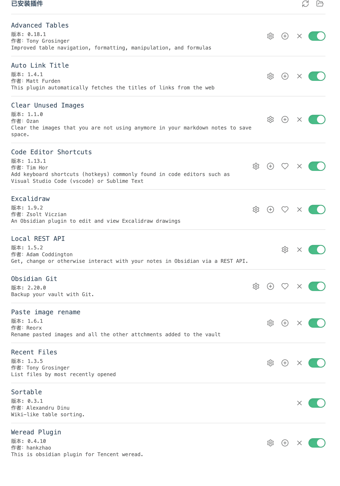

# Obsidian折腾之路

## 概况

## 同步方式

因为使用Mac + iPhone，主要通过`iCloud`进行`同步`。

另外这个知识库根目录是一个Git仓库，通过Obsidian Git自动同步到`Github仓库`，用于`备份`和`历史版本管理`。

## 布局

### 左上角

- 文件列表
- 搜索
- 书签
- 最近文件（插件Recent Files）

### 右上角

- 大纲
- 出链
- 反向链接
- 标签tags
- Advanced Tables（表格插件）

### 左侧工具栏

- 这个下面`外观-工具栏`中有截图介绍

## 设置

### 通用

#### 新标签页默认视图

- 预览模式

> 个人习惯，防止有时候蹭到键盘改动内容
>
> 要书写的时候通过`CMD + E`切换到编辑模式

### 文件与链接

#### 删除文件设置

- 移至软件回收站(.trash文件夹)

#### 新建笔记的存放位置

- 当前文件所在的文件夹

#### 内部链接类型

- 基于仓库根目录的绝对路径

#### 附件默认存放路径

- 指定的附件文件夹

#### 附件文件夹路径

- 97.附件

> 由于目录是基于本地文件，所以给文件夹设置了个编号

## 外观

### 主题

- Typora-Vue

### 工具栏

## 快捷键

这个看个人习惯吧，我是结合Jetbrains和VSCode的部分快捷键来设置的

## 核心插件

> 没提到的插件就是默认设置

### 白板

#### 新画布文件的默认位置

- 指定的附件文件夹

#### 用于创建新画布文件的文件夹

- 96.简图

### 反向链接

#### 在页面中显示反向链接

- 关闭（个人习惯，不太喜欢）

### 命令面板

#### 置顶命令

- 模板：插入模板
- 文件恢复：打开快照列表
- Obsidian Git： Commit all changes
- Obsidian Git： Push

### 模板

#### 模板文件夹位置

- 99.模板

#### 日期格式

- YYYY-MM-DD

#### 时间格式

- HH： mm： ss

## 第三方插件

### Advanced Tables

自动格式化表格

- Obsidian的表格交互做的并不好，这个插件只能稍微挽救一下，可以去Typora里编辑表格。

### Auto Link Title

插入链接的时候自动获取标题名

### Clear Unused Images

删除没有引用到的本地图片文件

### Code Editor Shortcuts

用于添加VSCode类似功能的快捷键，装了之后可以增加快捷键设置里的选项

### Excalidraw

手绘风画图

中文字体手绘风支持参考下面链接

> [Obsidian 的 Excalidraw 插件自定义中文字体](https://sspai.com/post/71244)

### Local REST API

为了配合Chrome`简悦`插件保存网站到本地Markdown

具体使用参考官方文档

> [导入到Obsidian](https://simpread.ksria.cn/plugins/details/1VQ19jCD8Z)

### Obsidian Git

Git插件，如果文档需要存放在Git仓库，可以使用这个插件，会自动进行拉取和提交。

我的设置

#### Vault backup interval (minutes)

- 10分钟

#### Auto pull interval (minutes)

- 5分钟

### Paste image rename

复制进来的图片会自动进行重命名，可以自己设置格式化

### Recent Files

最近使用的文件

### Weread Plugin

同步微信读书的数据到Obsidian知识库

<git-talk/>