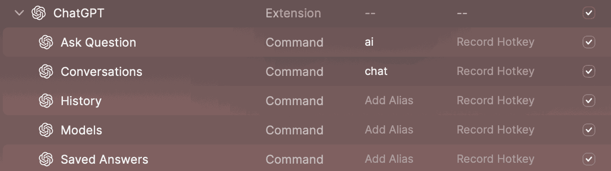
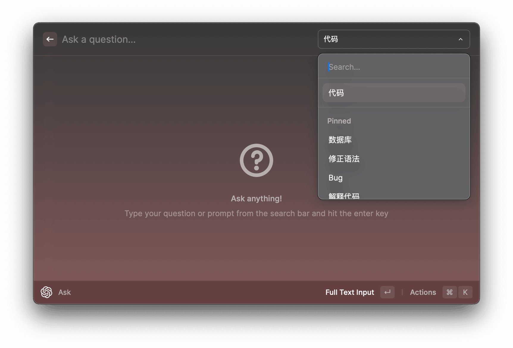
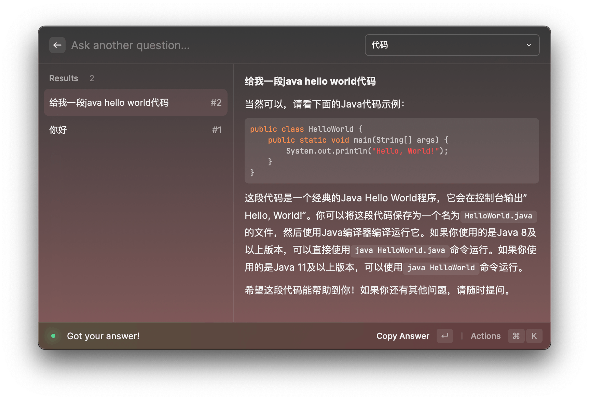
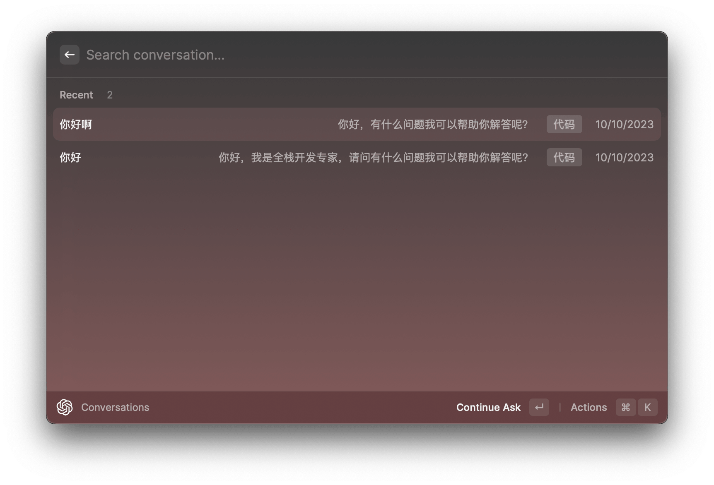
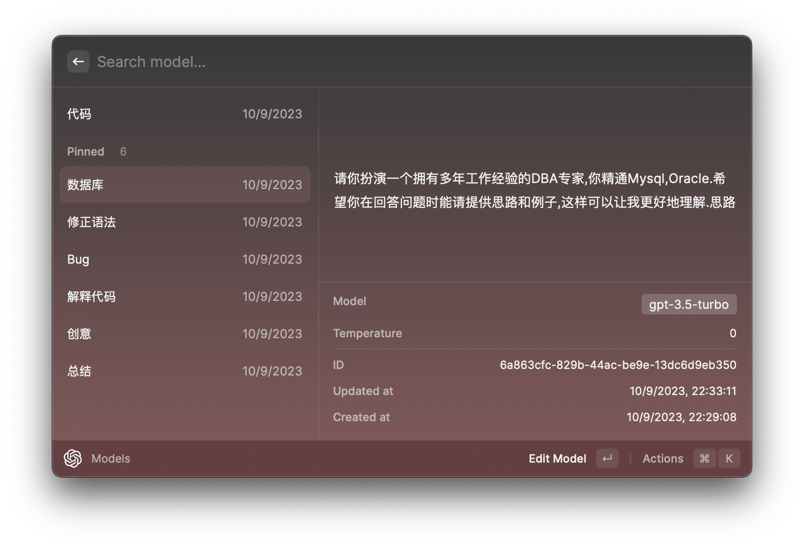
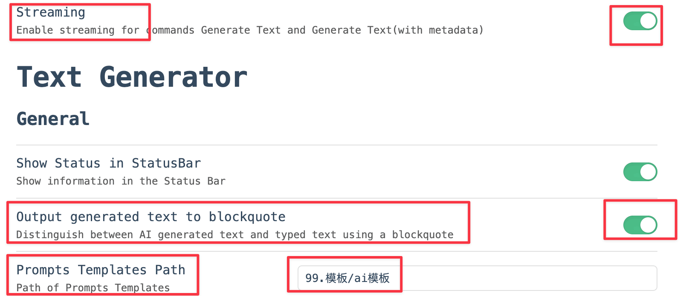
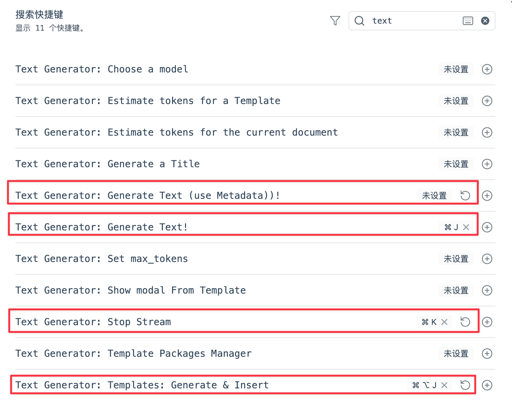

# OpenAI api集成

## Api Key获取

由于Raycast Pro即将到期，鉴于成本和OpenAI api相差较大（70块/月 -> 2块/2个月），于是尝试了一下api方案。

一开始还是想自己开虚拟卡进行OpenAI api付费，但是查阅了各种方案，还是决定放弃。最终以2块钱成本购入剩余2个月有效期的5刀余额体验账号，从而获得Api Key。（购买网站就不说了，应该很好找，价格也应该都差不多）

拿到Api Key后，先用Raycast的ChatGPT插件测试了一下Api Key，轻度试用后初步感觉逻辑有点奇怪。不过测试Api Key没问题。登录OpenAI网站看了下有效期到24年1月1日。

## 客户端

于是开始尝试了各种客户端方案，希望搭配Raycast的快键键呼出来使用，用来顶替Raycast AI。

客户端试用：

- chatbox
  - 使用总感觉手感有点肉。
  - 只能在设置中设置默认前置语，没法单独进行设置。
- AMA
  - 只有归档，没有自动保存历史。
  - 好像也没法单独设置前置语。
- openCat
  - 通过美区ID下载，用自己的Api Key需要付费pro。遂放弃。
- macGPT
  - 19欧，付不起😅。遂放弃。
- Macaify
  - 轻度试用了下，感觉体验有点奇怪。
  - 聊天记录会消失，莫名其妙跑到翻译界面去了。
  - 需要给辅助功能权限。
  - 给了权限之后选中文本不知道给我处理了什么东西，自动输出了一些文本。

- Helper
  - 本地计划29刀。遂放弃。
- chat X
  - 操作上不是很方便，没法快速选择某种情景，历史记录上的设计也有点问题。
  - 但总体比上面几款感觉更符合需求一些。

最终又重新转回来尝试Raycast的ChatGPT插件。

>[MacGPT](https://www.macgpt.com/)
>
>- 免费码：macfreepeetee
>
>目前使用这款，可以呼出类似Raycast的输入框，也可以呼出菜单栏小窗口，并且还有全局右侧窗口（这个窗口使用的是官方web版的页面）
>
>我目前主要使用右侧窗口，毕竟官方的页面做得是最完善的，不会出现显示错误。

## Raycast ChatGPT插件

### 概况

- 直接问问题
- 对话
- 历史记录
- 模型配置
- 归档

### 功能

#### Ask Question

- 进入Ask Question后，可以直接输入问题。
- 通过`CMD + P`选择对应预设的Models。

- 可以进行`连续对话`，但不如Raycast AI那么直观，这个是以`List`的形式展示的，不过也还行。

#### Conversations

- 可以知道之前的对话记录，我感觉不需要History，这个用来当历史记录反而舒服一些。
  - 因为Conversations是根据`整个对话`来进行`分组`
  - 而History是`每一个发送的问题`的历史记录

#### Models

- Models就类似于预设的`前置提示词`，对应了Raycast AI中的`command`。

- Temperature可以设置温度，可以设置`0-2`
- Model设置模型
  - 目前只有`gpt-3.5-turbo`和`gpt-3.5-turbo-0301`

## Obsidian Text Generator插件

#### 配置

配置有点复杂，没怎么改，基本用的默认的

- 配置了一下OpenAI 的Api key
- 开了一下`流式生成`
- 开了生成内容到`blockquote`（不过这个只有整片输出或者按模板输出的时候生效，流式的时候没有效果）
- 配置了ai生成内容`模板`的路径

#### 快捷键

- 关闭了使用元数据生成文本内容的快捷键（平时几乎不用元数据）
- 生成文本还是默认的`CMD + J`
- 开启了停止流式生成`CMD + K`，因为感觉每次生成的内容很多，偶尔会想停止，就配置了快捷键
- 把原先元数据生成的快捷键`CMD + Option +J`改到了根据模板生成上，感觉这个会比较常用.比如周报之类的生成。

#### 效果

<gitalk/>