# Raycast折腾之路（常用功能篇）

## 概况

### 界面

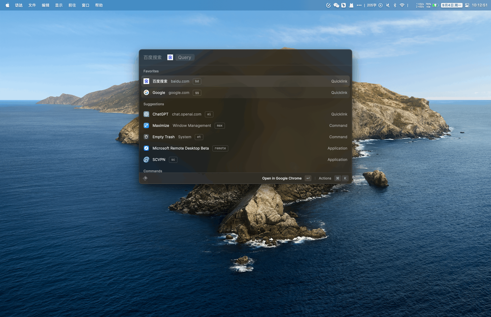

### 设置页

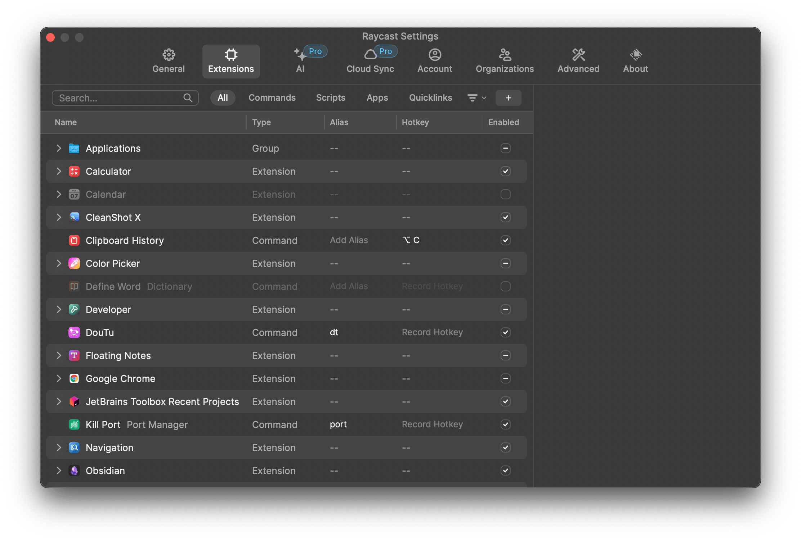

### 功能列表

- 启动本地应用，`给常用软件设置快捷键，快速唤起、隐藏`，平替了`manico`
- 快捷链接（支持变量赋值网址查询条件）
- 搜索文件（支持文本内容）
- 剪切板历史（支持搜索、分类），`mac上有很多剪切板工具，这个够用了`（`option + C`）
- 代码片段收藏（支持自定义变量赋值），平替了`Snippetslab`（`option + D`）
- 快捷窗口布局（控制其他app的布局，比如全屏，半屏，上下左右排布等），平替了`Rectangle`
- 卸载应用（平替`AppCleaner`）
- 窗口切换及菜单栏切换（这个用得少）
- 系统功能控制（例如音量、清空废纸篓、弹出磁盘等等）
- 搜索截图
- 搜索通讯录
- 搜索emoji
- 便签
- 快捷计算器
- ~~词典~~（关掉了，个人使用不到）
- ~~日历~~（关掉了，个人使用不到）
- ~~待办~~（关掉了，还是用滴答清单）
- `AI`（交互体验最好的GPT操作，可惜8刀/月实在太贵了，实在下不去手😭）
- Chrome历史 + 书签（插件）
- Jetbrains项目管理（插件）
- vscode项目管理（插件）
- hosts多环境管理（插件）`平替iHosts`
- 控制CleanShot X截图（插件）
- 搜索Obsidian文档（插件）
- Linux命令查询（插件）
- 端口管理（插件）
- Tailscale设备查询（插件）
- `快捷获取短信中收到的验证码`（插件）
- 表情包搜索（插件）

## 布局

- 主体就是一个`输入框`
- 下面是`搜索结果`
- 左下角`系统设置`
- 右下角`拓展动作`

## 配置

> `CMD + 空格`唤起后，使用`CMD + ,`进入设置界面

### 启动本地应用

#### 呼出后直接输入内容进行搜索

> 这个也是所有操作的基础

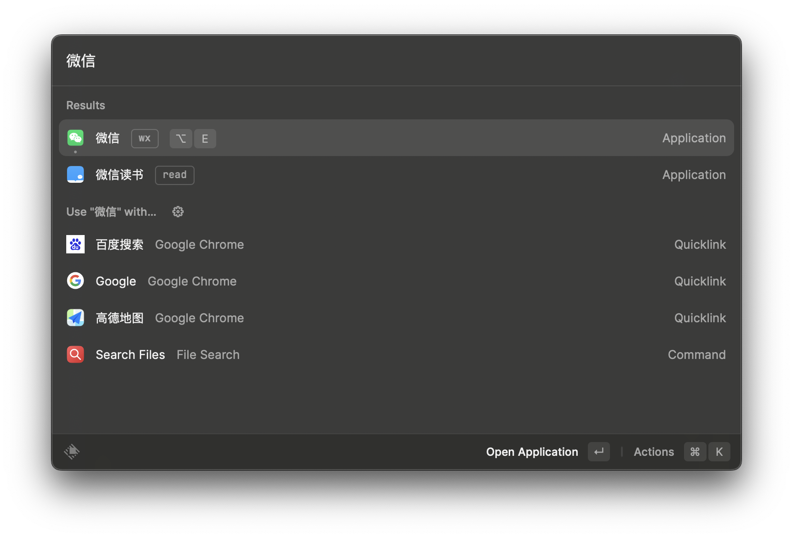

#### 设置别名

- 在`插件设置`中的`Applications`可以找到本机的所有应用，在`Alias`中可以设置`别名`，方便输入搜索

#### 设置快捷键（👍快速隐藏、唤起应用）

- 在`插件设置`中的`Applications`可以找到本机的所有应用，在`HotKey`中可以设置`快捷键`，方便全局隐藏、唤醒应用

  > 快捷键功能使用频率极高

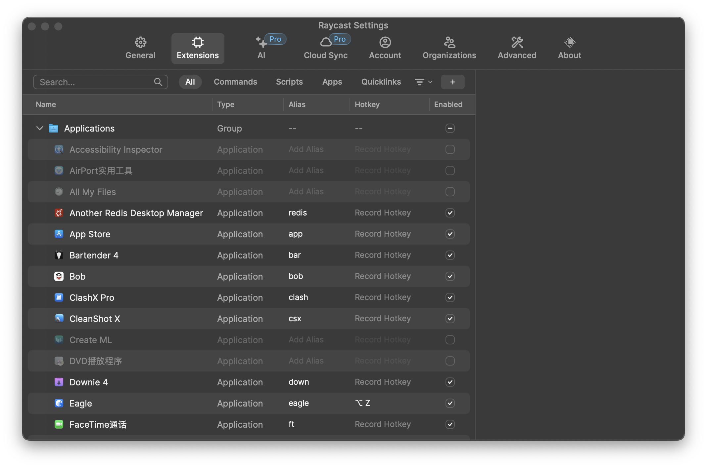

### 快捷链接（支持变量赋值网址查询条件）👍

> 使用率极高

#### 创建

- 通过在输入框输入`quick`，选择`Create Quicklink`来创建快捷链接
- 支持`Query`变量
  - 例如我设置了`Name = map`,`Link=https: //www. amap. com/search? city=3301&query={Query}` 
  - 我在输入框中输入`map + 空格 + 西湖 + 回车`，即可直接跳转网页端高德地图搜索到西湖的位置

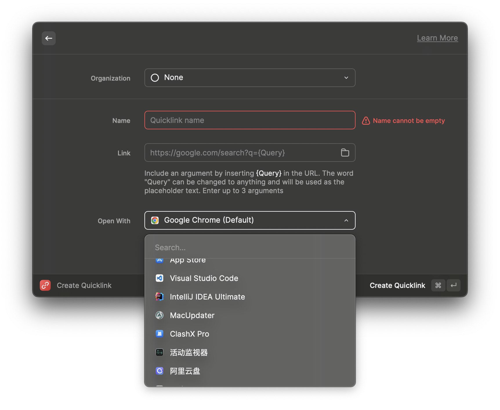

#### 配置例子

具体链接参考以下Blog

> [Raycast快捷链接参考](./Raycast快捷链接参考)

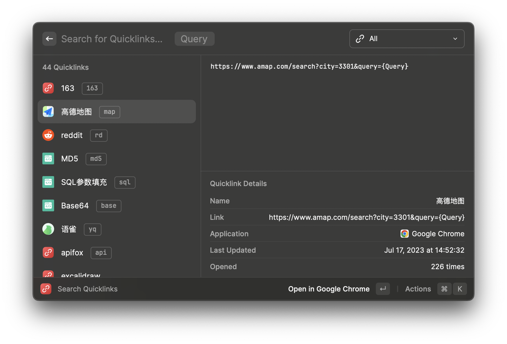

#### 效果

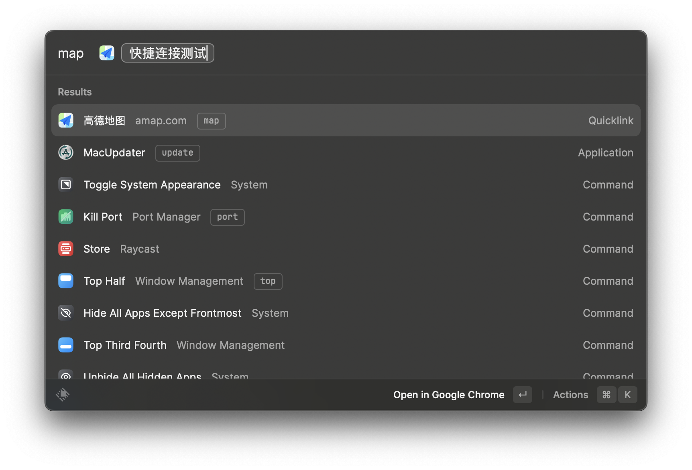

### 搜索文件

#### 输入`Search Files`，支持文本内容

- 这个功能个人用得不多，可能没啥搜索需求

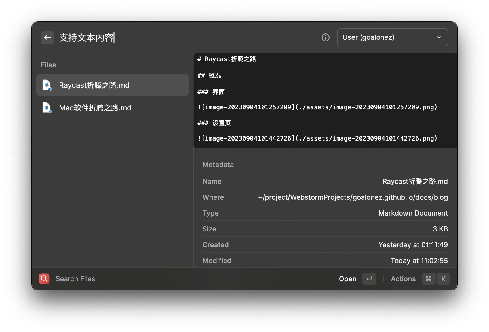

### 剪切板历史👍（`option + C`）

> 使用率极高

>默认是`回车`直接输出，`CMD +  回车`复制到剪切板
>
>可以通过`插件设置`，在`Primary Action`中切换

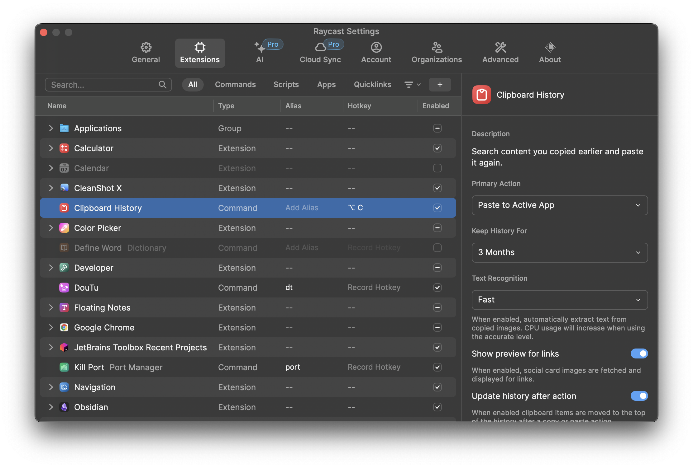

#### 支持分类

#### 拼接文本

- 右下角`Actions`支持拼接文本`Append to Clipboard`

#### 剪切板图片OCR

- 右下角`Actions`支持图片OCR`Copy Text from Image`

#### 效果

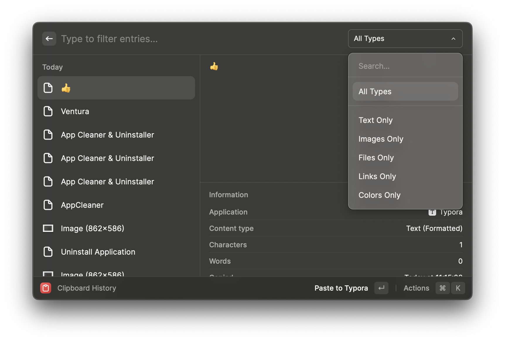

### 代码片段收藏👍（`option + D`）

> 使用率极高

> 默认是`回车`直接输出，`CMD +  回车`复制到剪切板
>
> 可以通过`插件设置`，在`Primary Action`中切换
>
> 具体操作跟上面剪切板一样

#### 支持自定义变量

#### 关键字快捷输入

- 例如在任何地方输入`gg`，会自动变成`Google`

#### 创建

- 输入`snippet`,选择`Create Snippet`

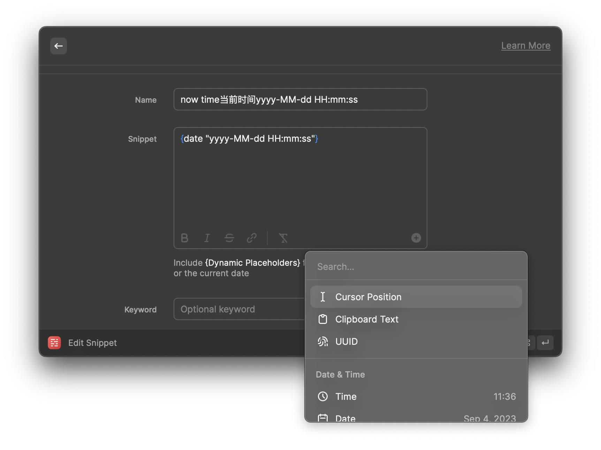

#### 效果

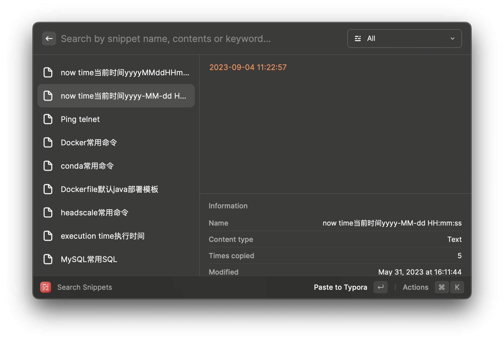

### 快捷窗口布局👍

调整当前应用的布局

我常用的基本只有

- max：最大化
- am：几乎最大化
- left：左半屏
- right：右半屏
- bo：下半屏
- top：上半屏

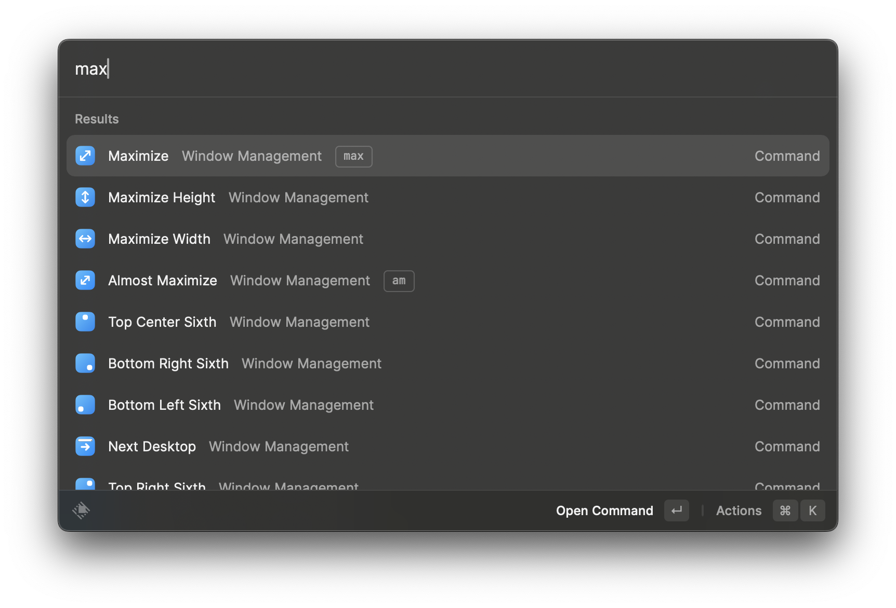

### 卸载应用👍

#### 搜索应用，右下角`Uninstall Application`

- 效果个人感觉`App Cleaner & Uninstaller` > `Raycast`  = `AppCleaner`
- `App Cleaner & Uninstaller`有个坑就是买断只有大版本，我升级到`Ventura`系统后，之前买断的版本就用不了了，对于一款卸载工具来说，这样的价格只买断一个大版本并不是很值得。

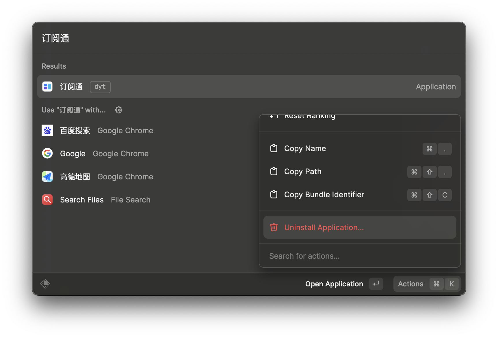

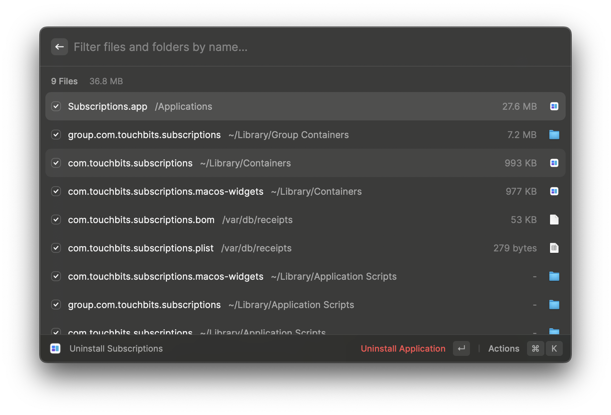

<git-talk/>