# Raycast折腾之路（常用功能篇）

## 概况

### 界面

### 设置页

### 功能列表

- 启动本地应用，`给常用软件设置快捷键，快速唤起、隐藏`，平替了`manico`
- 快捷链接（支持变量赋值网址查询条件）
- 搜索文件（支持文本内容）
- 剪切板历史（支持搜索、分类），`mac上有很多剪切板工具，这个够用了`（`option + C`）
- 代码片段收藏（支持自定义变量赋值），平替了`Snippetslab`（`option + D`）
- 快捷窗口布局（控制其他app的布局，比如全屏，半屏，上下左右排布等），平替了`Rectangle`
- 卸载应用（平替`AppCleaner`）
- 窗口切换及菜单栏切换（这个用得少）
- 系统功能控制（例如音量、清空废纸篓、弹出磁盘等等）
- 执行快捷指令
- 搜索截图
- 搜索通讯录
- 搜索emoji
- 便签
- 快捷计算器
- ~~词典~~（关掉了，个人使用不到）
- ~~日历~~（关掉了，个人使用不到）
- ~~待办~~（关掉了，还是用滴答清单）
- `AI`（需要开Pro，个人感觉交互方式最好的GPT，可惜8刀/月实在太贵了，实在下不去手😭）
- Chrome历史 + 书签（插件）
- Jetbrains项目管理（插件）
- vscode项目管理（插件）
- hosts多环境管理（插件）`平替iHosts、SwitchHosts`
- 控制CleanShot X截图（插件）
- 搜索Obsidian文档（插件）
- Linux命令查询（插件）
- 端口管理（插件）
- Tailscale设备查询（插件）
- 快捷获取短信中收到的验证码（插件）
- 表情包搜索（插件）
- 拾色器（插件）
- Github（插件）
- Docker（插件）
- Change Case（插件）
- Raycast Explorer（插件）

## 布局

- 主体就是一个`输入框`
- 下面是`搜索结果`
- 左下角`系统设置`
- 右下角`拓展动作Actions`（学会用`CMD + K`，偶尔能发现一些好用的功能）

### Pro

开了pro，可以自定义主题

- 目前我用的是RAIcast主题，自己微调了一下渐变颜色`#BE5555`

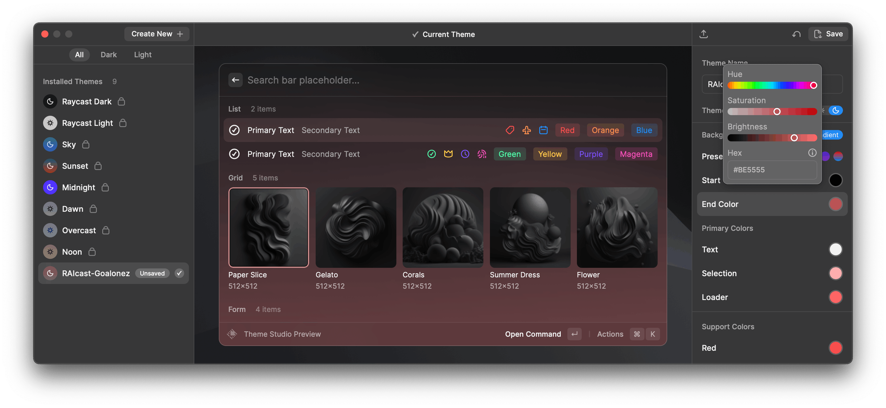

## 配置

> 直接关闭spotlight，设置Raycast快捷键`CMD + 空格`
>
> `CMD + 空格`唤起后，使用`CMD + ,`进入设置界面

### 启动本地应用

#### 呼出后直接输入内容进行搜索

> 这个也是所有操作的基础

#### 设置别名

- 在`插件设置`中的`Applications`可以找到本机的所有应用，在`Alias`中可以设置`别名`，方便输入搜索

#### 设置快捷键（👍快速隐藏、唤起应用）

- 在`插件设置`中的`Applications`可以找到本机的所有应用，在`HotKey`中可以设置`快捷键`，方便全局隐藏、唤醒应用

  > 快捷键功能使用频率极高

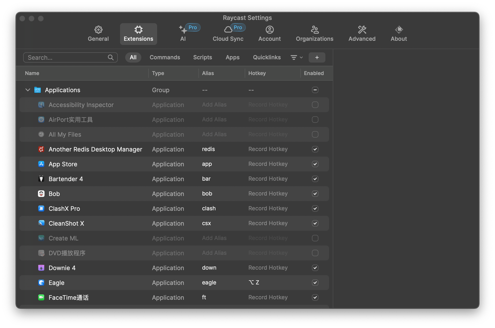

### 快捷链接（支持变量赋值网址查询条件）👍

> 使用率极高

#### 创建

- 通过在输入框输入`quick`，选择`Create Quicklink`来创建快捷链接
- 支持`Query`变量
  - 例如我设置了`Name = 高德地图`,`Link=https://www.amap.com/search?city=3301&query={Query}` ，在`插件设置`中设置别名`map`
  - 我在输入框中输入`map + 空格 + 西湖 + 回车`，即可直接跳转网页端高德地图搜索到西湖的位置

#### 配置例子

具体链接参考以下Blog

> [Raycast快捷链接参考](./Raycast快捷链接参考)

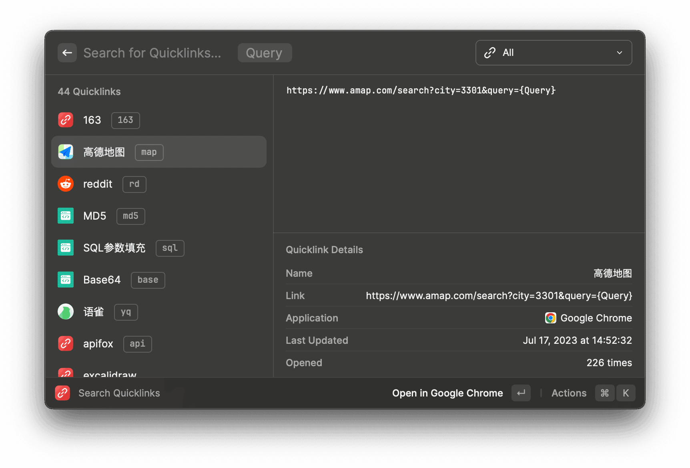

#### 效果

### 搜索文件

#### 支持文件内容搜索

- 输入`Search Files`，我设置了别名`sf`，直接输入需要搜索的内容

- 这个功能个人用得不多，可能没啥搜索需求

### 剪切板历史👍（`option + C`）

> 使用率极高

>默认是`回车`直接输出，`CMD +  回车`复制到剪切板
>
>可以通过`插件设置`，在`Primary Action`中切换

#### 支持分类

#### 拼接文本

- 右下角`Actions`支持拼接文本`Append to Clipboard`

#### 剪切板图片OCR

- 右下角`Actions`支持图片OCR`Copy Text from Image`

#### 效果

### 代码片段收藏👍（`option + D`）

> 使用率极高

> 默认是`回车`直接输出，`CMD +  回车`复制到剪切板
>
> 可以通过`插件设置`，在`Primary Action`中切换
>
> 具体操作跟上面剪切板一样

#### 支持自定义变量

#### 关键字快捷输入

- 例如在任何地方输入`gg`，会自动变成`Google`

#### 创建

- 输入`snippet`,选择`Create Snippet`

#### 效果

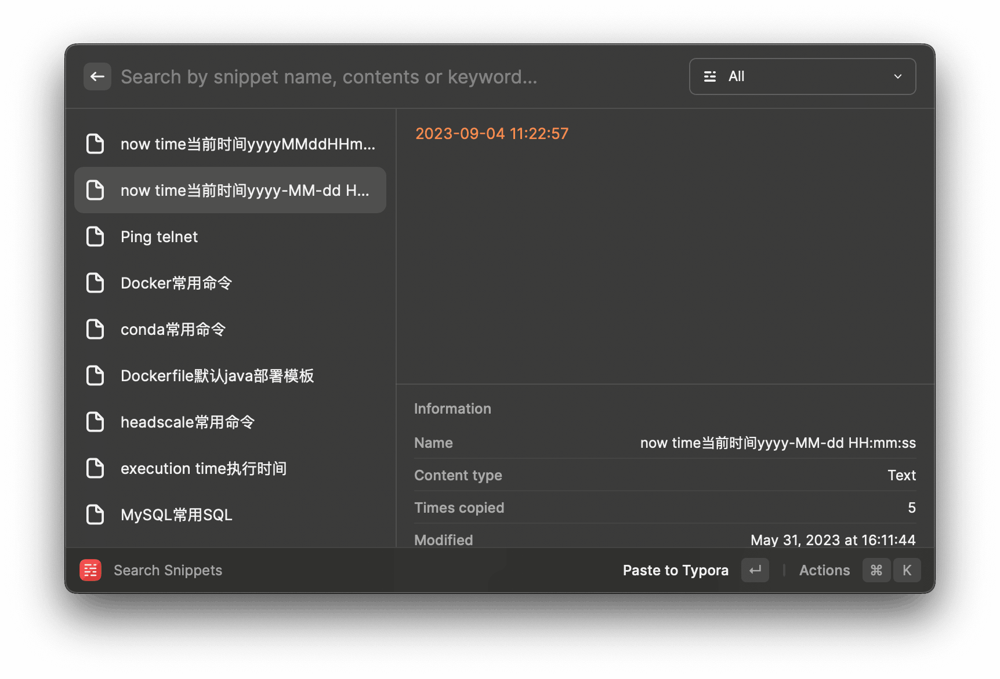

### 快捷窗口布局👍

调整当前应用的布局

#### 常用

| 别名  | 效果       |
| ----- | ---------- |
| max   | 最大化     |
| am    | 几乎最大化 |
| left  | 左半屏     |
| right | 右半屏     |
| bo    | 下半屏     |
| top   | 上半屏     |

### 卸载应用👍

#### 搜索应用，右下角`Actions` 中选择`Uninstall Application`

- 效果个人感觉`App Cleaner & Uninstaller` > `Raycast`  = `AppCleaner`
- `App Cleaner & Uninstaller`有个坑就是买断只有大版本，我升级到`Ventura`系统后，之前买断的版本就用不了了，对于一款卸载工具来说，这样的价格只买断一个大版本并不是很值得。

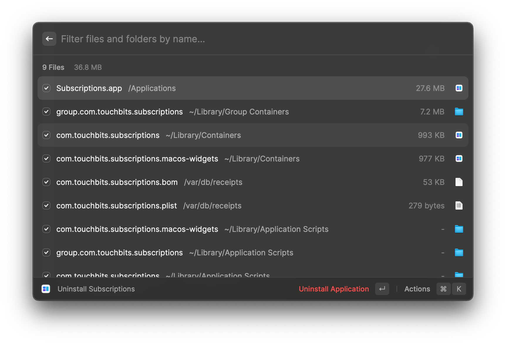

### 窗口切换及菜单栏切换

这个功能个人用得比较少

#### 窗口切换

- 输入`Switch Windows`，我设置了别名`win`

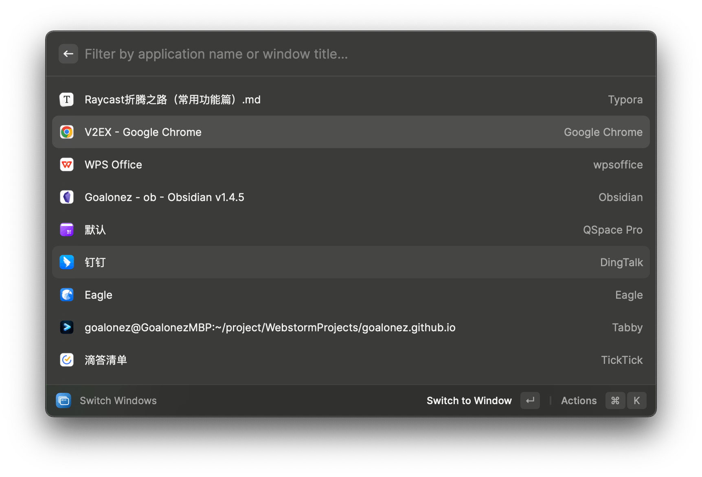

#### 菜单切换

- 输入`Search Menu Items`，我设置了别名`tab`

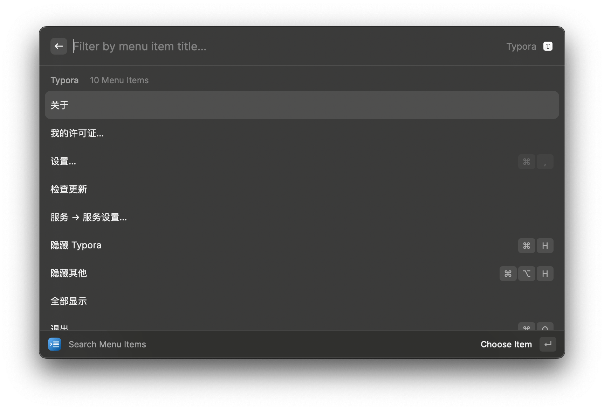

### 系统功能控制

| 功能                       | 别名 | 效果       |
| -------------------------- | ---- | ---------- |
| Eject All DisksEmpty Trash | disk | 弹出磁盘   |
| Empty Trash                | et   | 清空废纸篓 |
| Set Volume to 0%           | 0    | 音量0%     |
| Set Volume to 100%         | 100  | 音量100%   |
| Set Volume to 25%          | 25   | 音量25%    |
| Set Volume to 50%          | 50   | 音量50%    |
| Set Volume to 75%          | 75   | 音量75%    |

### 搜索截图

- 输入`Search Screenshots` ，我设置了别名`ss`
- 右下角`Actions`
  - 支持OCR
  - 快速预览
  - 直接调用`CleanShot X`来编辑

### 搜索通讯录

- 输入`Search Contacts` ，我设置了别名`txl`

这个就不截图了，跟上面的功能类似

### 搜索emoji

- 输入`Search Emoji Symbols` ，我设置了别名`emoji`

- 支持搜索（英语）

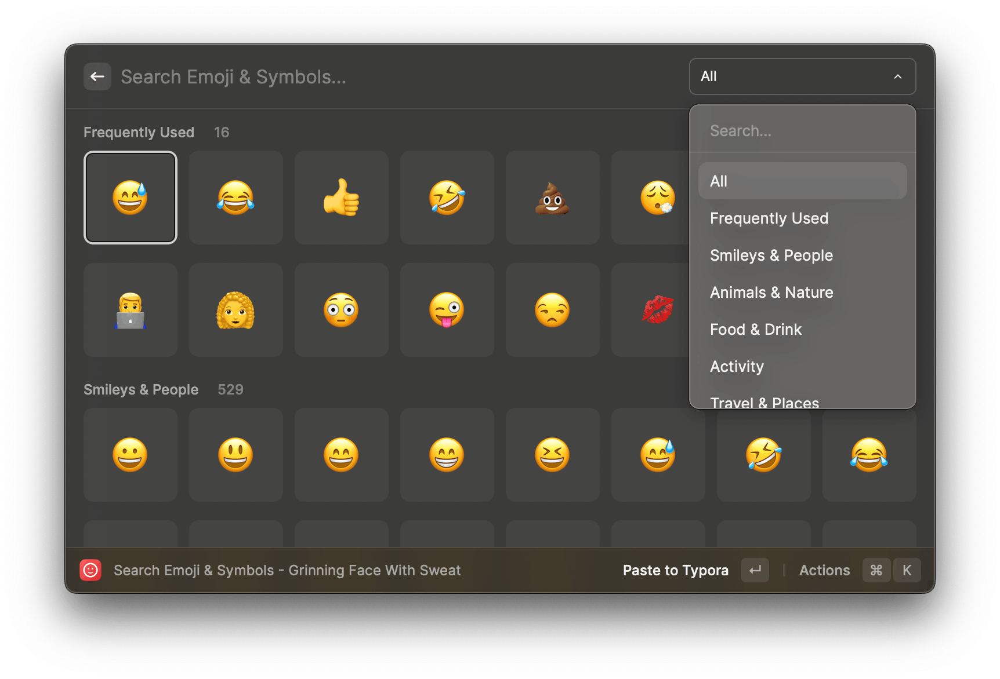

### 便签

- 输入`Toggle Floating Notes Window` ，我设置了别名`fn`
- 我关闭了`Toggle Floating Notes Focus`，因为感觉用另一个就够了
- 支持`多种配色`

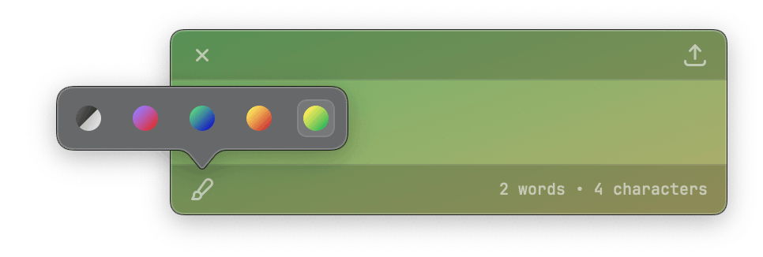

### 快捷计算器

- 直接输入就可以了

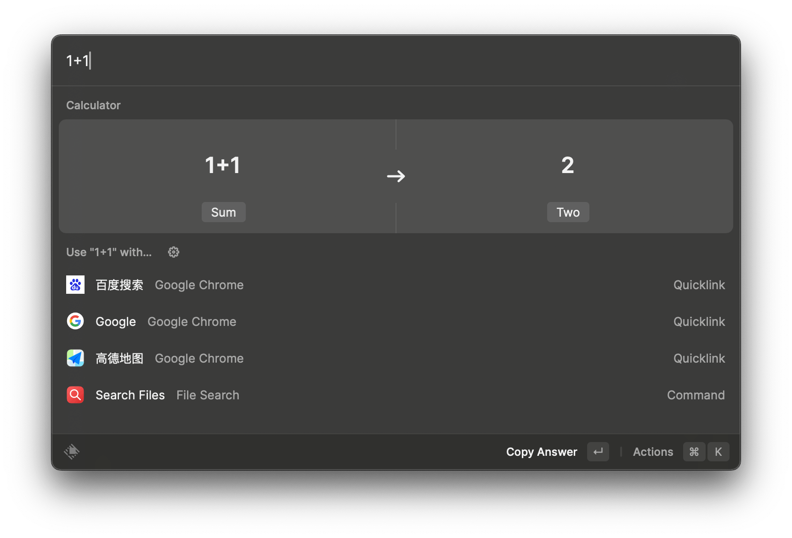

### 执行快捷指令

- 配合米家App可以控制相关智能设备

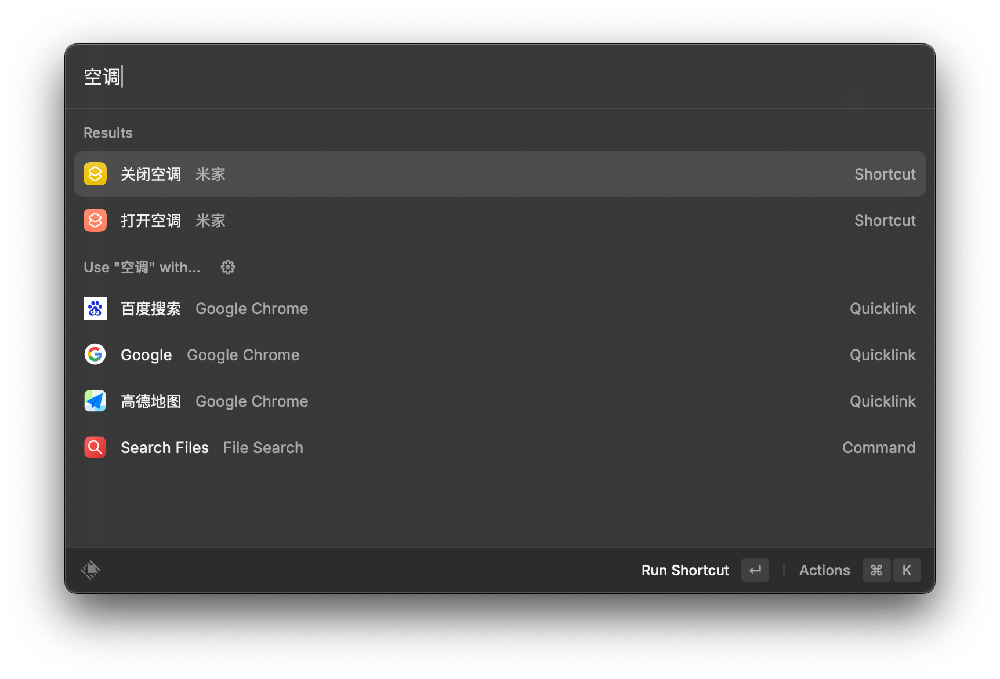

### 设置备份

- 没有开Pro的话可以手动导出导入设置

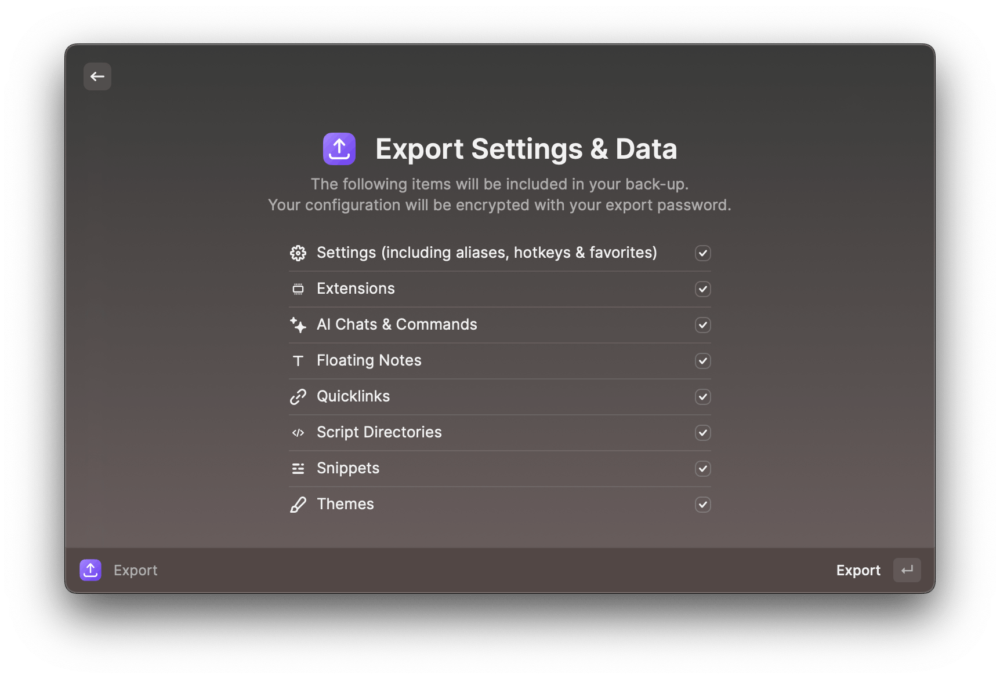

## 插件篇

> [Raycast折腾之路（插件篇）](./Raycast折腾之路（插件篇）)

<gitalk/>