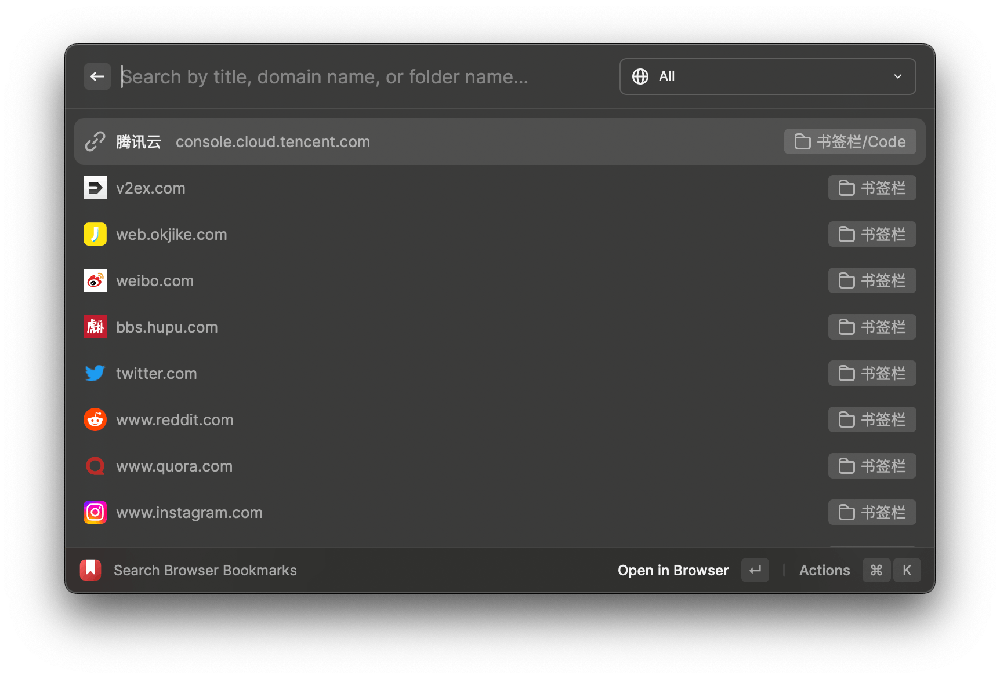
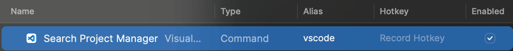
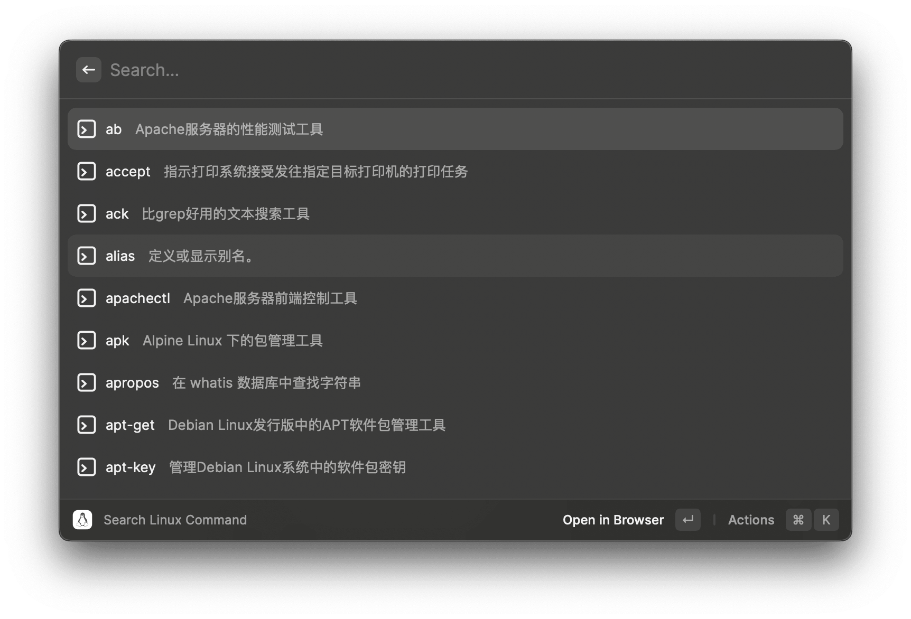
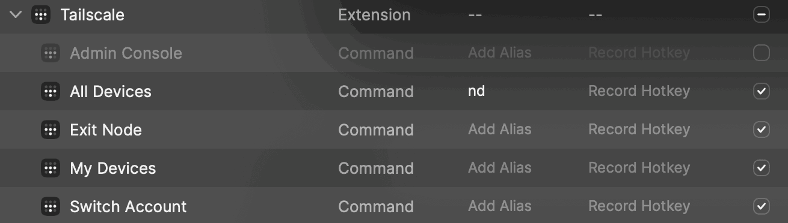
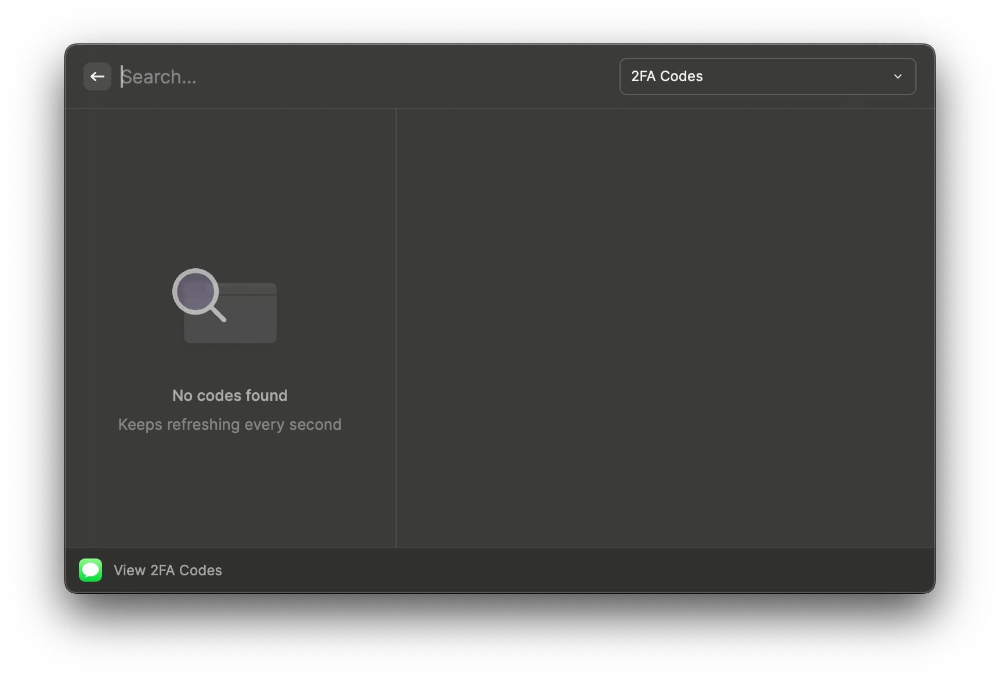
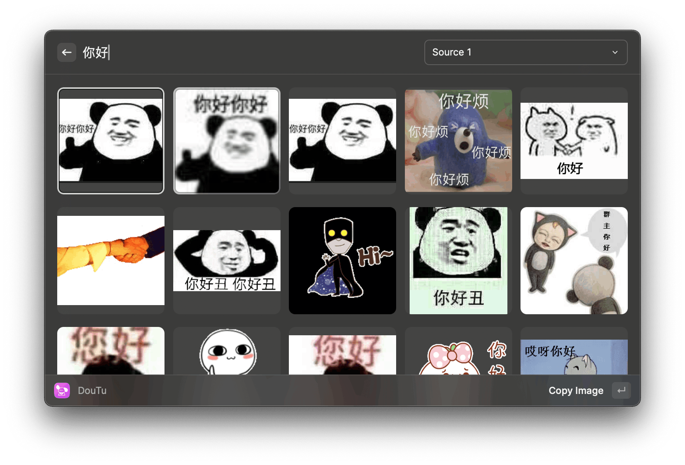
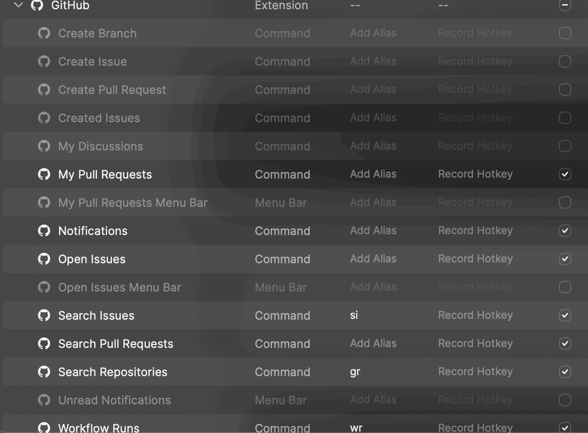
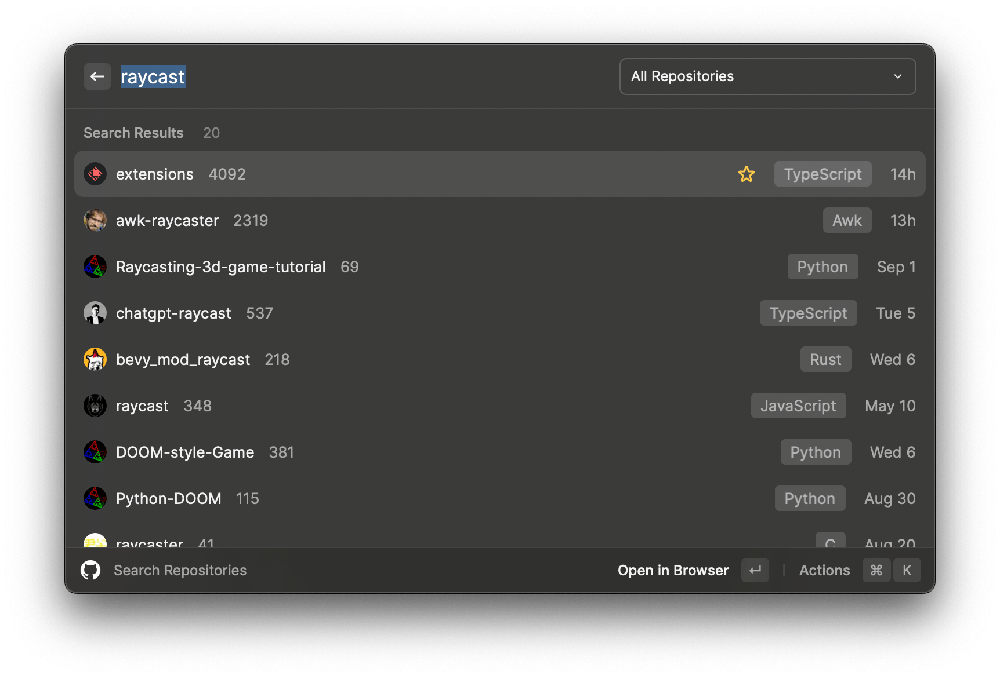
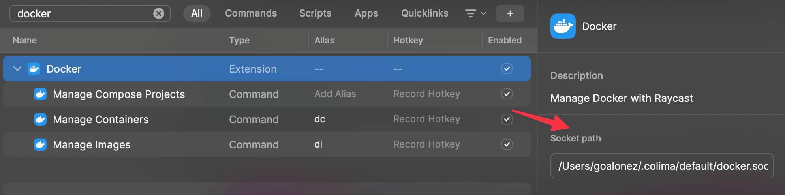

# Raycast折腾之路（插件篇）

## 概况

### 常用功能篇

> [Raycast折腾之路（常用功能篇）](./Raycast折腾之路（常用功能篇）)

### 插件列表

- AI (这个不算插件，官方`pro`功能，但也放到这边来讲)
- Chrome历史 + 书签
- Jetbrains项目管理
- VSCode项目管理（插件）
- Hosts多环境管理
- 控制CleanShot X截图
- 搜索Obsidian文档
- Linux命令查询
- 端口管理
- Tailscale设备查询
- 快捷获取短信中收到的验证码
- 表情包搜索
- 拾色器
- Github
- Docker

## 安装方式

输入`store`，输入`插件名称`，`回车`进入详情，`回车`安装

## 配置

### AI

这个不过多介绍了，因为我没开pro，没法具体展示，由于在内测期间使用过，还是想推荐一下。

`目前个人觉得操作最舒服的GPT交互`。👍👍👍

基础的操作逻辑：

- 直接通过`CMD + 空格`唤起输入框
- 输入问题
- `Tab`键触发`AI`
- 给出答案
- `CMD + J`可以继续往下聊

其他的一些自定义指令之类的功能，因为没有体验，所以就不说了。

> 没有开pro的原因主要还是穷😭
>
> 8刀/月的价格，只有ChatGPT3.5 + 自研集成模型的效果
>
> 再加8刀，也就是16刀/月，才有ChatGPT4.0，并且也是有限制条件的
>
> 所以还是选择白嫖GPT官网
>
> 另外目前AI能力过于分散，ChatGPT、Github Copilot、Raycast等等美元计费，如果都续上的话每个月也是一笔不小的支出。

### Chrome历史 + 书签

#### 浏览历史、标签页搜索

##### 设置

##### 效果

#### 书签

##### 设置

##### 效果

### Jetbrains项目管理

#### 设置

#### 效果

### VSCode项目管理

- ❗需要配合`VSCODE`插件`Project Manager`进行使用

#### 设置

#### 效果

### hosts多环境管理

- 平替iHosts

#### 设置

#### 效果

### 控制CleanShot X截图

- 这个本来是统一用Raycast来设置快捷键的
- 但是效果不如直接在软件中设置
  - 有些弹出层如果用Raycast的快捷键会导致消失，从而截不到想要的图
- 目前仅用于搜索`触发不常用的功能`，比如定时截图，录屏，GIF等

#### 设置

### 搜索Obsidian文档

- 支持内容搜索、标签搜索

#### 设置

#### 效果

### Linux命令查询

#### 效果

### 端口管理

#### 设置

### Tailscale设备查询

- 我一般只用`All Devices`看一下设备情况

#### 设置

### 快捷获取短信中收到的验证码

这个插件需要授权，才能读取到短信

直接`回车`就可以快捷输入到输入框

#### 设置

#### 效果

### 表情包搜索

#### 设置

#### 效果

### 拾色器

- 一般只用`Pick Color`，选择后自动复制颜色编码到`剪切板`

#### 设置

### Github

- Github的一些常规功能
- 只用到了一些查询相关的
- 可以添加一些信息到菜单栏（我目前关掉了）

#### 设置

#### 效果

### Docker

- 管理Docker镜像、容器、compose
- 由于我用的是colima跑的Docker，所以需要设置一下`Socket path`

#### 设置

#### 效果

<gitalk/>