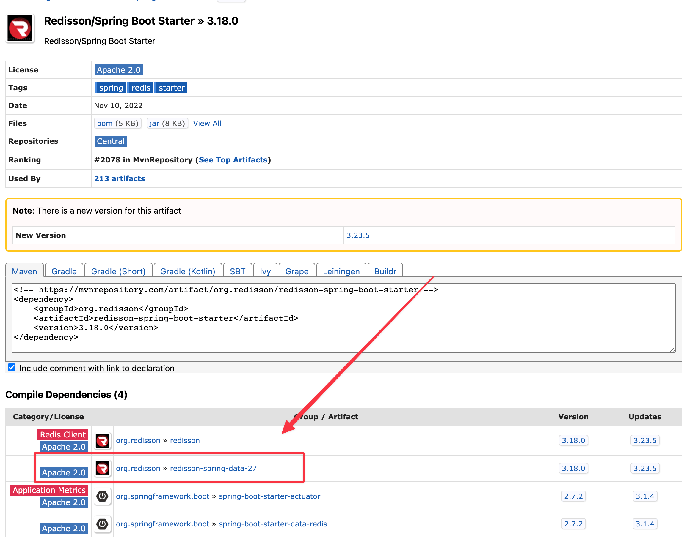

# SpringBoot与Redisson版本对应

最近新项目需要搭个脚手架，在集成SpringBoot与Redisson时，发现需要版本对应。


> 引用自官方Github：[链接](https://github.com/redisson/redisson/tree/master/redisson-spring-boot-starter#1-add-redisson-spring-boot-starter-dependency-into-your-project)
>
> `redisson-spring-boot-starter`取决于`redisson-spring-data`与最新版本的 Spring Boot 兼容的模块。`redisson-spring-data`如果需要支持以前的 Spring Boot 版本，请降级模块：
>
> | redisson-spring-data module name | Spring Boot version |
> | -------------------------------- | ------------------- |
> | redisson-spring-data-16          | 1.3.y               |
> | redisson-spring-data-17          | 1.4.y               |
> | redisson-spring-data-18          | 1.5.y               |
> | redisson-spring-data-2x          | 2.xy                |
> | redisson-spring-data-3x          | 3.xy                |


但是翻了一顿文档，感觉还是很模糊，没有找到具体的版本对应关系。


>引用自官方Github：[链接](https://github.com/redisson/redisson/tree/master/redisson-spring-data#1-add-redisson-spring-data-dependency-into-your-project)
>
>```xml
><dependency>
>    <groupId>org.redisson</groupId>
>         <!-- for Spring Data Redis v.1.6.x -->
>         <artifactId>redisson-spring-data-16</artifactId>
>         <!-- for Spring Data Redis v.1.7.x -->
>         <artifactId>redisson-spring-data-17</artifactId>
>         <!-- for Spring Data Redis v.1.8.x -->
>         <artifactId>redisson-spring-data-18</artifactId>
>         <!-- for Spring Data Redis v.2.0.x -->
>         <artifactId>redisson-spring-data-20</artifactId>
>         <!-- for Spring Data Redis v.2.1.x -->
>         <artifactId>redisson-spring-data-21</artifactId>
>         <!-- for Spring Data Redis v.2.2.x -->
>         <artifactId>redisson-spring-data-22</artifactId>
>         <!-- for Spring Data Redis v.2.3.x -->
>         <artifactId>redisson-spring-data-23</artifactId>
>         <!-- for Spring Data Redis v.2.4.x -->
>         <artifactId>redisson-spring-data-24</artifactId>
>         <!-- for Spring Data Redis v.2.5.x -->
>         <artifactId>redisson-spring-data-25</artifactId>
>         <!-- for Spring Data Redis v.2.6.x -->
>         <artifactId>redisson-spring-data-26</artifactId>
>         <!-- for Spring Data Redis v.2.7.x -->
>         <artifactId>redisson-spring-data-27</artifactId>
>         <!-- for Spring Data Redis v.3.0.x -->
>         <artifactId>redisson-spring-data-30</artifactId>
>         <!-- for Spring Data Redis v.3.1.x -->
>         <artifactId>redisson-spring-data-31</artifactId>
>         <version>3.23.5</version>
>     </dependency>
>     ```


最终，根据我的SpringBoot版本是`2.7.15`，应该是需要使用`redisson-spring-data-27`。从[mvnrepository](https://mvnrepository.com/artifact/org.redisson/redisson-spring-boot-starter/3.18.0)仓库中得到了对应信息。

目前最高支持的版本应该是`3.18.0`。



<gitalk/>