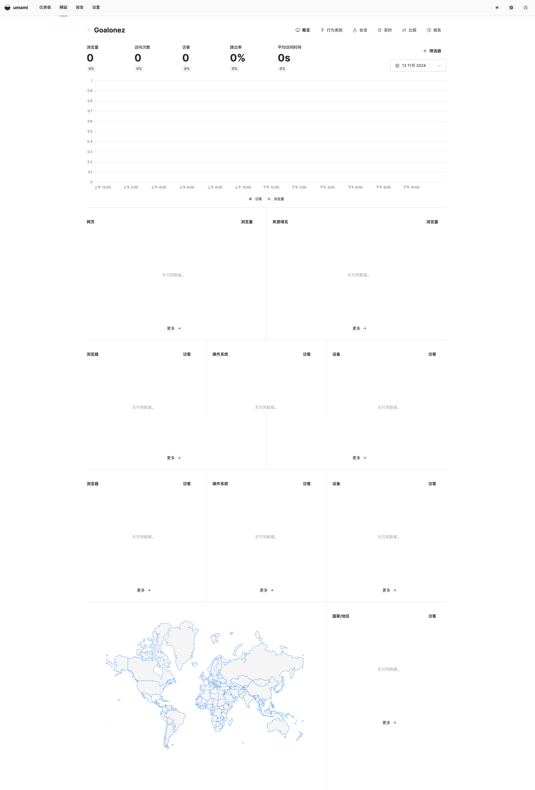

# Umami防止被广告插件屏蔽

由于Blog迁移到Vercel，没有再续服务器，所以也就取消了备案。于是把流量统计也迁移了一下。

最终选了umami，主要感觉UI还不错🤣

但是发现ublock会屏蔽脚本，影响统计，所以去找一些办法，看到有自部署的、Cloudflare Workers代理的。

最终在[官方文档](https://umami.is/docs/guides/running-on-vercel#proxy-umami-analytics-via-vercel)发现了Vercel rewrites的方案，我的Blog就托管在Vercel，刚好可以很方便的实现。

## 添加script
```json
// 在Vitepress的config文件的head中添加统计代码
// 添加 Umami 统计代码
[
  "script",
  {
    defer: "true",
    src: "/stats/script.js",//修改src中的内容，对应上Vercel.json里rewrites的配置就行
    "data-website-id": ""
  }
]
```

## Vercel.json
```json
//在项目根目录增加Vercel.json文件，内容如下
{
  "rewrites": [
    {
      "source": "/stats/:match*",
      "destination": "https://cloud.umami.is/:match*"
    }
  ]
}
```

## UI

<gitalk/>