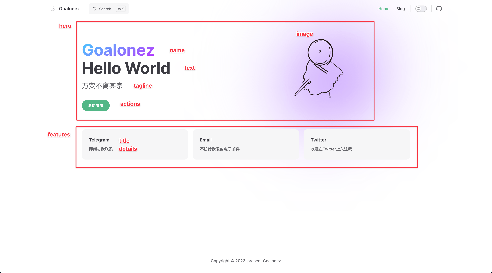

# VitePress博客搭建

## Node.js环境安装

### Volta安装

- 建议使用Volta进行版本管理

#### Linux or MacOS安装

```shell
curl https://get.volta.sh | bash
```

#### Windows安装

> [Volta安装](https://docs.volta.sh/guide/getting-started)

#### 安装Node.js

```shell
volta install node@18.17.1
```

## 安装VitePress

### 创建一个目录

```shell
mkdir blog
cd ./blog
```

### 安装依赖

```shell
npm add -D vitepress
```

### VitePress 附带一个命令行设置向导

可帮助您构建基本项目。安装后，通过运行以下命令启动向导

```shell
npx vitepress init
```

```shell
┌   Welcome to VitePress! 
│
◇  Where should VitePress initialize the config?
│  ./docs
│
◇  Site title:
│  test
│
◇  Site description:
│  A VitePress Site
│
◇  Theme:
│  Default Theme
│
◇  Use TypeScript for config and theme files?
│  Yes
│
◇  Add VitePress npm scripts to package.json?
│  Yes
│
└  Done! Now run npm run docs:dev and start writing.
```

### 这时候会拥有一个初始化结构

- 自建一下目录和文件

```shell
.
├─ .github                       //这个目录自建，用于存放部署脚本
│  └─ workflows                  //这个目录自建，用于存放部署脚本
│       └─ deploy.yml            //这个文件自建，用于部署脚本
├─ docs
│  ├─ .vitepress
│  │    ├─ components            //这个目录自建，用于存放组件
│  │    │    └─ gitalk.vue       //这个文件自建，用于引入gitalk
│  │    ├─ theme                 //这个目录自建，用于存放主题相关文件
│  │    │    ├─ custom.css       //这个文件自建，用于存放自定义样式
│  │    │    └─ index.ts         //这个文件自建，用于引入主题和组件
│  │    └─ config.mts
│  ├─ blog                       //这个目录自建，用于存放博客内容
│  ├─ public                     //这个目录自建，用来存放公共资源等，引用的时候路径不需要包含public
│  │    ├─ logo.ico              //浏览器图标，自己找图
│  │    └─ logo.png              //首页右侧图片和logo，自己找图
│  ├─ api-examples.md
│  ├─ markdown-examples.md
│  └─ index.md
└─ package.json
```

### package.json自带脚本

```json
{
  ...
  "scripts": {
    "docs:dev": "vitepress dev docs",
    "docs:build": "vitepress build docs",
    "docs:preview": "vitepress preview docs"
  },
  ...
}
```

### 调试

```shell
npm run docs:dev
```

### 构建

```shell
npm run docs:build
```

### 使用Volta固定Node.js版本

```shell
volta pin node@18.17.1
```

### 这时候package.json会自动生成以下内容

```json
"volta": {
    "node": "18.17.1"
}
```

### 这时候进入当前项目目录，会自动切换到该Node.js版本

## 配置

### 首页

- 编辑`./docs/index.md`

```yaml
---
layout: home

hero:
  name: "Goalonez"
  text: "Hello World"
  tagline: 万变不离其宗
  image:
        src: /logo.png
        alt: Goalonez
  actions:
    - theme: brand
      text: 随便看看
      link: /aboutme

features:
  - title: Telegram
    details: 即刻与我联系
    link: https://t.me/Goalonez
  - title: Email
    details: 不妨给我发封电子邮件
    link: mailto:z4781854680@gmail.com
  - title: Twitter
    details: 欢迎在Twitter上关注我
    link: https://twitter.com/Goalonez
---
```



### 主题设置

- 编辑`./docs/.vitepress/theme/index.ts`

- 引入默认主题
- 引入自定义css文件

```ts
import DefaultTheme from 'vitepress/theme';
import './custom.css';

export default {
  ...DefaultTheme,
  enhanceApp(ctx) {
    DefaultTheme.enhanceApp(ctx)
  },
};
```

- 编辑`./docs/.vitepress/theme/custom.css`

- 参考以下官方链接

> https://github.com/vuejs/vitepress/blob/main/src/client/theme-default/styles/vars.css

- 我主要调整了以下内容

```css
/* 整体配色改成绿色 */
:root {
    --vp-c-green-1: #52b788;
    --vp-c-green-2: #52b788;
    --vp-c-green-3: #52b788;
    --vp-c-green-soft: rgba(16, 185, 129, 0.16);
}
/* 整体配色改成绿色（暗黑模式） */
.dark {
    --vp-c-green-1: #52b788;
    --vp-c-green-2: #52b788;
    --vp-c-green-3: #52b788;
    --vp-c-green-soft: rgba(16, 185, 129, 0.16);
}
/* 整体配色改成绿色 */
:root {
    --vp-c-brand-1: var(--vp-c-green-1);
    --vp-c-brand-2: var(--vp-c-green-2);
    --vp-c-brand-3: var(--vp-c-green-3);
    --vp-c-brand-soft: var(--vp-c-green-soft);
}
:root {
  /* 设置主题字体颜色 */
  --vp-home-hero-name-color: transparent;
  --vp-home-hero-name-background: -webkit-linear-gradient(120deg, #bd34fe, #41d1ff);

  /* 设置右图像渐变 */
  --vp-home-hero-image-background-image: linear-gradient( -45deg, #6a00f4 30%, #ffffff 70% );
  --vp-home-hero-image-filter: blur(130px);
}

/* 引用块配色 */
.vp-doc blockquote {
  background-color: #ecf8f3;
  border-left: solid #42b983 !important;;
}
/* 引用块配色（暗黑模式） */
.dark .vp-doc blockquote {
  background-color: #4a5f53;
  border-left: solid #b9eed6 !important;;
}
/* 引用块配色（暗黑模式字体） */
.dark .vp-doc blockquote > p {
  color: #92cab2;
}
```

### 核心配置

- 编辑`./docs/.vitepress/config.mts`

- 具体直接参考下面的配置吧

```ts
import { defineConfig } from 'vitepress'

export default defineConfig({
  // 标题（浏览器后缀）
  title: "Goalonez",
  // 描述
  description: "Goalonez Blog",
  // 语言
  lang: 'zh-CN',
  // 根目录，如果需要部署成htpps://github.com/blog/的形式，则设置/blog/
  base: '/',
  // 文档最后更新时间展示
  lastUpdated: true,
  // 去除浏览器链接中的.html后缀
  cleanUrls: true,
  // markdown显示行数
  markdown: {
    lineNumbers: true,
  },
  // head设置
  head: [
    // 浏览器中图标
    ["link", {rel: "icon", href: "/logo.ico"}],
    // 添加百度统计代码
    ['script', {},
    `
      var _hmt = _hmt || [];
      (function() {
        var hm = document.createElement("script");
        hm.src = "https://hm.baidu.com/hm.js?自己申请";
        var s = document.getElementsByTagName("script")[0]; 
        s.parentNode.insertBefore(hm, s);
      })();
    `
    ]
  ],
  // 主题设置
  themeConfig: {
    // 左上角logo
    logo: '/logo.png',
    // 首页右上角导航栏
    nav: [
      { text: 'Home', link: '/' },
      { text: 'Blog', link: '/aboutme' }
    ],
    // 文章左侧导航栏
    sidebar: [
      {
        text: '博客',
        items: [
          { text: 'About Me', link: '/aboutme' }
        ]
      }
    ],
    // 文章底部导航栏的自定义配置，默认是英语
    docFooter: {
			prev: '上一篇',
			next: '下一篇',
		},
    // 文章右侧目录展示级别和标题
    outline: {
      level: [2, 6],
      label: '文章目录'
    },
    // 文章更新时间的前缀文本
    lastUpdatedText: '最后更新时间',
    // 开启本地搜索（左上角）
    search: {
      provider: 'local',
    },
    // 右上角Github链接
    socialLinks: [
      { icon: 'github', link: 'https://github.com/Goalonez/goalonez.github.io' }
    ],
    // 页脚
    footer: {
			copyright: 'Copyright © 2023-present Goalonez',
		}
  }
})
```

## 部署到Github Pages

- 编辑.github/workflows/deploy.yml
- 提交代码到main分支即自动触发部署到Github Pages

```yaml
name: Deploy
on:
  workflow_dispatch: {}
  push:
    branches:
      - main
jobs:
  deploy:
    runs-on: ubuntu-latest
    permissions:
      pages: write
      id-token: write
    environment:
      name: github-pages
      url: ${{ steps.deployment.outputs.page_url }}
    steps:
      - uses: actions/checkout@v3
        with:
          fetch-depth: 0
      - uses: actions/setup-node@v3
        with:
          node-version: 18.17.1
          cache: npm
      - run: npm ci
      - name: Build
        run: npm run docs:build
      - uses: actions/configure-pages@v2
      - uses: actions/upload-pages-artifact@v1
        with:
          path: docs/.vitepress/dist
      - name: Deploy
        id: deployment
        uses: actions/deploy-pages@v1
```

## 其他配置

### 引入gitalk

> [参考原文档](https://blog.csdn.net/qq_42611074/article/details/128451765)

#### 注册应用

- `Github`
- 进入个人设置`Settings`
- 最下方`Developer settings`
- `OAuth Apps`
- `New OAuth App`
- 此刻获取到`clientID`和`clientSecret`

#### 安装依赖

```shell
npm install md5 gitalk
```

#### 编辑配置

- 编辑`./docs/.vitepress/components/gitalk.vue`

- 默认gitalk存在黑色模式下字体白色，背景色也是白色，导致看不见字体，所以样式里设置一下

> [前端保存clientSecret是否安全?](https://carl-zk.github.io/blog/2020/03/03/gitalk-%E8%BF%90%E4%BD%9C%E5%8E%9F%E7%90%86/#%E4%BB%80%E4%B9%88%E6%98%AF-GitHub-OAuth-Apps)

```vue
<template>
    <div class="gitalk-container">
      <div id="gitalk-container"></div>
    </div>
</template>
<script>
import md5 from "md5"
import Gitalk from "gitalk"
import "gitalk/dist/gitalk.css"
export default {
  name: "gitalk",
  data() {
    return {}
  },
  mounted() {
    const commentConfig = {
      clientID: "你的clientID",
      clientSecret: "你的clientSecret",
      repo: "仓库.github.io",
      owner: "名称",
      admin: ["名称"],
      id: md5(location.pathname),
      distractionFreeMode: false,
    }
    const gitalk = new Gitalk(commentConfig)
    gitalk.render("gitalk-container")
  },
}
</script>
<style>
.gt-container .gt-header-textarea {
  color: #000;
}
</style>
```

- 编辑`./docs/.vitepress/theme/index.ts`

```ts
import DefaultTheme from 'vitepress/theme';
import './custom.css';
// @ts-ignore
import comment from "../components/gitalk.vue";// 引入这一段

export default {
  ...DefaultTheme,
  enhanceApp(ctx) {
    DefaultTheme.enhanceApp(ctx)
    ctx.app.component("gitalk", comment)// 引入这一段
  },
};
```

#### 使用

在需要的Markdown里使用`<gitalk/>`开启评论

### 接入百度统计

- 去官网申请，获取接入代码

- 编辑`./docs/.vitepress/config.mts`

```ts
// head设置
  head: [
    // 添加百度统计代码
    ['script', {},
    `
      var _hmt = _hmt || [];
      (function() {
        var hm = document.createElement("script");
        hm.src = "https://hm.baidu.com/hm.js?自己申请";
        var s = document.getElementsByTagName("script")[0]; 
        s.parentNode.insertBefore(hm, s);
      })();
    `
    ]
  ],
```


## 开始书写

- 记得写完在`./docs/.vitepress/config.mts`里编辑`themeConfig.sidebar`。


<gitalk/>