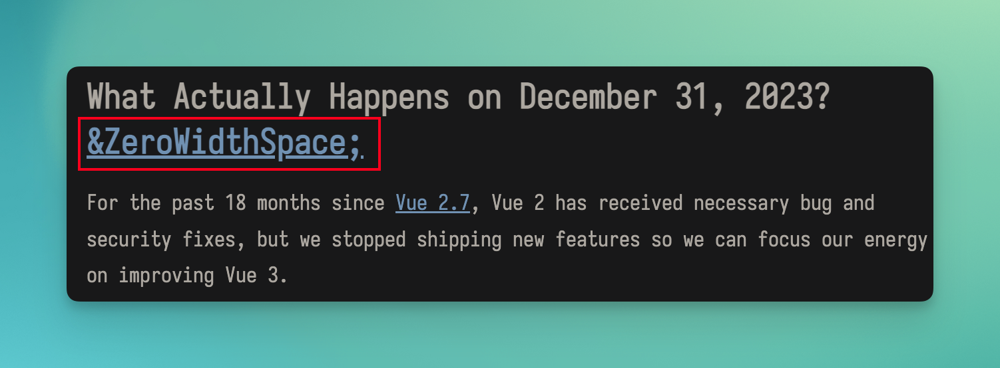
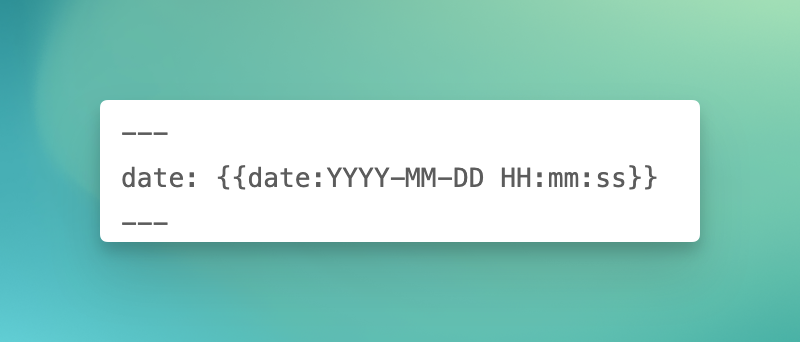

# VitePress添加RSS
由于平时经常逛V2EX，前段时间论坛增加了VXNA板块，于是想着给Blog加个RSS，接入到VXNA去。

## 开动
### vitepress-plugin-rss
>我目前没有用这个实现，折腾的时候暂时解决不了一些问题，就直接换了种方式。

一开始搜到了这款插件，简单看了下[vitepress-plugin-rss - npm](https://www.npmjs.com/package/vitepress-plugin-rss)文档感觉挺方便了。于是立马开始折腾。

#### 安装依赖
```shell
npm install vitepress-plugin-rss
```

#### 配置config.mts
```TypeScript
import { RSSOptions, RssPlugin } from 'vitepress-plugin-rss'

const baseUrl = 'https://域名'
const RSS: RSSOptions = {
    title: '名称',
    description: '描述',
    baseUrl,
    copyright: '',
    language: 'zh-cn',
    icon: true,
    author: {
        name: '',
        email: '',
        link: ''
    },
    filename: 'feed.xml',
    limit: 100,
    log: true,
    renderHTML: (filecontent: string) => {
        // 这个后续会讲到
        // 使用正则表达式去除所有的 &ZeroWidthSpace;
        return filecontent.replaceAll(/&ZeroWidthSpace;/g, '');
    }
}

//在defineConfig中添加配置
export default defineConfig({
    vite: {
     // ↓↓↓↓↓
     plugins: [RssPlugin(RSS)]
     // ↑↑↑↑↑
    },
})
```

#### 完成
很快就可以配置好，并且效果也不错。本以为这就结束了。🤣
然后登录Innoreader订阅测试了一下效果。还是发现存在一些问题。

#### 问题
>可以参考这个[Issue](https://github.com/vuejs/vitepress/issues/3364)
##### 1.内容会出现`&ZeroWidthSpace;`
在vitepress编译后，会在内容的各级标题后面出现`&ZeroWidthSpace;`。

效果见下图


参考了Issue中给Vue Blog提的PR。于是在renderHTML配置相中做了全局替换。也就是下面这段代码。
```TypeScript
const RSS: RSSOptions = {
    renderHTML: (filecontent: string) => {
        // 这个后续会讲到
        // 使用正则表达式去除所有的 &ZeroWidthSpace;
        return filecontent.replaceAll(/&ZeroWidthSpace;/g, '');
    }
}
```

##### 2.图片路径
由于我的图片是直接存储在仓库之中，没有用到oss。
在vitepress编译后，会导致图片从的名称添加改动，也就是Issue中提到的从`./assets/cover.jpg`变成`./assets/cover.A4Q5uAxl.jpg`。根据Vue Blog的做法，是将资源迁移到public目录下，就不会变更。
于是只能将资源迁往public再进行测试。但是测试发现在enclosure标签下的路径会带上public，而且暂时没有找到处理的地方。

### feed
于是根据[Issue](https://github.com/vuejs/vitepress/issues/3364)中OP的[Blog](https://blog.rxliuli.com/p/8956b229025844859429e252f9591080/#%E8%A7%A3%E5%86%B3)，重新开始折腾。

#### 安装依赖
```shell
//RSS
npm install feed
//处理html
npm install node-html-parser
```

#### 配置config.mts
```TypeScript
import { createContentLoader, defineConfig } from 'vitepress'
import { Feed } from 'feed'
import { writeFile } from 'fs/promises'
import * as path from 'path'

const map: Record<string, string> = {}

//在defineConfig中添加配置
export default defineConfig({
    //------------------------------------------------------------------------------
  //处理RSS
  transformHtml(code, id, ctx) {
    if (!/[\\/]404\.html$/.test(id)) {
      map[id] = code
    }
  },
  //构建完成后处理逻辑
  async buildEnd(siteConfig) {
    const hostname = '域名'
    //初始化feed
    const feed = new Feed({
      id: hostname,
      title: siteConfig.site.title,
      description: siteConfig.site.description,
      language: siteConfig.site.lang,
      favicon: hostname + "/logo.ico",
      //处理更新时间，没加的时候时区似乎不对
      updated: new Date(),
      link: hostname,
      copyright: siteConfig.site.themeConfig.footer.copyright,
      author: {
        name: "",
        email: "",
        link: hostname
      }
    })

    // 过滤出所有的 markdown 文件
    const posts = await createContentLoader('./blog/*.md', {
      excerpt: true,
      render: true,
    }).load()

    //按时间排序
    posts.sort(
      (a, b) =>
        +new Date(b.frontmatter.date as string) -
        +new Date(a.frontmatter.date as string),
    )

    //处理内容及图片
    async function cleanHtml(
      html: string,
      baseUrl: string,
    ): Promise<{ cleanedHtml?: string, firstImageUrl?: string }> {
      const { parse } = await import('node-html-parser');
      const dom = parse(html).querySelector('main > .vp-doc > div');
      let firstImageUrl: string | undefined = undefined;
    
      dom?.querySelectorAll('img').forEach((it, index) => {
        const src = it.getAttribute('src');
        if (src) {
          const absoluteSrc = new URL(src, baseUrl).toString();
          it.setAttribute('src', absoluteSrc);
          if (index === 0) {
            firstImageUrl = absoluteSrc; // 记录第一个图片的路径
          }
        }
      });
    
      return {
        cleanedHtml: dom?.innerHTML,
        firstImageUrl,
      };
    }

    //处理路径
    function getAbsPath(outDir: string, p: string): string {
      if (p.endsWith('.html')) {
        return path.join(outDir, p)
      }
      if (p.endsWith('/')) {
        return path.join(outDir, p, 'index.html')
      }
      return p
    }
 
    for (let { url, excerpt, frontmatter, html } of posts) {
      let result;
      //处理路径
      const htmlUrl = getAbsPath(siteConfig.outDir, url);
      //处理内容及图片
      if (map[htmlUrl]) {
        const baseUrl = path.join(hostname, siteConfig.site.base);
        result = await cleanHtml(map[htmlUrl], baseUrl);
      } else {
        result = { cleanedHtml: html };
      }

      //处理时区
      const date = new Date(frontmatter.date); 
      const gmtDate = new Date(date.getTime() + date.getTimezoneOffset() * 60000);
      
      // 添加到 feed 中
      feed.addItem({
        title: frontmatter.title,
        id: `${hostname}${url}`,
        link: `${hostname}${url}`,
        description: `${hostname}${url}`,
        //处理vitepress编译后生成的ZeroWidthSpace
        //处理gitalk
        content: result?.cleanedHtml?.replaceAll('&ZeroWidthSpace;', '')
        .replaceAll(/<span class="line-number">\d+<\/span><br>/g, '')
        .replaceAll(/<div class="gitalk-container"><div id="gitalk-container"><\/div><\/div>/g, '')
        .replaceAll(/<gitalk\/>/g, ''),
        author: feed.options.author ? [feed.options.author] : undefined,
        date: gmtDate, // 使用 GMT 时区的日期
        image: result?.firstImageUrl || `${hostname}` + '/logo.jpg',
      })
    }

    // 生成并写入文件
    await writeFile(path.join(siteConfig.outDir, 'feed.xml'), feed.rss2())

  },
  //处理RSS
  //------------------------------------------------------------------------------
})
```

#### 文章时间排序
需要用到根据时间排序文章，所以给文章加上时间元数据
```
---
date: 2024-07-13 14:29:41
---
```

由于我平时使用Obsidian编写Blog，所以就直接新建了一个模板


#### 完成
本来还想着调休了可以好好休息一下。结果搞完已经大晚上了。比上班还累🫠

<gitalk/>