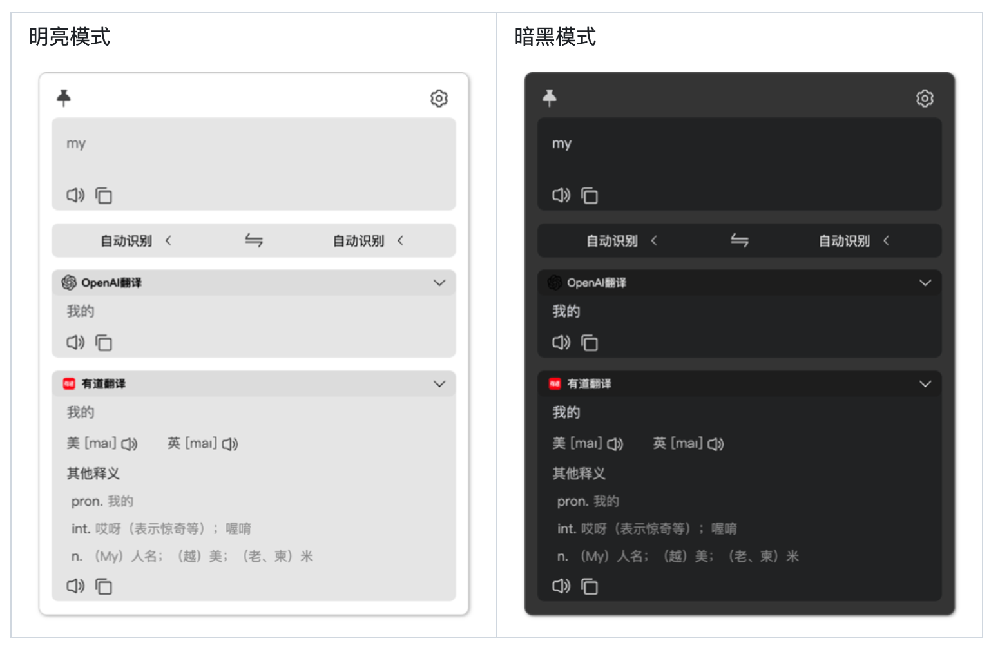

# Windows软件折腾之路

## 概况

Windows平台目前用得不多，全平台通用软件就不写了，可以参考[Mac软件折腾之路](./Mac软件折腾之路)

## 启动器

### [uTools](https://www.u.tools/)

以前经常用，插件更本地化一些，毕竟基于中文环境。后来在Mac上切换到了`Raycast`。

Windows上目前试用了很多类似的软件，还是停留在`uTools`上。

- 之前配置了很多插件，网页快开之类的，现在新机子懒得搞了，`只保留了基础插件`。
- `流畅度一般`，没有Mac上Raycast和系统的那种集成感。
- `剪切板，计算稿纸，网页快开`应该是用的最多的。
- 本地搜索基于`Everything`。
- 有个`Ctool`的插件还不错，开发用得上。

## 压缩软件

### [7-Zip](https://www.7-zip.org/)

这个也没什么好说的，其实个人还是习惯WinRAR，但是这个免费、没广告。

## 图片预览

### [Honeyview](https://cn.bandisoft.com/honeyview/)

## 设备监控

### [HWiNFO64](https://www.hwinfo.com/download/)

主要用来看一下mini主机的部件温度。

## 翻译

### ~~🚫[Pot](https://github.com/pot-app/pot-desktop)~~

主要跟Mac上的Bob类似，所以选了这款，安装包比较小。流畅度一般。快捷键保持跟Bob一致。

> 最近一直弹出更新，而且提示需要管理员权限，就切换成TTime了

### [TTime](https://github.com/inkTimeRecord/TTime)

功能没什么区别，但是感觉这个更流畅一些。

自带划词选中翻译，不需要配合快捷键，更符合Mac上Bob配合PopClip的使用习惯。

## 截图

### [Snipaste](https://zh.snipaste.com/)

<gitalk/>

