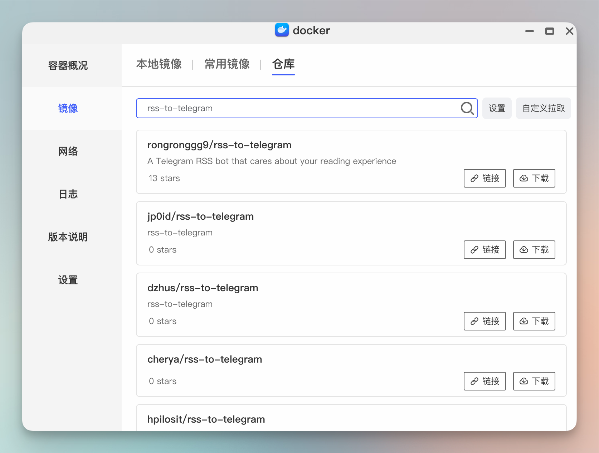
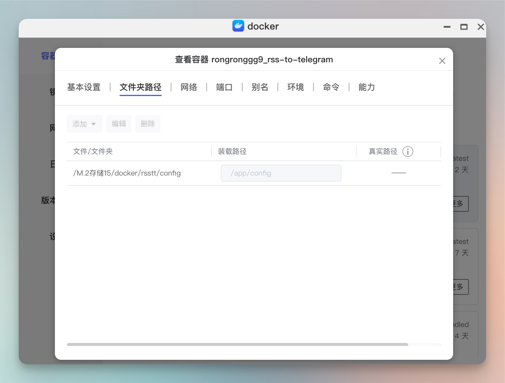
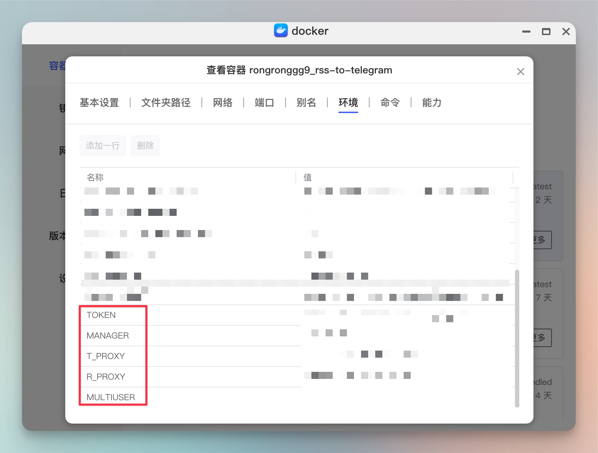
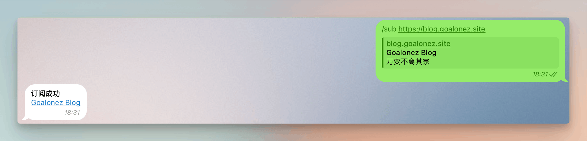

# 在Telegram中订阅RSS

先贴成果，弄了几个频道分类订阅了一些自己关注的RSS地址 
>[万变不离其宗📰](https://t.me/blog_goalonez  )：一些博客的RSS，截止写这篇Blog的时候大概积累了130多个Blog或期刊的RSS订阅。  
>[即刻圈子热门😼](https://t.me/jike_goalonez  )：一些即刻圈子的热门列表RSS订阅,主要是互联网相关的圈子。  
>[片刻📷](https://t.me/photo_goalonez)：摄影相关的RSS聚合，暂时只有即刻的一些摄影相关圈子的RSS订阅。  

欢迎后续有好的Blog或者摄影类的RSS地址分享出来，我会加入到对应的频道中去。

## 开搞
最近发现一个[有趣的项目](https://github.com/Rongronggg9/RSS-to-Telegram-Bot)，可以把RSS推送到Telegram bot上，于是立马决定部署体验一下。  
由于现在没有续服务器了，所以直接丢在了极空间上，使用docker进行部署。虽然最近极空间开放了ssh，不过还没去折腾，暂时还是用原先的可视化界面进行来操作docker。

```shell
//官方Docker Compose
mkdir rsstt
cd rsstt
wget https://raw.githubusercontent.com/Rongronggg9/RSS-to-Telegram-Bot/dev/docker-compose.yml.sample -O docker-compose.yml
vi docker-compose.yml  # fill in env variables
docker-compose up -d
```

根据官方的[Docker Compose](https://raw.githubusercontent.com/Rongronggg9/RSS-to-Telegram-Bot/dev/docker-compose.yml.sample)配置文件看了一眼，并不需要依赖其他中间件，这样的话直接拉镜像跑就行了。

下面直接开始。
## 机器人创建
在Tg上直接使用[@BotFather](https://t.me/BotFather)进行机器人创建
1. `/newbot`命令发起创建
2. 取一个机器人名字
3. 取一个机器人id，必须以bot结尾

创建完成后会返回一个token，格式类似于`1234567890:A1BCd2EF3gH45IJK6lMN7oPqr8ST9UvWX0Yz0`，保存下来，后续部署服务端会用到。
## 服务端部署
#### 拉取镜像
- 直接拉第一个就行了

#### 映射目录
- 映射一下`/app/config`目录



#### 环境变量
- 我目前只填了几个关键的环境变量，主要是对Tg相关的参数以及本地代理
    - Token：在[@BotFather](https://t.me/BotFather)中创建机器人完成后，会返回类似`1234567890:A1BCd2EF3gH45IJK6lMN7oPqr8ST9UvWX0Yz0`这样的内容，就是Token。
    - MANAGER：使用[@userinfobot](https://t.me/userinfobot)机器人，可以获取到自己的账号id，类似1234567890。
    - 两个PROXY则是为了打通Tg的网络，如果你的服务器直接能通的话也就不需要了。
    - MULTIUSER：开关多用户功能。`0关闭，1开启`
- 更多变量的使用可以参考[官方文档](https://github.com/Rongronggg9/RSS-to-Telegram-Bot/blob/dev/docs/advanced-settings.md)


## 操控机器人
- 这时候已经可以通过给bot发送指令进行操作了。发送`/start`启动。
- 各项操作可以使用`/help`查看。
- 如果只是个人简单使用的话，直接在bot中使用`/sub`进行订阅即可。
- 
```
RSS to Telegram Bot，关心你的阅读体验的 Telegram RSS 机器人。

GitHub: https://github.com/Rongronggg9/RSS-to-Telegram-Bot

命令:
/sub: 添加订阅
/unsub: 退订订阅
/unsub_all: 退订所有订阅
/list: 列出订阅列表
/set: 自定义订阅设置
/set_default: 自定义默认设置
/import: 从 OPML 导入订阅
/export: 导出订阅到 OPML
/activate_subs: 启用订阅
/deactivate_subs: 停用订阅
/version: 查看 bot 版本
/help: 查看帮助
/lang: اختيار اللغة / Seleccionar un idioma / Επιλέξτε μια γλώσσα / Select a language / Seleccionar un idioma / Aukeratu hizkuntza bat / انتخاب زبان / Sélectionnez une langue / בחר שפה / Pilih bahasa / Selezionare una lingua / 言語を選択する / Selecione um idioma / Сменить язык / Bir dil seçin / Змінити мову / 選擇語言 / 选择语言

/test: 测试 (仅 bot 管理员)
/set_option: 更改 bot 配置 (仅 bot 管理员)
/user_info: 查看/修改用户信息 (仅 bot 管理员)
```

#### 群聊和频道中使用
- 由于bot中直接订阅没有办法对订阅进行分类，也无法分享给他人共享订阅，所以可以`将bot拉倒群聊或者频道中`，给上`管理员权限`即可。
- 建议还是在bot中对群组或频道的订阅进行操作，否则你的操作也会被他人看到，影响阅读体验。
```
在频道/群组里的使用方式:
1. 将 bot 添加到频道/群组里。
2a. 直接在频道/群组里发送命令。
2b. 或者，你也可以在和 bot 的私聊里像这样发送命令: /sub @username https://example.com 或 /sub -10010000000000 https://example.com。
(@username 是频道/群组的用户名，@ 是不可缺少的；-10010000000000 是频道/群组的 ID，必须以 -100 开头)
```

<gitalk/>