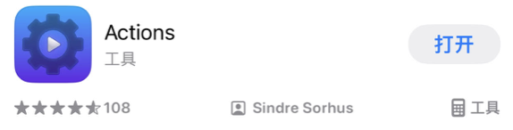
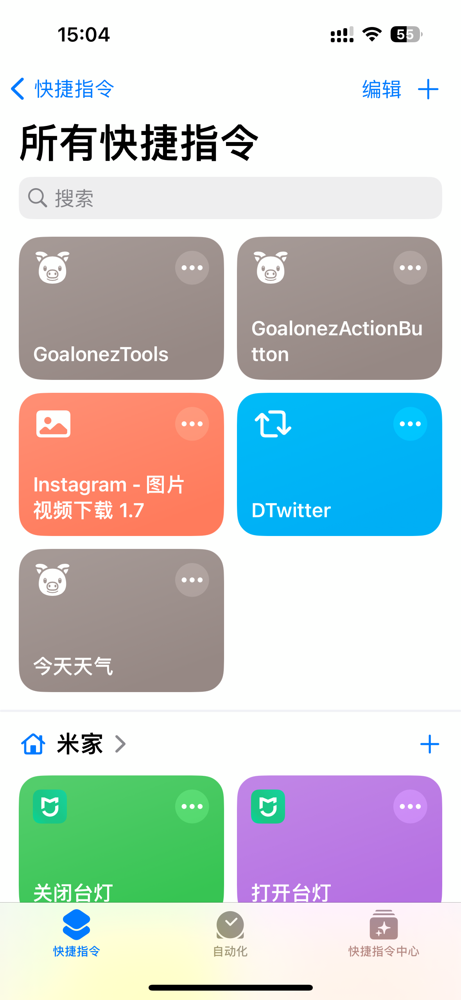
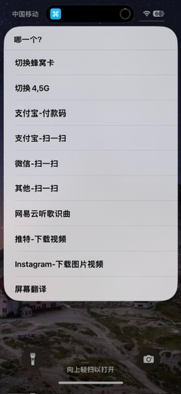
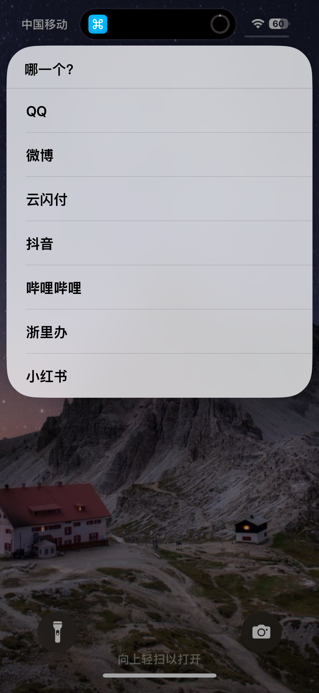
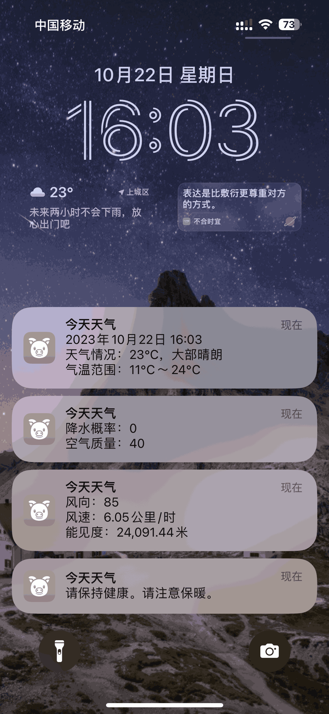

# 快捷指令折腾之路

## 前置

需要先去应用商店下载`Actions`才能识别方向。

## 快捷指令

- `GoalonezTools`：工具集合

  - > https://www.icloud.com/shortcuts/83604ca73dff414ca59538c8dc576f26

  - 

  - 切换蜂窝卡

  - 切换4,5G

  - 支付宝-付款码

  - 支付宝-扫一扫

  - 微信-扫一扫

  - 其他-扫一扫

    - QQ
    - 微博
    - 云闪付
    - 抖音
    - 哔哩哔哩
    - 浙里办
    - 小红书
    - 

  - 网易云听歌识曲

  - 推特-下载视频

  - Instagram-下载图片视频

  - 屏幕翻译

- `GoalonezActionButton`：根据设备方向执行不同命令

  - > https://www.icloud.com/shortcuts/d3293f8b8b154c62a271b48dbed8b22e

  - 直立portrait

    - 打开工具集合GoalonezTools

  - 倒立portraitUpsideDown

    - 打开手电筒

  - 左侧横放landscapeLeft

    - 打开相机

  - 右侧横放landscapeRight

    - 打开微信扫一扫

  - 屏幕朝上faceUp

    - 打开杭州市民卡交通码

  - 屏幕朝下 faceDown

    - 录音

- `今日天气`

  - > https://www.icloud.com/shortcuts/701214553dd24807be0b7179f1844792

  - 通过消息提醒自动化报告当天天气

  - 

- `Instagram`图片视频下载

  - > 引用自：https://www.icloud.com/shortcuts/c9ec7b51adef4ae0b4c2476cd34cc6cb

- `推特`视频下载

  - > 引用自：https://www.icloud.com/shortcuts/bb06925ad50c42269a96f7ce1b2c4094

## 自动化

- 触发今日天气
- 出门上班自动静音、关闭WIFI
- 到公司自动打开WIFI
- 下班关闭WIFI
- 到家打开声音、打开WIFI
- 打开音视频App取消方向锁定
- 关闭音视频App打开方向锁定
- 低于20电量自动打开低电量模式
- 高于20电量自动关闭低电量模式

## Action Butoon

配置运行快捷指令`GoalonezActionButton`

<gitalk/>