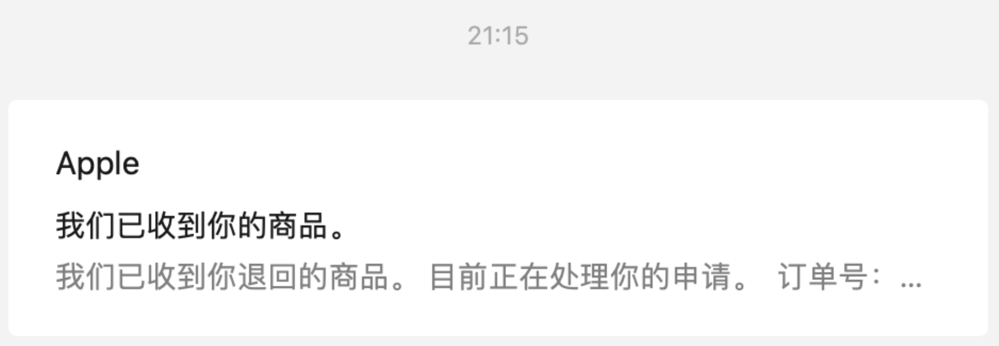
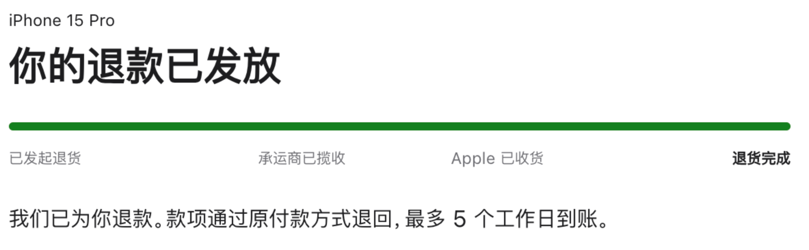
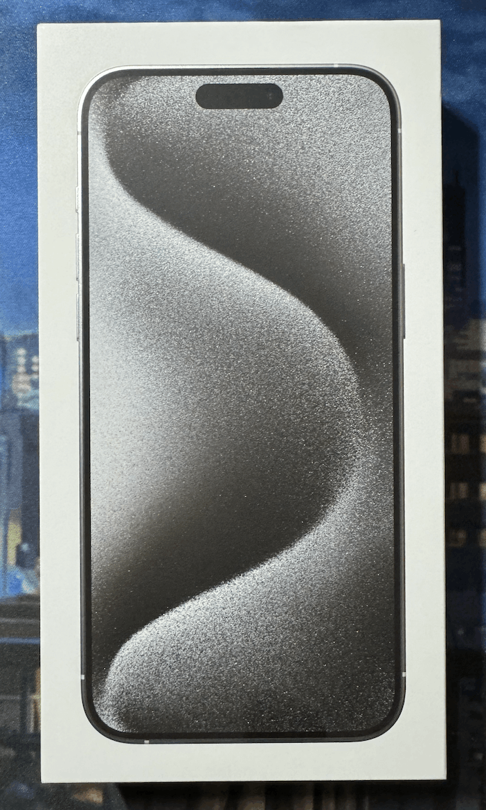
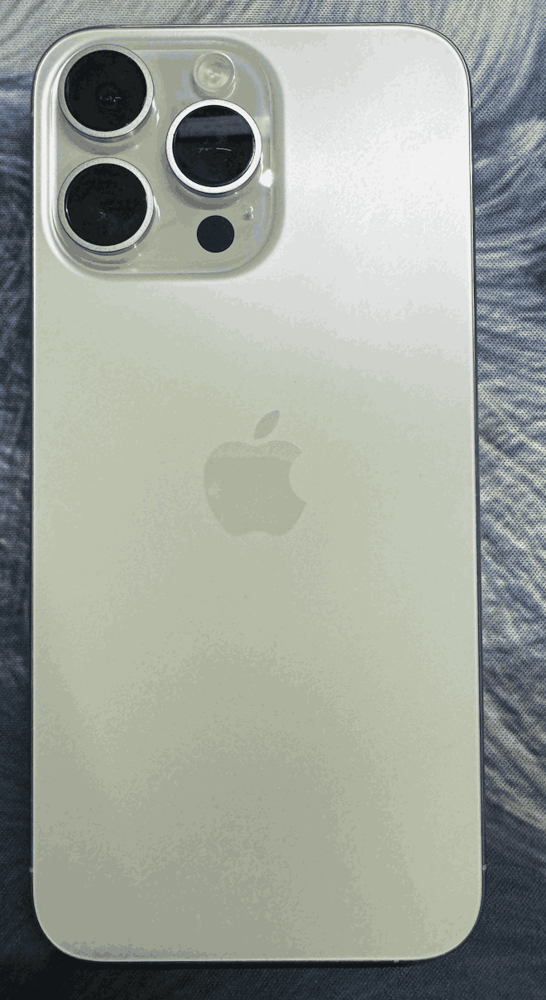
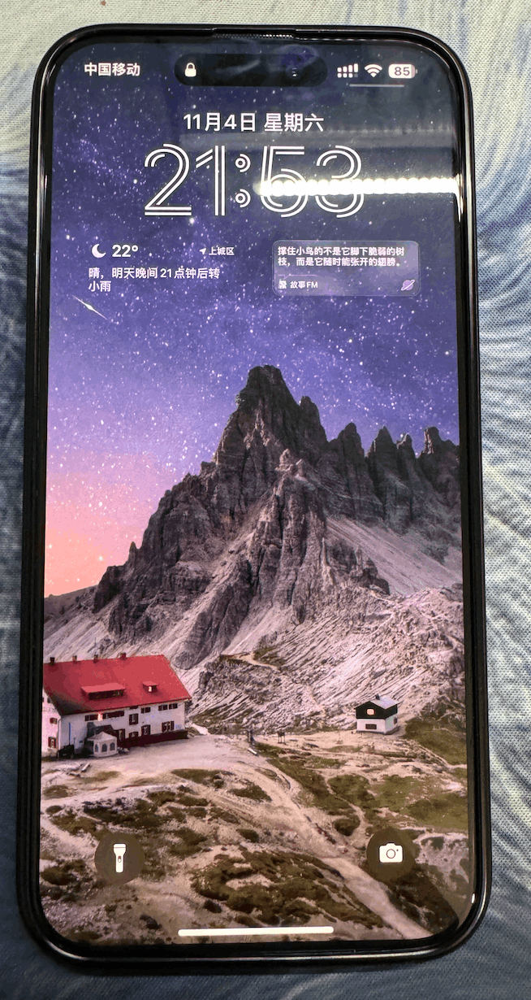

# 新玩具-15ProMax

## 15Pro退货

### 起因

1. 由于今年双十一降价太狠了，导致官网购入的15pro使用没几天就降价了1000块钱。😱
2. 在购入第14天的时候第一次在新手机上打王者荣耀，初始电量80（由于日常开着充电80上限），等队友掉了10，然后打了3把，直接从70掉到了10。😡
3. 发热严重，当时开着游戏等队友的时候就整个正面屏幕都在发热，后面摄像头附近更热。😡

### 过程

想要退货的时候已经是第15天了，当时在app上看了下，已经无法提交退货申请。后来在网上搜索了一下，发现有超期退货成功的案例，于是打算尝试一下。

在第16天上午给Apple官方客服打了一个电话，说明了原因。售后表示需要去申请一下，大概听了几分钟音乐，反馈帮我申请成功了`特殊退货服务`，但是只有`1次机会`。然后售后跟我确认了手机没有划痕，原装盒子等基本情况，就帮我预约了上门取件。

最后跟我特别强调讲解了一下我需要做的流程很简单，就是把手机给快递员，其他都不需要操作。

当然这个时候并不代表已经退货成功，售后表示`发回工厂后需要进行检测`，如果通过了会收到一封邮件。具体检测标准是检测手机硬件有问题，还是只检测手机是否有磨损就不得而知了。

### 物流

`上午`取件，`第二天`物流显示签收，但Apple订单状态没有变化，`第三天晚上9点`收到邮件表示收到商品，Apple订单显示退款已发放。这个时候应该就是退款成功了。当然`钱还没这么快到账`。

#### 邮件

#### 订单

## 购入15 Pro Max

当时想着一方面max的电量会好一些，毕竟之前的情况看14、15两代电池都很拉跨。另一方面降价幅度也大。于是就开始关注15 Pro Max的价格。还有就是这一代重量减轻了，以前为了单手操作都是选择Pro。

双十一活动期间的价格真是一天一个价，甚至一小时一个价。

`平台各种耍猴`，显示可以保价，但其实每次降价又不是同一个链接上架。

最终在京东百亿补贴下了一单白色15 Pro Max。（几乎等于原先的pro价格了，如果其他颜色的话会更便宜）

## 外观

## 配置

因为这次15Pro已经不在手上了，所以没法手机直传，而且想着以前下了很多app，又卸载了，不知道会不会有残留文件也备份到iCloud上，于是就按新机来初始化激活了。

结果一搞搞了一下午，太麻烦了。😭

### 大坑

配置途中发现Apple Watch没法直接连接到新手机上，搜了一下才知道只有iCloud迁移才能直接同步过来，没办法只能把Apple Watch给还原了重新进行匹配。并且Watch也需要重新配置一遍。😮‍💨

<gitalk/>