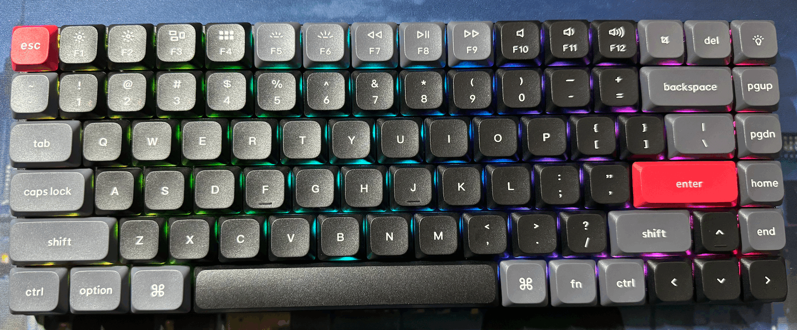

# 新玩具-Keychron-K3-Pro

## 外观

### 盒子

### 无灯

### RGB

## via改键

由于键盘功能区默认是多媒体，搜了一下似乎没有提供一键更改，于是只能通过via一个一个键来改。把0层改成了了默认F1-F12，1层改成了多媒体（通过fn键触发）。

因为截图一般用的CleanShot X，所以把截图键改成了insert。

顺便把Windows模式下的win键去掉了，改成了alt键，alt改成了ctrl。

### Mac

### Windows

<gitalk/>
