# 新玩具-极空间Z4pro

## 下单

10月24号第一轮预售，犹豫了几天，原以为备货充足，结果没想到卖了几天就售罄了。

只能等到11月1号第二轮预售才下单，10号付尾款，最终经过1周的等待发货，在20号才收到。反而硬盘早就到了。

### 型号

- 极空间Z4 Pro 8G标准版（一开始想入16G，后来想想也没什么必要，因为已经有mini主机了，而且后续有需求自己买一条16G内存条更划算，没必要现在多花300升配）
- 海康威视4T紫盘
- 希捷VX015 4T

两个硬盘都差不多450，比以前的低价要贵了不少，但目前看也没有更好的价了。

## 开箱

### 包装

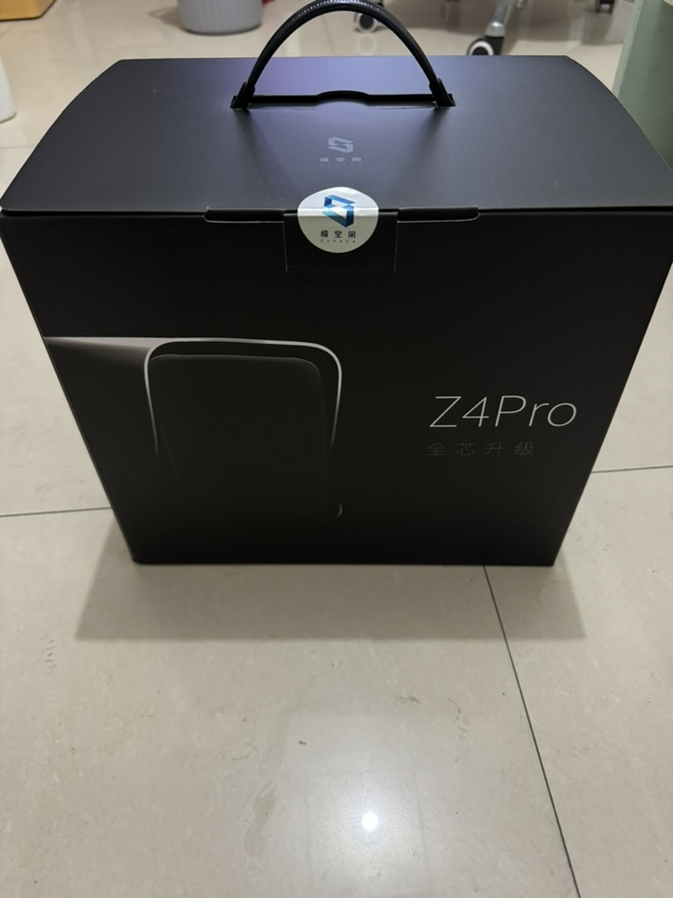

### 配件

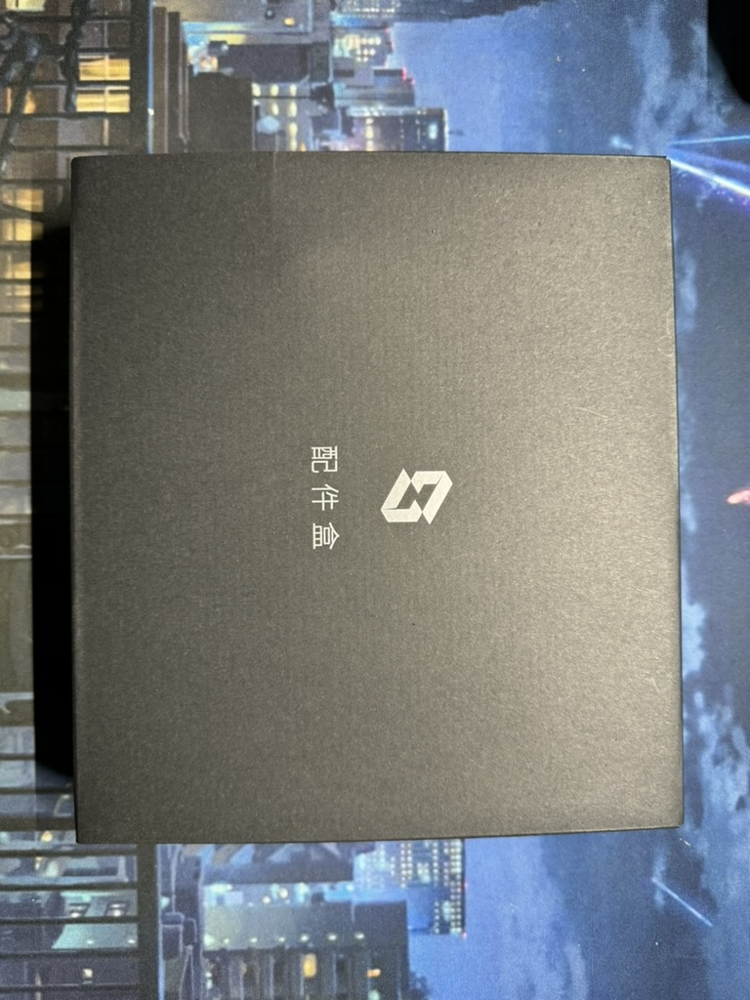

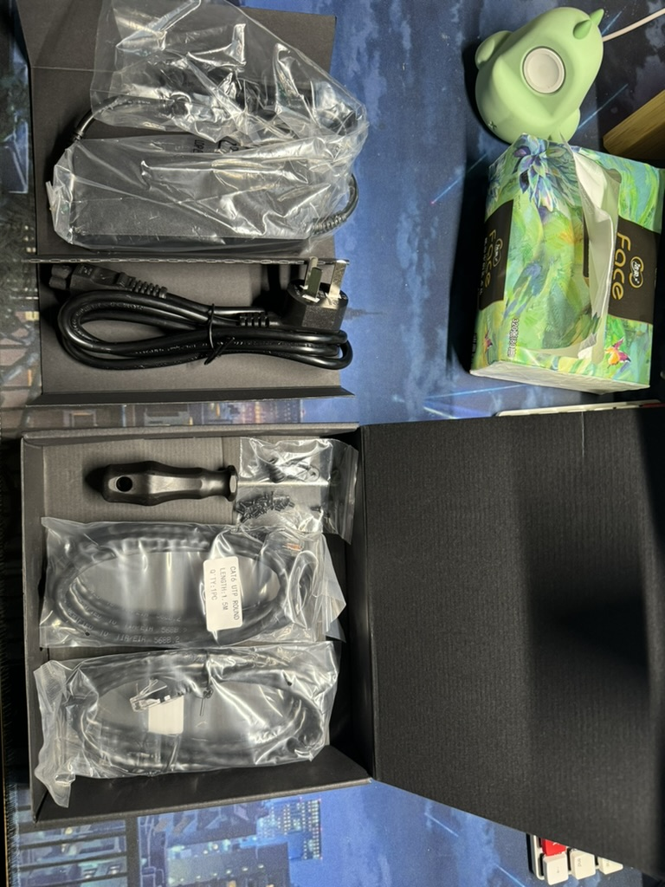

### 机器

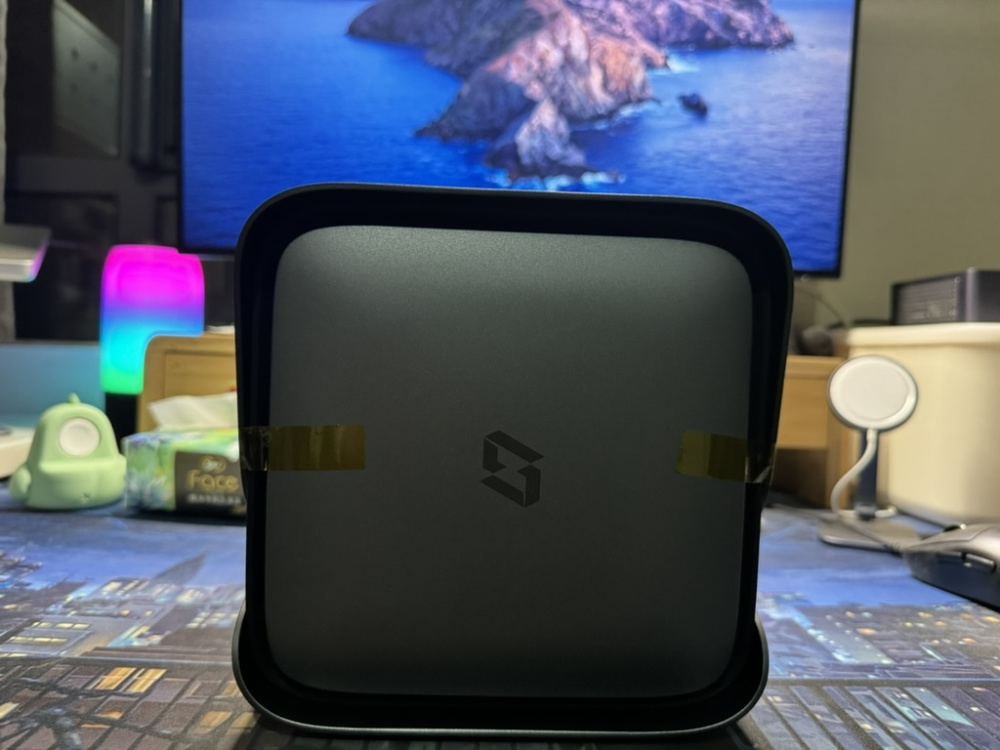

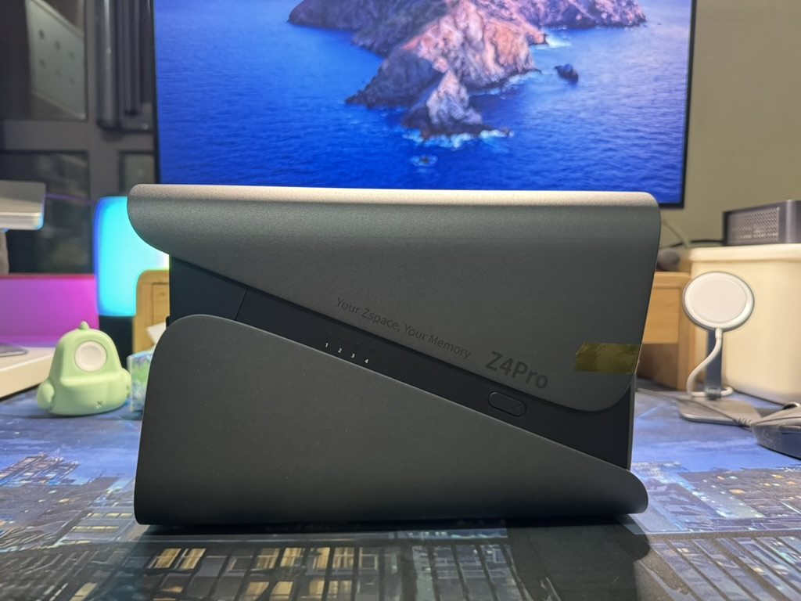

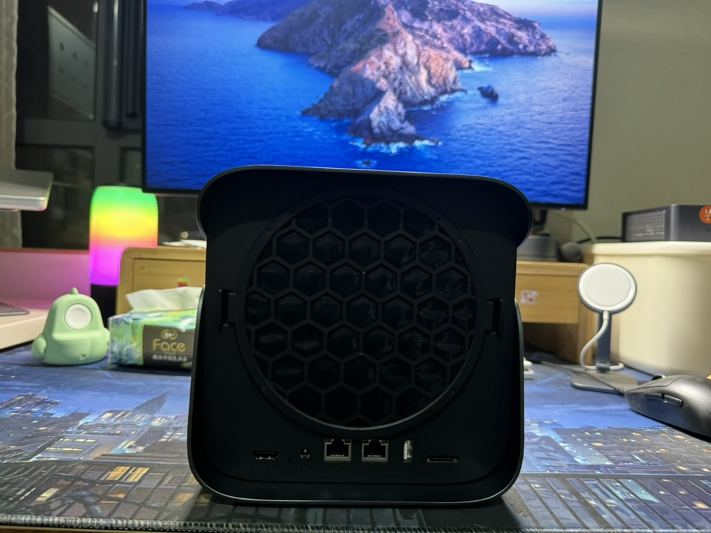

## 系统

### 磁盘模式

初始化需要选择磁盘模式，raid或者独有的zdr，目前还没有basic模式，但是据论坛说已经在推送给用户了。所以暂时我用的还是zdr模式，这个模式没法让我自己控制每个文件具体在哪个盘，所以我并不是很喜欢这种模式，后续等推送了应该会切换过去。

### 个人空间

- 纯个人文件仓库
- 一般个人的资料、备份之类的我就丢在个人空间里
  - docker配置
  - 手机相册备份
  - 文档同步（目前我只用了单向同步，因为基本所有工作都在一台MacBook上，所以只是作为一个备份，也不涉及到同步到其他机器的问题）
  - 专门用来PT做种奖励的种子和资源（因为这部分只是为了做种奖励，不需要展示在极影视中）
- `管理员也没法看到其他账号的任何资料`
- 重要资料可以开启双备份
  - 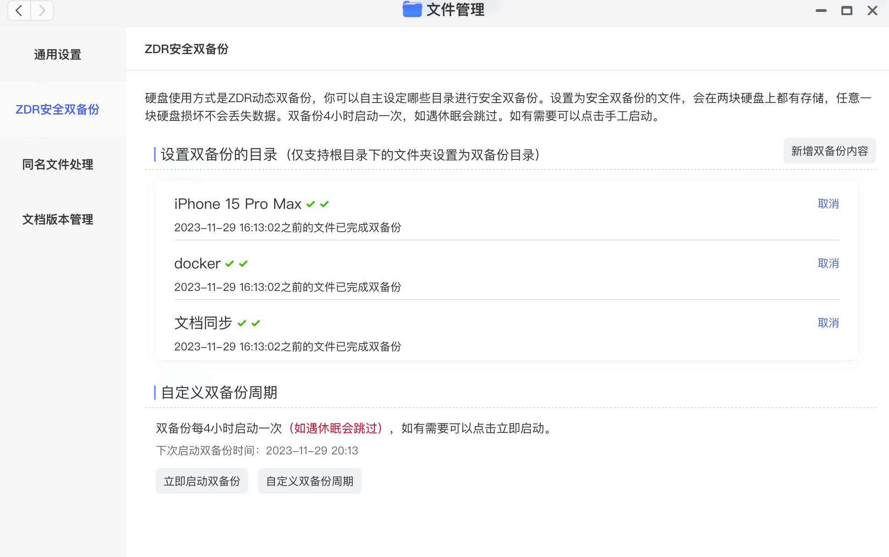

### 团队空间

- 需要共享的文件丢在团队空间
- 需要共享的内容
  - 影视资源，包括PT种子
  - 音乐资源

### 极相册

- 自动备份iphone上的照片，会自动保持跟手机上的相册一致。
- 但是删除操作不会同步，需要单独在极空间里进行删除，不过同步操作是在打开app才会进行，所以大部分时间没用的照片在手机上会及时清理，这样就不会同步到NAS上。
- 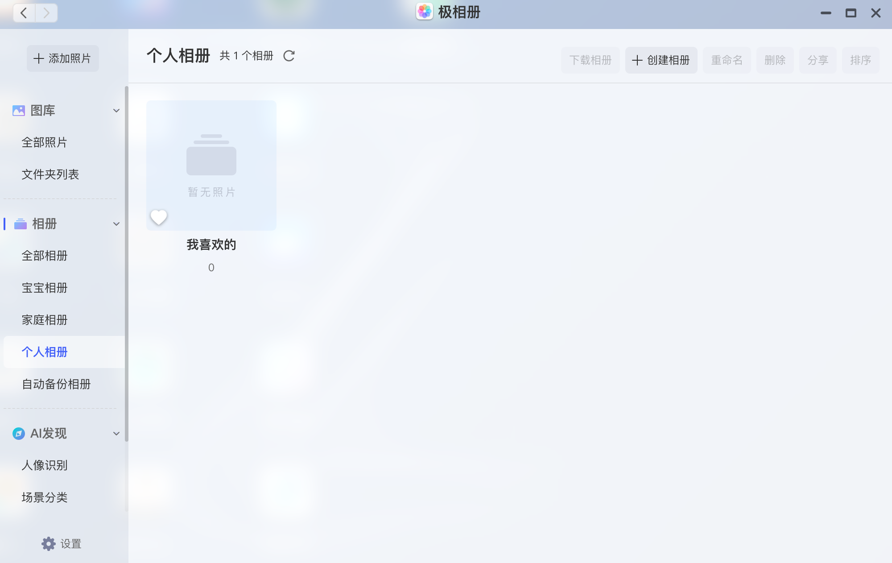

### 极影视

- 默认是账号之间不共享的，必须把分类设置成共享，才能让其他成员看到。
- 所以为了共同维护一个影视库，我把影视目录建在了`团队空间`中，然后根据电视、电视剧、纪录片等通用分类把极影视的分类共享给所有成员，并让这些分类的内容设置成团队空间的文件夹。
- 刮削能力目前看还可以。
- 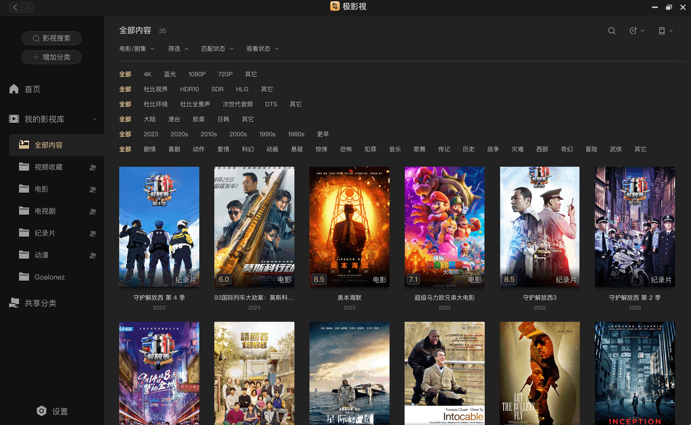

- 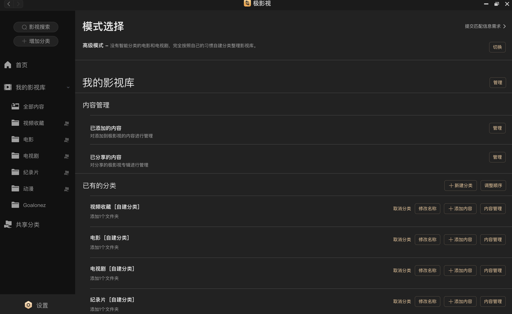

### 极音乐

- 这个感觉需求也比较少，可能要在电视上播放音乐才会用到音乐资源。大部分时间还是网易云、Spotify就可以满足了。
- 并且这个功能感觉做的也不好，多成员的情况下很难管理，没法把以前的网络歌单同步进来。
- 比如目前我把自己的歌单先下载完导入，做成我的歌单，但是对其他用户来说，如果导入就会全部混在一起，他们要创建歌单只能一首一首去选择，可用性就太差了。
- 音乐资源的作用可能还是在于一些没有版权或者某些原因不可听的音乐，可以做一下适当备份吧。
- 通过docker镜像Music-Tag-Web可以做刮削信息和歌词，整理文件夹感觉作用不大，因为在极音乐里自动会分类专辑和歌手。
- 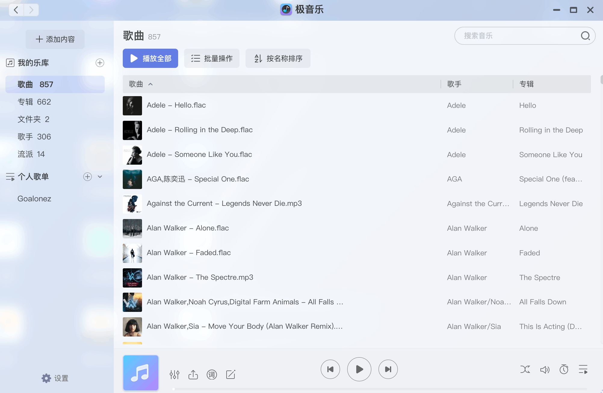

### 文档同步

#### 单向备份

- 以电脑文件为准，仅上传到NAS去
- 但是今天发现这是个坑。他仅仅是增量同步，所以电脑上无论是删除文件，亦或者移动目录，只会把增量情况同步到NAS上。也就是说随着时间推移，NAS上的文档结构是电脑文件的历史总和，几乎是一个不可用状态。

#### 双向备份

- 电脑和NAS文件双向同步，删除也会同步，适用于多设备共用的情况，但是对我的需求来说也很奇怪。因为我只希望以我MacBook为准，NAS只做备份，不希望NAS影响我电脑的文件。假设NAS文件系统错乱，会导致我MacBook本地也被同步影响到。虽然有设置可以NAS删除文件的时候不删除本地电脑文件，但总感觉这整个功能设计都很奇怪。

> 后续可能会考虑手动去定期备份到个人空间，像网盘一样使用，而不使用文档同步。但这样的便捷性就等于无。

- 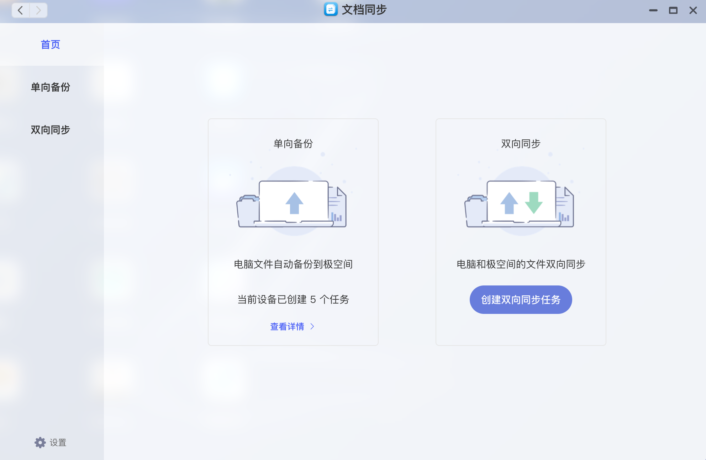

### Mac备份

- 第一次用MacBook的Time Machine，所以有点没整明白，不知道是BUG了还是我没理解。
- 备份成功后，在NAS的Mac备份里看不到已经备份的信息，还是显示没有备份。
- MacBook似乎会先在自带的存储中备份一份，并没有直接备份到NAS里。删了半天，折腾好久才还原到没有备份的情况。
- 第二天重试就正常了。直接能备份到NAS里。目前看是没什么问题。不过据官方描述，Mac备份似乎也有很多限制，不遵守可能会导致后续还原失败。
- 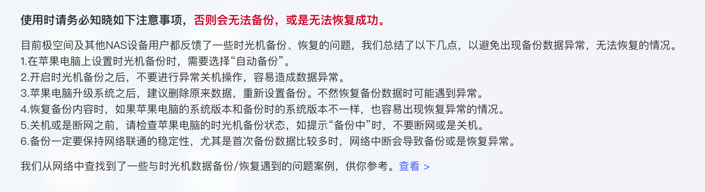

### Docker

- 目前只用了这4个镜像
- music-tag-web
  - 音乐刮削
- ddns-go
  - 这个只是备份，平时没有开启，只要还是通用极空间自带的网络就可以很好的处理外网连接的问题了。
  - 另外还有tailscale把设备组成一个局域网
- alist
  - 用来挂载阿里云盘
  - 但是从挂载的云盘里下载文件（复制）到NAS里，出现了好多次，下载了几十G结果失败了，但没法续传，前功尽弃，所以后续基本资源都是从PT去下载，阿里云盘就没什么用了。
  - 不过挂载的方式似乎可以突破官方限速，平时在电脑上阿里云盘基本就几M/秒，但是挂载的可以达到带宽上限。
- tailscale
  - 把自己的设备组成一个局域网。
  - 以前是通过自己的云服务器自建的derp。
  - 目前改成光猫桥接，路由器拨号，似乎速度还不错，就直接用官方节点了。方便不少，只需要下载客户端即可。

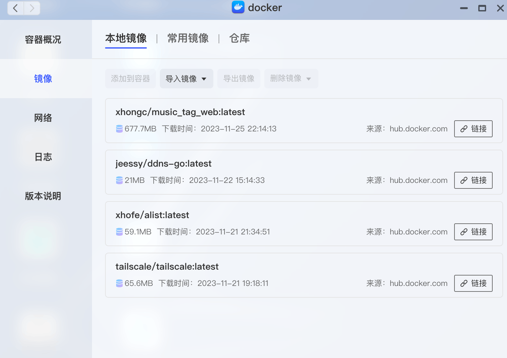

## 网络

### 光猫桥接

#### 超级密码

一开始不知道超级密码，后来在网上搜到这个型号的光猫可以通过`FTP直接连到光猫`，就能获取到`配置文件`，然后在配置文件里找到了超级密码。于是顺利登录了管理端的后台。

#### 改桥接

直接打客服电话。但是电信的客服真是一言难尽。

- 第一次在表示先重置上网密码，再改桥接的情况下。`客服误操作`，直接改成了桥接，导致路由器不知道上网密码，没法上网。
  - 而且管理端页面里的上网密码是错误的，尝试了也没用。

- 于是第二个电话，让客服先改回路由模式。
  - 客服表示之前是上个客服的失误，`直接提出补偿6个月宽带提速服务`。😅
- 结果在配置文件中发现有上网密码，经过尝试，顺利在路由器上拨号了。
- 第三个电话联系客服，让他撤回路由模式的更改。
  - 这时候桥接能够正常上网了，但是网速没有提升。
- 第四个电话询问之前说补偿了网速，为什么没得到提升。
  - `客服表示撤回的时候，把网速一起给撤回了。`⁉️
  - 重新帮我操作提升网速。
- 后来发现桥接又不行了，网速倒是提升了。
  - 登录管理端页面查看，发现下发的配置文件又改成路由了。
  - 不过幸好，这次可以直接在管理端页面自己配置成桥接。
- 经历一番折腾，终于完成了桥接 + 路由器拨号

<gitalk/>