# 新玩具到了-15Pro

## 准备购入

本来没打算买15Pro，所以也就没抢首发。后来看着去年首发购入的14Pro只剩90的电池了（这一代的电池实在太太垃圾了😭）。

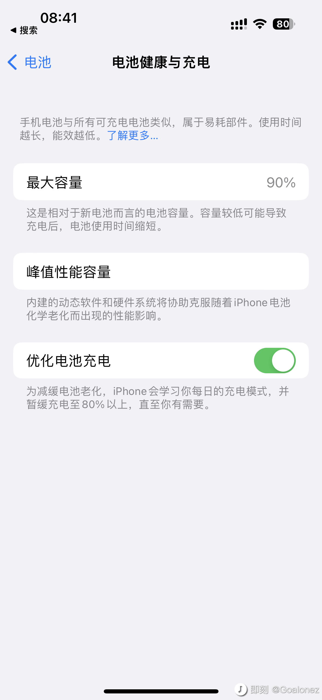

## 下单

国庆假期算了下成本，咸鱼`14Pro`还能出个`6000左右`，于是便下单`15Pro 256G 白色`。

### 第一单

- 下单时间：`10/29 00:01`。
- 发货时间：`11/02-11/09`。

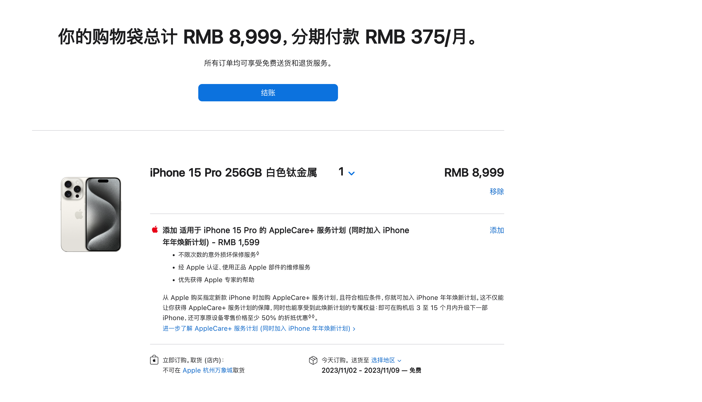

### 第二单

- 白天去看了下订单，突然发现下新单的时间变成了`10/24-10/30`。
- 于是又下了一单（🙈）。
- 结果下单当天晚上，第一单也变成了`10/24-10/30`。

### 第三单

- 无尽的等待
- 在V2ex找到一个监控库存的小工具，部署了一下。[Apple-Monitor](https://github.com/MoshiCoCo/Apple-Monitor)
- 监控的`15Pro 256G白色`，结果到最后到手也没放出一台白色的库存😳。
- `10/12`号的时候刷官网发现其他3个配色都有现货了，白色依然没有。
- 于是纠结一番后下单了`15Pro 256G 原色`。

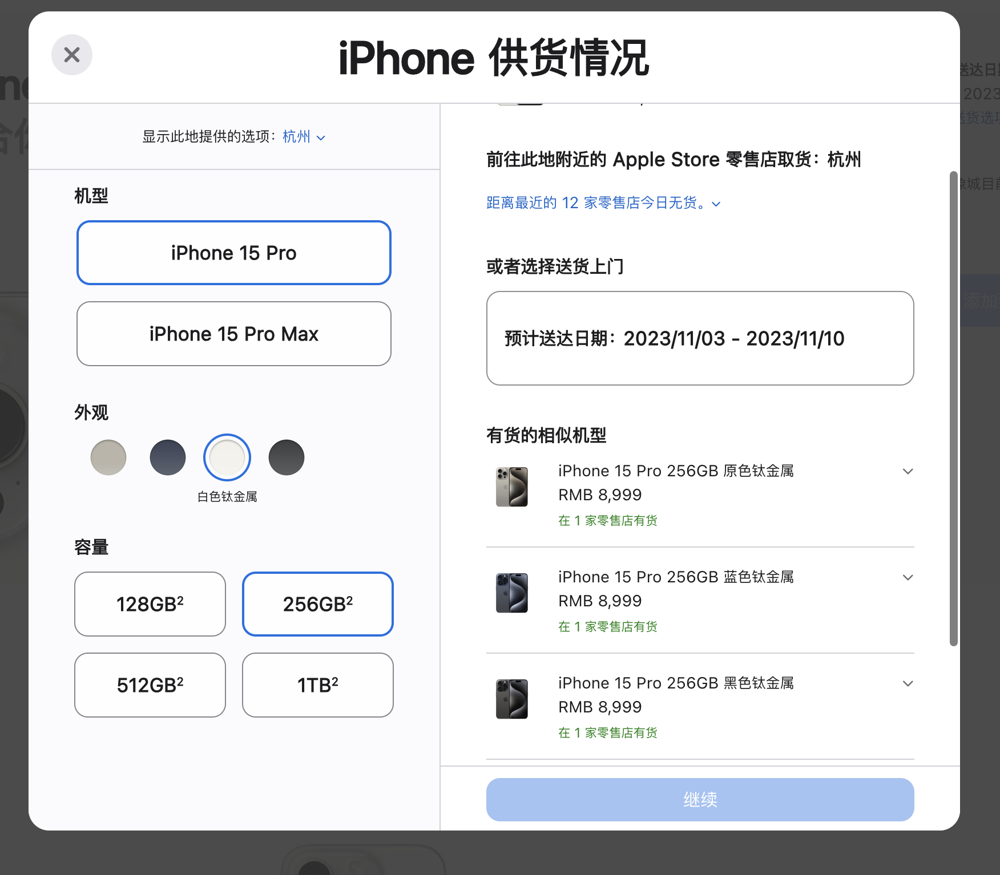

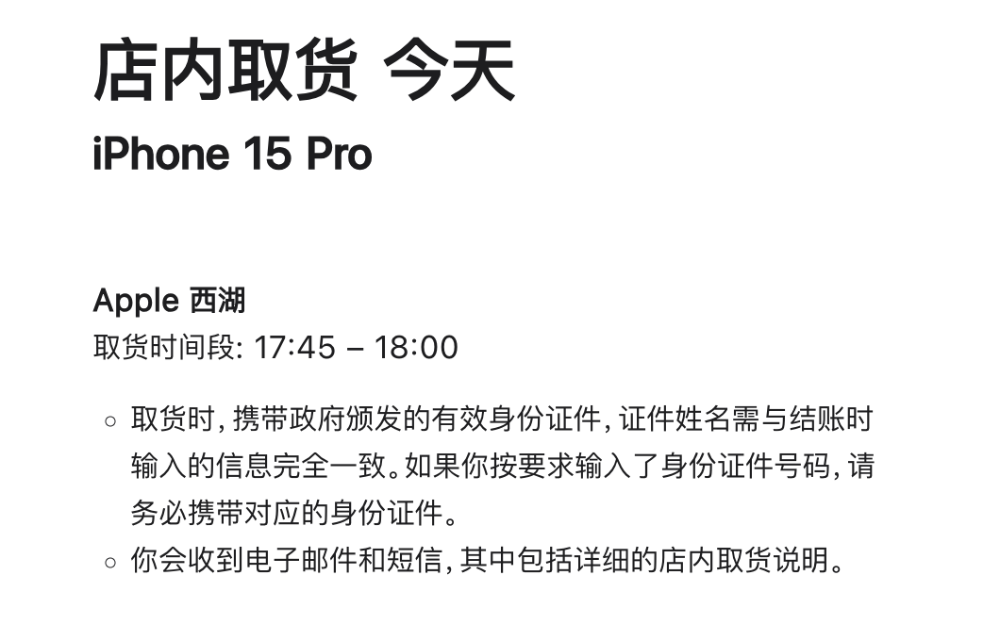

### 第四单

- 当天下班就到店里拿了货，结果回家拆开发现有个后壳有个小瑕疵，也擦不掉。
- 想着贴膜得第二天才到，也不想裸奔（壳可以不带，膜必须贴，以前X没贴膜结果不知道哪来的两道大划痕，太伤了）。还是决定退了重新下一个。
  - 本来下了`benks`的膜，又退掉了。因为`14Pro`上用着还不错，但是后来看到有人说第一批很多品牌有白边或者黑边遮挡，包括`benks`，于是看推荐换了`铁兔`的膜（感觉都差不多，不过这个膜贴起来很方便）。
- 幸好晚上去看3个配色还是有货，白色依然没有，所以继续下了`15Pro 256G 原色`。
- 第二天中午到店取了货（这次直接现场拆了包装先看了下外观），顺便办了退款，也拿到了膜。
- 最终订单变成了这个样子。（😂真是一波三折）

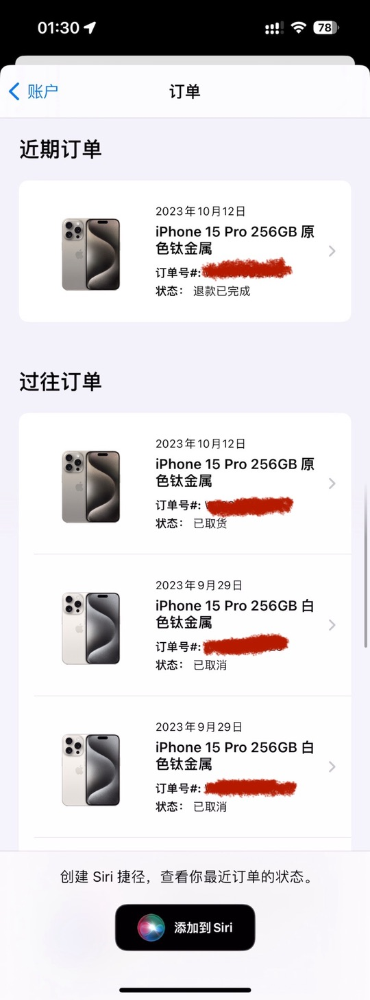

## 开箱

### 盒子

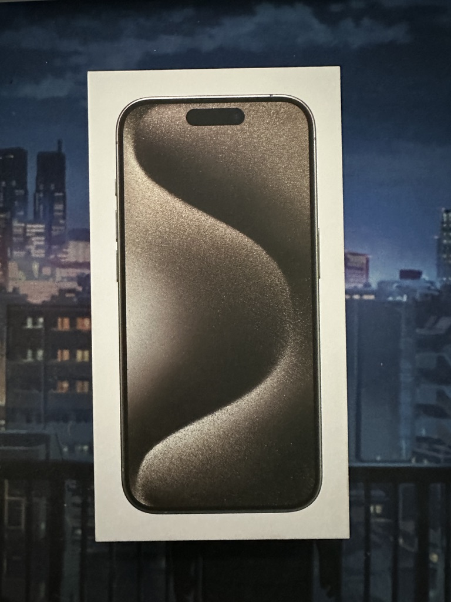

### 手机

- 拍出来有点像银色。
- 店里看了4个配色，感觉不如14Pro，都有点做旧风的感觉。
- 所以也就不纠结白色了，因为不是想象中以前那种透亮的白。原色也不错。

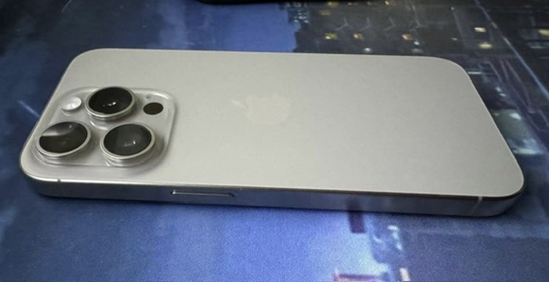

### Type-C线

- 线是编织的，跟MacBook的差不多。
- 已经能想象到以后变黄的样子了😒。

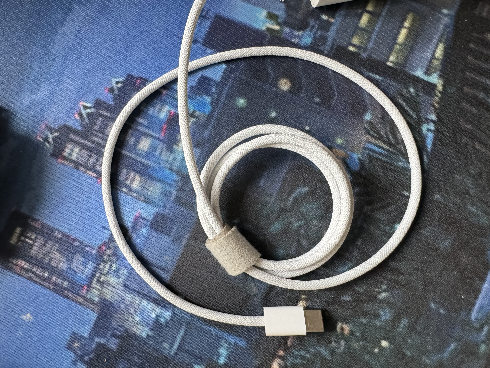

## 数据传输

- 感觉还是挺方便的，基本和原先手机完全一致迁移过去。包括`桌面，登录信息，app配置`等。
- 但是因为`面容ID会重置`，所以导致银行App都得重新登陆。
- `QuantumultX`迁移过去后也无效了，删了App重新下载配置才成功。（这个很奇怪，浏览器有效，但App连不上，所以就重新弄了）

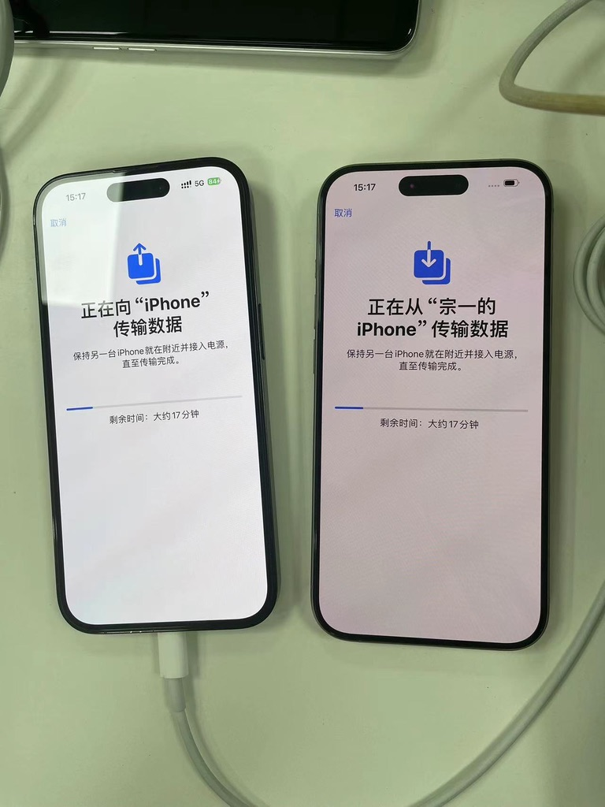

## 折腾

### 充电

#### 数据线

- 因为看了下评测65W氮化镓的线也是2.0的传输速度，充MacBook跟15Pro的线一样都在57W左右。因为在公司充手机经常要用到，MacBook在公司放了自带的充电套装，所以就把随身携带的Type-C线换成了15Pro自带的数据线。
- 以后再也不用带Lightning线了。
- 家里备了一根，现在出门用的索尼（感觉比以前AirPods Pro好用），但是家里还有一个有点电流声的AirPods Pro偶尔会用一下。

#### 充电头

- 充电头用的小米65W氮化镓，因为以前一直用的这款，感觉还不错，充MacBook速度也够。

#### MagSafe

- 官方的
- 支架：绿联的一款79的支架
  - 质感还可以。
  - 但是因为 14Pro 摄像头比较大,裸机没问题。
  - 14Pro带壳的话由于摄像头又大了一圈,本身线圈自带的位置会顶到摄像头,需要找适配的 magsafe 壳,之前用的壳线圈应该是有点往下移的设计.会在 100%电量之后间歇性出现充电开始的提示。
  - 15Pro用的`申本`的壳，目前没发现上面的问题。

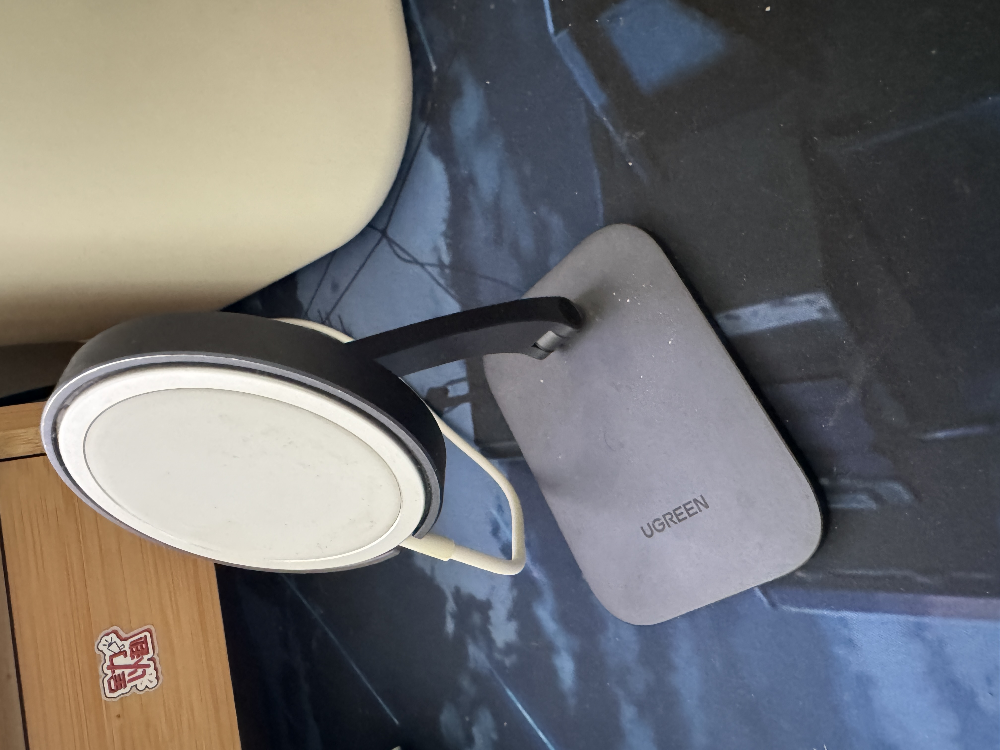

### Action Button👍👍👍

昨天初步尝试了一下，感觉是意外惊喜，本来升级只是为了电池和Type-C，结果发现静音键的改动配合快捷指令意外强大。

#### 前置条件

下载App

- Actions（识别设备姿势）
- 随便扫（集成扫码）

快捷指令

- [Action button](https://www.icloud.com/shortcuts/dba7b93b2d4d4885bae5c2fc46188e24)
- 根据这条指令修改了一下

#### 配置

##### 直立portrait

- 打开App - `随便扫`

##### 倒立portraitUpsideDown

- 开关`手电筒`
- 这个姿势感觉不常用，实在不知道能配置些什么
- 而且很多操作需要解锁，就更加没法玩
- 所以设置了手电筒，不需要解锁就能控制

##### 左侧横放landscapeLeft 

- 打开URL：`杭州市民卡-交通码`
- `smkapplication://ewogICJ1cmwiOiAic21rYXBwOi8vc2NhbkNvZGVSaWRlMiIKfQo=`

##### 右侧横放landscapeRight 

- 打开相机
- 其实左侧横放更适合一些，但是因为需要交通码，所以只能放在右侧了
- 右侧手指会挡住摄像头，需要适应

##### 屏幕朝上faceUp

- 打开Url`支付宝-付款码`
- `alipay://platformapi/startapp?appId=20000056`

##### 屏幕朝下 faceDown

- 打开`语音备忘录`

## 退货

由于第三单后壳瑕疵，跑到店里退货，遇到了几个有意思的客户。

排队

1. 大叔A

   - `15 PLUS`

   - 纠结退或者换

   - 手机飞行模式，晚上90的电，到早上就没了

   - 看股票刷新速率慢

2. 大哥B

   - `Apple Watch星空色`
   - 纠结原装表带不好看，想换个黑色Nike运动表带

3. 我

4. 大妈C

   - `充电套装`
   - 退货
   - 插队

刚到那边，大叔A已经在跟售后聊手机情况了，但是比较慢，一直在重复几个问题。

店员则是劝他退货，但是他又想换货再看看新手机的情况。

这时候我跟大哥B都在等待。大哥B看到我也是星空色Watch，就问我表带搭配。我表示以前带过黑色表带，感觉不是很搭。然后他觉得原装表带有点女性化，但是听我一说，又觉得黑色也不行，就更加纠结了。我建议不如下楼试试效果，看过实物就知道该用哪个了。

于是在我的好言相劝之下就下楼换表带去了🤣`所以我就提前了一位`。

这时候大妈C也过来了，开始和大叔聊天。大叔问她的手机出现过这种情况吗，结果大妈说我`伦敦`都去过了，也还有电。（😱😳😅????这跟你去没去过伦敦有什么关系啊`意识到这位选手不太对劲`）

由于大叔A还在纠结，店员B就让我先拿出设备和单子先帮我处理一下。

我刚拿出东西，店员检查了一下手机，大妈C就跑出来`插队`。于是店员只能同时帮她开始一起处理。

结果店员查了大妈C的订单，发现是2月份买的，但是她非说自己是6月份买的。店员说退货只能14天，而且看了一下她自己带的小票也是2月份。大妈C一看赖不掉了，就说这个得按实际情况来，我一直放在柜子上，不能算时间，我就去`伦敦`用了一次,你们必须给我退！（😱😳😅????怎么又是伦敦啊）后面就一直缠着店员，不知道强调了多少遍`伦敦`（😳笑死😂）。后面来了另一位店员跟她沟通，才总算开始我的退货流程。

退货流程还是挺快的，店员看完手机（因为我也没激活，当时拆开只看了下外观就决定退了），帮我在系统中提交了一下工单，就给了张小票，表示7个工作日内会到账。

## 14Pro

最后纪念一下陪伴一年的14Pro

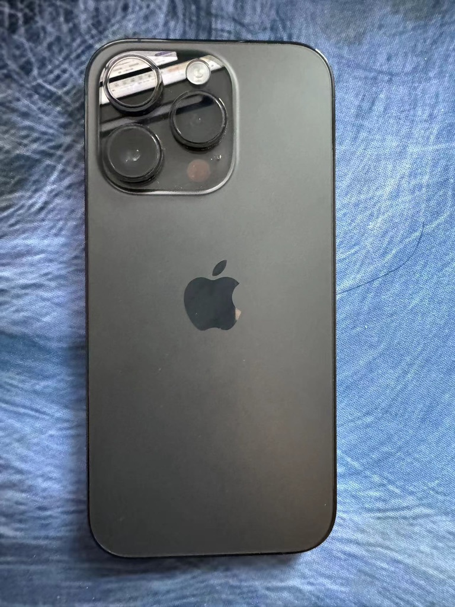

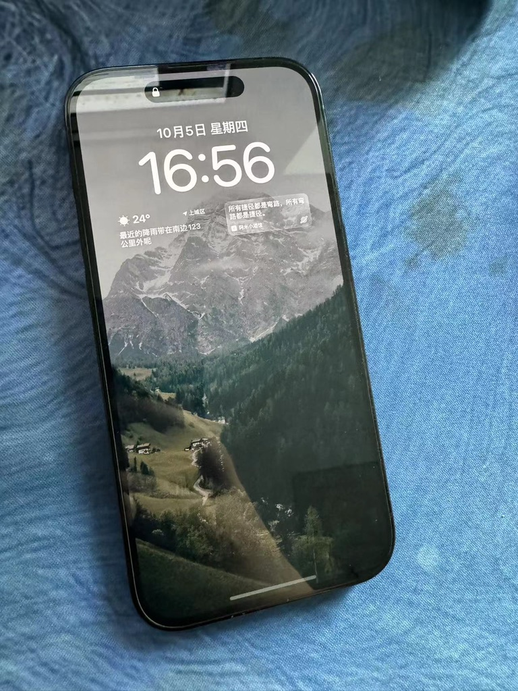

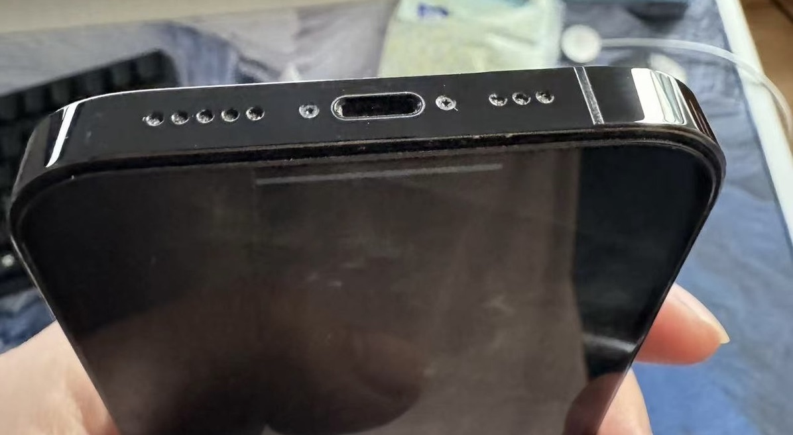

<gitalk/>
