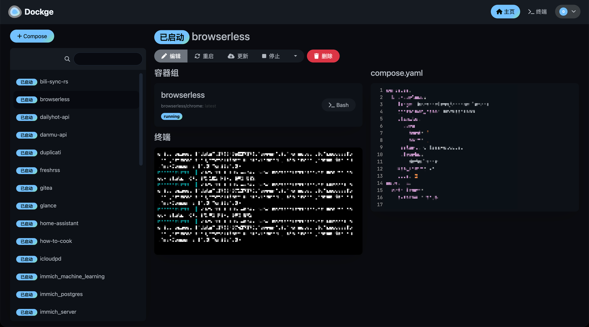
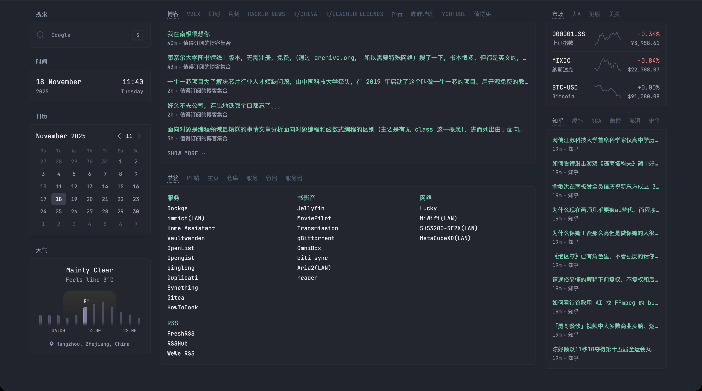
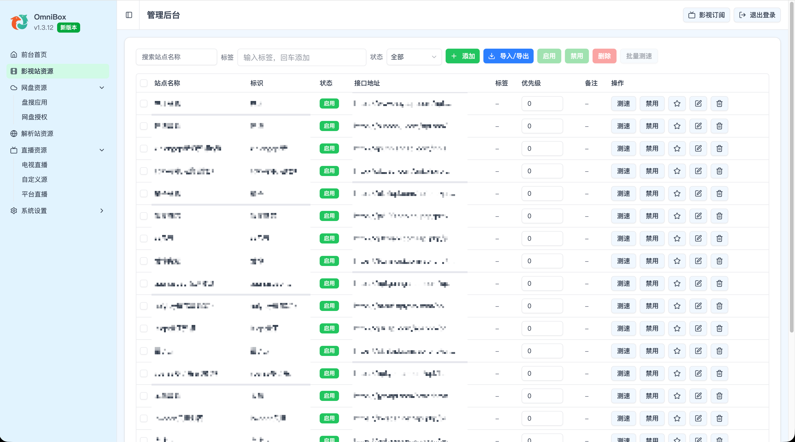
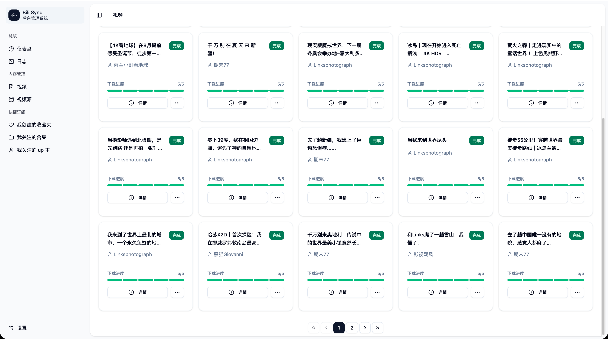

# 最近部署的一些NAS容器

## Dockge
- Docker web管理面板
- 由于portainer的体验不太好，没有遮罩层，更新容器的时候很奇怪，所以替换了这个轻量级的面板，反而感觉更好用
- [Docker compose](./NAS-DockerCompose分享.html#dockge)

## glance
- 主页导航，搭配sun-panel的浏览器插件使用
- [Docker compose](./NAS-DockerCompose分享.html#glance)

## OmniBox
- 影视综合管理，集成影视站，网盘搜索，iptv，直播平台，支持tvbox订阅
- [Docker compose](./NAS-DockerCompose分享.html#omnibox)

## bili-sync
- 哔哩哔哩收藏视频备份
- [Docker compose](./NAS-DockerCompose分享.html#bili-sync)

<gitalk/>