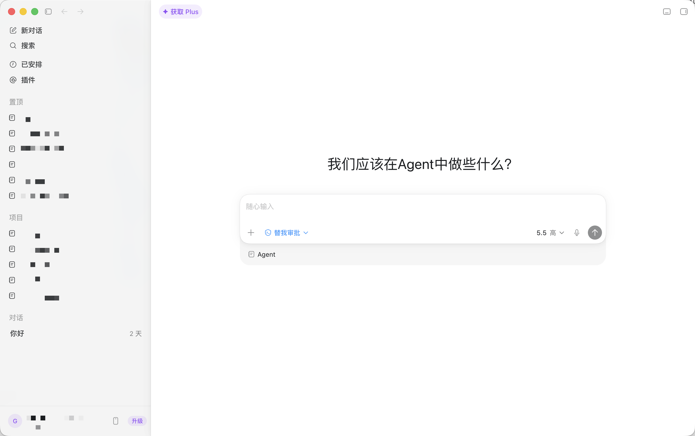
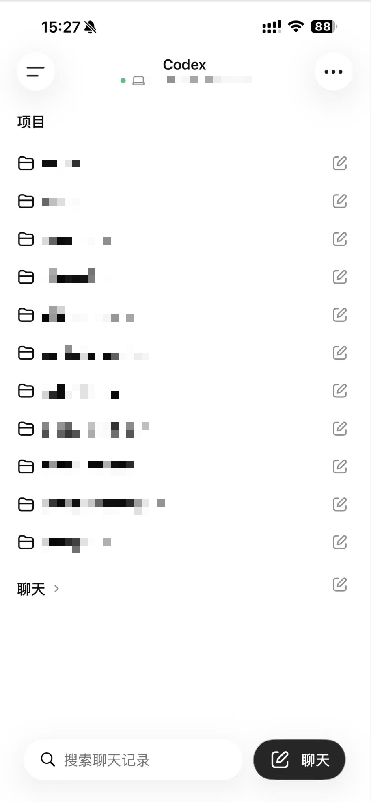
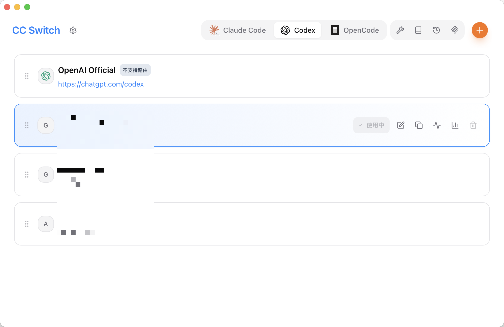
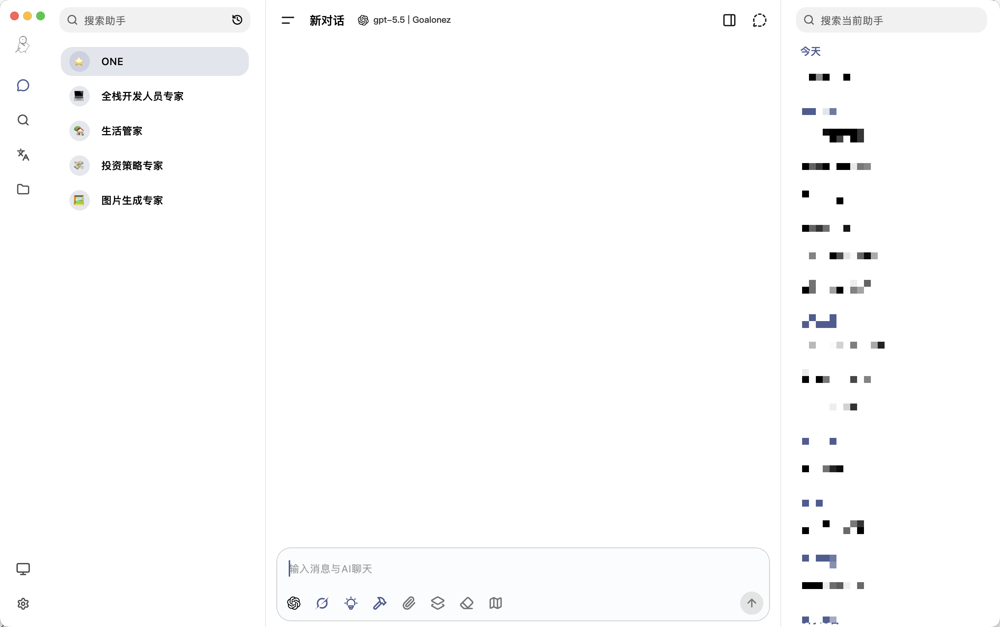
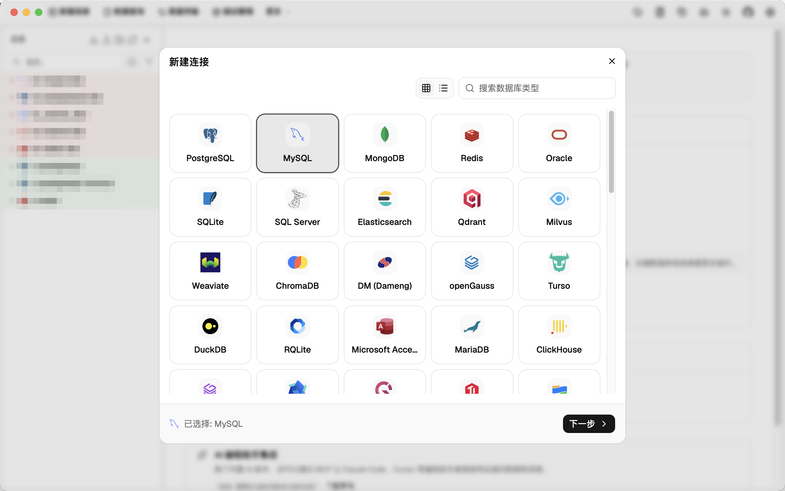
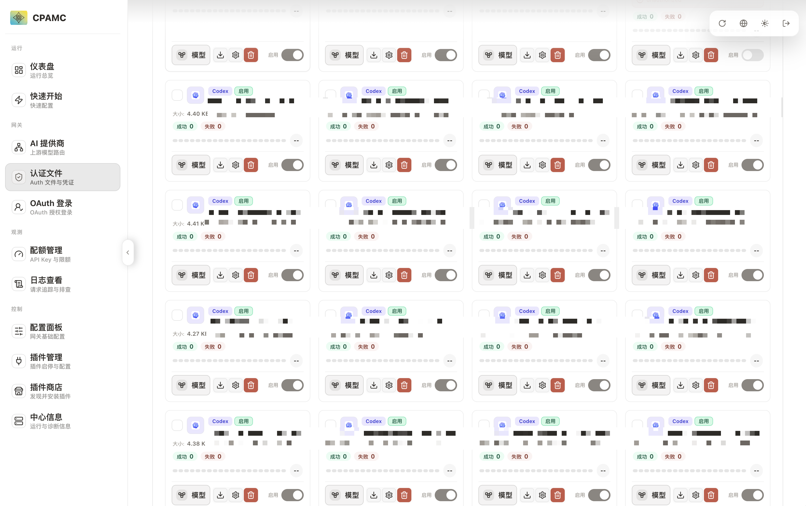
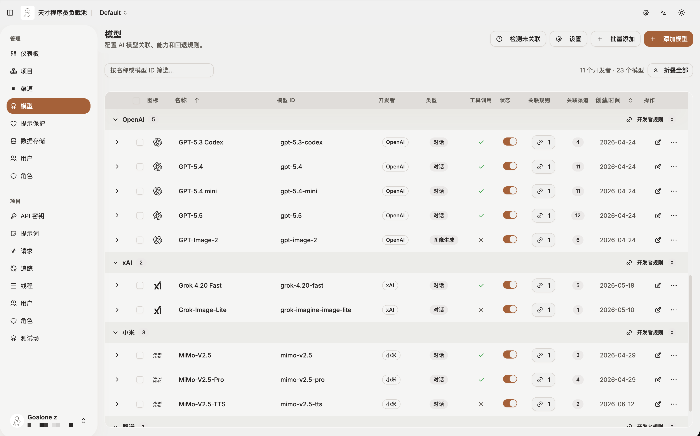
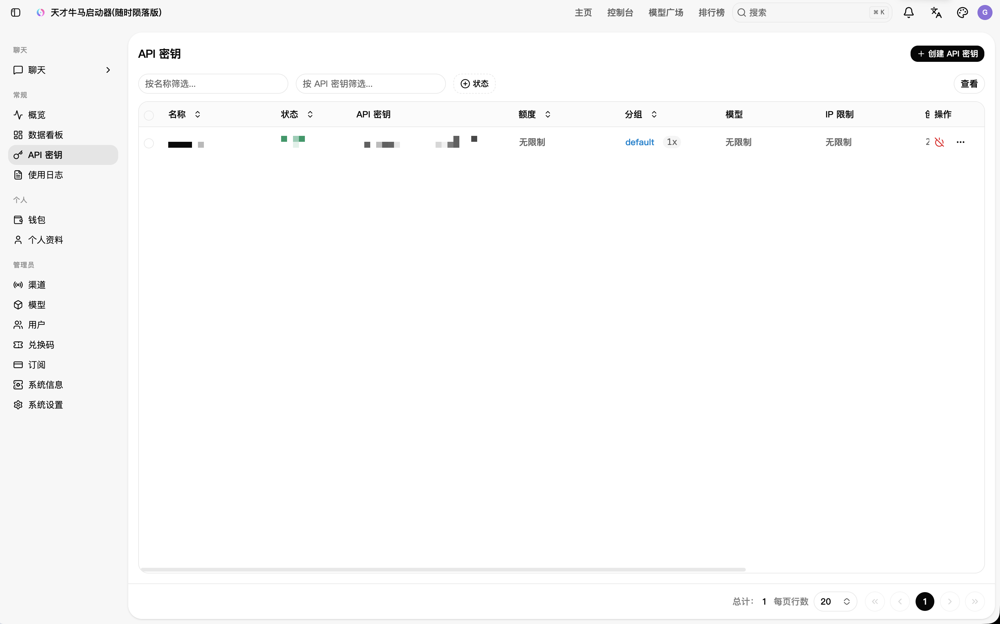

# 记录一下目前用到的AI生态

## CLI
### Pi
- 只提供一个精简的agent底座，可以根据自己的需求来进行各种扩展，就非常有意思，喜欢折腾的推荐尝试
- [What I learned building an opinionated and minimal coding agent](https://mariozechner.at/posts/2025-11-30-pi-coding-agent/)
### Claude Code
- 体验最好，三方生态适配度和优先级都感觉高一些
### Codex
- CLI用得比较少，感觉细节上比较粗糙，一般codex就直接用客户端了，起码切换会话方便，可视化也舒服点
### OpenCode
- 切换模型方便
- 不过现在一般只拿来处理非coding场景
- 
## 客户端
### Codex App
- 目前通过官方授权登录 + 接入自己的api使用
    - 这样既能使用插件生态、远程控制等功能，也能使用自己的号池或者接入其他模型


### ChatGPT
- 主要是用iOS端，通过移动端远程控制codex

### [CC Switch](https://github.com/farion1231/cc-switch)
- 快速切换配置
- 统一管理多个agent的mcp、skills、全局提示词、会话记录
- 其他选择
    - [AI Toolbox](https://github.com/coulsontl/ai-toolbox)

### [Kelivo](https://github.com/Chevey339/kelivo)
- 纯聊天客户端
- 支持mcp，例如可以把滴答清单mcp接入来编排TODO List
- 搜索引擎支持接入grok或者自己部署的[SearXNG](./NAS-DockerCompose分享.html#searxng)
- 目前没有找到一个完美支持多端同步的客户端
- 其他选择
    - [Cherry Studio](https://github.com/CherryHQ/cherry-studio)
    - [LobeHub](https://github.com/lobehub/lobehub)
    - [Open WebUI](https://github.com/open-webui/open-webui)
    - [HaloWebUI](https://github.com/ztx888/HaloWebUI)
    - [DEEIX](https://github.com/DEEIX-AI/DEEIX-Chat)

### [DBX](https://github.com/t8y2/dbx)
- 支持[mcp](https://github.com/t8y2/dbx/blob/main/packages/mcp-server/README.md#%E4%B8%AD%E6%96%87%E8%AF%B4%E6%98%8E)和[cli](https://github.com/t8y2/dbx/blob/main/packages/cli/README.md)的方案接入到agent，可以让agent直接去稳定查询数据库
- 其实客户端大部分时候还是用的DataGrip，主要是看中他支持cli的形式接入agent，并且主流库不需要打开客户端直接支持接入
- 目前官方还没出skills,所以自己根据官方文档让agent生成了一份：[dbx-readonly-cli](https://github.com/Goalonez/dbx-readonly-cli)
- 其他选择
    - [universal-db-mcp](https://github.com/Anarkh-Lee/universal-db-mcp)



## 服务

> 对应docker compose可以从[NAS-DockerCompose分享](./NAS-DockerCompose分享.html)页面获取

### [CLIProxyAPI](https://github.com/router-for-me/CLIProxyAPI)
- 自用的号池反代


### [Axonhub](https://github.com/looplj/axonhub)
- 自用的AI渠道聚合网关
- 省去本地配置改来改去的麻烦，可以把各种渠道的api都聚合起来统一出口，也能查看具体的请求记录
- CLIProxyAPI不直接对外提供api，通过Axonhub统一分发

### [New API](https://github.com/QuantumNous/new-api)
- 主要用于对外分发api给朋友
    - 将Axonhub里的渠道接入New API来统一分发
- 其他选择
    - [sub2api](https://github.com/Wei-Shaw/sub2api)

### [Hermes](https://github.com/NousResearch/hermes-agent)
- 私人agent
- 目前接入deepseek-v4-flash也不错，性价比高，虽然实际效果不如gpt
- 感觉任务执行其实不如openclaw，但是相对来说稳定点，以前用openclaw最大的感触就是更新完版本就崩，然后浪费token修bug
- 可以跑个docker[KasmVNC](https://github.com/kasmtech/KasmVNC)用CDP协议给hermes接入


## MCP
### [滴答清单mcp](https://help.dida365.com/articles/7438132116019216384)
- 让Kelivo直接操作滴答清单
### ~~[chrome-devtools-mcp](https://github.com/ChromeDevTools/chrome-devtools-mcp)~~
- 控制浏览器
### ~~[universal-db-mcp](https://github.com/Anarkh-Lee/universal-db-mcp)~~
- 接入各种类型的数据库

## Skills
### [docx](https://github.com/anthropics/skills)
- 处理word
### [pdf](https://github.com/anthropics/skills)
- 处理pdf
### [pptx](https://github.com/anthropics/skills)
- 处理ppt
### [xlsx](https://github.com/anthropics/skills)
- 处理excel
### [skill-creator](https://github.com/anthropics/skills)
- 创建skills(codex自带了)
### [karpathy-guidelines](https://github.com/forrestchang/andrej-karpathy-skills)
- 编码规范
### [dbx-readonly-cli](https://github.com/Goalonez/dbx-readonly-cli)
- 搭配DBX的CLI使用，默认只读数据库
### [defuddle](https://github.com/kepano/obsidian-skills)
- 用于Obsidian
### [json-canvas](https://github.com/kepano/obsidian-skills)
- 用于Obsidian
### [obsidian-bases](https://github.com/kepano/obsidian-skills)
- 用于Obsidian
### [obsidian-cli](https://github.com/kepano/obsidian-skills)
- 用于Obsidian
### [obsidian-markdown](https://github.com/kepano/obsidian-skills)
- 用于Obsidian
### [grill-me](https://github.com/mattpocock/skills)
- 进行采访式问答进行需求明确
- trellis已经集成
### [playwright-cli](https://github.com/microsoft/playwright-cli)
- 控制浏览器，搭配Playwright CLI使用
### ~~[frontend-dev](https://github.com/MiniMax-AI/skills)~~
- 前端
### ~~[ui-ux-pro-max](https://github.com/nextlevelbuilder/ui-ux-pro-max-skill)~~
- 前端
### [taste-skill]([GitHub - Leonxlnx/taste-skill: Taste-Skill - gives your AI good taste. stops the AI from generating boring, generic slop · GitHub](https://github.com/Leonxlnx/taste-skill)
- 前端
### [find-docs](https://github.com/upstash/context7)
- 搭配context7的CLI使用

## Pi插件
- [packages](https://pi.dev/packages)
### @amaster.ai/pi-image-gen
- 生图工具
### @ayulab/pi-rewind
- 回撤消息
### @ff-labs/pi-fff
- 替代内置的grep和find
### pi-btw
- 侧边对话
### pi-codex-goal
- 类似codex的goal
### pi-nano-context
- 一个UI的增强插件，显示各种上下文占用情况
### pi-observational-memory
- 长会话防偏移
### pi-tool-display
- 美化
### pi-web-access
- 网络搜索
### pi-webdav-sync
- 配置webdav备份
### @gotgenes/pi-permission-system
- 权限控制

## 全局提示词
```
# AGENTS.md

适用于 Claude Code、Codex、OpenCode、Pi 等编码代理。

本文件定义全局个人偏好、安全边界和输出习惯；项目级流程由项目内规则（如 `.trellis/`）定义。

---

## 1. 环境与工具

- **环境管理**：使用 `mise`。当前目录版本用 `mise list`，全局默认版本用 `mise list -g`。
- **Python**：优先使用 `uv` 管理虚拟环境和依赖。
- **Trellis**：若存在 `.trellis/`，且不违反安全边界、不冲突于用户本轮目标，优先遵循 Trellis；更靠近当前目录的项目规则优先。
- **可用工具**：
  - 数据库：`dbx skills` + `dbx-app CLI`。
  - 官方文档：`find-docs skills` + `ctx7 CLI`。
  - 浏览器操作：`playwright skills` + `playwright/cli CLI`。

---

## 2. 规则优先级

从高到低执行；项目规则可补充细节，但不得覆盖安全边界：

1. 高风险操作确认与安全边界。
2. 用户本轮明确指令（不得违反安全边界）。
3. 当前项目规则和工程化流程（如 Trellis）。
4. 本全局 `AGENTS.md`。
5. 默认代理行为。

---

## 3. 默认可执行行为（免确认）

仅限低风险、局部、可回滚、不影响真实环境的操作：

- 读取、搜索、分析文件。
- 当前任务范围内的小到中等代码修改。
- 运行测试、Lint、类型检查。
- 运行构建；若构建会安装依赖、生成大量文件、调用外部服务或执行部署脚本，必须先确认。
- 只读 Git 操作：`git status` / `git diff` / `git log` 等。

---

## 4. 高风险操作（必须先确认）

涉及以下场景时禁止直接执行；只能输出方案或命令给用户确认，并说明：做什么、影响范围、主要风险、是否可回滚。

- **文件破坏**：删除文件/目录，或覆盖用户未说明的改动。
- **环境变更**：修改环境变量、系统配置、权限、Git Hooks。
- **依赖变更**：新增/升级核心依赖，全局安装/卸载依赖。
- **危险 Git 操作**：`git push` / `git reset --hard` / `git rebase` 及任何强制覆盖。
- **数据库**：默认只允许安全读取；写入、删除、DDL、批量修改真实数据等操作，仅输出 SQL、迁移方案或执行步骤，禁止直接执行。
- **外部环境**：调用生产环境、真实账号、付费服务，或会产生真实副作用的外部 API。

---

## 5. 编码与决策原则

优先级：**正确性 > 安全性 > 可验证性 > 可维护性 > 一致性 > 效率 > 表达**。

- **先读后写**：修改文件前必须读取目标文件当前内容，并搜索确认相关调用、类型、配置或既有模式；禁止凭空假设文件、接口或行为。
- **保护用户改动**：涉及代码变更前检查相关文件是否有未提交或非本轮产生的改动；不得覆盖用户已有改动。
- **最小改动**：保持现有实现 > 局部修改 > 新增抽象 > 重构 > 重新设计；禁止顺手大改、无关重构、为“完整性”扩展范围。
- **优先复用**：优先复用项目已有实现、工具类和设计模式。
- **防死循环**：修复同一 Bug 或测试连续 3 次失败后停止，报告错误规律并请求人工介入。
- **需求纠偏**：若用户前提、归因或方案明显不合理，直接指出并给出替代建议。

---

## 6. 验证、完成与停止

按任务相关性选择最小必要验证：**相关测试 > 类型检查 > Lint > 构建 > 局部运行/手动验证**。

- 涉及代码、配置或命令执行结果时，没验证就不说“已完成”。
- 验证不完整时，说明已验证什么、未验证什么、剩余风险。
- 完成标准：满足用户核心目标，改动最小化，必要验证已执行或明确无法验证。
- 工具停止条件：证据足以回答或实施时停止继续搜索、读取或分析；不要为措辞、额外示例或非必要背景继续调用工具。
- 除非用户明确要求或任务刚需，禁止主动拉起浏览器、GUI 或外部服务。

---

## 7. 输出与沟通

- 默认简体中文；代码、路径、命令、标识符保持原样。
- 先给原因，再给结论；分析类任务默认按 `原因 -> 结论 -> 建议` 输出。
- 不套话、不谄媚、不虚假确认；未验证事项明确说明“未经测试”。
- 多步骤或耗时任务只做简短进度反馈，不叙述工具流水账。
- 分析、评审、比较、方案设计类任务默认只输出文本，除非用户明确要求执行。
- 最终回答只说明结果、验证、风险和必要下一步；不展开内部推理或无关过程。

```

## AI编码工程化框架
### [Trellis](https://github.com/mindfold-ai/Trellis)
- 基础用法
    - trellis init初始化一下项目
    - 默认会生成一个00-bootstrap-guidelines任务，直接跟agent说完成这个任务，会默认生成好基础规范
    - 开发新需求就是用trellis-brainstorm规划一下，落地prd（或者自然语言也行，会自动触发，小需求会自动跳过，不会出现改点小问题都完整跑一遍流程的情况）
    - 任务完成后用trellis-finish-work收尾一下任务状态（或者自然语言也行，会自动触发）
- 其他也用了一些，目前还是比较喜欢这个，对团队共享来说也比较友好

## 建议
>在选择工具时，最好优先考虑用户量大的产品。AI 正在极速迭代，很多产品初期可能更新频繁，也有不少亮点和创新；但长期来看，相比用户体量更大的产品，它们可能更难跟上整体生态节奏。

<PostComments/>