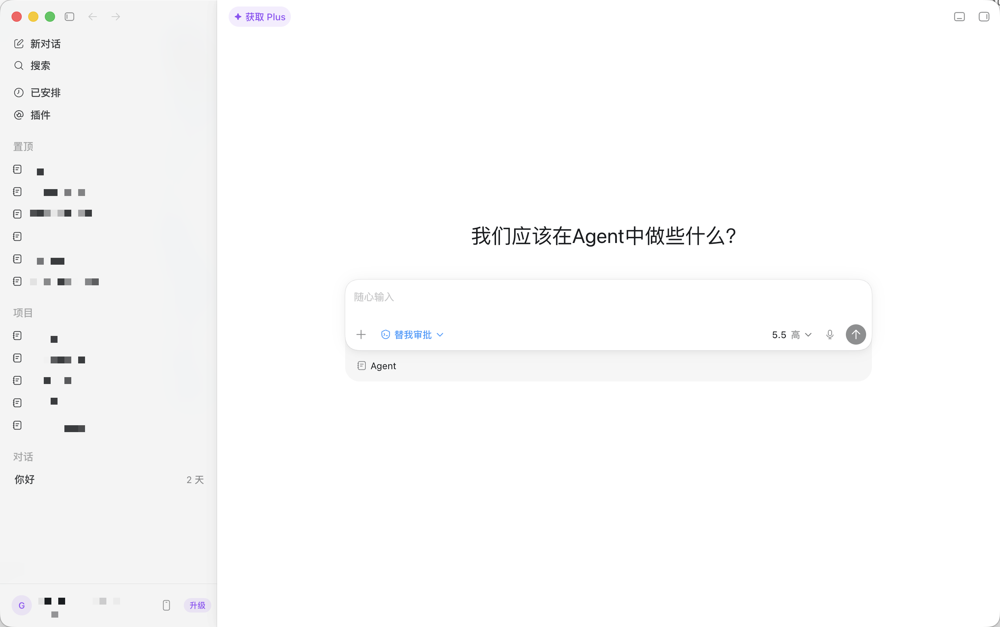
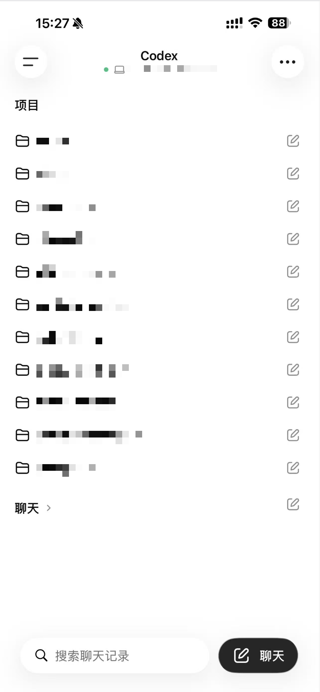
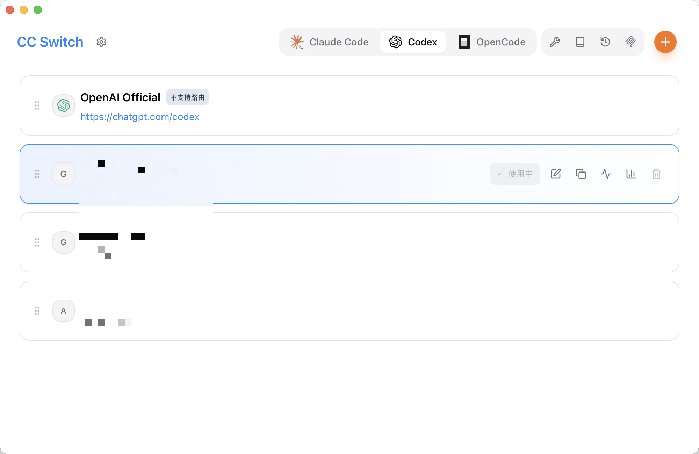
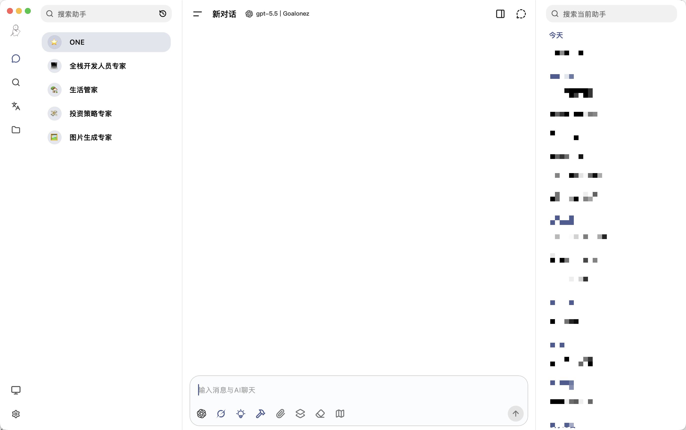
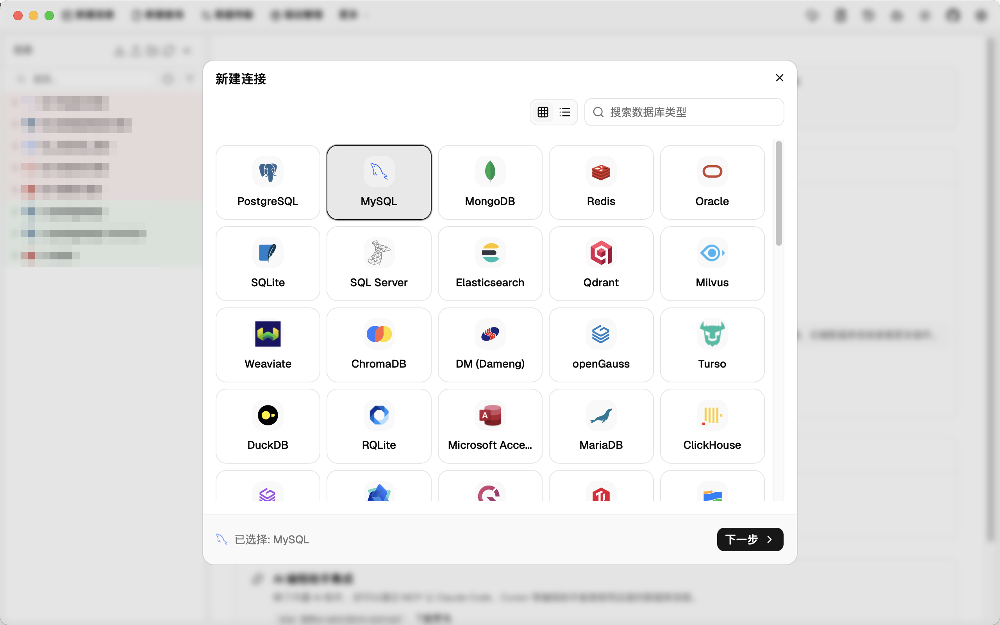
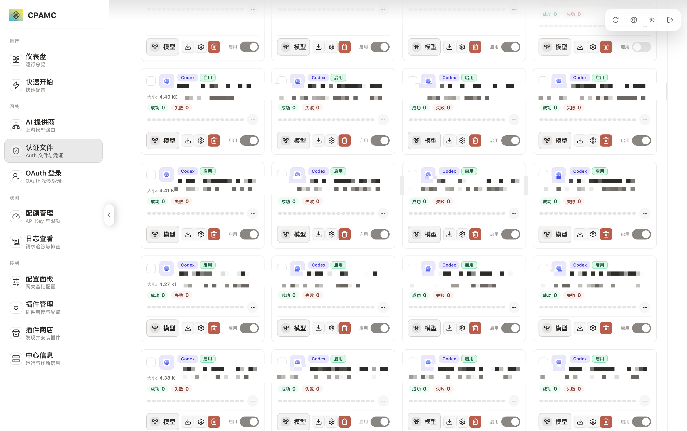
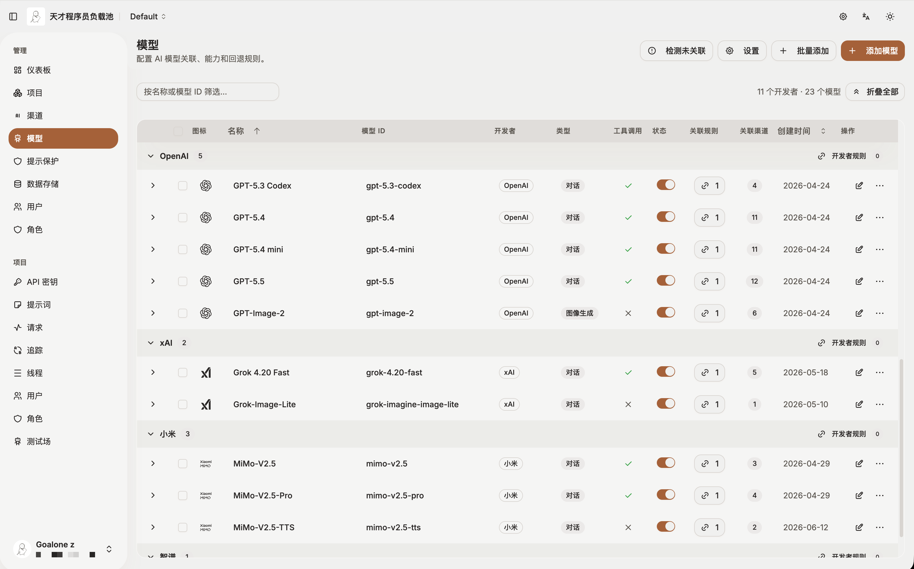
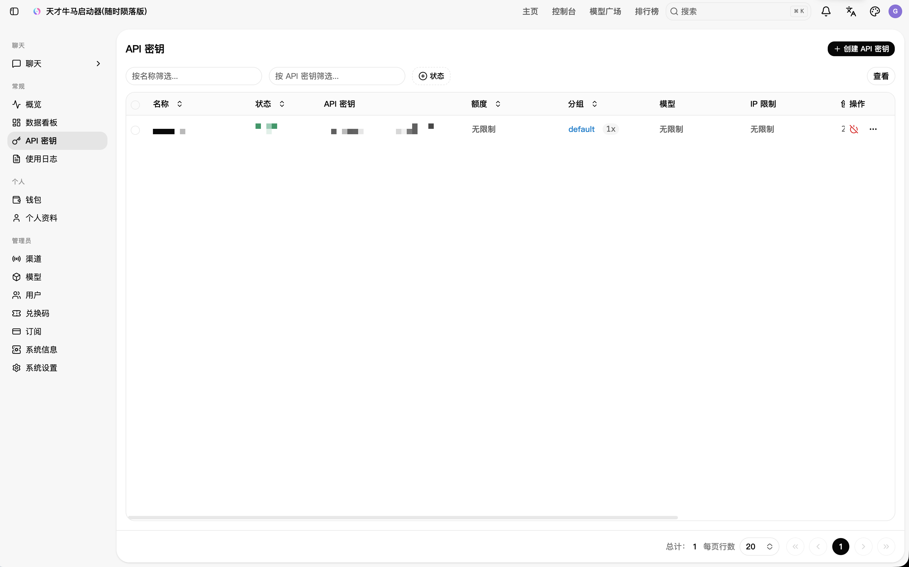

# 记录一下目前用到的AI生态

## CLI
### Pi
- 只提供一个精简的agent底座，可以根据自己的需求来进行各种扩展，就非常有意思，喜欢折腾的推荐尝试
- [What I learned building an opinionated and minimal coding agent](https://mariozechner.at/posts/2025-11-30-pi-coding-agent/)
### Claude Code
- 体验最好，三方生态适配度和优先级都感觉高一些
- 不过鉴于A➗的一些骚操作，自己抉择吧
### Codex
- CLI用得比较少，感觉细节上比较粗糙，一般codex就直接用客户端了，起码切换会话方便，可视化也舒服点
- 感觉配置做得很糙
### OpenCode
- 切换模型方便点
- 被Pi替换了

## 客户端
### Codex App
- 目前已合并成ChatGPT客户端
- 目前通过官方授权登录 + 接入自己的api使用
    - 这样既能使用插件生态、远程控制等功能，也能使用自己的号池或者接入其他模型


### ChatGPT
- 主要是用iOS端，通过移动端远程控制codex

### [CC Switch](https://github.com/farion1231/cc-switch)
- 快速切换配置
- 统一管理多个agent的mcp、skills、全局提示词、会话记录
- 其他选择
    - [AI Toolbox](https://github.com/coulsontl/ai-toolbox)

### [Kelivo](https://github.com/Chevey339/kelivo)
- 纯聊天客户端
- 支持mcp，例如可以把滴答清单mcp接入来编排TODO List
- 搜索引擎支持接入grok或者自己部署的[SearXNG](./NAS-DockerCompose分享.html#searxng)
- 目前没有找到一个完美支持多端同步的客户端
- 其他选择
    - [Cherry Studio](https://github.com/CherryHQ/cherry-studio)
    - [LobeHub](https://github.com/lobehub/lobehub)
    - [Open WebUI](https://github.com/open-webui/open-webui)
    - [HaloWebUI](https://github.com/ztx888/HaloWebUI)
    - [DEEIX](https://github.com/DEEIX-AI/DEEIX-Chat)

### [DBX](https://github.com/t8y2/dbx)
- 支持[mcp](https://github.com/t8y2/dbx/blob/main/packages/mcp-server/README.md#%E4%B8%AD%E6%96%87%E8%AF%B4%E6%98%8E)和[cli](https://github.com/t8y2/dbx/blob/main/packages/cli/README.md)的方案接入到agent，可以让agent直接去稳定查询数据库
- 其实客户端大部分时候还是用的DataGrip，主要是看中他支持cli的形式接入agent，并且主流库不需要打开客户端直接支持接入
- 目前官方还没出skills,所以自己根据官方文档让agent生成了一份：[dbx-readonly-cli](https://github.com/Goalonez/dbx-readonly-cli)
- 其他选择
    - [universal-db-mcp](https://github.com/Anarkh-Lee/universal-db-mcp)



## 服务

> 对应docker compose可以从[NAS-DockerCompose分享](./NAS-DockerCompose分享.html)页面获取

### [CLIProxyAPI](https://github.com/router-for-me/CLIProxyAPI)
- 自用的号池反代


### [Axonhub](https://github.com/looplj/axonhub)
- 自用的AI渠道聚合网关
- 省去本地配置改来改去的麻烦，可以把各种渠道的api都聚合起来统一出口，也能查看具体的请求记录
- CLIProxyAPI不直接对外提供api，通过Axonhub统一分发

### [New API](https://github.com/QuantumNous/new-api)
- 主要用于对外分发api给朋友
    - 将Axonhub里的渠道接入New API来统一分发
- 其他选择
    - [sub2api](https://github.com/Wei-Shaw/sub2api)

### [Hermes](https://github.com/NousResearch/hermes-agent)
- 私人agent
- 目前接入deepseek-v4-flash也不错，性价比高，虽然实际效果不如gpt
- 感觉任务执行其实不如openclaw，但是相对来说稳定点，以前用openclaw最大的感触就是更新完版本就崩，然后浪费token修bug
- 可以跑个docker[KasmVNC](https://github.com/kasmtech/KasmVNC)用CDP协议给hermes接入


## MCP
### [滴答清单mcp](https://help.dida365.com/articles/7438132116019216384)
- ~~让Kelivo直接操作滴答清单~~
- 接到hermes
### ~~[chrome-devtools-mcp](https://github.com/ChromeDevTools/chrome-devtools-mcp)~~
- 控制浏览器
### ~~[universal-db-mcp](https://github.com/Anarkh-Lee/universal-db-mcp)~~
- 接入各种类型的数据库

## Skills
### [zyes](https://github.com/Goalonez/zyes)
- 自己结合mattpocock skills、trellis定制的精简版Skills工作流
### [skill-creator](https://github.com/anthropics/skills)
- 创建skills(codex自带了)
### [find-docs](https://github.com/upstash/context7)
- 搭配context7的CLI使用
### [playwright-cli](https://github.com/microsoft/playwright-cli)
- 控制浏览器，搭配Playwright CLI使用
### [dbx-readonly-cli](https://github.com/Goalonez/dbx-readonly-cli)
- 搭配DBX的CLI使用，默认只读数据库
### [OfficeCLI](https://github.com/iOfficeAI/OfficeCLI)
- 处理Office
### [Obsidian Skills](https://github.com/kepano/obsidian-skills)
- 操控Obsidian CLI
### ~~[karpathy-guidelines](https://github.com/forrestchang/andrej-karpathy-skills)~~
- 编码规范
- 精简到全局AGENTS.md了
### ~~[docx](https://github.com/anthropics/skills)~~
- 处理word
### ~~[pdf](https://github.com/anthropics/skills)~~
- 处理pdf
### ~~[pptx](https://github.com/anthropics/skills)~~
- 处理ppt
### ~~[xlsx](https://github.com/anthropics/skills)~~
- 处理excel
### ~~[grill-me](https://github.com/mattpocock/skills)~~
- 进行采访式问答进行需求明确
- trellis已经集成
- zyes也集成了
### ~~[frontend-dev](https://github.com/MiniMax-AI/skills)~~
- 前端
### ~~[ui-ux-pro-max](https://github.com/nextlevelbuilder/ui-ux-pro-max-skill)~~
- 前端
### ~~[taste-skill](https://github.com/Leonxlnx/taste-skill)~~
- 前端

## Pi插件

>[插件仓库](https://pi.dev/packages)
### @gotgenes/pi-subagents
- 子代理
### @amaster.ai/pi-image-gen
- 生图工具
### pi-workspace-history
- 回撤消息及改动的文件
### pi-wtf
- 终止当前消息，会自动触发`pi-workspace-history`回退改动
### @ff-labs/pi-fff
- 替代内置的 `grep` 和 `find`
### pi-btw
- 侧边对话
### pi-codex-goal
- 类似codex的`goal`
### pi-nano-context
- 一个UI的增强插件，显示各种上下文占用情况
### pi-observational-memory
- 长会话防偏移
### pi-web-access
- 网络搜索
### pi-webdav-sync
- 配置`webdav`备份
### @gotgenes/pi-permission-system
- 权限控制
### @juicesharp/rpiv-todo
- 增加一个todo视图
### @llblab/pi-telegram
- 接入`telegram`进行远程控制
### pi-tool-display
- opencode风格美化
- 跟`pi-hashline-edit-pro`冲突
### pi-markdown-preview
- markdown预览
### ~~pi-hashline-edit-pro~~
- 把内置的 `read` 和 `edit` 替换成哈希版
- pi-tool-display
## 全局提示词

- 模型越来越强，大部分能力都可以交还给模型，感觉不需要定义太多边界了

```
# AGENTS.md

适用于 Claude Code、Codex、OpenCode、Pi 等编码代理。本文件定义全局环境、个人偏好和安全边界；项目级规则负责具体工程流程，但不得放宽安全边界。

## 语言

- 默认简体中文；代码、路径、命令、标识符保持原样。包括输出需要落地的文档也请使用简体中文。

## 环境与工具

- **环境管理**：使用 `mise`。当前目录版本用 `mise list`，全局默认版本用 `mise list -g`。只有pnpm由corepack管理。
- **Python**：优先使用 `uv` 管理虚拟环境和依赖。
- **可用工具**：
  - 数据库：`dbx skills` + `dbx-app CLI`
  - 官方文档：`find-docs skills` + `ctx7 CLI`
  - 浏览器：`playwright skills` + `playwright CLI`
  - Office：`officecli skills` + `officecli CLI`
- **所需工具未安装时，不要自行全局安装，先询问用户**

## 安全边界

涉及以下场景时禁止直接执行；只能输出方案或命令给用户确认，并说明：做什么、影响范围、主要风险、是否可回滚。

- **文件破坏**：删除文件/目录，或覆盖用户未说明的改动。
- **环境变更**：修改环境变量、系统配置、权限、Git Hooks。
- **依赖变更**：新增/升级核心依赖，全局安装/卸载依赖。
- **危险 Git 操作**：`git push` / `git reset --hard` / `git rebase` 及任何强制覆盖。
- **数据库**：默认只允许安全读取；写入、删除、DDL、批量修改真实数据等操作，仅输出 SQL、迁移方案或执行步骤，禁止直接执行。
- **外部环境**：调用生产环境、真实账号、付费服务，或会产生真实副作用的外部 API。

```

## AI编码工程化框架
### [zyes](https://github.com/Goalonez/zyes)
- 自己结合mattpocock skills、trellis定制的精简版Skills工作流
### ~~[Trellis](https://github.com/mindfold-ai/Trellis)~~
- 基础用法
    - trellis init初始化一下项目
    - 默认会生成一个00-bootstrap-guidelines任务，直接跟agent说完成这个任务，会默认生成好基础规范
    - 开发新需求就是用trellis-brainstorm规划一下，落地prd（或者自然语言也行，会自动触发，小需求会自动跳过，不会出现改点小问题都完整跑一遍流程的情况）
    - 任务完成后用trellis-finish-work收尾一下任务状态（或者自然语言也行，会自动触发）
- 对团队共享来说也比较友好

## 建议
>在选择工具时，最好优先考虑用户量大的产品。AI 正在极速迭代，很多产品初期可能更新频繁，也有不少亮点和创新；但长期来看，相比用户体量更大的产品，它们可能更难跟上整体生态节奏。

<PostComments/>