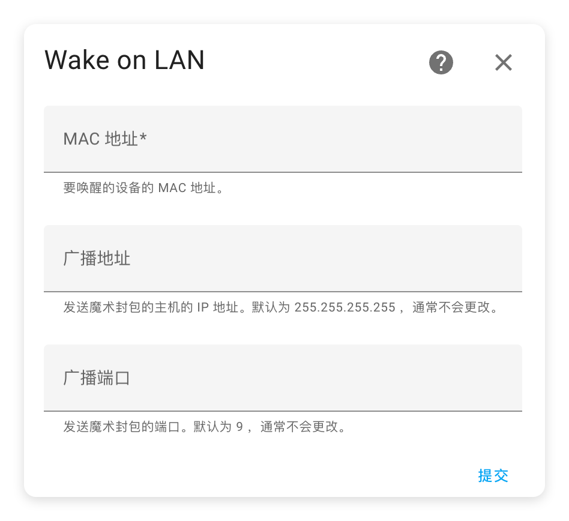
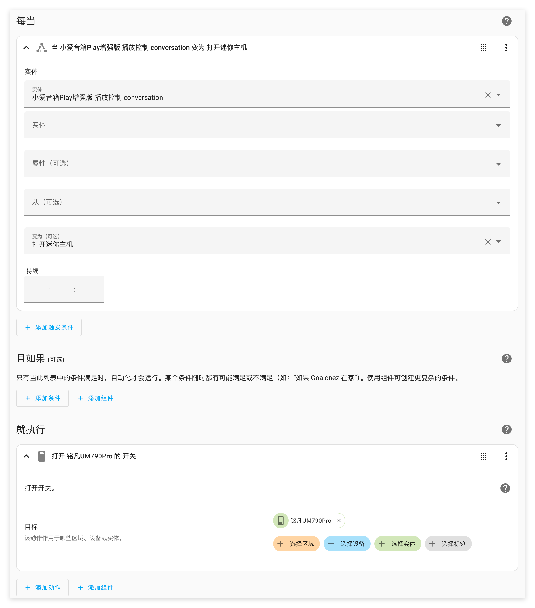
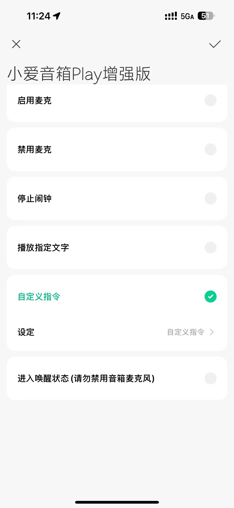

# 通过HomeAssistant控制电脑开关机并接入米家

## 安装HomeAssistant
参考[Docker Compose](./NAS-DockerCompose分享.html#home-assistant)

## Windows打开网络唤醒
- BIOS设置需要自行搜索各品牌方案
- 系统设备管理系中的网络适配器
    - 允许此设备唤醒计算机
    - 只允许幻数据包唤醒计算机（避免被误唤醒）

## 通过Wake on LAN实现开机
- HomeAssistant左下角“设置”-右下角“添加集成”-搜索“Wake on LAN”
- windows-网络-属性-找到“物理地址MAC地址”-填写到HA中
 

## 通过ssh的方式实现关机
### Windows
- 设置-搜索`可选功能`-找到`OpenSSH服务器`-添加
- `WIN+R`输入`services.msc`找到`OpenSSH SSH Server`,打开并设置成自动
- 控制面板-Windows Defender 防火墙-允许应用通过 Windows Defender 防火墙进行通信把`OpenSSH SSH Server`的`公用`勾上

### HomeAssistant
- 如果是docker版HA，最好映射一下ssh目录`/HomeAssistant/ssh:/root/.ssh`，把密钥保存下来，否则以后重构容器就丢了
- 进入容器
- 生成密钥`ssh-keygen -t ed25519 -f ~/.ssh/id_ed25519_pc`
- 将.pub的公钥内容复制出来，创建一个`administrators_authorized_keys`的文件，把内容复制进去，丢到Windows上的`C:\ProgramData\ssh\`目录下面
- 试一下`ssh -i ~/.ssh/id_ed25519_pc 用户名@ip`看看连不连得上
- 在HA的config目录下找到`configuration.yaml`，添加以下配置

```yaml

switch:
  - platform: wake_on_lan
    name: "" # HA实体名称，随便取一个
    mac: "" # 电脑的MAC地址
    host: "192.168.1.100" # 电脑的局域网ip
    broadcast_address: "192.168.1.255" # 广播地址
    broadcast_port: 9 # wol端口
    turn_off:
      action: shell_command.turn_off_connect
      
shell_command:
  turn_off_connect: 'ssh -o UserKnownHostsFile=/dev/null -o StrictHostKeyChecking=no -i ~/.ssh/id_ed25519_pc 用户名@电脑ip shutdown /s /t 10 /c "你的电脑将在10秒后关机"'
  
```

- 进入HA的Web控制台-开发者工具-配置检查与重启-检查配置-重新启动
- 这时候应该就可以尝试在HA中对电脑进行开关机了

## 接入米家
### HomeAssistant
- 在HACS中安装`xiaomi miot auto`，因为官方的xiaomi home没法获取小爱音箱的文本内容
- HA-设置-自动化与场景-创建自动化
- 以下是开机示例（关机反之）

### 米家
- 创建一个手动控制
- 选择小爱音箱
- 自定义指令
- 设置成上面HA自动化中设置的文本内容





## 参考链接
- [让小爱同学远程开电脑——米家联动HA零成本触发WOL](https://post.smzdm.com/p/arr6q49x/)
- [HomeAssistant 控制pc开关机（无需硬件和下载第三方软件）wol - 哔哩哔哩](https://www.bilibili.com/opus/921208379781677111?jump_opus=1)
- [小爱同学通过homeassistant控制win电脑开关机\_小爱同学控制电脑开关机-CSDN博客](https://blog.csdn.net/qqqq2531/article/details/141351962)

<gitalk/>