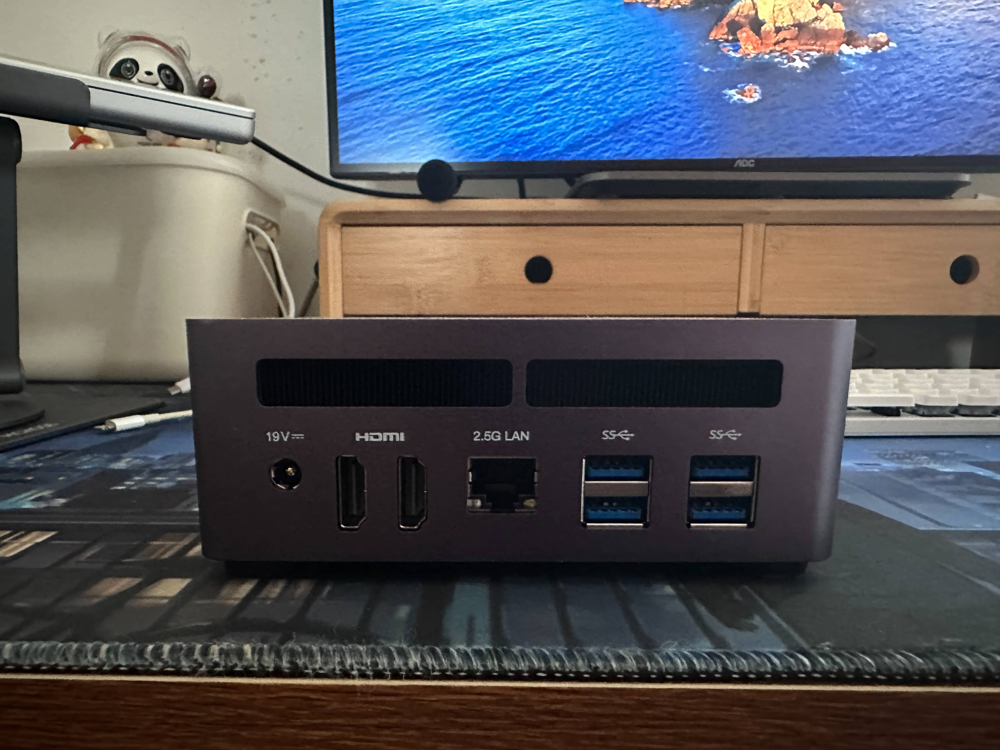
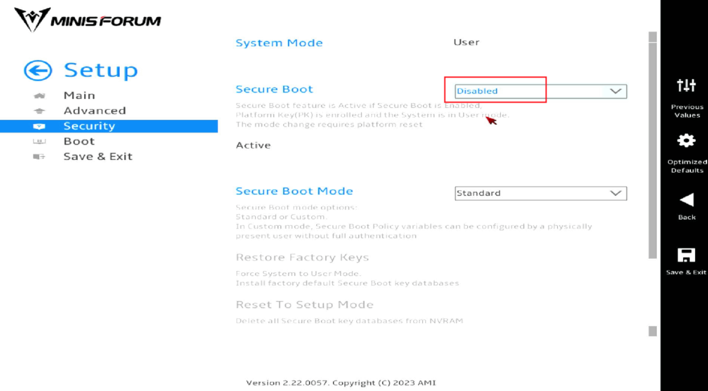
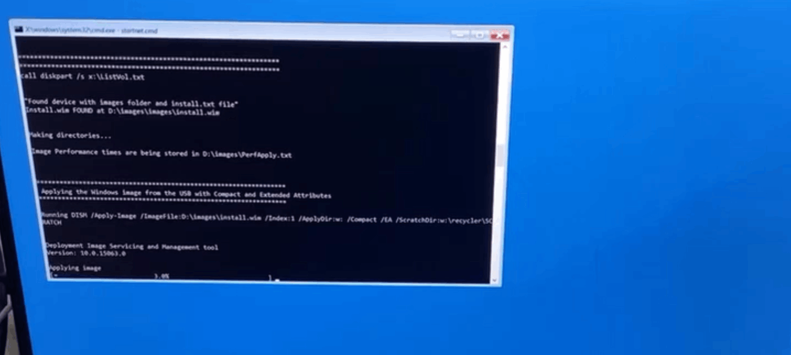

# 铭凡UM790 Pro体验

## 选型

由于之前的台式机坏了，于是在经过一顿搜索之后，最终决定购入`铭凡UM790 Pro`。

- 首先想到了之前出的`小米mini主机`，基于NUC的换壳机型。颜值相对高一点，电池也小一些。
- 平时在V2EX上看到过`零刻`的相关帖子，于是去搜索了一下做了对比，感觉部件的性价比更高一些。但是看了相关消息，感觉散热不太行，虽然最多也就跑跑LOL大乱斗。
- 后来又发现了`铭凡`这个牌子，据说散热做得相对好一些，于是在各种型号的对比下，最终下单了`铭凡UM790 Pro`。后续有货的`铭凡UM780`看上去性价比似乎更高一些，不过已经购入也就不纠结那么多了。

## 下单

- 京东购入
- 准系统版（自己买内存条 + 硬盘），价格3049
- Mini主机收货大概等了7天，比官方预计发货时间早了2天
- 内存条英睿达5600 16G*2套装（当时机器已经发货，也没法等好价了，就直接买了，后续保价了20，最终579购入😮‍💨）
- 硬盘还是用的台式机拆下来的三星970evo 256G（个人硬盘需求不高，一般资料都放在云上）

## 外观

- 大小还是比较满意的，可以跟旁边GPW鼠标参照一下
- 质感也还不错
- 前后插口我需求不高，暂时够用
- 目前我的3.5音频口是用了一分二，插了麦克风和音响，在前面有点突兀，不过影响也不大
- 电源大小也还行，我没有移动需求，大小就比较无感

## 开始装机

### 配件

- mini主机（准系统版）
- 电源
- 散热片
- 系统U盘

### 硬件安装

- 内存条
- 硬盘

> 视频教程地址：[Minisforum UM790PRO 拆机](https://www.bilibili.com/video/BV1su411578T/?share_source=copy_web&vd_source=62c54cc8c645edce8ba244679179541f)

### 系统安装

刚开始想安装Windows10，个人不太喜欢Windows11，感觉整体流畅度不高，尤其是资源管理器和设置界面。

询问客服说安装Windows10会导致USB口失效。

最终还是安装了自带U盘里的Windows11，由于官方自带的系统已经安装了驱动，所以后续也算省事，不需要再去官网下载驱动了。

### 开启性能模式（可选）

> 官方教程地址：[UM790PRO 如何在BIOS 中开启性能模式？](https://www.minisforum.com/new/support#/support/faq/8)

### 增加VRAM（可选）

> 官方教程地址：[UM790PRO 如何在windows 上增加VRAM](https://www.minisforum.com/new/support#/support/faq/19)

### 开启虚拟化（可选）

> 官方教程地址：[UM790- How to Enable Virtualization （如何开启虚拟化）](https://www.minisforum.com/new/support#/support/faq/23)

### 正式开始安装Windows11

- 以下内容摘自官网教程

#### 关闭安全启动

- 进入Bios 关闭安全启动 （切记： 一定要关闭安全启动，否则使用官方镜像安装系统U盘引导时会蓝屏报错）
- 开机时按Delete 进入Bios
- 关闭安全启动步骤：选择Setup----Security----secure Boot将Enabled 改成Disabled 按键盘F4回车保存

`（如果出现灰色，无法修改的情况，请您重新启动，再次按Delete 进入BIOS 修改）`

#### U盘启动

- 开机按键盘的F7 进入快速启动菜单
- 选择U盘启动自动安装windows 系统。
- 安装进度到100%侯自动关机重启 完成安装windows

## 顺利点亮

- 整个安装过程比想象轻松，基本没什么坑。
- 拆机的时候，4个脚垫还是挺难掰的。
- `注意里面的排线要放好，小心蹭到风扇。`

## 使用情况

- 目前使用下来，`流畅度`也比想象中更好一些，原以为这么点大的机器可能达不到目前的效果。
- `散热`也还不错，空调房里打了几把LOL后看CPU基本在50度多一点，内存条40多的样子。比之前了解到的情况看实际更低一些。
- 由于我的屏幕是27寸4K60HZ屏，`LOL帧率`方面
  - 在`4K分辨率`下大乱斗稳定在`80-90`的样子，不卡但是个人觉得达不到以前机子的流畅感。
  - 所以平时一般是开的全屏模式，`2K分辨率`，这时候我是锁`144帧`，能够稳定住，流畅度也够。
  - 试过设置在`1080P`的时候，帧率能跑在到`200-300`的样子。不过没有长时间使用，目前基本用2K锁144打大乱斗。
  - `WeGame比较坑，可能是由于系统缩放150%，或者LOL分辨率的问题，只有第一把是正常的，后续选英雄的时候那个设置符文和装备的界面就变大了，导致按不到应用界面。还有就是游戏进去后，有时候设置明明是全屏，但是效果是窗口，需要切换窗口再切回全屏。`
- 我一般Windows平台只是浏览网页，然后跟朋友玩玩LOL大乱斗，使用情况比较轻量，所以目前看这款mini主机还是比较合适的。`可以不用，但不能没有😅`

<gitalk/>
